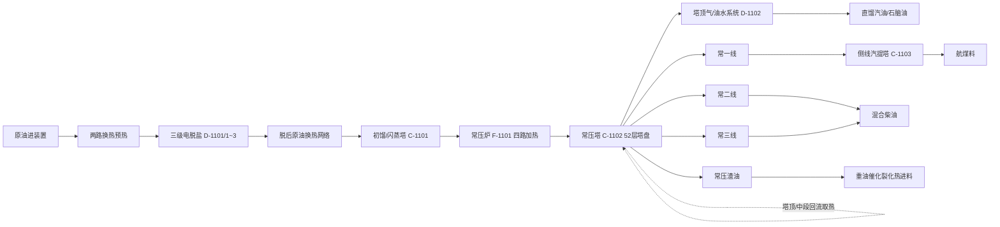
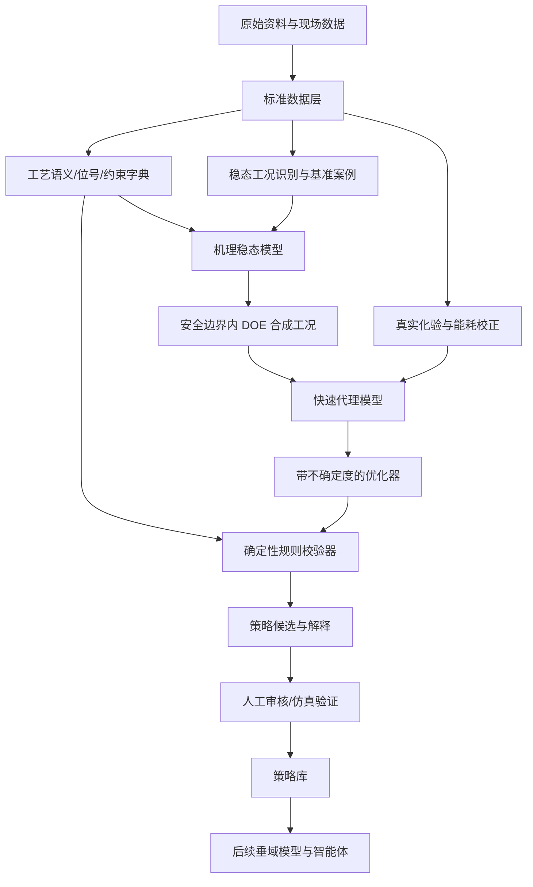

# 延炼 300 万吨/年常压蒸馏装置工艺及数据分析

> 文档状态：初版（后续随现场数据、专家确认和模型建设持续修订）  
> 编制日期：2026-08-16  
> 分析对象：延炼 300 万吨/年常压蒸馏装置  
> 原始资料目录：`base_files/original_data/延炼300万吨常压装置/`

## 1. 结论先行

当前资料已经足以完成三件重要的基础工作：建立装置工艺知识底座、整理一个可追溯的静态基准工况、搭建首版稳态机理模型。当前资料还不足以直接训练可信的动态优化模型，更不足以让智能体在线闭环控制装置。

建议首版建设对象不是 LSTM、Transformer 或端到端“AI 控制器”，而是一个**机理约束的稳态灰箱模型**：

1. 以物料衡算、能量衡算、蒸馏切割和设备机理为主体；
2. 用 2026-06-04 的 DCS 截图与当日化验构成第一个基准工况；
3. 用历史化验和月度能耗校正模型的长期合理区间；
4. 在机理模型上做安全边界内的试验设计（DOE），生成合成工况；
5. 再训练带不确定度的快速代理模型，供优化器、策略库和智能体调用；
6. 所有优化结果在当前阶段仅作为操作建议，必须经过规则校验和人工确认，不能直接写入 DCS。

当前最关键的数据缺口是连续 DCS 历史数据。下一阶段应优先取得不少于 12 个月、最好 24 个月的 1～5 分钟历史趋势，并保留质量码、控制模式、设备状态、报警和检维修时段。没有这些数据，就无法可靠识别操纵量变化对产品质量、能耗和约束的真实动态影响。

### 1.1 与项目总建设方案的关系

本报告同时参考了[《1322建设方案0802》](<../base_files/1322建设方案0802.docx>)。总方案对应项目 `2026ZD1614300`“石化装置运行性能智能评估模型与自主优化软件研发及验证”，执行期为 2026 年 3 月至 2029 年 2 月。本仓库当前工作属于其中“运行优化策略生成”技术链的装置落地起点。

总方案的三项核心交付物及本报告的衔接关系如下：

| 总方案交付物 | 总方案中的职责 | 本阶段常压装置工作 |
|---|---|---|
| 运行优化策略库 | 组织策略、专家知识、工艺机理和物理约束 | 先建立位号、约束、场景和策略 Schema，再从规程、台账和模拟结果形成种子 |
| 运行优化垂域模型 | 理解工况与任务，检索知识，构造优化问题并规划专业工具调用 | 当前先建设其将来要调用的常压稳态机理模型、代理模型和约束接口；二者不是同一个“模型” |
| 运行优化智能体 | 编排策略库、垂域模型和专业工具，完成独立校验、回溯和候选策略封装 | 当前先定义可信状态、工具边界和安全规则，数据与模型成熟后再实施工作流 |

总方案给出的主要量化指标是：策略及物理约束规则不少于 1,000 条、运行优化策略生成响应时间不超过 3 秒、智能体输出策略可执行率不低于 85%。这三个指标应从现在开始纳入数据结构和测试设计，但不能通过重复扩写策略、忽略模拟计算时间或模糊“可执行”的分母来满足：

- 1,000 条策略/规则应具有独立语义、来源、适用条件、版本和审核记录；
- 不超过 3 秒意味着在线建议链路要调用快速代理模型与索引服务，详细 HYSYS 模型主要承担离线生成、校正和复核；
- 可执行率需要预先定义测试集、通过条件、阻断策略是否计入分母，以及人工审批和现场条件的边界；
- 当前装置数据只是总方案所需知识、模型和评测数据的一部分，后续还需承接多源状态表征、性能评价和衰退根因结果，并向系统集成与工程验证环节输出标准化候选策略和调用记录。

## 2. 分析范围与资料口径

### 2.1 资料位置说明

用户描述中的资料目录为 `docs/original_data`，当前仓库的实际位置是：

```text
base_files/original_data/延炼300万吨常压装置/
```

本次仅读取和分析该目录中的原始文件，没有修改原始数据。建议以后保持原始目录只读，清洗结果、模型输入和分析报告分别进入独立目录。

### 2.2 已有资料清单

当前原始资料共 74 个文件：

| 类型 | 数量 | 主要内容 | 当前用途 |
|---|---:|---|---|
| PDF | 4 | 工艺流程图、P&ID 图册、操作规程、工艺卡片 | 工艺拓扑、操作边界、联锁与机理知识 |
| DOCX | 2 | 工艺流程文字说明、操作台账照片 | 流程补充、短时操作记录 |
| JPG | 10 | DCS 画面拍照 | 单时刻工况与位号识别 |
| XLS | 11 | 2023 年早期月度能耗报表 | 长周期能耗基线 |
| XLSX | 47 | 化验、能耗、报警、样品、异常、检修台账 | 质量、能耗、事件和设备状态 |

主要来源包括：

- [300 万吨常压装置流程图](<../base_files/original_data/延炼300万吨常压装置/300万吨常压装置流程图.pdf>)；
- [联合装置 P&ID 图册](<../base_files/original_data/延炼300万吨常压装置/联合二车间-300万吨年常压蒸馏-200万吨年重油催化裂化联合装置.pdf>)；
- [常压装置操作规程](<../base_files/original_data/延炼300万吨常压装置/规程/延炼300万吨常压装置操作规程.pdf>)；
- [现行工艺卡片](<../base_files/original_data/延炼300万吨常压装置/卡片/45c55b38fe.pdf>)；
- [工艺流程文字说明](<../base_files/original_data/延炼300万吨常压装置/规程/延炼常压工艺流程.docx>)；
- `300万吨DCS/` 中的 10 张 DCS 画面；
- `化验数据/` 中的 12 份分产品化验表；
- `能耗报表/` 中 2023-01 至 2026-05 的 41 份月报；
- 历史报警、样品、异常波动、大事记和设备检修台账。

### 2.3 信息冲突时的采用优先级

不同资料的编制时间和用途不同，出现冲突时建议采用以下优先级：

| 信息类别 | 优先来源 | 说明 |
|---|---|---|
| 当前工艺控制指标和产品质量边界 | 2025-07-04 生效的工艺卡片 | 比 2023 年规程更新，但仍需现场确认当前版本是否继续有效 |
| 设备、管线和位号拓扑 | 2025 年 7 月更新的 P&ID | 用于建立设备—测点—物流关系 |
| 工艺机理、操作方法、事故处理 | 2023 年操作规程 | 适合提取因果规则和处置策略，不应替代实时状态 |
| 实际发生的观测值 | DCS、LIMS/化验、计量和历史数据库导出 | 需同时保留时间、质量码和采样语义 |
| 图片人工读数 | DCS 和台账照片 | 仅作为初始线索，最终应由原始导出值替换 |

## 3. 工艺过程理解

### 3.1 装置定位

装置设计加工能力为 300 万吨/年，设计年开工 8,000 小时。操作规程中的设计原油为延安原油与吴咀原油按 65:35 混合。装置主要任务是对原油进行脱盐脱水、换热升温、闪蒸、加热和常压分馏，生产直馏汽油/石脑油、常一线航煤料、常二线和常三线混合柴油，并将常压渣油作为下游重油催化裂化装置的热进料。

装置不是一个孤立优化单元。常压渣油去向、下游催化装置承受能力、产品调合需求、换热网络、燃料与蒸汽系统都会影响常压装置的实际最优点。因此后续优化目标不能只看单塔产品收率，也要纳入跨装置约束。

### 3.2 主流程



根据规程中的设计描述，典型温度路径为：原油约 35 ℃进装置，经前部换热至约 72 ℃，电脱盐温度约 115 ℃；脱后原油继续换热至约 220 ℃进入闪蒸系统；闪底油换热后约 287 ℃进常压炉，炉出口设计约 364 ℃，然后进入常压塔分馏。

### 3.3 关键单元及其优化意义

| 单元 | 主要功能 | 关键状态/操纵量 | 对模型和优化的意义 |
|---|---|---|---|
| 原油换热网络 | 回收产品和中段回流热量 | 各段进出口温度、流量、压降、旁路、结垢状态 | 决定炉负荷和能耗，是长期节能的重要来源 |
| 三级电脱盐 | 脱除盐、水和杂质 | 注水量、混合强度/压差、电压、电流、界位、温度 | 影响腐蚀、结垢、塔压、能耗和运行稳定性 |
| 闪蒸塔 C-1101 | 进炉前轻组分闪蒸 | 塔顶压力、温度、液位 | 改变常压炉和常压塔负荷 |
| 常压炉 F-1101 | 将闪底油加热到分馏所需温度 | 四路流量、炉出口温度、燃料、氧含量、炉膛负压 | 是主要能源消耗和安全约束单元 |
| 常压塔 C-1102 | 按沸点范围分离产品 | 塔顶压力/温度、侧线抽出、中段回流、汽提蒸汽 | 决定收率、切割点和质量 |
| 侧线汽提塔 C-1103 | 调整侧线轻端和闪点 | 侧线流量、汽提蒸汽、温度 | 影响航煤/柴油闪点及收率 |
| 三段循环回流 | 控制塔内热量分布并回收热量 | 流量、返塔温度、取热量 | 同时影响分馏、换热和能耗，变量间耦合强 |
| 塔顶冷凝及压缩系统 | 回收塔顶产品并稳定压力 | 冷凝温度、回流、罐液位、气相负荷 | 影响塔压和轻端回收，存在设备能力约束 |

### 3.4 主要工艺因果关系

从操作规程和现场数据可提炼出首批确定性工艺知识：

- 原油含水升高会增加汽化负荷，可能造成塔压上升、塔内负荷波动、能耗增加，严重时影响稳定操作；
- 炉出口温度提高通常会使汽化率和轻质产品潜在收率提高，但同时增加燃料消耗、炉管热负荷、结焦和产品质量越界风险；
- 塔顶温度主要受塔顶循环回流/回流量和热平衡影响，并与塔顶压力共同决定塔顶切割；
- 常一、常二、常三侧线抽出量、抽出温度和汽提蒸汽共同影响产品干点、闪点及相邻馏分重叠；
- 中段回流改变塔内热分布，既影响分馏效果，也影响原油预热和常压炉负荷；
- 脱盐温度、注水量、混合强度、电场和界位需要联合控制，单独提高某一变量并不一定改善脱盐效果；
- 优化不能只改变一个变量后直接归因，必须通过模型处理多变量耦合、时间滞后和原油性质变化。

这些关系适合作为模型方向性校验和策略库规则，但参数大小仍需连续历史数据或模拟试验确定。

## 4. 当前工艺与质量边界

以下数值主要来自现行工艺卡片。它们应被录入“约束字典”，后续由现场工艺人员逐项确认生效版本、单位、适用产品方案以及报警/联锁层级。

### 4.1 关键操作指标

| 指标 | 当前资料给出的范围/上限 | 模型用途 |
|---|---:|---|
| 常压炉出口温度 TIC-1102 | 350～370 ℃ | 硬约束候选 |
| 常压炉相关温度 TIC-1101 | 500～800 ℃ | 需确认该点具体物理含义后使用 |
| 常压炉炉膛压力 PIC-1203 | -95～-1 Pa | 安全硬约束 |
| 常压塔顶温度 TIC-1001 | 95～115 ℃ | 操作约束 |
| 常压塔顶压力 PI-1003 | 0.03～0.10 MPa | 安全/操作硬约束 |
| 闪蒸塔顶压力 PI-1001 | 0.05～0.12 MPa | 操作约束 |
| 常一线抽出温度 TIC-1004 | 155～175 ℃ | 操作约束 |
| 常三线抽出温度 TIC-1008 | 290～310 ℃ | 操作约束 |
| 汽油出装置温度 | 15～40 ℃ | 产品储运约束 |
| 常一线出装置温度 | 15～45 ℃ | 产品储运约束 |
| 柴油出装置温度 | 15～60 ℃ | 产品储运约束 |
| 渣油出装置温度 | 50～95 ℃ | 产品/输送约束 |

### 4.2 原料、脱盐和产品指标

| 对象 | 指标 | 当前资料给出的要求 |
|---|---|---:|
| 进装置原油 | 盐含量 | ≤200 mg/L |
| 进装置原油 | 水含量 | ≤3.0% |
| 脱后原油 | 盐含量 | 一般产品方案 <3.0 mg/L；3 号喷气燃料料方案 <2.5 mg/L |
| 脱后原油 | 水含量 | <0.1% |
| 直馏汽油/石脑油 | 干点 | ≤175 ℃ |
| 常一线/航煤料 | 密度 | 780～810 kg/m³ |
| 常一线/航煤料 | 闪点 | 42～47 ℃ |
| 常一线/航煤料 | 终馏点 | ≤251 ℃ |
| 常一线/航煤料 | 冰点 | ≤-50 ℃ |
| 常一线/航煤料 | 烟点 | ≥26 mm |
| 混合柴油 | 资料所列“终馏点” | ≤365 ℃，但与规程/化验表的“95% 馏出温度”口径可能不一致，必须确认 |
| 烟气 | SO₂ | ≤100 mg/m³ |
| 烟气 | NOx | ≤150 mg/m³ |
| 烟气 | 颗粒物 | ≤20 mg/m³ |

工艺卡片中还存在“蒸汽 ≤2.66 kg/t 原油”的指标，而月度报表显示的实际物理蒸汽单耗明显更高。两者可能不是同一统计边界、蒸汽等级或指标定义，不能直接认定实际超标，应在模型建设前完成口径核对。

## 5. 数据现状分析

### 5.1 数据覆盖全景

| 数据域 | 时间范围/规模 | 粒度 | 优点 | 主要限制 | 可信用途 |
|---|---|---|---|---|---|
| DCS 截图 | 10 张；画面时刻集中在 2026-06-04 09:16～09:17 | 单时刻 | 位号和主要变量较完整 | 图片人工读数，无连续趋势、质量码和控制模式 | 建立一个静态基准工况、位号字典初稿 |
| 操作台账照片 | 约 7 个两小时间隔记录 | 短窗口 | 可补充短时变化 | 日期不清晰，图片识别误差 | 与 DCS 工况做人工核对，不可直接训练 |
| 原油化验 | 162 个带时间样本，2023-07-03～2026-06-16 | 约周度 | 盐、水覆盖较好 | 完整馏程仅约 27%～31%，缺重端完整 TBP | 原料分类、长期漂移和模型校正 |
| 常一线化验 | 869 个带时间样本，2023-07-01～2026-06-16 | 多数日度 | 密度、闪点、馏程较完整 | 冰点、烟点、硫氮等仅约 4%～15% | 质量模型校正和验证 |
| 混合柴油化验 | 1,106 个带时间样本 | 多数日度 | 馏程、闪点、凝点约 98%～99% 覆盖 | 硫含量约 11%～17%，字段跨期变化 | 质量模型校正和越界复核 |
| 直馏汽油化验 | 1,126 个带时间样本 | 多数日度 | 馏程覆盖近 100% | 硫约 10%～17%，密度仅约 4%～5% | 干点/馏程模型校正 |
| 月度能耗 | 41 个月，2023-01～2026-05 | 月度 | 时间跨度长 | 粒度太粗、模板漂移、受负荷和统计边界影响 | 长期基线和月度校正，不能学习分钟级响应 |
| 历史报警 | 19 行，2026-06-01～06-07 | 事件 | 有报警位号、等级、原因/措施 | 样本少、重复报警、确认时间全缺 | 建立初始报警规则和情景，不适合异常检测训练 |
| 异常/大事记 | 异常台账约 177 个非空事件行，范围混合常压与催化 | 事件 | 有真实故障和处置经验 | 重复、范围混杂、时间与工况不完全对齐 | 策略库种子、风险场景、测试用例 |
| 设备检修 | 常压部分约 20 条实质记录、16 个位号 | 事件 | 有故障对象和维修内容 | 数据少且格式空行多 | 设备可用性与推荐置信度修正 |

注：上述“样本”仅统计可识别的带时间实际记录，已排除部分表头、统计行和指标行；后续正式 ETL 仍需再次形成可复现的数据审计报告。

### 5.2 化验数据的价值与问题

化验数据是当前最有价值的连续数据，但它描述的是低频产品质量结果，不是完整的过程输入—操纵—输出序列。

主要问题如下：

1. **跨期表结构漂移**：相同指标在不同年度出现列名变化、重复列、单位变化；
2. **同义字段并存**：如冰点、闪点、氮含量和水分存在多列或别名；
3. **单位不统一**：`ppm`、`ug/g`、`μg/g` 等写法并存；
4. **非数值结果**：存在“痕迹”“+3”等，需要保留原值并另建规范化数值/类别字段；
5. **样品时间语义不足**：目前未明确区分采样时间、送检时间和结果发布时间；
6. **产品覆盖不平衡**：现有 12 个分产品文件没有独立的常二线、常三线和渣油历史序列；
7. **文件名与数据日期不完全一致**：例如混合柴油文件名中出现 `20500630`，标称截止 2026-06-15 的文件中有 2026-06-16 记录；
8. **原油表征不足**：原油蒸馏曲线缺失较多，且当前资料不能完整覆盖 350 ℃以上重端性质。

因此，化验数据应采用“原值层 + 标准层”双层保存：原值不可覆盖，标准层统一字段、单位和异常标记。化验结果与 DCS 的关联应使用采样前一段稳态窗口，而不是简单按自然日拼接。

### 5.3 能耗数据

现有 41 份月报覆盖 2023-01 至 2026-05。对可直接解析的 30 份 XLSX（2023-12 至 2026-05）初步统计：

- 月加工量约 25.54 万～32.67 万吨，均值约 29.10 万吨；
- 综合能耗约 5.169～7.172 kg 标油/t，均值约 6.410 kg 标油/t，中位数约 6.405 kg 标油/t；
- 2024 年 3 月等文件存在标题行偏移，说明读取逻辑必须按字段标签而非固定单元格位置；
- 历史模板、公式和辅助工作表有变化，部分辅助表日期可能是沿用旧模板的残留值。

这些月度数据适合回答“长期能耗是否落在合理区间”“模型年/月度聚合结果是否偏离实际”，但不适合直接回答“某次调整炉温后能耗变化多少”。后一个问题必须依赖分钟级燃料、蒸汽、进料和工况数据。

### 5.4 报警、异常与检修数据

报警表只有一周 19 条记录，其中三级报警 16 条、二级报警 3 条，10 个位号，且有重复报警，所有确认时间均缺失。它可以帮助建立报警位号映射和初始场景，但无法支撑机器学习异常检测。

异常波动台账和大事记中可以识别出若干真实场景，例如原油带水、塔顶循环泵停运、供电波动造成泵/电脱盐停运、压缩机结垢、换热器泄漏、炉温测点套管泄漏、调节阀卡涩导致进料大幅下降、燃料或联锁相关事件。这些案例非常适合形成“触发条件—影响—处置—退出条件”的策略库种子。

但台账同时包含常压和催化两个装置，且有跨工作表重复记录。正式使用前必须增加 `unit_scope`、`event_id`、`source_row` 和去重标记，不能把文本行数当作独立样本数。

## 6. 2026-06-04 初始基准工况

DCS 画面显示时间集中在 2026-06-04 09:16～09:17。以下数值来自图片人工读取，精度有限，后续应由原始 DCS 导出数据替换。

### 6.1 DCS 工况读数

| 变量 | 位号/说明 | 图片读数 |
|---|---|---:|
| 原油进料 | FI-1018 | 约 407.3 t/h |
| 四路炉管流量 | 画面四路 | 约 58.86、73.28、96.60、147.53 t/h |
| 四路流量合计 | 计算值 | 约 376.27 t/h |
| 常压炉出口温度 | TIC-1102 | 约 355.2 ℃ |
| 各路炉出口温度 | 画面读数 | 约 352.8～355.2 ℃ |
| 常压塔顶温度 | TIC-1001 | 约 113.5 ℃ |
| 常压塔顶压力 | PI-1003 | 约 0.051 MPa |
| 塔顶汽油流量 | FI-1012 | 约 63.50 t/h |
| 常一线流量 | FI-1024 | 约 31.79 t/h |
| 常二线流量 | FI-1022 | 约 22.25 t/h |
| 常三线流量 | FI-1020 | 约 82.41 t/h |
| 常压渣油流量 | FI-1028 | 约 203.72 t/h |

按上述图片读数，五股主要液体产品合计约 403.67 t/h，相对 407.3 t/h 原油进料的表观闭合率约 99.11%，表观差额约 3.63 t/h。按进料计算的瞬时表观收率约为：汽油 15.59%、常一线 7.81%、常二线 5.46%、常三线 20.23%、渣油 50.02%。

这是一个有价值的合理性信号，但不是正式物料平衡：它尚未处理塔顶气、含水、蒸汽、不同计量状态、仪表偏差、库存变化和不同画面的时间同步误差。

规程给出的设计质量收率为：塔顶气 0.03%、汽油 13.94%、常一线 13.73%、常二线 9.83%、常三线 14.43%、渣油 47.77%。基准画面的分布与设计值存在差异，可能来自实际原油、产品方案、常二/三线切割、仪表口径或图片读数，不应在缺少原始趋势时直接解释为异常。

### 6.2 相邻化验结果

当日产品化验时间为 08:00，与 DCS 截图约相差 1 小时 16 分钟；最近的原油化验是 2026-06-02。它们可以构成首个“弱对齐”案例，但不能假定完全对应同一批物料。

| 样品 | 时间 | 关键结果 |
|---|---|---|
| 原油 | 2026-06-02 | 盐 39.2 mg/L；水“痕迹”；初馏点 75 ℃；100/120/150/160/180/200/220/240/260/280/300/350 ℃回收率分别约 3/5/12/14/17/20/24/26/30/34/39/50% |
| 常一线 | 2026-06-04 08:00 | 密度 788.4 kg/m³；闪点 46 ℃；初馏点 155.5 ℃；10%/20%/50%/90%点 174.5/180.5/195/217 ℃；终馏点 230 ℃ |
| 混合柴油 | 2026-06-04 08:00 | 初馏点 200.5 ℃；10%/50%/90%/95%点 246.5/290.5/354/371 ℃；闪点 84 ℃；凝点 +7 ℃；硫 559（单位需按原表确认） |
| 直馏汽油 | 2026-06-04 08:00 | 初馏点 35.3 ℃；10%/50%/90%点 64.4/113.5/150.1 ℃；终馏点 167.2 ℃；硫 133（单位需按原表确认） |

常一线密度、闪点和终馏点，以及直馏汽油终馏点均落在当前资料列出的主要边界内。混合柴油 95% 点为 371 ℃，高于卡片中的 365 ℃数值；但卡片写的是“终馏点”，化验表是“95% 馏出温度”，再加上采样与 DCS 不严格对齐，因此这里只记录为**待核对的数据现象**，不能据此直接下达质量不合格结论。

建议将这一组数据固定命名为 `case_20260604`，完整保留每个字段的来源、时间和置信等级，作为首版模型贯通数据链路的验收案例。

## 7. 数据质量结论

### 7.1 可信度分级

| 等级 | 定义 | 当前例子 | 使用规则 |
|---|---|---|---|
| A | 原始系统导出、时间和单位明确、质量码有效 | 当前尚缺少连续 DCS 原始导出 | 可用于训练、校正和正式验证 |
| B | 原始业务表，字段可解释但存在口径/缺失问题 | 大部分化验与月度能耗 | 清洗、版本化后用于校正和趋势分析 |
| C | 图片人工读数或弱时间对齐 | DCS 截图、台账照片、`case_20260604` | 用于原型和合理性校验，不用于宣称精度 |
| D | 叙述性、范围混杂或重复记录 | 异常台账、部分大事记 | 用于规则/场景种子，需专家复核 |

### 7.2 当前数据能支持的工作

- 建立工艺设备、物流、位号和约束知识图谱/语义字典；
- 建立原料—装置—产品的静态流程模型；
- 用 `case_20260604` 完成首个端到端物料衡算和质量预测案例；
- 从规程和事件台账提炼初始操作策略、报警处置和安全规则；
- 用历史化验定义质量分布、缺失模式、数据漂移和校正目标；
- 用月度能耗定义模型聚合结果的合理范围；
- 在机理模拟器中生成受约束的合成工况，供代理模型预训练和算法联调。

### 7.3 当前数据不能支持的工作

- 不能从图片和日度化验可靠学习分钟级动态响应；
- 不能识别操纵变量对质量和能耗的纯因果效应；
- 不能训练覆盖全工况的异常检测模型；
- 不能证明某个优化策略在真实装置上的收益；
- 不能支撑自动闭环控制或绕开现有 DCS/SIS 联锁；
- 不能支撑一个可信的全装置端到端深度神经网络；
- 不能把月度能耗与某次具体操作调整直接归因。

## 8. 推荐的初始模型

### 8.1 模型定位

建议建设 `Hybrid Steady-State CDU Baseline v0.1`，即“常压蒸馏机理约束稳态灰箱基线模型”。

它的第一目标不是马上找到全局最优操作，而是建立一个可解释、可校正、可生成数据、能够检查约束的数字试验台。首版只覆盖**单一正常稳态生产模式**，暂不覆盖开停工、严重异常、设备切换和在线自动控制。

### 8.2 总体架构



### 8.3 机理模型的子模块

1. **原油表征模块**  
   将原油实沸点/TBP 或 ASTM 馏程、密度、硫、水盐和混合比例转换为伪组分。当前原油数据只到 350 ℃且缺失较多，首版需采用规程设计原油、现有化验和专家假设构造重端，再通过不确定区间标记该假设。

2. **换热网络边界模块**  
   首版可先用各关键节点实测温度和总体换热效率描述，不必立即精确建模每台换热器；取得完整温压流量后再细化到单台设备和结垢系数。

3. **三级电脱盐经验模块**  
   用入口盐/水、温度、注水率、混合强度、电压/电流和界位估算脱后盐水。由于当前缺少连续观测，首版以规则和经验效率为主，不宣称预测精度。

4. **闪蒸塔模块**  
   基于温度、压力和原油伪组分估算闪顶/闪底分配，为常压炉和常压塔提供边界。

5. **常压炉模块**  
   建立四路物料平衡、热负荷、燃料消耗和效率关系，显式约束炉出口温度、各路偏差、炉膛负压、氧含量以及设备能力。

6. **常压塔与侧线汽提模块**  
   建模 52 层塔盘、塔顶、三条侧线、渣油、三段循环回流和侧线汽提。输出产品流量、收率、关键馏程/闪点代理和塔内约束裕度。

7. **不确定度与残差校正模块**  
   对原油重端、仪表偏差、弱对齐化验和未测扰动保留分布或区间；用真实化验修正模拟器系统偏差，并输出预测置信区间，而不是单一数值。

若现场已有 Aspen HYSYS 或等效流程模拟软件许可，建议用它构建详细稳态机理模型；若暂时没有许可，可以先在 Python 中完成缩减版物料/能量衡算和切割点模型。两条路线的数据接口应保持一致，避免以后更换模拟器时推倒上层系统。

### 8.4 输入、操纵量、输出与扰动

| 类型 | 首版建议变量 |
|---|---|
| 原料/扰动 | 原油流量、原油类型/混合比例、密度、馏程、水盐、入口温度；环境和公用工程状态 |
| 候选操纵量 | 炉出口温度、四路流量分配、塔顶回流/塔顶循环量、两段中段回流量和返塔温度、常一/二/三线抽出量、汽提蒸汽、塔顶压力目标 |
| 状态量 | 关键换热温度、脱盐电流/电压/界位、闪蒸塔温压液位、炉温/炉压/氧含量、塔顶和侧线温度、各罐液位、泵和阀门状态 |
| 预测输出 | 各产品流量与收率、汽油干点、常一线密度/闪点/终馏点、柴油 95% 点/闪点/凝点、综合能耗、关键约束裕度 |
| 不可直接优化项 | SIS 联锁值、设备保护值、未经批准的旁路和任何超出工艺卡范围的设定值 |

变量是否可以作为操纵量，必须结合控制回路模式、阀门权限、设备状态和操作规程确认。一个在模型中“可调”的变量，在现场可能只是被控量或受上游/下游约束。

### 8.5 目标函数和约束

首版优化可以表示为：

```text
最小化：
    单位原油综合能耗
  + 产品质量偏离/越界惩罚
  + 操作变量变动幅度惩罚
  + 不确定度与越域风险惩罚

满足：
  物料和能量守恒
  工艺卡硬边界
  产品质量边界
  炉、塔、泵、换热器和下游装置能力边界
  环保边界
  操作变量变化速率和最小保持时间
  当前设备可用性及联锁状态
```

不建议首版直接采用单一“利润最大化”，因为当前缺少可靠的实时产品价值、调合去向和跨装置边界。先以能耗、质量稳定性和约束裕度为目标，能更安全地验证系统方向。

### 8.6 合成数据与代理模型

利用机理模型，在专家确认的安全区域内做 DOE：改变原油性质、加工负荷、炉出口温度、循环回流、侧线抽出和汽提蒸汽等，生成覆盖正常操作空间的合成工况。每条数据都要同时保存输入、输出、约束裕度、模拟器版本、收敛状态和场景标签。

代理模型的选择应服从数据规模和不确定度需求：

- 初期样本较少时优先高斯过程、PLS、Elastic Net 或带约束的低复杂度模型；
- 合成样本增加后可使用梯度提升树等非线性模型；
- 代理模型必须做越域检测，并对真实数据稀疏区域给出更宽的不确定区间；
- 训练/验证应按时间、原油类型或生产方案切分，不能随机打散造成信息泄漏；
- 合成数据用于学习机理模型的映射，真实数据用于残差校正和可信度评估，不能用大量合成数据掩盖真实偏差。

### 8.7 首版验收建议

首版模型宜采用分层验收，不应只看一个总体 R²：

| 验收层级 | 建议标准 |
|---|---|
| 拓扑与口径 | 关键设备、物流、位号、单位和边界经工艺专家签字确认 |
| 物料平衡 | 在 `case_20260604` 等基准工况上，主要物流相对闭合误差目标 ≤3%；需明确未计物流 |
| 能量合理性 | 聚合到月度后落入历史能耗合理区间，偏差由专家确认 |
| 质量预测 | 对汽油、常一线、柴油的核心指标设逐项容差，不用单一平均误差掩盖越界 |
| 方向性 | 关键变量扰动后的趋势与规程和专家知识一致 |
| 约束安全 | 所有生成和推荐工况通过确定性硬约束检查 |
| 不确定度 | 真实值在预测区间中的覆盖率达到预先约定目标，越域时拒绝推荐 |

其中 3% 是首版工程目标，不是已经达到的结论；实际容差需在仪表精度、计量边界和数据取得后再冻结。

## 9. 数据建设方案

### 9.1 数据分层

建议在仓库中逐步形成以下逻辑层次：

```text
base_files/original_data/       # 原始资料，只读、不覆盖
data/catalog/                   # 文件、表、位号和字段目录
data/bronze/                    # 原始导出标准封装，保留原值
data/silver/                    # 清洗、统一时间/单位/质量码后的长表
data/gold/                      # 稳态工况、模型特征、标签和基准案例
models/mechanistic/             # 机理模型与版本配置
models/surrogate/               # 代理模型、训练信息和评估结果
knowledge/strategies/           # 结构化策略库
docs/                           # 分析、设计、数据字典和验收文档
```

不要把生成数据写回原始 Excel。所有清洗规则都应可复现，且每条标准记录能够追溯到源文件、工作表、行号/单元格和转换版本。

### 9.2 统一数据模型

连续过程数据建议采用长表：

| 字段 | 含义 |
|---|---|
| `timestamp` | 统一时区后的时间 |
| `tag_id` | 规范位号 |
| `value_raw` / `value` | 原始值与标准化值 |
| `unit_raw` / `unit` | 原单位与标准单位 |
| `quality_code` | DCS/数据库质量码 |
| `mode` | 自动、手动、串级等控制模式 |
| `source_system` | DCS、LIMS、能耗、人工台账等 |
| `source_ref` | 源文件/表/记录定位 |
| `ingestion_version` | 导入与转换版本 |

化验数据至少增加：`sample_time`、`result_time`、`sample_point`、`product_route`、`method`、`detection_limit`、`raw_text`、`normalized_value`。事件数据至少增加：`start_time`、`end_time`、`unit_scope`、`equipment_id`、`event_type`、`severity`、`cause`、`action`、`recovery`、`source_ref`。

### 9.3 DCS 历史数据优先清单

建议导出不少于 12 个月、最好 24 个月，采样间隔 1～5 分钟，并尽量包含原始值而非只含小时平均值。优先测点如下：

1. 原油：总流量、各路/各油种流量、混合比例、密度、温度、含水/含盐；
2. 换热网络：各关键换热段进出口温度、压力、压降、旁路阀位；
3. 电脱盐：三级进出口温度、注水量、混合压差、电压、电流、界位、排水和跳闸状态；
4. 闪蒸塔：进料温度、塔顶/塔底温度、压力、液位、闪顶/闪底流量；
5. 常压炉：四路进料流量、进出口温度、燃料气/燃料油流量、炉膛负压、烟气氧含量、排烟温度、风门/阀位和联锁状态；
6. 常压塔：塔顶压力/温度、关键塔盘温度、塔底温度、液位、塔顶回流和三段循环回流的流量及进出口温度；
7. 产品：塔顶汽油、常一/二/三线、渣油流量和出装置温度，油水分离罐状态；
8. 汽提和公用工程：各路蒸汽、冷却水、电、燃料、氮气等流量和压力；
9. 控制语义：PV、SP、MV，手/自动/串级模式，阀位、阀门限位、设备运行/备用状态；
10. 事件语义：报警、联锁、操作票、采样、检修、仪表失准和上下游限量时段。

应同时获取 DCS 点表或历史数据库位号清单，包含中文描述、工程单位、量程、采样周期、所属设备、控制回路和报警限值。仅有数值而没有这些语义，后续建模仍会大量返工。

### 9.4 稳态工况抽取

化验标签不能与某一个瞬时 DCS 点直接拼接。建议按每个产品的物料停留时间和现场采样规则，提取采样前若干小时的过程窗口，并执行：

- 剔除开停工、切换、联锁、设备故障和人工化验异常；
- 检查原油流量、关键温度/压力和液位的波动率；
- 检查控制回路是否在合理模式、阀门是否饱和；
- 计算窗口均值、标准差、斜率、极值和约束裕度；
- 根据停留时间对不同单元做时间对齐；
- 为每条样本保存稳态评分和数据完整度评分。

首版模型只使用高稳态评分的数据。异常和过渡数据另建数据集，用于后续动态模型、诊断和策略验证。

## 10. 策略库建设建议

策略库不应只是自然语言建议合集，而应是可验证、可版本化的结构化知识。建议每条策略至少包含：

```yaml
strategy_id: unique-id
scene: 正常稳态/质量偏离/能耗偏高/设备降级/异常处置
trigger: 触发条件与持续时间
evidence: 当前状态、趋势、化验或模型证据
objective: 目标及优先级
decision_variables: 可调整变量
action_template: 分步建议及幅度上限
preconditions: 执行前提
hard_constraints: 不可突破的边界
predicted_effect: 预测效果与不确定区间
stop_conditions: 停止条件
rollback: 回退措施
provenance: 规程/事件/专家/模拟/实际验证来源
model_version: 生成该策略的模型版本
review_status: 待审/通过/驳回/已验证
```

策略来源可分三层：

1. **规则种子**：从规程、工艺卡、报警和真实异常台账提取，约 50～100 条，全部人工审核；
2. **模型扩展**：在机理模型的 DOE 工况上由优化器生成候选，必须通过约束校验和方向性校验；
3. **现场验证**：经模拟、专家审核和现场受控试验验证后提升可信等级。

总方案的最终考核目标是不少于 1,000 条运行优化策略和物理约束规则，但数量不是早期阶段的首要指标。应先形成 50～100 条来源清楚、边界明确、可回退的高质量种子，再用机理模型 DOE、场景组合和经审核的约束规则扩展到目标规模；不能把同一条建议的文字改写或无意义的数值枚举作为独立策略计数。

## 11. 智能体设计的后续落点

在模型和策略库稳定后，智能体建议采用“检索 + 工具调用 + 确定性校验”架构，而不是让大模型直接计算或控制：


大模型的职责是理解任务、选择工具、检索证据、组织建议和解释；数值预测由版本化模型完成，硬约束由确定性程序检查。首阶段智能体只读数据并输出建议，不直接写 DCS。任何未来的执行接口都应在 DCS/SIS 原有安全层之外设置白名单、审批、限幅、速率限制、回退和完整审计。

当前不建议立刻微调垂域大模型。先把规程、位号、约束、案例和策略构造成高质量可检索数据，并用评测集验证智能体是否会引用正确版本、是否会越过边界、是否能在信息不足时拒绝推荐。等积累了足够的已审核问答、工具轨迹和策略反馈，再判断微调是否有增量价值。

## 12. 分阶段实施路线

### 阶段 0：证据底座（当前阶段）

- 固化本报告和原始资料目录；
- 建立资料目录、来源优先级、开放问题和专家确认清单；
- 不对模型精度或节能收益作承诺。

### 阶段 1：数据语义和基准案例

- 建立设备、物流、位号、单位和约束字典；
- 统一 12 份分产品化验表和 41 份能耗表；
- 整理报警、异常和检修事件；
- 建立 `case_20260604`，完成可追溯的物料衡算；
- 输出首版数据质量审计和 DCS 导数清单。

### 阶段 2：稳态机理模型 v0.1

- 明确模拟平台和原油伪组分方案；
- 建立闪蒸、常压炉、常压塔、侧线汽提和循环回流模型；
- 用设计值和 `case_20260604` 标定；
- 做物料、能量、质量和方向性验收。

### 阶段 3：真实历史数据接入与模型校正

- 导入 1～5 分钟 DCS 历史；
- 标记生产模式、异常和检维修时段；
- 建立稳态工况数据集并与化验对齐；
- 校正机理模型和不确定度；
- 形成按时间/油种/方案隔离的验证集。

### 阶段 4：DOE、代理模型和优化器

- 在已确认安全边界内生成 DOE 数据；
- 训练快速代理模型和残差模型；
- 构建多目标约束优化器；
- 在历史回放和模拟环境中评估收益、鲁棒性及越域拒绝能力。

代理模型和检索/校验接口同时要为总方案“不超过 3 秒”的策略生成指标预留性能预算；详细流程模拟不应成为每次在线请求的同步阻塞步骤。

### 阶段 5：策略库

- 先录入规程和真实事件策略种子；
- 由模型生成候选策略并自动附上来源、边界和不确定度；
- 建立专家审核、版本管理、模拟验证和现场反馈闭环。

### 阶段 6：智能体原型

- 建立状态解释、知识检索、模型调用、优化、规则校验和报告生成工具；
- 采用离线问答和历史回放评测；
- 先做只读、建议型助手，再讨论受控执行；
- 上线前完成安全、权限、审计和降级设计。

智能体评测集需覆盖正常工况、约束临界、数据缺失、设备不可用、模型越域和冲突目标，并在实施前冻结“策略可执行率不低于 85%”的计算口径。对信息不足而正确阻断的任务，应作为安全能力单独统计，避免为了表面可执行率强行生成建议。

## 13. 建议的下一项仓库工作

下一项最合适的实施任务是：**建立数据目录、统一位号/约束字典和 `case_20260604` 基准工况，而不是立即训练模型。**

建议交付物为：

1. `docs/02_数据源目录与质量规则.md`；
2. `data/catalog/source_catalog.*`：文件、工作表、时间范围、字段和责任人；
3. `data/catalog/tag_dictionary.*`：位号、设备、变量、单位、PV/SP/MV、上下限和来源；
4. `data/catalog/constraint_dictionary.*`：工艺卡、规程、报警和联锁约束及版本；
5. `data/gold/case_20260604.*`：原料、DCS、化验、物料衡算、来源和置信度；
6. `docs/03_DCS历史数据导出需求.md`：按优先级和用途列出的正式导数清单。

完成这一步后，首版机理模型的输入输出和验收边界才会稳定，后续开发也能避免反复修改字段含义。

## 14. 待现场确认的问题

1. 当前执行的工艺卡版本是否确为 2025-07-04 版本？后续是否有临时指标或产品方案调整？
2. 工艺卡中混合柴油“终馏点 ≤365 ℃”是否实际指 95% 馏出温度？
3. 工艺卡“蒸汽 ≤2.66 kg/t 原油”的统计边界、蒸汽等级和月报口径分别是什么？
4. 2026-06-04 DCS 截图是否与操作台账照片属于同一天、同一生产方案？
5. DCS 图片中主要流量是质量流量还是经过密度/温压补偿的折算流量？
6. 原油实际混合比例是否长期为 65:35，还是会随罐区和调度变化？是否有罐切换记录？
7. 常一线当前是固定作为 3 号喷气燃料组分，还是存在柴油方案切换？
8. 常二线、常三线、渣油以及脱后原油的化验数据是否可从 LIMS 另行导出？
9. 化验表时间字段代表采样时间、送样时间还是结果录入时间？各产品从塔到采样点的停留时间是多少？
10. 是否具备 Aspen HYSYS/UniSim 等模拟平台及既有模型？若有，版本和许可环境是什么？
11. 常压装置与催化装置之间有哪些实时限量、产品去向和联合优化规则？
12. 哪些变量允许操作建议调整，哪些仅可监视，建议的单次调整幅度和保持时间是多少？

## 15. 风险与原则

- 当前基准工况来自图片和弱时间对齐化验，所有精确数值结论都应标注来源和置信度；
- 模拟器生成的数据不是现场事实，必须保存 `synthetic=true` 和模型版本，严禁与真实观测混用；
- 所有规则都要有版本和来源，不能把旧规程中的指标无条件当作当前硬约束；
- 首版优化只覆盖正常稳态，遇到越域、异常、仪表质量差或设备状态不明时应拒绝给出调整量；
- 智能体永远不能替代 DCS/SIS 的安全保护，也不能绕过现场审批制度；
- 项目评价应同时看安全、质量、稳定性、节能和可解释性，不能只看算法指标；
- 每个阶段先形成可审计的基线和验收标准，再进入下一阶段。

---

本报告是项目的第一份工艺与数据基线。后续新增数据、现场澄清、模型假设和验收结果应以变更记录的方式纳入，而不应覆盖原有证据。
