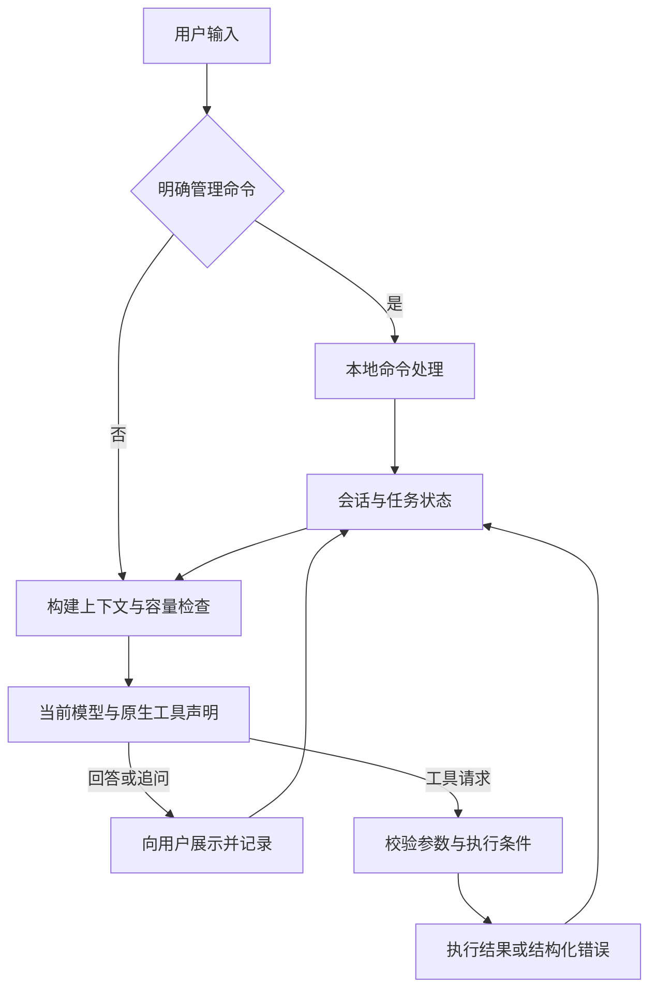

# Petroleum RTO Agent — ReAct改造项目状态与实施规划

_建立：2026-09-09；最后更新：2026-09-11（Asia/Shanghai）｜状态：LC1–LC7及结果展示改进已验证；HYSYS稳态替换仍在规划；用户已明确确认公开发布，当前Agent与规划已推送GitHub并核对远端，可在Windows接续开发；回退点105e5b8，规划基线66993db；保留五模型双协议_

---

## 📋 1. 当前状态与文档职责

统一LLM工具循环、五模型切换和已有上下文管理已实现。本阶段在现有create_agent基础上，进一步将状态、持久化、人工确认、摘要、流式和有限重试交给LangChain/LangGraph；具体范围与验收以本文件LC0–LC7正式实施计划为准。

本文件是当前项目进度、范围、验证、风险和下一步的唯一状态来源，继续覆盖ReAct改造后的HYSYS接入阶段；后续直接更新相关章节，不再按对话逐次堆叠讨论全文。

| 项目 | 当前事实 |
| --- | --- |
| 本轮交付 | 58文件检查、代码/规划基线35c317f及交接记录9c0c896已推送到公开仓库feat/react-agent，远端完整哈希核对一致；忽略规则和Windows接续说明已交付。本轮追加发布完成记录 |
| 用户已确认 | 用户要求先检查gitignore，再提交到GitHub以便Windows继续开发；明确桌面hysys_moni不必考虑，Windows已有；获知公开目的地及58文件范围后明确“允许提交吧”。仅交付当前仓库及必要忽略/交接修正，不迁入外部模型，不实施H1–H6或删除旧CDU |
| 本轮执行范围 | 已检查、提交并公开推送当前Agent、测试、规划和报告；补.gitignore/README/本状态，无新增生产源码修改、HYSYS迁入或旧CDU删除。此前审批阻塞在用户明确确认后解除，正常推送完成 |
| 后续阶段 | H0分析及范围细化完成；H1仿真模块与资料、H2读取/单点与Windows适配、H3稳态RTO、H4Agent/恢复切换、H5旧模型删除、H6Windows优化总验收均未实施；变量语义/范围及实际Windows连接仍需验证 |
| 当前源码基线 | feat/react-agent；代码与规划基线35c317f0bf3ffa45bab010281662028b333c045e已发布；交接提交9c0c896c4bf3010a787fd8a3e1ff5622151cf58c已完成首次远端核对。本轮完成记录单独提交，最终HEAD以git log及远端核对为准。main未改，未强推 |
| 改造代码 | 单一图状态、五个领域工具和分页工具、SQLite恢复、真实输入审批、固定M2/M4、正文流、公共摘要逐批保存及普通有限重试已实现；旧manage/solve/verify模型入口已删除，工具合同3.0.0 |
| 真实模型验证 | 当前五个精确ID保持原Chat/Responses映射，20种不同请求配置的SSE工具往返、五默认摘要、真实Agent帮助/切换及工具回填通过；全部62次HTTP为200。供应商自报别名与请求ID区分记录；旧Responses统一迁移失败仅作历史事实 |
| 技术路线 | LangChain 1.4.0 / langchain-core 1.6.2 / LangGraph 1.2.11；httpx原生传输，domain-model extra和uv.lock锁定；摘要公共接口关闭预裁剪，仅结构化临时错误每批最多3次尝试 |
| 本地启动准备 | 两种CLI入口共用桌面ReactAgent；新会话默认gpt-5.6-sol-cdx，默认开启思考并实际发送low，/help如实展示。已有会话优先恢复保存的选择，可用/model 3切换；本轮未改用户当前会话库或本机凭据 |
| 已有计算底座 | 复用严格业务意图、受信工况、确定性问题构造、求解和M2/M4配对评价 |
| 当前下一步 | Windows拉取feat/react-agent，阅读本状态与simulation稳态规划，使用Windows已有HYSYS目录；下一开发批次从H1仿真模块及资料合同开始，H2处理Windows兼容及真实连接验证 |

### GitHub基线与Windows交接（2026-09-11，公开发布已确认，代码与规划已推送）

- **授权与范围：** 用户要求检查gitignore后提交GitHub，在Windows继续开发；明确排除桌面hysys_moni，并在获知公开仓库、目标分支及完整58文件范围后明确“允许提交吧”。交付既有LC1–LC7、结果展示、相关测试/报告与HYSYS稳态规划；当前仍保留旧CDU和动态实现，H1–H6尚未实施。仅新增忽略规则和README Windows交接说明，确认后的本轮仅更新发布状态，不实施Windows兼容或仿真接入。
- **忽略规则：** 补Windows系统/Office临时文件、备用虚拟环境、覆盖率/日志/编辑临时文件、本机JSON配置、凭据备份及SQLite数据库/旁路/锁文件、新仿真raw资料目录。保留.env.example、正式JSON配置/快照、模型原件可跟踪能力、uv.lock和报告；现有runs和原始工艺资料继续忽略，不以*.json或*.hsc全局屏蔽必要资产。
- **提交前检查：** 25项应忽略和11项应保留路径探针通过，已跟踪文件被新增规则误忽略为0。对364个已跟踪/非忽略文件及Office XML内容检查，本机实际凭据及常见编码变体命中0；凭据格式扫描唯一命中为已有防泄露测试的固定测试字符串。当前凭据文件、SQLite、运行产物、虚拟环境及原始资料不进入提交。
- **运行验证：** 83项针对性回归通过（3.74秒），覆盖帮助、结果展示、会话保存和固定方案持久化；全src/tests Ruff和162源文件mypy通过。最新结果说明实网报告引用的6个生产模块哈希与当前源码一致。JUnit为/private/tmp/petroleum-rto-git-handoff-20260911.xml；报告中的历史全仓/实网计数保持历史范围，不与本轮83项加总。
- **检查中修正：** 首轮忽略探针发现仓库根目录session.sqlite.lock未被规则覆盖，补充数据库点后缀规则后全部通过。第一次受限环境访问GitHub的本机代理失败，申请所需网络访问后远端分支读取成功；远端仍为66993db，无远端新增提交冲突。gh命令不可用，采用Git和已连接GitHub元数据工具完成核对。
- **未执行与交接限制：** 本轮未重复全仓/重型CDU/真实LLM/HYSYS测试；无生产源码新修改，沿用已有完整验收，并执行上述回归。Windows的文件锁/文件保护/交互输入兼容及HYSYS真实接入仍未完成。Windows独立配置密钥，使用已有HYSYS目录，Git不迁移本机会话。规划中的Mac路径仅是历史来源记录。
- **提交与检查补记：** 已显式暂存核验58个文件，git diff --cached --check通过；暂存内容与审查文件完全一致，暂存凭据匹配0。提交35c317f0bf3ffa45bab010281662028b333c045e保存Agent实现、测试、规划、报告和忽略规则。额外凭据启发式检查因要求测试串必须含test而误报；复核为原提交已有的全小写语义占位串，位于明确的防泄露测试中，修正检查口径后通过，无需修改生产或测试源码。
- **审批与连接记录：** origin对应公开仓库https://github.com/lvguima/petroleum_rto_agent。此前自动审批要求明确完整载荷的公开发布范围，因此暂停推送且未绕过。用户本轮明确允许后重试同一目标；首次因LibreSSL SSL_ERROR_SYSCALL连接失败，只读确认远端仍为66993db后重试成功，分支更新至9c0c896。
- **发布核验：** git ls-remote独立确认feat/react-agent为9c0c896c4bf3010a787fd8a3e1ff5622151cf58c，与已推送本地提交一致；main仍为e234c2e040ceaeaf3fee24a86179cee380b355f1。本轮无生产代码变化，不重复此前83项回归或全仓/真实模型验证；完成记录按单文件显式暂存、差异检查及提交后远端核对交付。
- **Git状态与下一步：** 从“本地已提交、公开发布待确认”变为“用户已确认、代码与规划已发布”。当前完成记录以独立文档提交交付；Windows拉取feat/react-agent，依README重建开发环境并读取稳态规划，从H1继续。HYSYS仍使用Windows已有目录；Windows兼容和真实连接仍是待开发/待验证事项，无新增阻塞。

### HYSYS稳态专用替换规划细化（2026-09-11，范围已明确，仍未实施）

- **授权与范围：** 用户明确仅基于稳态开发，删除旧CDU及动态内容；新仿真代码/资料进入对应仿真工作目录，直接读取HYSYS作为装置状态主来源，固定快照可以保留；要求“继续规划”。该决定取代上一轮保留独立CDU或未来动态分支的建议。本轮不实施，不删除物理模型或已有运行文件。
- **实际文档变更：** 将初版规划移入[simulation稳态规划](simulation/01_HYSYS稳态仿真接入规划.md)并重写后半部分；[原目录核对](../reports/simulation/hysys_inventory_20260911.json)归入reports/simulation，内容保持；新增[替换范围核对](../reports/simulation/hysys_replacement_scope_20260911.json)，更新导航与本状态。原docs/rto规划路径和reports/rto核对路径退出，不留重复入口。
- **完整牵连：** 当前装置介绍/工况工具均硬编码旧case，展示强制旧设定和动态库存并固定idle，Context强制旧组成；RTO双阶段请求、动态字段/评价/产物/reader、策略M4证据要求、包内能力默认值、CLI必填context、Agent图/恢复/文案均需同步替换。新方案只有HYSYS稳态实现；原始快照为事实源，Context由其确定性投影；确认时检查相关工况漂移，候选只在隔离副本运行。
- **删除与保留规划：** 旧CDU代码86、配置14、脚本3、测试68、报告10、文档13、data/cdu非忽略文件4个纳入逐项清单；均为文件数而非测试数或完成率。另有53个跨模块源码/配置/测试/脚本文件需语义审查，不按命中批量删除。data/cdu/raw含工艺图、台账、报表等原始资料，保留或清单迁移；用户runs、SQLite、外部hysys_moni不做整体删除。旧审批/任务不自动迁成新HYSYS授权，不保留旧后端执行兼容层。
- **发现的Windows问题：** assistant/session依赖fcntl、O_NOFOLLOW/getuid/fchmod；RTO文件锁明确拒绝非POSIX；交互CLI缺readline即退出。来源脚本报告Python3.11，项目要求3.12。计划H2补有限跨平台文件锁/文件保护和终端处理，实际组合需Windows实测；不以接通COM等同完整Agent可运行。
- **已执行验证及失败修正：** 只读复核工作树、源/配置/导出/CLI/会话/策略、53文件引用和直接CDU导入；首轮系统Python3.9 AST扫描不能解析项目3.12语法，改用项目Python3.12.14后扫描成功，未改源码。规划/导航/本轮状态链接及围栏、JSON结构、迁移报告内容、差异和文件范围检查通过；外部26文件及既有实现/配置/测试保持不变。
- **未执行与风险：** 未运行项目测试、Windows、HYSYS、实际快照冻结、微扰恢复或优化；未渲染Mermaid。变量语义/范围、完整物料/热边界、质量条件和可重建当前内存基准仍待Windows核实；动态/DCS已排除，不再作为待补能力。暂建议Windows同机联调，未开启网络服务或新增通信平台。
- **下一步与变更记录：** 本轮从“H0初版接入建议”收敛为“H0单一稳态替换方案”。后续H1–H6按仿真模块→单点与Windows适配→稳态RTO→Agent切换→旧模型清除→真实总验收推进；Mac可先完成实现与离线检查，Windows项如实保留未验证。当前交付规划，源码仍是既有CDU/M2/M4实现，不声明新架构已经落地。

### HYSYS资料核查与接入规划（2026-09-11，H0分析完成，实现未开始）

- **授权与实际变更：** 用户要求理解Windows已搭建的真实常压仿真案例，并规划MV/PV接口、替换现有Python仿真及功能。新增[接入分析与规划](simulation/01_HYSYS稳态仿真接入规划.md)和[静态核对记录](../reports/simulation/hysys_inventory_20260911.json)，更新文档导航及本状态。保留已有未提交修改；无源码、测试、运行配置、依赖、外部目录修改或文件删除，无Git提交推送。
- **文件事实：** 26个文件完成清单和SHA-256记录；核心是mjh_ATM.hsc、COM读写脚本、Table映射与前后快照。24个可写量、36个CV、73级状态共352个标量；主塔52级，其余为侧线塔。历史报告记录2026-09-09同工况24项写入/回读及收敛，3.687秒；不是扰动试验。旧data_write夹带的stage及original/data_read均有73级气液重复错误，当前data_read和before已经修复，旧输出不能作为当前证据。
- **已执行核对：** 8份JSON严格解析、5份现行Python文件语法解析；60条表单映射唯一、当前352标量有限、输入/前后MV相同、原分析四份源哈希一致；已列物流403 t/h与400 t/h原油加3 t/h Water闭合，六项热负荷106.739 MW及最大塔温/TBP漂移复算一致。该口径不证明完整组分守恒、干基收率或净能耗。文档链接、围栏、差异与本轮文件范围完成检查；外部26文件及既有实现/配置/测试保持不变。
- **设计结论：** 保留Agent/审批、不可变工况、RTO搜索和证据分责；沿现有仿真端口加入专用HYSYS适配器。现行后端装配、决策M2/M4绑定、强制动态评价、旧指标、最终选择、恢复与文案需要协调升级，不能仅替换一个连接类。首版建议稳态搜索及独立重算复核，明确动态未验证，不伪造M4通过或现场能力。H1可在Mac完成；H2真实执行及后续工艺优化必须Windows验收。
- **风险、待决和未执行：** 未打开/运行.hsc，未运行COM测试或项目回归，未实测HYSYS版本、变量扰动、恢复、拓扑、动态或优化。旧报告未绑定.hsc哈希；D_temperature、D_pressure、boilup百分数、循环规格与Water语义待确认；原油组成/物性、外部物流/产品水分、热边界、变量范围和质量条件缺失。部署已询问用户，暂建议先Windows同机联调；Mac远程调用是可选后续方案，未视为已授权部署服务。Mermaid已检查源结构，未执行渲染验收。
- **下一步与状态变更：** 本轮从“结果展示改进完成”转为“HYSYS H0分析规划完成”。交付可审查方案；后续首批是H1案例元数据/变量字典/历史快照合同和严格读取，Windows补导出需求已列入规划。H1–H5仍是待实施计划，不计作能力完成；既有LC验收结论保留其原范围。

### 结果展示与解释改进（2026-09-11，本批验证完成）

- **授权与范围：** 用户指出确认后直接打印JSON难以阅读，要求先给出推荐优化方案再解释结果，并收敛显示小数；同时询问三个优化目标的代码位置。本批仅改Agent展示、确认/恢复完成后的说明及相关测试和现行文档，不改RTO结果JSON、原始数值、优化目标、求解或物理证据。
- **实际行为：** 新增纯展示函数，按推荐调整、同工况基准/预测、改善、备选真实核验状态、工况和结果编号展示；隐藏内部路径与执行计数。K同时显示℃；常规两位小数，质量分数和无量纲比例按百分数、绝对比例差按百分点，小幅非零值保留必要精度。七种结果状态分别说明，原始回执与持久化精度不变。三个目标继续共用prepare_optimization，通过objectives选择，没有新增三个独立求解工具。
- **自动解释：** 确认或/resume完成后，先保存并展示受信报告，再复用同一Agent和当前模型说明。临时运行上下文仅携带已展示报告，公开模型包装设置空工具并拒绝工具响应，不新增持久化阶段、第二个Agent或重复活动账本。正常增加一次逻辑说明请求，临时失败沿既有官方重试最多3次HTTP；说明失败或中止不撤销结果、不重跑M2/M4。/result与重复确认仍零模型请求、零重新计算；CLI与仅正文回调均先展示报告，已显示报告不在回合末重复。
- **本地验证：** 最终全仓1326项通过（230.81秒），明确排除完整CDU重型工作流1项；领域427项（69.58秒）、展示23项及说明/CLI等定向批次是重叠子集，不加总。新增32项用例涵盖各结果状态、用户实际数值样例、真实mass_fraction单位、原始精度保持、微小值、多目标与候选核验、报告先于HTTP/正文、失败与三次重试、工具拒绝、SQLite恢复和查询/重复确认。全src/tests Ruff、162源文件mypy、11个本批Python文件格式、现行Markdown链接/围栏与差异检查通过。
- **实际模型验证：** 当前默认gpt-5.6-sol-cdx/Responses经生产模型适配器和真实Agent只读解释路径完成1次HTTP，无重试、无领域调用、无返回工具。仅发送手写合成的650→648 K、190→186 MJ/t报告，人工核对输出数值、两位小数、2.11%和仿真建议表述一致；未加载或外发项目配置、用户工况和对话历史。请求精确型号与响应别名分开记录，安全正文与源码哈希见[实网说明记录](../reports/domain_model/result_presentation_live_20260911.json)。
- **发现与修正：** 首轮新说明测试两项因替身返回包装不符合inspect_result合同失败，修正夹具后通过；一项发现恢复完成仍带旧“未完成”提示，现将完成输出收敛为最终报告。独立复核发现仅正文回调时先流出解释、真实收率单位未转百分比，两处均已修正并增加用例。展示模块类型收窄、回调边界静态检查及格式问题已修正，最终回归无失败或跳过。
- **证据与保留：** JUnit位于/private/tmp/petroleum-rto-result-ux-full.xml及同前缀domain.xml，展示与定向验证位于/private/tmp/petroleum-rto-readable-result-*、/private/tmp/petroleum-rto-result-explanation-*；临时文件不承诺永久保留。对比本轮前哈希，计算源码、配置、数据及既有LC7报告未变；未写用户当前会话或凭据。无新依赖、文件删除、Git提交或推送。
- **未执行、风险与下一步：** 完整CDU重型用例仅适配新增说明HTTP夹具并单独检查该夹具，未重跑约10分钟的物理计算，沿用LC7的612.31秒真实CDU证据，本批不计入通过数。新的自动说明实网仅测默认Sol与合成报告，未测五模型全部配置、真实模型驱动完整CDU的联合链路或所有自然语言表述；模型文字仍可能偏离，关键事实以程序报告与回执为准。本批无已知未修复阻塞；下一步重启CLI使代码生效，用/result查看已有结果，下一次确认或恢复完成后自动展示报告和解释。

### LC7实施记录（2026-09-11，本轮验收完成）

- **授权与范围：** 用户要求完成剩余工作并将默认模型修改为5.6sol；采用已有gpt-5.6-sol-cdx精确型号及Responses映射，保留256K应用预算。承接LC1–LC6未提交修改，无新依赖、服务、物理算法、现场能力或Git提交推送；本轮生产改动限于默认配置、帮助渲染及应用状态投影。
- **应用行为：** 自然语言请求与/help共享命令、模型菜单、当前有效思考、能力入口及待办状态；每次派生，不新增持久化帮助账本。没有任务或取消后也附加最新空状态，旧摘要不能覆盖当前事实。新会话默认Sol；已有会话继续恢复用户保存的选择。默认Sol实际外发low，显示为low（应用默认），关闭思考显示无强度；值直接来自现有请求参数。
- **删除与清理：** Chat测试夹具显式选Flash，不再把启动默认常量当成Chat协议。沿现行导航清除README、文档导航、两份架构说明、Agent说明、通信协议及RTO使用说明中的旧模型阶段入口、确认旁路、容量禁止、进程内会话、零重试和缓存直返描述。源码/导出/配置可达性核对未发现需删除的残留生产路径，无文件删除；旧工具名负面测试、独立D0公共合同和受信调用方API继续保留。
- **本地最终验证：** 当前全部1295项用例覆盖通过。全仓除隔离完整CDU用例1293项通过（251.27秒）；最终有效思考显示修正后的帮助/Agent/CLI78项通过（8.41秒），其中仅1项为全仓收集后补的新测试，其余重叠；真实CDU1项通过（612.31秒）。三份JUnit按完整用例标识去重后与当前收集1295项完全一致，无失败或跳过。领域396项等定向子集不加总。全src/tests Ruff、161源文件mypy、36个累计改动Python格式、11份Markdown的104个本地链接/全部围栏及差异检查通过。
- **完整计算：** 使用保存的单变量Problem执行真实M2搜索和全部3个M4入围候选复核，status=success，10份真实CDU物理manifest。配置漂移后固定问题保持；SQLite重开、结果查询和重复确认零新增模型请求及物理重算。保持同一static_ref而篡改回执、删/损manifest、取消后篡改last_result均拒绝。仅远端模型HTTP为替身，物理计算和reader真实；这是合成工程仿真证据。
- **实网最终验证：** 五精确请求型号保持原双协议；20种不同有效参数配置逐一完成真实SSE工具调用→随机合成标记回填→生产解析器续答，default/on等同参数按别名去重。五默认型号官方摘要通过，人工核对保留允许温度、排除压力、未确认且未执行。实际Agent帮助/切换5轮通过，8次本地选择零请求；五模型实际图内工具回填各一次通过，新增末条application_help未破坏完整工具组或续答。Flash额外2请求核对流式正文口径；合计62次HTTP全部200，无真实重试、fallback或协议补偿。全部输入为必要手写合成数据，没有发送仓库配置或真实工况；请求精确ID与供应商自报别名分别记录。
- **失败与修正：** 初轮领域376通过、12失败及重型准备阶段0.30秒失败，均因旧夹具把末条消息假定为工具结果；改为按角色、call_id及完整历史序列定位后回归通过，首次准备失败尚未计算。独立复审发现Sol实际默认low却显示模型默认，已修正并增加一致性用例。图内工具补验的Flash出现“全轮流式文本等于最终无工具答复”比较失败；该口径忽略工具调用消息正文。保留原始失败观察，单独实网复验捕获前导两个换行，核对完整流等于全部保存AI正文、最终输出等于无工具AI正文均通过，无丢字或重复，不修改生产流式语义。
- **证据与保留：** [总验收报告](../reports/domain_model/lc7_final_acceptance_20260911.md)、[安全实网记录](../reports/domain_model/lc7_live_acceptance_20260911.md)及同名JSON保存长期摘要；本地JUnit/log和真实仿真产物仍在/private/tmp/petroleum-rto-lc7-*，仅属临时证据，不宣称永久保留。对比本轮前基线，182个已跟踪配置/数据/RTO/CDU文件、原模型协议源码和旧STATUS一致；用户当前会话和凭据未写入或复制。
- **未执行、风险与下一步：** 实网模型验收使用合成工具数据，完整CDU工作流使用模型HTTP替身；两条链分别通过，尚未做真实模型驱动完整CDU的联合实网验收。未测最大上下文窗口、内置搜索、长期供应商稳定性、所有自然语言问法或现场数据；不以小样本通过扩大这些能力声明。无本轮已知未修复阻塞，LC1–LC7验收收尾完成。下一步按使用说明启动日常会话，已有会话切Sol用/model 3；Git发布尚未执行。

### LC6实施记录（2026-09-11，本地验收完成）

- **授权与范围：** 用户明确“接下来是lc6”；承接LC1–LC5未提交修改，保留原配置/数据/凭据、两个PNG和既有证据。修改限于Agent摘要/请求包装、相关测试和两份现行说明；没有新增依赖、改动模型协议/会话格式/工具合同或物理计算代码，未提交推送。LC7未开始。
- **有限重试：** 普通请求使用官方ModelRetryMiddleware，明确max_retries=2、on_failure=error，retry_on仅接受LC5已有的结构化RetryableNativeModelError。ObservableModelRetry仅通过公开wrap_model_call观察实际进入handler的尝试，循环与默认退避仍由框架处理；三次临时失败明确报告尝试次数和安全原因，永久/解析/容量/凭据/中止不作为可恢复服务错误重试，不创建伪AI答复，不启用fallback。
- **预算与副作用：** 普通逻辑调用由ModelCallLimitMiddleware限制，摘要逻辑批使用既有summary_calls，均以max_model_calls为上限；两条路径共用MAX_MODEL_ATTEMPTS=3，因此每次用户图调用的HTTP合计上限为6乘逻辑上限。原传输request_count核对实际尝试；没有新增独立配置、重复总计数器或外层摘要重试。Context先准备发送视图，普通重试仅重复同一模型请求，已完成工具、摘要和M2/M4不随请求重跑。
- **流式行为：** 每次真正进入模型handler发送结构化ModelAttempt事件，不在最后一次失败也会触发的retry_on回调里虚报。失败尝试若已有可见正文，下一次前明确标为未完整并显示第2/3次尝试；CLI及仅正文回调均有清晰边界。失败半句不拼入保存的成功消息，工具调用仍须完整校验；已接收完传输但缺结束协议的incomplete-stream保持永久失败。
- **中止修复：** 真实SIGINT探针发现主线程进入图清理等待后，后台普通/摘要仍可能继续两次HTTP。现在每次运行使用独立公开RunControl；仅在主线程默认SIGINT处理器下临时先request_drain再转发KeyboardInterrupt，结束后恢复原处理器，不覆盖嵌入调用方的自定义处理。普通每次handler及摘要每次invoke检查drain；callback退出也先通知停止再关闭图流。四种真实SIGINT时机和callback中止均验证取消后零新增HTTP，下一轮使用新控制并正常工作。当前HTTP、退避或工具仍可能需要等待，不承诺即时终止底层计算。
- **删除与收敛：** 替换普通零重试路径与相应旧测试假设，统一普通/摘要每次尝试常量；无文件删除、无自研重试循环或持久化取消状态。三个旧临时失败夹具改为真实连续三败，避免假传输耗尽掩盖行为。
- **最终验证：** 当前共1283项；本轮全仓1282项全部通过（227.12秒），明确排除此前已验证且本批计算路径未改的完整CDU工作流1项。新增普通重试17项、双协议流式及实际交互CLI10项、独立进程SIGINT/回调中止5项；相关摘要/重试63项和旧相关89项为重叠子集，不累加。覆盖三次成功/耗尽、永久一次/本地零请求、工具只执行一次、SQLite方案消息保留、普通3n及摘要3n不倍增、流式隔离与取消后下一轮续接。全src/tests Ruff、161源文件mypy、33个累计改动Python格式、4文档48本地链接/围栏及差异检查通过。
- **失败记录：** 首次模块回归367通过、3失败：1项旧零重试夹具及2项构图后替换工具未命中的新夹具；按连续三次临时失败与构图前绑定修正后相关验收通过。取消接入首次RunControl导入位置错误导致5模块收集失败，改为公开langgraph.runtime并修正生成器关闭类型后63项通过。真实SIGINT取消后仍外发的缺陷有前后对照证据，未把探针或失败当作完成。
- **证据、限制与下一步：** 最终回归/private/tmp/petroleum-rto-lc6-full.xml与同名log；重点记录/private/tmp/petroleum-rto-lc6-acceptance/model-retry-final.xml、/private/tmp/petroleum-rto-lc6-stream.xml、/private/tmp/petroleum-rto-lc6-probes/interrupt-final.xml，信号前后探针位于同probes目录。均属临时证据，不宣称长期归档。本轮没有真实DMX请求，不能据替身证明供应商稳定性或自然语言保真；完整CDU工作流沿用前轮证据且未计入本轮通过数，其余全仓照常验证。收尾检测到本机空会话库（创建时间晚于本轮测试结束，无消息/方案），来源未确认，原样保留；旧STATUS哈希和既有真实CDU证据保持。LC6交付完成，无新增授权阻塞；下一批按既定规划推进LC7应用帮助、清理与总验收。

### LC5实施记录（2026-09-11，本地验收完成）

- **授权与范围：** 用户继续，按上一轮明确下一步推进LC5；保留LC1–LC4未提交改动、两个PNG、原配置/数据/凭据及既有证据。本批没有新增依赖、改变会话格式/工具合同或修改物理模型；未提交/推送，LC6/LC7尚未实施。
- **实际变更：** 官方SummarizationMiddleware公共before_model只处理一次性发送视图，公开keep决定保留政策及完整工具组切点，关闭摘要前预裁剪。已有摘要放入明确的数据段合并，仅新原文参与切点。公开add_messages只应用到视图，原始图messages完整保留；covered_until仅从官方返回后缀推导原文覆盖关联，不自管切点。
- **有效提交与恢复：** 每批摘要要求非空、无工具调用，替换后真实协议载荷必须变小；有效批次先经公共图跳转保存检查点，再处理下一批。后批失败不覆盖旧摘要，失败批次的预算及分页变化在外层恢复边界保存。当前轮、完整工具组、待确认方案和原文保持；重启只读取展示，切模型不外发旧模型原生推理。
- **重试与预算：** 摘要模型通过公共invoke/with_retry，只对结构化RetryableNativeModelError最多3次总尝试；认证/权限/其它永久HTTP、解析/空白/工具响应及无压缩收益不重复外发。summary_calls保持每轮逻辑批语义，上限复用max_model_calls；传输记录实际尝试。因此本批摘要HTTP上限为逻辑上限的3倍，普通请求仍最多逻辑上限且不重试；没有叠加ModelRetryMiddleware或自动换模型。
- **删除与收敛：** 删除_find_safe_cutoff_point调用、_summary_model私有改写、自管安全切批搜索、重复wrap_model_call→prepare，以及旧组件的begin_turn/clear/tool和middleware包装；新轮、清除和分页工具均由唯一图状态提供。保留原文归档关联与当前业务状态，没有第二套活动账本。
- **最终验证：** 当前共1251项；本轮全仓1250项全部通过（207.05秒），明确排除完整CDU工作流恢复1项，未把此前通过计入本轮。上下文24项、持久摘要9项、公共切点边界3项及原生协议/错误分类116项为重叠定向子集，不累加。覆盖五精确模型既有协议、多批无裁剪、后批5类失败、同模型/Kimi独立进程恢复、预算耗尽后下一轮续接、全文分页、摘要SSE不混正文、首个多工具整组及花括号原文。全src/tests Ruff、161源文件mypy、30个改动Python文件格式、4文档48本地链接/围栏与差异检查通过。
- **失败与修复记录：** 公共探针确认官方默认重试全部异常3次，已在公开模型边界收窄为结构化临时错误。首轮上下文2项失败为旧夹具假定单批和对象同一性，按公共结果修正；跨进程夹具改为允许容量变化新增分页引用，不假定单批长度。独立复核另复现只重写旧摘要、没有消费新原文却误报无进展的真实缺陷；改为旧摘要进入提示数据段后，非流/流式及首个多工具组回归通过。文档检查首轮因Git转义中文路径失败，改用零分隔路径读取后通过。
- **证据与限制：** /private/tmp/petroleum-rto-lc5-full.xml及同名log保存最终回归；/private/tmp/petroleum-rto-lc5-acceptance/summary-final-nine.xml和/private/tmp/petroleum-rto-lc5-probes/public-boundaries.xml为重点验收。均为临时证据，不宣称长期归档。未请求真实DMX，不能用HTTP替身证明摘要自然语言保真；实网与全部思考组合留LC7。上一轮586.15秒的完整CDU工作流已有真实证据，本批未改变其计算路径，故不重复该高成本用例；其余全仓回归照常执行。项目runs未产生会话库，旧STATUS哈希和原有CDU证据保持。
- **下一步：** LC5交付完成，无新增外部授权阻塞；按既定规划推进LC6普通请求有限重试、实际尝试预算及流式失败展示，摘要不得重叠重试。

### LC2–LC4实施记录（2026-09-11，本地验收完成）

- **授权与范围：** 用户明确“继续lc2到lc4”；承接前轮LC1未提交改动。无Git提交或推送，未触碰两个PNG、原始配置/数据和本机凭据；RTO v4合同、物理模型、求解算法和现场能力不变。
- **LC2实际变更：** 单一create_agent图的messages/session是唯一活动事实源；新增版本化state与官方SQLite会话模块，严格JSON白名单、字段完整性校验及本机单写锁。保存原始消息、模型/思考、摘要/分页、固定方案和阶段回执；固定方案从完整能力快照和Context确定性重建，配置漂移不替换原Problem。启动只读取展示，零模型请求、零计算。已知本机凭据原文和编码变体在输入落盘前拒绝，污染历史拒绝恢复。
- **LC3实际变更与删除：** 工具合同升级3.0.0，移除manage中的confirm/keep协调、模型solve/verify入口、重复活动状态及/confirm直达计算旁路；保留五个领域工具和分页工具。三种整条确认由真实输入转换成同一公共interrupt恢复动作；固定展示→审批→M2→M4节点各保存检查点。追问保留方案，修改失败也撤销旧批准，切模型保留方案；/resume只恢复已批准、未完成且已展示摘要的任务。取消后的最近结果同样独立重载验真；/clear清除全部可恢复会话并保留模型选择和磁盘RTO证据。
- **LC4实际变更：** 标准_stream/AIMessageChunk/usage_metadata和当前模型profile接通；正文即时显示、工具参数完整校验后才执行、推理续接字段无损保留。CLI逐片刷新且不重复正文，部分回答后失败明确提示不完整；非交互保留最终AgentTurn。外发计数在实际传输边界累计，未启用LC6重试或fallback。
- **必要依赖：** domain-model锁定langgraph-checkpoint-sqlite 3.1.1及其aiosqlite/sqlite-vec传递依赖，不启用向量能力。初次受限网络同步失败，获准后成功；未增加其他服务或后端。
- **最终验证：** 当前收集1204项，分互不重叠批次全部通过：其余全仓1195项（197.80秒）、后新增恢复边界8项（0.67秒）、隔离真实CDU完整执行/恢复1项（586.15秒）。领域定向298项、RTO相关231项、SQLite独立26项和CLI/真实PTY30项为重叠子集，不累计加总。覆盖真实进程退出重开、并发锁、固定问题、三种确认、修改撤销、M4中断后显式恢复、五精确模型及8种合法组合的离线流式工具往返、凭据保护。全src/tests Ruff、161源文件mypy、27个改动Python文件格式、4文档48本地链接/围栏和差异检查通过。
- **真实计算证据：** 仅替代远端模型HTTP，prepare、CDU计算、M2/M4及reader全部真实；在外部配置变化后仍执行保存的单变量Problem，完整复核3个M4入围候选，最终status=success，生成10份真实CDU运行manifest。恢复、查询和重复确认的物理文件集合、大小、mtime及SHA-256均不变，零新增仿真和模型请求。保持static_ref而篡改回执、删除/损坏manifest、取消后篡改last_result均明确拒绝。只属于合成工程仿真，不是现场验证或放行证据。
- **失败及修复记录：** 初始嵌套图改为单一图公共节点；ToolRuntime与Schema冲突改为同源JSON Schema及原始参数校验。修复孤立工具调用阻塞续聊、runtime/config字段提前被消费、误粘贴凭据入库、修改失败残留旧阶段回执。真实验收首轮247.63秒通过，追加检查曾被pytest默认临时目录回收中止；固定独立目录最终重跑已覆盖全部新增断言。没有将中止探针算作通过。
- **限制与未执行：** 本轮无真实DMX请求；五模型新链路实网、长上下文及全部思考强度仍留LC7，不以替身流测试证明兼容。大体量物理证据的严格重载较慢；586.15秒包含计算和多次重启/破坏/重载，不能解释成单次恢复时长。完整阶段复用，半阶段仍可能重算，不承诺每候选恰好一次；中断沿原受支持边界。LC5官方摘要迁移和LC6有限重试尚未实施，现有摘要私有接口依赖如实保留。
- **证据与工作树：** 临时验收记录为/private/tmp/petroleum-rto-lc2-4-full.xml、/private/tmp/petroleum-rto-lc2-4-edges.xml、/private/tmp/petroleum-rto-lc3-real-workflow-final.xml及对应日志；最终真实产物位于/private/tmp/petroleum-rto-lc3-real，不宣称长期归档。旧CLI测试误写入项目runs的纯合成会话已取得独占锁并核对后移除，测试改用隔离目录。首次实际启用从新会话开始，旧进程内记录不能迁移。旧STATUS哈希保持a0380e44b65637ad6cb54c811c40219624f11e213a3ae20ac442df9504c604f9。
- **下一步：** 本轮LC2–LC4交付完成；下一批按既定规划推进LC5公共摘要接口，随后LC6和LC7。无新增待决产品选择或外部授权阻塞。

### 新旧文档的关系

- **新阶段：** [STATUS_REACT_REBUILD.md](STATUS_REACT_REBUILD.md)，标题为“ReAct改造项目状态与实施规划”。以后记录本阶段的实际实施与验证。
- **改造前基线：** [STATUS.md](STATUS.md)，保留原文件名和内容，不再向其中追加新阶段状态。其内部“当前”“下一步”等措辞属于截至本次交接前的记录。
- [领域智能体架构](architecture/02_领域智能体架构与功能设计.md)与[源码区领域Agent说明](domain_model/01_聚合式垂域模型综合说明.md)已同步当前原生工具实现与P6删除边界；确认授权缺陷及模型限制以本文件为准。
- `AGENTS.md`、根README和文档导航改为优先指向本文件，避免新对话继续读取旧阶段为唯一状态。

### 重构前累计交付与历史验证

| 项目 | 结果 |
| --- | --- |
| 新建 | 累计新增模型配置/native适配、领域工具、ReactAgent、会话压缩模块、共享AgentTurn、staged公共边界、五份测试及uv.lock |
| 基线代码变更 | CLI交互TTY使用readline配合input，保持读流/空行/EOF合同；新增9项PTY和4项重定向/缺少编辑器回归；同步两份现行说明及本状态文档，无新依赖或删除 |
| 旧状态文件 | 本轮保持逐字节不变；交接前SHA-256为`a0380e44b65637ad6cb54c811c40219624f11e213a3ae20ac442df9504c604f9` |
| 既有用户文件 | 两个未跟踪PNG附件不修改、不删除、不纳入本阶段实现范围 |
| 历史代码验证 | CLI修复领域178项通过（1.41秒，含9项真实PTY），基线发布前复验178项通过（1.17秒）；全src/tests Ruff、158源文件mypy、3个改动Python文件格式及3文档35本地链接/围栏通过。此前全仓1033项为上一轮结果，不冒充本轮全仓验证；定向与模块结果不累计相加 |
| 存量格式问题 | 全src/tests格式扫描有64个文件失败；逐个从HEAD复核可复现，均为本批前已存在；未扩大范围格式化这些文件 |
| 未通过或未执行 | 本轮未跑全仓、真实模型、仿真或图形输入法验收，改动仅终端输入；已做本机macOS真实PTY验证。此前Kimi Responses失败、Qwen/Pro生产Responses推理形状不兼容及长上下文/全强度/内置搜索未验等限制保留 |
| 前轮删除 | 4份旧v2/v3运行目录、`.pytest_cache`、`.mypy_cache`、`.ruff_cache`；共1,991个文件，删除前分配空间1,397,252,096字节（约1.40 GB / 1.30 GiB） |
| 前轮清理验证 | 目标均未被Git跟踪；取得4份workflow独占锁后删除；删除后全部目标不存在，全部已跟踪文件、两个PNG及策略记录哈希一致，随后仅更新本状态文档。项目磁盘占用由约1.7 GiB降至374 MiB |
| 保留与限制 | 保留源码、测试、配置、原始数据、正式CDU验证报告、运行环境及小型策略记录；已删除运行的物理证据不能再从本地重载，对应旧策略记录仅作历史留存，不构成现行可用验证证据 |
| Git状态 | 桌面feat/react-agent跟踪origin/feat/react-agent；重构前代码105e5b8及发布记录66993db已存在。本轮LC1–LC4代码、测试、依赖锁和现行说明已修改，未提交/推送；两个PNG保持未跟踪，凭据/数据/环境不纳入Git |

### 重构前GitHub基线交付（2026-09-10）

- **授权与范围：** 用户明确要求在本次重构之前，将当前版本提交到GitHub。本轮仅整理并提交现有代码、测试和文档，不开始LangChain重构；两个未跟踪架构PNG保留本地，不纳入提交。
- **基线内容：** CLI中文输入编辑及真实PTY回归、prepare合同和字段级错误修复、GPT CDX 256K应用预算、现行说明及待实施重构提案；起点为`feat/react-agent`的`d5be37b`。
- **本轮验证：** 领域178项通过（1.17秒），全src/tests Ruff通过；提交前检查完整暂存范围及差异。未重新运行全仓、真实模型或仿真；已有协议不兼容限制保持。
- **执行记录：** 默认沙箱访问遇到本机代理不可用，移除本次命令代理后域名解析失败；获准访问本机现有代理后远端核对与普通推送成功。首次暂存因索引写入权限失败，获准后仅暂存明确列出的18个文件，暂存差异检查通过。代码基线`105e5b812b266615ece114ead83d7e9a4bfa0390`已推送至`origin/feat/react-agent`并由远程引用复核；main不变，无文件删除或新依赖。
- **交接与下一步：** 本节作为独立文档提交记录发布结果；代码回退点为`105e5b8`。工作树仅保留两个未跟踪PNG，凭据、原始数据和环境未加入提交。当前任务到基线发布结束，重构仍属于待实施提案。

### LangChain/LangGraph正式实施计划（2026-09-10授权，按下表更新执行）

本节取代此前分类提案中的待决项，是后续重构的执行依据；下方P0–P6和历次评估保留历史事实。用户已接受全部三项推荐，LC0轮先完成计划并更新STATUS。现已要求按规划开始实施，按本节分批验证，无需重新确认已确定事项。

#### 已确定范围与默认行为

| 决策 | 已确定内容 |
| --- | --- |
| 框架路线 | 继续以LangChain create_agent为入口；状态、持久化、HITL、摘要、流式和重试优先使用官方能力，必要业务政策只作局部公共扩展 |
| 本机保存 | 保存当前会话原始记录、工作摘要、模型/思考选择、工况、可重建固定方案、审批状态、阶段结果和分页全文或有效引用；加入并锁定兼容当前框架的官方langgraph-checkpoint-sqlite依赖，限定在domain-model extra |
| 保存位置 | 使用项目runs/assistant/session.sqlite作为本机当前会话存储，沿用runs忽略规则；项目自定义状态版本化、严格读取，不启用任意对象pickle回退，凭据和HTTP客户端不入库 |
| 重启行为 | 启动只读取并展示恢复状态，零模型请求、零计算；已批准未完成任务经明确恢复指令后才续算，待确认方案仍须确认，已完成阶段严格校验后复用 |
| 恢复指令 | 增加本地/resume，仅适用于已批准但未完成且已展示恢复摘要的任务；待审批仍使用/confirm、确认、确认执行。普通追问不恢复计算，/resume不批准新方案 |
| 清除和取消 | /clear清除当前会话全部可恢复记录、快照、摘要、分页内容、方案和授权，保留模型选择及现有磁盘计算证据；/cancel取消待执行任务，保留已有结果；执行中断沿用现有受支持边界，不承诺立即终止所有底层计算 |
| 自动换模型 | 本轮关闭自动fallback，也不预建备用链；/model继续手动切换，保留方案和会话，推理历史按实际目标模型转换 |
| 有限重试 | 普通模型请求最多额外2次，使用ModelRetryMiddleware并在耗尽后报错；摘要最多3次总尝试，纳入实际请求预算且不叠加外层重试；仅暂时网络、限流和明确可恢复服务错误允许再次外发 |
| 保存范围 | 首轮只管理当前会话，不增加历史会话列表、跨会话长期记忆或自动淘汰原始记录；/clear负责用户主动清除 |

重构前代码回退点为105e5b8，当前本地HEAD为66993db（基线发布记录）；开始规划时已跟踪文件干净，仅两个PNG未跟踪。继续在桌面feat/react-agent开发，保留附件、原始数据、凭据及既有RTO证据。本次授权包含必要SQLite依赖、上述交互调整、旧路径清理和相应验收；不扩展到现场接口、外部追踪、后台服务、自动模型切换或强制五模型Responses统一。

#### 批次安排与退出条件

LC0计划交付及LC1–LC7本轮实施验收均已完成。批次按依赖顺序推进，先通过最相关验证再扩大；不以计划、探针或历史测试替代本批完成证据。

| 批次 | 修改范围和主要位置 | 本批退出条件 |
| --- | --- | --- |
| LC0 计划与基线 | 核对当前源码/说明、105e5b8与66993db、授权及工作树；建立本节执行清单 | 计划完成，三项待决已转为确定行为，范围/删除/验收均有记录；仅STATUS修改 |
| LC1 稳定进度与终端 | assistant/cli.py、react.py、native_tools.py；rto/runtime/staged.py和实际编排/评价边界增加最小中立进度回调；消费稳定updates/custom事件 | 读取工况、准备、M2、M4和结果事件在执行中可见；成功/无可行解/错误/恢复分别显示；自然语言和/confirm无漏报或重复；中文编辑、窄终端、管道、EOF及中断回归通过 |
| LC2 唯一状态与本机持久化 | assistant状态、context.py、native_tools.py、装配；必要时新增一个职责明确的会话模块；pyproject.toml与uv.lock | 状态先统一，再接SQLite；两个真实进程之间可恢复消息、模型选择、固定方案和分页全文；启动不联网/不计算；改变外部配置后仍能按保存内容重建原问题或明确拒绝；/clear后不恢复旧授权 |
| LC3 HITL与固定执行流程 | react.py、native_tools.py、状态和CLI恢复命令；复用staged公开边界，M2/M4分别记录恢复点 | 一次确认执行固定M2→M4；追问不执行、修改必重审、切模型保留方案、取消不复活；/resume只恢复已批准任务；已完成阶段证据复核后零新增仿真，未完成阶段行为明确 |
| LC4 标准模型与文本流 | domain_model/native.py、models.py，框架消息流和CLI渲染 | _stream、标准chunk/usage_metadata和当前模型容量适配通过；工具参数完整校验后才执行；中文分片、空正文工具调用、推理续接、流中断、已显示文字后失败和重复打印均有回归 |
| LC5 官方摘要与上下文 | assistant/context.py、图状态和模型请求预算 | 直接使用SummarizationMiddleware公共能力；关闭摘要前预裁剪，保护当前轮及完整工具组；摘要无效/失败/不缩小时不替换有效状态；跨模型和重启后预算、原始记录及分页仍正确 |
| LC6 结构化有限重试 | native错误分类、请求预算、React middleware装配；复用ModelCallLimitMiddleware | 临时错误最多3次实际尝试；永久错误一次失败后不再外发；重试和摘要都计预算且不倍增；模型失败不重跑已完成工具；失败明确报告，不启用fallback |
| LC7 应用帮助、清理与总验收 | 当前能力/模型/思考/方案状态统一投影；相关源码、测试、两份现行主文档和STATUS | 自然语言帮助符合当前功能；被替代路径及引用全部清理；相关模块、真实PTY、必要精确模型实网、最小离线RTO和全仓回归完成，证据与源码/配置/文档一致 |

LC1先完成工具/阶段事件，再在实际评价边界补搜索进度与入围候选复核；搜索点、入围候选、最终方案明确区分，不伪造百分比。终端输入期间不后台刷写；非交互模式保持现有按行输入与最终结果合同，不默认输出终端控制序列。文本流在LC4实现，避免把当前SSE整段聚合当作已经完成实时回答。

LC2按“图状态统一→序列化重建测试→SQLite接入”三个检查点推进；客户端和服务依赖放runtime context，活动业务事实只在state有一份权威表示。完整原始消息保留在会话持久记录，摘要后的工作消息用于模型请求，不维持第二套可独立变更的活动历史。首次启用从新会话开始，不能迁移旧进程未持久化的内存。

LC3实施前先用实际框架验证“待审批追问→保留方案→确认”“修改→新版本→确认”“挂起时切模型”三个交互序列。优先HITL的approve/reject；如果内建交互无法保留这些行为，用一个最小公共interrupt审批节点补足，不引入第二个Agent或自研恢复引擎。审批描述由程序从固定方案生成，中文确认和/confirm都由真实用户输入转换成同一恢复动作；模型复述的用户原文不能授权。工具侧将原manage/solve/verify调度收敛为一次受审批的优化执行，M2/M4内部公共函数仍保留；Agent工具合同显式升级，RTO v4合同不变。

LC4先验证标准流片段聚合能无损保留现有工具关联、原生推理和结束状态，再接终端正文。容量按实际请求模型及完整载荷计算；usage_metadata仅映射实际返回用量，缺失不伪造，现有保守估计不冒充精确tokenizer。请求计数在实际外发边界建立，供LC5/LC6共用。

LC5先做公共接口探针，再删除私有补丁；官方摘要能力不足以保持当前轮/工具配对和有效提交时，仅增加一个公共middleware钩子。安装版本摘要内部最多3次尝试，本轮接受这一有界行为；摘要模型不再叠加ModelRetryMiddleware。结构化永久错误必须在适配边界阻止重复外发，不能因为框架内部默认重试而重新发送。禁止继续调用_find_safe_cutoff_point或修改_summary_model来绕过公开接口。

LC6普通调用明确配置max_retries=2、on_failure=error及结构化retry_on。预算区分Agent循环、摘要次数、每次实际外发尝试；总外发上限由既有逻辑调用上限和每次最多3次推导，集中实现，不增加多套独立配置。流式已有可见文字后失败，若重试须标明新尝试并分隔文字，不能拼成一条伪完整回答；取消、图interrupt和预算耗尽不作为服务错误重试。

#### 删除范围与持续保留

| 完成后删除或收敛 | 执行批次 | 必须保留的边界 |
| --- | --- | --- |
| self.messages等重复活动消息账本、工具对象重复保存的会话/任务状态及同步 | LC2，LC5最终清理 | 原始可恢复记录、唯一图状态、受信业务事实与工作发送视图的区别 |
| manage中的confirm/keep协调、跨轮资格暂停/恢复标志、/confirm直达计算旁路 | LC3 | 展示后新用户输入、当前方案版本、修改撤销旧批准、计算前真实授权检查 |
| 模型自由拼接M2/M4调用的Agent入口及失效Schema/提示/导出/测试 | LC3 | 独立RTO CLI、staged公共调用、同Problem/Context、完整入围列表M4验证 |
| 自管摘要切点、重复切批、私有摘要属性改写；水位收敛为官方保留后缀推导的原文关联 | LC5 | 当前轮/工具组保护、完整请求容量、原始记录、分页及失败不提交 |
| 完整handle结束后才展示全部内容的交互路径、重复状态/帮助描述 | LC1/LC4/LC7 | AgentTurn最终结果语义、非交互调用、程序核验的关键结果和已修复行编辑 |

每批验收通过后立即删除其被替代机制，不把全部清理拖到最后，也不先重构即将删除的代码。移除旧入口前核对真实消费者；没有消费者的兼容路径不保留。物理模型、求解算法、业务目标/变量、系统门禁、基准配对和证据规则保持；RTO/CDU核心不导入LangChain。变更工具合同和会话存储格式时分别版本化，不在旧版本下静默改变语义。

#### 验收清单与证据口径

- [x] LC1：事件按真实顺序即时可见；结构化失败不显示成功；恢复不冒充新计算；候选进度来自实际评价；两种CLI入口与中文行编辑/窄终端/非交互/EOF通过；中断后不继续调度，等待活动请求结束的差异已验证并记录。
- [x] LC2：退出进程A后由进程B恢复完整会话、方案、模型和分页；配置变化不会悄悄替换绑定工况；缺失/损坏/不支持版本明确报错；同一会话并发打开不会覆盖状态；/clear后重启无旧方案或授权。
- [x] LC3：准备当轮和追问时零求解；三种现有确认输入有效，条件/引用/标点/伪造原文不能确认；修改失败不恢复旧授权；取消/清除/重启不复活旧动作；M2/M4严格顺序且完整配对。
- [x] LC3恢复：待审批重启仍待审批；已批准未完成重启先展示、零自动请求；/resume后严格重载证据并恢复；缺失证据不能仅凭checkpoint宣称完成；已完成阶段不重算，半阶段重算限制如实记录。
- [x] LC4本地：五个精确模型保持既有协议和合法思考组合；连续工具往返、分片参数、推理续接、用量、正文去重和失败均通过。
- [x] LC7实网：五模型新链路使用当前生产解析器，20种有效配置工具往返、默认摘要、实际Agent帮助/切换和工具回填通过；62次HTTP及观察/复验记录见报告。
- [x] LC5本地：当前轮和完整工具组受保护；摘要输入未先被静默截断；摘要失败/空输出/工具响应/无压缩收益不提交；切模型、恢复和分页不丢原始内容，摘要不能修改授权。
- [x] LC6本地：临时错误两次失败后成功、三次均失败、永久错误、预算耗尽、摘要内部重试和流中断分别验证；计数与真实外发一致，已完成领域工具不因模型重试重复。真实SIGINT及callback中止后不再发出后续请求，下一轮可正常运行。
- [x] LC7：应用帮助与当前模型/思考/能力/待办一致；被替代源码、配置、导出、测试和文档引用可达性清理完成；两份现行主文档及STATUS同步。
- [x] 总验收：最小单变量离线RTO完整搜索/复核/重载并核对进度；最终相关模块与全仓pytest、Ruff、mypy、改动文件格式、本地链接及差异检查通过；存量格式问题不顺带重排。

真实接口验收按现行五模型受支持组合检查问答、工具往返、流式、摘要与切换，仅使用必要合成输入；不发送整个仓库、凭据或无关数据。暂时外部失败记录实际型号、接口和安全错误，框架本地验收可继续，但对应实网项保持未通过，不能宣称全部完成。仿真放隔离目录，避免覆盖已有证据；长期需要保留的验收摘要进入有模块归属的报告，临时目录不宣称长期归档。

#### 已知工程风险与处理

| 风险 | 处理及完成条件 |
| --- | --- |
| Checkpoint只保存图状态，不能自动恢复外部对象 | 固定方案持久化必须足够重建Context/Intent/Problem及配置快照；恢复核对指纹和版本，拒绝不可重建记录 |
| interrupt/任务重放可能重复执行 | 在M2/M4真实边界保存完成状态；恢复仍严格读取RTO证据，不能把缓存记录当作物理证据，也不承诺任意代码行续跑或恰好一次 |
| 内建HITL不能直接表达所有追问/修改交互 | LC3先做交互探针，使用最小公共审批节点补齐必要行为；保持一个Agent和一份状态 |
| 摘要公共接口与当前保护规则存在差距 | LC5公共hook和逐批检查点本地验收通过，私有接口已移除；LC7五型号必要合成摘要保真核对通过，不宣称任意历史均保真 |
| 网关协议差异及部分模型组合不稳定 | 保留精确ID和双协议；不补造推理、不自动fallback，外部失败与本地缺陷分开记录 |
| 同一持久化会话被两个CLI写入或中断损坏 | LC2使用本机单会话互斥/事务能力，第二写入者明确失败；校验清除/重启和异常路径，不新增并发框架 |

以上是工程验证点，当前没有未决产品选择或实施阻塞；如后续出现超出已授权依赖、数据用途或现场能力的需求，再单独说明，不反复确认本节已确定事项。

#### 执行记录与下一步

| 批次 | 当前状态 | 实际证据 / 下一步 |
| --- | --- | --- |
| LC0 | 已完成规划 | LC0轮只读复核基线、现行源码/说明、已装middleware及三路独立计划审查；仅更新STATUS，文档验收见本轮交接记录 |
| LC1 | 已完成本地验收 | 稳定updates/custom事件、真实评价计数和终端刷新已接通；领域196项/RTO206项及全仓1068项通过，真实PTY、两入口与中断信号探针通过，限制见下节 |
| LC2–LC4 | 已完成本地验收 | 唯一状态/SQLite、公共审批和固定阶段、标准正文流完成；当前1204项分批全部通过，含真实CDU及损坏拒绝；证据与限制见本轮实施记录 |
| LC5 | 已完成本地验收 | 官方摘要公共接口、逐批保存和原文恢复已验；证据见LC5记录 |
| LC6 | 已完成本地验收 | 官方有限重试、尝试计数、流式分隔和中止后停止外发已验；证据见LC6记录 |
| LC7 | 本轮验收完成 | 同源帮助与默认Sol、现行引用清理、全部1295项用例及62次必要实网验证完成；结果和限制见本轮记录与报告 |

LC0规划轮未修改生产源码、配置、锁文件或测试，未安装SQLite依赖、请求真实模型、运行仿真或重新跑代码测试，也未提交/推送。2026-09-11已开始LC1，实际实施与验证见下节。

LC0计划交接验收：独立复核正式计划未发现实质问题；338个已跟踪文件及附件的指纹核对确认仅STATUS变化，其余337个文件不变；23个本地链接、单一标题、围栏及差异检查通过。记录位于/private/tmp/petroleum-rto-langchain-approved-plan/review.json。本轮删除的是被正式计划替代的待决/提案文字，没有删除实现文件；此记录只代表LC0时点，后续批次功能验收见执行表。

### LC1实施记录（2026-09-11）

- **授权与范围：** 用户要求按规划开始实施。本轮按小批验证原则执行LC1，已完成本地验收；确认规则、五模型双协议、RTO v4合同和物理算法保持。基线HEAD为66993db，开始时仅规划STATUS已修改及两个未跟踪PNG。
- **实际变更：** Agent用稳定updates/custom流连接工具真实起止和中立RTO事件；CLI交互输出逐行flush，非交互保留最终AgentTurn。RTO公开入口增加可选进度回调，实际评价边界分别统计M2搜索点和M4完整入围候选；成功、无可行解、结构化错误及严格复用区别显示。两个阶段工具的回调不进入模型Schema或方案状态。同步三份现行说明及架构边界测试。
- **收敛与删除：** 交互进度不再等待完整handle结束后才展示，最终结果不重复打印进度；图仍使用create_agent，未引入私有框架补丁或第二执行引擎。没有删除文件、新依赖、SQLite安装、提交或推送；两个PNG和旧STATUS保持。
- **已执行验证：** 原Agent/优化工具78项通过；新增Agent进度13项通过，覆盖执行中可见、纯查询串行、三种确认、无解/错误、解释失败保留结果及同轮再次拒绝。最终全仓1068项通过（162.97秒）；此前领域模块196项通过（1.74秒，包含22项CLI/真实PTY），RTO模块206项通过（16.91秒），覆盖实际求解/评价边界、完整M4、无解、系统错误、缺失/损坏证据及零新增仿真的严格复用。两种真实生产入口通过/help→/model→/exit管道冒烟，均退出0、stderr为空、无终端控制序列。全src/tests Ruff、159源文件mypy、12个Python文件格式及4份文档46个本地链接/围栏通过。定向/模块数量不相加。
- **失败与修正：** 初次接custom流时，框架等待器占满原max_concurrency=1工作线程，定向测试卡住；已为框架设2并用标准库局部互斥保持工具串行，重新78项通过，仅终止本轮卡住的测试进程。独立复核发现失败去重会吞掉同轮下一次被拒绝调用，已按单次工具结果清除标记并加回归。模块初测1项架构边界失败，改为经既有rto.runtime公开回调类型并更新允许导出后通过；mypy初测1项流联合类型错误，按稳定updates结构标注后通过。新增测试曾使用不存在的指标ID，改用当前能力目录后通过；未改变生产能力。
- **中断边界：** 真实PTY覆盖进度flush、20列中文编辑、管道/EOF和执行中Ctrl-C。另用实际ReactAgent、模拟传输和三个独立进程信号探针确认：custom流中Ctrl-C需要等当前模型请求结束；不会执行中断请求返回的新工具或继续请求，已完成工具记录保留。对照旧updates路径模型请求可立即返回中断，因此这一等待差异明确保留，不宣称立即停止全部底层计算。
- **未执行与限制：** 本批没有真实DMX请求或单独的真实CDU端到端进度验收；全仓包含现有CDU回归，不用持久化合成测试simulator冒充真实模型/现场证据。正文流、SQLite恢复、HITL改造、摘要及有限重试仍属于LC2–LC7。首次启用会话持久化将从新会话开始。
- **证据与下一步：** /private/tmp/petroleum-rto-lc1-domain.xml、petroleum-rto-lc1-full.xml及petroleum-rto-lc1-full.log保存本轮临时测试证据；最终差异、文档链接和工作树核对通过，LC1交付完成。14个已跟踪文件修改、2个新增实现/测试文件，两个PNG保留未跟踪；旧STATUS哈希仍为a0380e44b65637ad6cb54c811c40219624f11e213a3ae20ac442df9504c604f9。下一批在既定授权下推进LC2“唯一图状态→严格序列化重建→SQLite”。

### LangChain/LangGraph能力复用评估（2026-09-10）

- **授权与当前事实：** 用户提出durable execution、streaming、HITL、持久化及内建middleware复用并要求深入分析。本轮只读核对当前需求、Agent/RTO源码、官方文档及本机LangChain 1.4.0、core 1.6.2、LangGraph 1.2.11、checkpoint 4.2.0；没有实施重构。现有create_agent、AgentMiddleware、ModelCallLimitMiddleware已用，SummarizationMiddleware作为自定义压缩器子程序使用；无checkpointer/thread_id，消息、方案、摘要水位和分页全文仍主要在实例字段。SQLite/Postgres checkpoint后端尚未安装。
- **评估结论：** 通用状态、暂停恢复、审批调度、模型重试和事件分发应优先交给框架，并删除重复管理机制。业务工况/问题绑定、版本校验、真实领域进度和RTO证据规则可以通过标准state、工具与middleware表达，不必继续放在框架外。RTO/M2/M4证据读取仍负责物理证据完整性；框架checkpoint负责Agent恢复位置，二者职责不同。准备阶段的固定方案必须可持久化重建，不能只保存一个尚无落盘对象的引用。
- **交互与流式：** 当前graph.stream(updates)只收集消息，CLI等待完整handle返回；DmxNativeModel仅实现_generate，HTTP SSE被完整聚合。先接工具生命周期与custom业务进度即可改善等待体验；候选细节需从实际评价边界发出中立事件，不把搜索点当最终方案。当前应显示配置工况读取，没有DCS接口或高负荷分类器。原生HITL可以替代大量confirm/keep/suspend协调，但修改后重审、待确认追问、取消与切模型要定义应用交互；内建edit会修改参数后直接执行。建议优先审批固定完整优化任务，内部保持M2/M4顺序及恢复边界；该调整为提案。
- **摘要、重试和模型适配：** 建议用框架state及公共摘要配置收敛自管水位/切批，保留完整请求容量检查、当前轮保护和大结果引用。当前完整载荷计量为保守UTF-8字节估算，不是精确tokenizer；自定义模型尚未提供标准usage_metadata和真正_stream。官方摘要在已装版本内部with_retry且没有公共重试开关，不能声称一个参数即可同时保留零重试并删除私有属性修改。ModelRetry宜按结构化临时错误有界接入；当前默认错误分类和on_failure需适配。Fallback前必须让历史投影和容量依据实际请求模型，否则当前foreign-model-history检查和固定self.model预算会冲突；不新增自研重试引擎或静默跨模型回退。
- **隔离验证与证据：** 7组假模型/工具探针确认approve前0次、后1次，reject不执行；edit直接执行新参数；同checkpointer重建Agent只恢复graph消息而不恢复外部方案字典；interrupt前普通副作用重放2次，包task后已完成输出复用为1次；新InMemorySaver无旧checkpoint。结果在`/private/tmp/petroleum-rto-langgraph-hitl-analysis/evidence.json`。另以假transport验证现模型stream只产出1个完整消息；已装框架v3工具事件可提供内部进度和最终结果，但安装源码标experimental且实际产生BetaWarning。v3探针首次缺少dmx_model_id导致foreign-model-history，修正夹具为生产parse_response后通过；原故障属于探针构造问题。
- **未执行、风险与下一步：** 未安装持久化后端、未验证磁盘跨进程恢复、未做真实模型/仿真或全仓回归，未做真实任务取消和终端UI实现。上述探针只证明框架语义，不构成迁移验收；节点恢复会重放，仍需副作用边界与现有幂等/证据校验，不能承诺任意代码行续跑或恰好一次。仅本状态文件修改，既有代码/文档改动和附件保留，无删除/提交/推送。当前授权内下一步为交付分析；建议后续依次验证事件输出、状态与持久化、HITL交互、摘要和模型适配、有限重试及可见fallback，全部保持小批可验证。
- **资料：** [LangChain概览](https://docs.langchain.com/oss/python/langchain/overview)、[Checkpoint机制](https://docs.langchain.com/oss/python/langgraph/checkpointers)、[Interrupt重放](https://docs.langchain.com/oss/python/langgraph/interrupts)、[HITL](https://docs.langchain.com/oss/python/langchain/human-in-the-loop)、[Streaming](https://docs.langchain.com/oss/python/langchain/streaming)、[内建middleware](https://docs.langchain.com/oss/python/langchain/middleware/built-in)、[公共middleware扩展](https://docs.langchain.com/oss/python/langchain/middleware/custom)。

### 当前系统架构与流程讲解核对（2026-09-10）

- **授权与完成：** 用户要求再次讲解系统架构、设计、流程和功能。本轮检查现行Agent/RTO/CDU说明、终端装配、原生工具循环、工具与确认边界、上下文压缩、模型目录、RTO分阶段入口及能力政策；以当前工作树为准，未将旧架构或规划当作现行实现。
- **核对结论：** 当前为本地同步Agent结合外部模型接口，七个领域工具与一个分页工具驱动查询和离线优化；业务意图、配置工况、固定问题、物理证据和程序授权分别管理。工况来自本地离线案例，方案绑定读取的快照；确认后执行M2搜索与M4复核。算法与约束由版本化政策确定，普通运行不自动创建策略。保留双协议、多模型能力组合及自然语言应用帮助的既有限制。
- **变更与验证：** 仅更新本状态记录，无源码、配置或测试修改，无文件删除、提交或推送；工作树中此前改动和附件保留。核对源码及配置与解释一致，未重新运行自动测试、真实模型、仿真或图形渲染；上一轮178项领域通过仍为上一轮验证结果，不作为本轮新测试。
- **边界与下一步：** 本轮使用简图和示例说明实际职责与调用顺序，示例不作为新运行结果；不宣称现场验证、全模型兼容、第二仿真后端替换完成或持久化会话恢复。当前授权内下一步为交付系统讲解，后续开发仍需按既有待办和用户要求推进。

### CLI输入编辑修复（2026-09-10）

- **授权与状态：** 用户明确要求开始修复已定位问题，不再追查截图。本轮已实现并完成验证、文档同步及独立代码复核；P6里程碑保持，没有提交或推送。
- **实际变更：** CLI对真实标准输入/输出TTY惰性加载已有`readline`（本机为libedit），完整中文提示和输入交由`input()`管理；补回行尾换行，保持空行不退出及EOF正常退出。非交互流继续按行读取；缺少平台行编辑模块时明确报错退出并关闭运行时资源。新增真实PTY测试文件及4项重定向/缺少模块回归，同步两份现行说明和本状态文件。无新依赖、文件删除、多行消息合同调整或计算核心修改。
- **已执行验证：** 原有CLI及ReactAgent40项先通过；新增流式边界测试后CLI8项通过；真实PTY9项通过；最终领域模块178项通过（1.41秒，包含上述领域定向，不累计相加）。PTY覆盖中文两字两次DEL后重输、英文DEL/BS、左右键和Delete、20列长中文、空行、普通双行、EOF及真实Ctrl-C；捕获生产`main()`交给记录器的实际文本，并核对资源关闭。全src/tests Ruff、158源文件mypy、3个Python文件格式、3文档35个本地链接/围栏及差异检查通过；独立复核未发现必修问题。
- **未执行与限制：** 未运行全仓、真实模型或仿真，改动只涉及终端输入且领域回归已覆盖相关调用。PTY验证为本机macOS/Python 3.12环境中的实际提交文本与退出行为，不宣称跨平台、所有键位配置或图形输入法重绘验收；按用户要求不再追查截图。没有读取凭据、干预用户已有运行进程或改变运行中的会话。
- **证据与状态记录：** `/private/tmp/petroleum-rto-cli-input-fix/domain-tests.xml`保存最终领域结果，临时目录不作长期归档。初次格式检查发现新增测试的折行问题，格式化后复验通过；实现回归没有失败。复核本轮修改范围仅CLI、两份测试、三份文档，此前用户改动及两个PNG保持。当前授权内下一步是交付修复和重新启动说明；正在运行的CLI需重新启动才能加载新实现。

### CLI中文删除与输入残留诊断（2026-09-10）

- **授权与状态：** 用户提供命令行截图并询问错字无法删除、后续输入接在错字后的原因。本轮定位原因，不实施修复；P6里程碑和既有开发范围保持。仅更新本状态文件，无源码、配置、测试、依赖或文件删除；保留此前未提交修改与两个PNG。
- **代码事实：** `assistant/cli.py`先打印提示，再用`sys.stdin.readline()`读取并直接交给运行时；没有启用行编辑器。`ReactAgent.handle()`仅去除首尾空白，普通输入继续进入用户消息。现有CLI回归使用StringIO，未覆盖真实按键、终端回显或中文宽度；模型切换不改变输入路径。
- **隔离验证：** 本机Python 3.12.14/macOS，使用生产`_run_repl`和只记录输入的替身，不装配真实模型。新建PTY默认未开启IUTF8：输入“错字”→两次DEL→“现在”后，实际收到“错”加损坏UTF-8片段再加“现在”；英文DEL正常，BS及左箭头序列也可残留。依据本机SDK定义，仅在独立PTY开启IUTF8后，中文DEL恢复，但BS/方向键仍不能正确编辑。另用本机已有`readline/libedit`配合`input("你> ")`做独立对照，8种输入序列的提交内容符合预期，包含中英文删除、两种退格编码、左移后删除插入、窄终端长文本和Ctrl-U；这不是已集成修复。三组各8例共24次探针，不能把默认路径的故障复现称为功能通过。
- **证据与边界：** 探针及三组结果位于`/private/tmp/petroleum-rto-cli-input-diagnosis/`，临时目录不作长期归档。核对了实际提交字符串及PTY回显字节，未进行图形终端重绘验收；截图不能确认原会话的IUTF8、按键编码或中文输入法事件。未读取凭据、请求DMX、运行仿真或全仓回归；未干预用户正在运行的终端。Ctrl-U在本机两组生产路径探针中清空未提交行；输入阶段Ctrl-C会退出CLI，不作为清行建议。
- **结论与下一步：** 已确认当前输入层存在依赖终端设置的编辑缺陷，可以造成真实输入残留，不能仅归为屏幕残影。当前授权内下一步为向用户说明根因、复现边界与临时清行方法；建议后续交互TTY使用现成行编辑器管理完整提示与输入，保留非交互读流，并补按键及显示验收。本轮不把建议写入生产实现，不扩大到多行消息合同或其他UI重构。

### 方案准备修复与五模型Responses验证（2026-09-09）

- **授权与实现：** 用户要求修复prepare失败，并先测试五模型Responses、全部通过后统一。工具合同升为2.0.0，删除未实现constraints参数而不删除系统门禁；模型被明确要求保留用户额外限制并告知不支持。返回数量上限从ExecutionRoute.top_k读取；修正把搜索预算当返回数量的说明。新增OptimizationPreparationError公共边界，保留解析issues，并区分快照/旧方案引用、目标/方向/变量及数量错误；Schema错误只返回安全字段信息，不反射原始参数。未改确认合同、物理算法或v4持久化合同，无新依赖或文件删除。
- **本地验证：** 原有领域及staged162项通过；新增8项参数化/衔接用例后，优化工具与架构边界45项通过，158源文件mypy通过。能力查询→工况→错误约束→错误返回数→修正prepare回归保持原能耗目标及温度/压力，保留4硬门禁+1发布门禁且不授权；覆盖回流比不可用、错方向、快照ID混淆、资格暂停与不反射输入。最终全仓1033项通过（163.34秒）；随后仅修正__all__导出排序，领域及staged170项复验通过（1.81秒），全src/tests Ruff、158文件mypy、6文件格式、3文档35本地链接/围栏及差异检查通过。
- **实网结果：** 五模型普通Responses初测中Qwen/CDX/Pro/Flash200，Kimi400；字符串和标准消息数组均复现messages must not be empty。两次依赖合成工具+随机标记：CDX与Flash非思考三请求通过生产解析器；Qwen/Pro三请求诊断往返通过，但reasoning分别为空encrypted_content或缺字段，现生产解析器missing-reasoning。诊断原样回传完整返回项，无补造推理，未保存原始推理。Kimi标准平铺工具声明两次及去strict/简化名称lookup非流式诊断均400 function name is invalid。因此不满足全部通过条件，保留生产双协议，不新增失败后回退。
- **真实Agent复验：** 默认Flash使用实际ReactAgent、工具Schema与方案管理，工况/能力/准备后端全部手写合成。第一轮读取能力与工况，第二轮“可以，开始吧”一次prepare成功，方案可确认但未授权，solve/verify调用均0。合成复验与真实配置本地回归分开，不能宣称真实物理端到端或所有自然语言可靠。
- **失败与审批记录：** 首次网络在沙箱内ConnectError，按授权升级网络后继续；首次工具探针误把实例方法当静态方法，4个200后发生TypeError，修正探针后重跑，原记录保留。真实配置Agent复验被自动审批以潜在项目数据外发风险拒绝，未执行该脚本；按建议改用完全手写合成数据后获准并通过。首次代码补丁上下文不匹配未生效，修正后完成；首次mypy两项类型问题已修复并通过；全仓Ruff发现新增公开导出顺序问题，排序后通过并做170项相关复验。
- **证据、限制与下一步：** /private/tmp/petroleum-rto-responses-prepare-validation保存basic.json、tools.json、kimi.json、synthetic-prepare.json及pytest-full.log；临时目录不作长期归档。没有长上下文/全强度/原生搜索认证。本轮全仓与差异复核完成；后续统一Responses需先解决Kimi兼容与Qwen/Pro推理适配，当前不迁移。保留前轮256K和状态变更、两个PNG，不提交推送。

用户随后询问外发拦截原因：此为本次测试工具调用的自动审批决定，不是项目运行时禁止发送工况。当前Agent仍按原架构将领域工具公开的能力/工况摘要传给已配置DMX；本轮未改变该流程，也未把用户询问解释为绕过审批的授权。

### 用户连续准备失败的只读诊断（2026-09-09）

- **授权与状态：** 用户提供终端回答并询问原因；本轮仅分析，不修改源码、配置或测试。前轮CDX 256K变更保持，未提交；两个PNG保持不变。
- **已确认原因：** prepare工具说明要求提供能力中已有约束ID，能力视图也接受available guardrail，但ProblemBuilder对所有非空业务constraints统一拒绝。系统4项硬门禁及1项发布改善门禁会自动构造，不需模型重复传入。max_candidates是结果返回数量，单目标上限3、多目标上限5；33/81是搜索候选预算。staged丢弃IntentResolver具体issues，React工具包装再将ValueError/KeyError等合并为domain-tool-rejected，模型无法据此定位字段。
- **实际验证：** 使用真实本地配置与AgentDomainTools，按回答中描述重建5组参数，全部拒绝；仅将约束改为空列表、候选上限取1，同样炉温+压力、最小能耗方案准备成功，保留4项硬门禁与1项发布门禁，未授权。再验证空约束但33/81返回数量仍拒绝、加入deferred回流比仍拒绝、误用case_id代替snapshot_ref产生KeyError；共10组准备阶段对照，solve/verify替身调用均为0。
- **证据边界与未执行：** 用户提供的是模型自然语言总结，没有原始tool-call JSON；不能断言原会话每次实际参数及报错顺序完全一致，尤其snapshot_ref是否误传需原调用才能确认。未请求真实模型、未运行物理仿真或全仓回归；对照只证明当前准备路径的确定行为。没有业务文件改动或删除。
- **问题与下一步：** 模型建议加入deferred变量或让用户换目标缺少依据；工具只暴露可执行参数、明确自动约束及结果数量、返回结构化字段原因是待实施修复。待用户授权后处理并补从能力查询到prepare的语义衔接回归；不以既有157项通过宣称此缺陷不存在。

### CDX 256K预算与DMX Responses查证（2026-09-09）

- **授权与变更：** 用户明确要求去掉容量未知禁用并给GPT CDX设置256K。本轮将其context_tokens设为256,000，来源标记为用户应用预算；所有模型预算改为正整数，删除两个运行时unknown-model-capacity拒绝分支、菜单失效提示及对应旧测试逻辑。保留输出预留、完整载荷计量、自动摘要和实际超限保护；无新依赖，无文件删除，无计算核心修改。
- **接口查证：** [DMX Responses函数调用](https://doc.dmxapi.cn/res-function-call.html)明确提供/v1/responses；[DMX接口选择指南](https://doc.dmxapi.cn/omp.html)将GPT推理工具调用列为Responses、DeepSeek/Qwen/Kimi列为Chat Completions。[统一格式页面](https://doc.dmxapi.cn/fanwei.html)所称统一OpenAI格式指向/chat/completions。文档支持保留当前双协议，未证明所有精确型号可以完整统一；本轮不迁移协议或接入内置搜索。
- **验证状态：** 111项协议/上下文/Agent定向通过，Ruff及7文件格式通过；领域模块157项通过（0.88秒，包含上述定向），158源文件mypy通过；实际终端/model 3显示CDX容量256000并可正常退出。Responses连续工具调用、流式完整性和加密推理续接回归采用生产CDX配置，不再通过临时容量替换绕过；增加生成预留触发超限的回归。
- **未执行、风险与下一步：** 未执行真实DMX、256K长请求或物理仿真；预算是应用选择，不宣称网关窗口实测。本轮模块验证及终端冒烟已完成；下一步沿顶部待办处理应用帮助。保留之前架构核对的状态改动与两个PNG，不提交或推送。

以下为之前各轮记录；其中“未知容量阻止请求”的历史状态已被上述256K预算变更替代，真实协议失败与未覆盖验证仍保留。

### 当前架构讲解核对（2026-09-09）

- **授权与状态：** 用户要求根据实际实现详细解释Agent架构、运行流程和模块功能。本轮完成源码、配置、现行文档与相关测试定义的只读核对；核对基线为feat/react-agent的d5be37b，不改变实施里程碑或扩大开发范围。
- **核对范围与结论：** 覆盖终端装配、原生工具循环、七个领域工具及分页工具、方案版本和确认合同2.1.0、上下文摘要、模型协议与容量检查，以及快照绑定的Problem、M2/M4编排、配对评价和结果恢复。额外业务constraints虽然存在工具参数入口，当前ProblemBuilder仍拒绝非空值；现行计算使用系统固定门禁。当前Agent采用point范围，不自动创建策略。
- **实际变更与验证：** 仅补充本状态记录，无业务源码、配置或测试修改，无删除。检查当前Git基线和工作树，并复核讲解所引用的源码与配置；已有测试结果仍为此前执行记录，不作为本轮新验证。
- **未执行与限制：** 本轮没有运行自动测试、真实DMX请求、物理仿真或Mermaid图形渲染，因为任务为实现讲解。CDX未知容量门禁、自然语言应用帮助及会话投影不足、真实模型解释和摘要保真限制保持；不将协议和替身测试等同真实模型全能力认证。
- **下一步与状态记录：** 本轮交付按实际实现拆解的讲解；后续仍按顶部待办补齐自然语言应用帮助及配置/展示内容投影，再处理CDX容量预算，不在本轮实施。两个未跟踪PNG保持不变。

### 模型菜单编号选择与终端提示

- **本轮范围：** 修复用户复现的`/model`后回复`1`被当成聊天的问题；用户补充要求在终端直接展示切换方法。仅修改本地选择状态、菜单提示、相关测试和两份现行模块说明，不调整模型容量或自然语言帮助上下文。
- **已实现并验证：** 无参`/model`开启一次选择，编号/精确ID在本地切换；菜单直接提示编号示例、`/model 1`、输入0退出及继续聊天方式；成功显示当前模型与思考状态，无效编号本地报错并允许重试。其他命令仍执行原语义，尤其`/cancel`仍取消优化方案。切换不调用模型或改变方案确认资格。
- **验证结果：** 定向74项通过，领域模块157项通过；后者包含前者的领域测试，不作为独立数量累加。覆盖菜单内/外数字、有效编号和精确ID、无效输入重试、空行/忙碌保持、普通聊天/其他命令退出、方案对象/资格/业务轮次保持、/cancel原语义。两种桌面入口实际验证提示和选择流程；模拟传输的CLI回归确认只有后续聊天触发一次Qwen精确ID请求且thinking开启。3个Python文件Ruff及格式、158源文件mypy、3份文档35个本地链接/围栏及差异检查通过；独立代码复审未发现必修问题。
- **边界与下一步：** 无新依赖或删除；本轮未重新运行全仓、物理仿真或真实DMX，因为本地菜单修改不触及这些计算边界。一次编辑工具脚本语法错误发生在执行前，未产生文件更改，修正后完成。沿现有feat/react-agent提交交付；自然语言应用帮助及CDX容量仍按顶部待办继续。

### GitHub分支发布

- **授权与完成：** 用户反馈GitHub仅显示main并要求新版可见。本轮将桌面feat/react-agent的9f46152推送到原有origin，建立同名远程跟踪分支；保留main，不创建PR或合并。
- **核对结果：** 推送目标与用户截图一致；独立只读核对41个项目文件范围，没有新增真实凭据、运行数据或PNG。git push成功，git ls-remote返回feat/react-agent=9f461527d50bf22e6452d8e7f5fc32174fb690a9、main=e234c2e040ceaeaf3fee24a86179cee380b355f1。
- **变更与未执行：** 修正本状态顶部过时的未提交/不推送描述并补充交付记录，本轮没有业务代码改动或删除。沿用迁移轮1008项通过的既有证据，不重复运行测试、仿真或真实DMX请求。
- **限制与下一步：** 远程发布不代表应用帮助和CDX容量问题已解决。交付入口为[GitHub新版分支](https://github.com/lvguima/petroleum_rto_agent/tree/feat/react-agent)；后续继续在桌面同名分支处理顶部所列剩余事项。

### P3–P4前轮实施与证据

- **已实现：** 准备固定Context/Intent/Problem，程序展示版本摘要；修改尝试先撤销旧资格，失败不恢复；同轮自确认、错误引用与改变任务的并行批次拒绝。待确认仍走同一模型循环，聊天/查询可keep；`/model`保留方案，`/confirm`顺序完成M2/M4，`/cancel`保留已有结果。
- **阶段边界：** M2在原有`static-selection-ready`检查点返回候选及配对评价；M4处理全部入围列表。当前进程重复调用使用缓存；重新准备同一问题后按v4检查点严格重载。完整阶段零新增仿真，半阶段崩溃不新增恰好一次保证。新Agent不再复用旧四动作网关；指定结果查询严格校验证据。
- **真实最小案例：** 收率最大化、只调温度，工况`63d5ee06e6a397967a1519149991d1bb05c6027e7a7d18a6c56aba25f7980784`，问题`58f167c8bc87f209a3af36daa4639aa227a0db0892c91380ee90baf02f92b7d7`，运行`offline-rto-1459c1ff1bb7f3d1`。7次M2、4次M4（完整入围列表及配对基准）；结果`feasible_not_publishable`，628.35 K保持不变，收率0.4919579477，预测改善0。117.83秒包含首次两阶段、重复验证和严格重载；当前代码复验结果一致、M2/M4均零新增。
- **证据位置：** `/private/tmp/petroleum-rto-p3p4-validation/summary.json`及同目录日志，完整仿真在其`runs/`下，原始产物386,045,095字节。没有写入项目`runs/`或复用已删除旧结果；临时目录不是长期归档。
- **失败记录：** 首次全仓975通过、36失败、34错误，均涉及工作树缺少Git忽略的原始输入。原文件仍在桌面原项目；复制`data/cdu/raw/original_data`到当前工作树同一忽略目录（约58 MiB）后再跑：1045通过、1项依赖边界失败。新增公开入口的白名单现已同步且独立检查通过。后续定向381通过、1失败是测试把普通OSError误当中断；原领域合同实际返回evaluation_error，已分别覆盖该语义和KeyboardInterrupt恢复，最新20项定向通过。最终冻结功能代码后全仓1049项全部通过（160.13秒）；随后仅格式调整，AST一致。未跳过失败测试或降低约束。
- **删除与保留：** 替换P2只读占位和旧网关复用，未删除计算核心、原始输入、旧模块、结果或附件；P6集中清理旧模块。保持旧STATUS原始哈希和既有清理记录；本批未提交/推送。
- **剩余限制：** 自然语言confirm/keep仍由LLM判断；检查全文/轮次/版本不能证明语义，真实DMX未验。未决输入及协议失败暂停资格，重新准备展示后确认。查询工况不覆盖已绑定方案，只有prepare才绑定新快照。跨进程不恢复授权；P5进展见下方当前记录。

### P5前轮实施与证据

- **实现范围：** 新增`assistant/context.py`，复用LangChain 1.4.0 `SummarizationMiddleware`。原始消息和发送视图分离，以稳定消息ID记录摘要覆盖水位；每次模型调用前按当前模型的真实协议载荷估计容量，包括系统说明、工具Schema、推理字段和当前任务状态。接近容量时分批摘要旧历史，保留当前轮和近期完整工具关联；已覆盖原文不重复发送。
- **组件边界：** 显式关闭默认摘要输入裁剪及`with_retry`；摘要模型沿用当前精确ID、端点、thinking和传输，不带工具声明，拒绝空内容/工具响应。只有载荷缩小才提交水位。每轮摘要次数单独受既有`max_model_calls`约束；该预算与Agent调用预算分别计数。锁定版本的安全切点和摘要模型替换使用内部接口，升级依赖须复验。
- **大结果和业务状态：** 增加只读`read_tool_result`，按字符偏移读取完整工具结果，支持中文、emoji和JSON转义内容，不重做原工具。每次模型调用重新投影程序方案，阶段详情提供受控引用，Context/Problem/版本/确认资格独立；摘要文字不能恢复资格。切模型保留摘要和水位，已覆盖历史不再发送，另一模型原始推理不重放。
- **已执行：** 新增23项定向通过，覆盖多批完整摘要、失败不重试/不提交、无进展及调用预算、必需内容超限、精确分页还原、同批多工具关联、当前模型和跨模型推理字段、摘要不能自授确认、工具返回后压缩及原生分页往返。摘要提示全量覆盖的断言证明输入没有被组件预先裁掉，不证明真实摘要一定保留所有语义。
- **最终证据：** `/private/tmp/petroleum-rto-p5-validation/pytest-final.log`记录最终冻结代码全仓1072通过、161.41秒；首次1071通过后，因补充工具组边界修复再次完整回归，未把首次结果冒充最终验证。全src/tests Ruff、162文件mypy、5文件格式、9文档92本地链接/结构、差异及旧STATUS哈希核对通过；Mermaid未图形渲染。临时日志不是长期归档。
- **修复记录：** 初次集成修正类型声明和第八个工具的旧集合断言；测试断言改为核对实际Unicode内容和消息对象，避免转义误判。额外检查发现分批选择的二分中点可能落在首个完整工具组内部，已改为向组尾继续搜索，新增回归通过。未跳过测试或放松执行边界。
- **删除与保留：** 替换仅报容量超限的发送策略、切模型时整段合并旧历史的投影及每轮仅一次的任务状态投影；原始历史、现有业务状态、旧模块及无关附件保留。P6统一清理旧模块，本批没有增加依赖、磁盘格式或后台服务。
- **限制与未执行：** 真实DMX摘要保真、网关实际容量与五模型组合仍待验，GPT精确容量未知。未增加持久化会话或内存淘汰；摘要、分页全文及原始会话只在进程内，`/clear`清除。单条不可拆分历史、当前轮或必需状态过大时明确停止；无无限容量承诺。本轮未另行运行独立RTO优化案例，全仓回归仍覆盖计算功能；计算核心未变化，P3/P4证据保留。P6未实施；本批未提交或推送。

## 🎯 2. 已确定的需求与范围

| 编号 | 已确定要求 | 完成后的可观察行为 |
| --- | --- | --- |
| R01 | 任意自然语言进入同一LLM循环 | 聊天、工况、优化、插入问题均不先进入固定分类器 |
| R02 | 模型接收标准工具声明 | 请求中实际存在原生`tools`，模型输出真实工具调用，结果随后回传 |
| R03 | 工具按业务需求设计 | 工况、问题准备、静态求解、动态复核、结果读取有明确职责 |
| R04 | 完整多轮上下文 | 用户、助手、程序展示内容与工具结果可参与后续理解，查询后指代不丢失 |
| R05 | 工况参与优化思路形成 | 确认前可读取工况、准备问题，模型有依据地解释方案 |
| R06 | 修改和确认可靠衔接 | “只调温度”改变草案；修改失败时旧双变量方案不能被继续执行 |
| R07 | `/model`精确切换 | 简名用于显示，完整ID用于请求；保留对话、草案和已有结果 |
| R08 | thinking按模型适配 | 开关能力、强度、推理续传、终端展示分别处理 |
| R09 | 模型相关容量管理 | 每次模型请求前计量并预留生成空间，工具返回后也检查 |
| R10 | 采用已有压缩方法 | 优先现成摘要组件；关键业务状态独立于摘要，压缩后可继续任务 |
| R11 | 最终回答基于实际工具结果 | 数值、单位、验证阶段和失败状态保持准确；解释失败仍可交付已有关键结果 |
| R12 | 完整替换旧生产入口 | 不保留新失败后悄悄退回旧分类器的双轨运行方式 |

### 范围解释

1. “用户提出优化目标”只是一个使用案例，不能写成所有请求的第一步。系统提示应说明角色、工具用途和业务规则，不让模型先输出固定`routes`。
2. 明确的终端管理命令可以本地处理，如`/model`、`/help`、`/clear`和已有的明确确认/取消命令。其余自然语言交给同一LLM，包括待确认时的追问。
3. 天气是通用入口的示例，不代表本阶段已经接入天气数据。没有相应工具时，模型应说明无法获取实时天气；不将其强行改写为RTO请求。新增天气/搜索服务另按实际需求确定。
4. 现阶段优先保证理解与任务连续性，不以节省token为由保留低容量常量或提前丢弃必要信息。仍需要容量、超时和无进展停止条件，避免协议溢出和无限循环。
5. 本阶段不增加现场读写、策略自动审批/发布、HYSYS后端、后台服务、数据库、队列或插件平台。框架仅引入完成当前需求所必需的依赖与能力。

所有计算结果仍属于合成工程仿真。该事实保持在系统说明和结果语义中，普通聊天无需每轮重复声明。

## 🔍 3. 改造前事实与问题

下表是已核对的旧实现与用户暴露的问题，不是新阶段验收结果。源码和测试名称可能在改造中变化，后续应更新事实而非维持旧断言。

| 位置 | 当前事实 | 改造要解决的问题 |
| --- | --- | --- |
| [cli.py](../src/petroleum_rto/assistant/cli.py) | 一个客户端分别给ChatSession和IntentAdapter | 两条调用路径不共享完整对话；换模型可能只换一边 |
| chat.py（P6已删除，历史实现见基线Git） | 只发送model/messages；只返回content字符串 | 工具调用、推理字段、真实结束原因和usage未进入运行时 |
| [chat_settings.py](../src/petroleum_rto/domain_model/chat_settings.py) | 默认`deepseek-v4-flash-0731`；没有模型目录 | 不支持`/model`及模型相关参数 |
| dmx_intent_adapter.py（P6已删除，历史实现见基线Git） | routing/intent/confirmation三种自定义外层JSON合同 | 模型先分类，程序进入固定分支；没有标准工具反馈循环 |
| runtime.py（P6已删除，历史实现见基线Git） | 工况本地回复不进入Chat历史；待确认时进入专用小分类 | 装置身份问答偏题，跨轮指代和任务中查询受限 |
| 同上 | 修改失败保留原草案及其可确认资格 | 用户排除压力后，仍可能被引导确认原双变量方案 |
| chat.py（P6已删除，历史实现见基线Git） | 64条消息、128 KiB历史等固定限制；无自动摘要 | 限制不依据实际模型；历史提交可能发生在响应之后并失败 |
| [RTO运行入口](../src/petroleum_rto/rto/runtime/api.py) | 确认后读取Context并构造Problem | 新设计需把审阅方案绑定到确认前读到的明确快照 |
| [求解编排](../src/petroleum_rto/rto/orchestration/service.py) | 求解器调用M2评价服务，之后对短名单做M4 | 应按真实阶段拆工具，不能误拆成独立线性的“求解→仿真→评价” |

先前本地替身已复现：默认有system消息时，31轮短问答留下63条历史；第32次模型替身返回后，提交65条历史失败。该记录不是本轮重新测试，也不是供应商故障。

旧阶段记录过全仓`988 passed`等验证，只能证明当时的代码基线。新Agent、五模型兼容、压缩后语义和真实v4结果均不能继承这些结论。原先留存的四份旧v2/v3运行结果已于2026-09-09按用户要求清理，不能再本地重载，也不能作为当前v4七字段结果的验收样本。

清理的运行目录位于`runs/rto/`：`offline-rto-20579057338a4ec6`、`offline-rto-3c70c7c35ea7370f`、`offline-rto-8cf168e748c9e46d`、`offline-rto-c1048389862bfe0a`。此前功能测试使用的`/private/tmp/petroleum-rto-functional-20260905-PTYhYx`在本轮检查时已不存在，不计入本轮释放空间。一个既有Agent终端进程仍保留；检查时未持有上述结果文件，清理未中断该进程。

## 🧭 4. 目标架构与工具合同

### 4.1 统一入口

图中的回边表示下一次需要模型判断时复用状态，不代表每次展示回答后自动继续无休止生成。收到最终回答、等待用户补充、取消或不可恢复错误时结束本轮。

### 4.2 最小模块分工

| 职责 | 应维护的信息 | 实施边界 |
| --- | --- | --- |
| CLI | 输入输出、`/model`等管理命令、流式显示 | 保留现有`rto-chat`和模块启动方式 |
| Agent循环 | 当前轮模型调用、工具结果反馈、结束条件 | 复用框架循环，不自造文本Thought/Action解析器 |
| 模型适配 | 精确ID、接口路径、请求/响应结构、推理续接 | 按真实协议差异实现；不让供应商对象进入RTO核心 |
| 会话与上下文 | 共同记录、当前任务、摘要、模型专属续接数据 | 同一事实一个权威来源；原始记录与发送视图分开 |
| 领域工具 | 参数校验、受信引用、结构化结果 | 通过`rto.runtime`等公共边界调用领域能力 |
| RTO核心 | Intent、Context、Problem、求解、证据、评价 | 保留确定性构造、基准配对和完整性规则 |

这是一组职责，不要求机械地一行建一个类、工厂或注册系统。现有代码能直接复用时优先复用；只有真实协议或测试隔离需要才增加抽象。

### 4.3 首批工具职责

以下七个原生工具已接入。正式字段由`assistant/native_tools.py`中的Pydantic参数模型生成并校验；公共RTO准备与阶段入口位于`rto/runtime/staged.py`。

| 工具 | 主要输入 | 主要输出 | 执行条件 |
| --- | --- | --- | --- |
| `get_plant_info` | 无参数 | 装置/工艺身份、支持目标与变量、能力限制 | 只读；元数据来自权威配置或模型信息 |
| `read_operating_context` | 无参数；读取当前配置，不接受自造测量值 | 快照引用、单位、数据时间、来源及必要工况字段 | 只读；保存实际不可变快照 |
| `prepare_optimization` | 业务目标、允许变量、偏好、快照引用；修改时含原方案引用 | 新草案版本、问题引用、目标/变量/约束摘要及待确认状态 | 校验并构造，不求解、不仿真 |
| `manage_optimization` | plan_ref、confirm/cancel/keep、实际user_turn_id及完整用户原文 | 版本确认、取消或保持资格 | 修改当轮不得确认，未决或失败暂停旧资格 |
| `solve_optimization` | 已确认plan_ref | 静态求解引用、候选、M2配对评价、规定的动态复核短名单 | 对应方案版本已经确认 |
| `verify_optimization` | plan_ref及static_ref | 完整短名单M4结果、最终选择、简洁结果引用 | 同一问题/快照；沿用该方案的确认范围 |
| `inspect_optimization` | 可选受控workflow_id；省略时查询会话状态 | 已有结果、阶段状态、解释所需证据投影 | 只读；未计算内容不能伪装为已知 |

取消、确认和草案状态操作按真实交互需求提供最小动作接口；它们不形成一个前置的聊天分类器。正式Schema中不接受任意路径、任意公式、完整模型生成Context、算法名或`confirmed=true`之类自授资格字段。

每个工具结果必须有可判别的成功/失败状态及对应引用；数值携带明确单位，工况携带时间与来源。调用和结果通过原生调用ID关联。返回必要信息供模型判断，详细轨迹通过引用按需读取。

### 4.4 求解与验证不可被模型文字替代

- 静态搜索内部本来就需要多次仿真与评价。`solve_optimization`应封装完整的静态搜索及配对评价，不让LLM自行逐个拼装求解器内部调用。
- 所有候选与同一快照的基准配对；错误、硬约束和目标收益按现行领域规则处理。
- 模型可以查看静态结果、解释、继续复核或停止；只完成M2时只能声称得到静态候选。最终推荐仍需达到现行合同要求的M4复核范围。
- 重复工具请求应先检查已有阶段记录，不因模型重试而重复开展同一阶段计算。响应丢失时先查完成状态，不能盲目重新执行。
- 若拆阶段改变持久化流程、恢复语义或公共结果合同，显式升级相应版本。若七字段业务结果语义未变，则不为目录调整单独升级该结果合同。
- 关键数值和验证状态保留程序可直接展示的结果，模型解释失败时仍交付已有结果；模型结论与工具事实的一致性需要独立验收。

## 🔌 5. DMX接口与五模型设计

### 5.1 文档核对的结论

DMX是当前计划使用的网关，优先参考其[文档入口](https://doc.dmxapi.cn/)和[原厂SDK接入说明](https://doc.dmxapi.cn/sdk.html)。SDK兼容说明不能证明每个模型支持全部参数；实施必须同时确认**完整模型ID、端点、模式、工具及推理续接**的组合。

| 能力 | 文档已提供 | 仍需实际核实 |
| --- | --- | --- |
| SDK接入 | 使用对应原厂SDK并设置网关地址 | 所选SDK/框架是否保留额外推理字段和完整工具响应 |
| 模型列表 | `GET /v1/models`，使用模型调用令牌 | 精确ID是否对当前账户可用；列表本身不证明参数能力 |
| Chat函数调用 | 原生`tools`声明与`tool_calls`输出 | 本地执行后的tool消息回传、多次调用及流式参数拼接 |
| Responses函数调用 | 函数工具和`function_call`输出结构 | `function_call_output`续接及所需reasoning项、响应状态 |
| 推理与输出 | 厂商相关开关、强度和独立返回字段 | 精确版本/后缀ID是否遵循这些字段，哪些设置会被忽略 |
| 缓存与usage | 平台及模型相关用量信息 | 实际响应字段与命中情况；缓存不替代上下文压缩 |

对应DMX页面：[模型列表](https://doc.dmxapi.cn/model-list.html)、[Chat函数调用](https://doc.dmxapi.cn/function-call.html)、[Responses函数调用](https://doc.dmxapi.cn/res-function-call.html)、[Responses流式](https://doc.dmxapi.cn/res-chat-stream.html)。这些示例不能替代一次完整的本地工具往返验收。

两种工具协议不能混用：Chat使用嵌套的`tools[].function`，保存assistant工具调用后回传带匹配`tool_call_id`的tool消息；Responses使用扁平函数定义，按`call_id`回传`function_call_output`，并续接协议需要的原始output项。自定义本地函数始终由应用执行，不能把[Responses概览](https://doc.dmxapi.cn/responses.html)的“服务端循环”概述理解为DMX会执行本地RTO。

文档示例也需要审查：[GPT-5.4示例](https://doc.dmxapi.cn/GPT-5.4.html)中的`truncation:auto`不能当成语义摘要方案，过滤reasoning项的写法也不能照搬到要求推理续传的循环；Qwen页面的流式文字要求与示例不完全一致。最终依据精确模型协议和实际往返结果，而非复制单页示例。

### 5.2 精确模型清单

以下是用户指定的配置目标，不是已验证可用清单。

| 显示名 | 请求使用的完整ID | 资料核实与待办 |
| --- | --- | --- |
| Qwen Max | `qwen3.8-max-0902` | 原厂明确为可开关的混合思考模型；DMX精确ID、工具循环、字段透传待验 |
| Kimi K3 | `kimi-k3` | 原厂明确始终思考；DMX精确ID、完整推理回传与迁入上下文待验 |
| GPT Sol CDX | `gpt-5.6-sol-cdx` | 未查到精确后缀ID的公开合同；不得默换`gpt-5.6-sol`。Responses为候选协议，先核实 |
| DeepSeek Pro | `deepseek-v4-pro-0813` | 原厂V4支持双模式；DMX日期ID及实际开关/续接待验 |
| DeepSeek Flash | `deepseek-v4-flash-0731` | 当前配置ID；拟作为非思考用法的初始模型，需验证关闭参数实际生效 |

使用完整ID作为唯一配置键；显示名和菜单编号不参与网络模型匹配。不自动删除后缀、拼接thinking后缀或静默降级到另一模型。某个模型兼容性未解决时明确记录该项，不妨碍其他模型推进，也不能宣称五模型完成。

### 5.3 thinking与端点差异

- Qwen原厂对`qwen3.8-max-0902`列出混合模式；开关使用`enable_thinking`，Qwen3.8的强度支持`low/medium/xhigh`。DMX的通用Qwen示例不能直接证明这个精确ID的能力。[千问思考模式](https://platform.qianwenai.com/docs/developer-guides/text-generation/thinking)、[千问Chat参数](https://platform.qianwenai.com/docs/api-reference/chat/openai-chat)、[DMX Qwen](https://doc.dmxapi.cn/thinking-qwen.html)
- Kimi原厂对`kimi-k3`规定始终思考，强度为`low/high/max`；不能套用旧K2模型的关闭参数。多轮和工具循环应保留其完整assistant消息。[Kimi K3](https://platform.kimi.ai/docs/guide/kimi-k3-quickstart)、[推理消息说明](https://platform.kimi.ai/docs/guide/use-thinking-models)
- DMX DeepSeek页列出Flash默认不思考、使用`enable_thinking`，Pro关闭思考须用`thinking.type=disabled`；原厂默认/字段并不完全相同。因此精确网关ID的行为必须验证，不用型号昵称决定开关。[DMX DeepSeek](https://doc.dmxapi.cn/thinking-deepseek.html)、[原厂Thinking](https://api-docs.deepseek.com/guides/thinking_mode/)
- DMX GPT-5.6文档指出Chat Completions中带工具时需要`reasoning_effort=none`，推理与工具组合优先走Responses。这个系列说明不能证明`gpt-5.6-sol-cdx`的精确合同。[DMX GPT-5.6](https://doc.dmxapi.cn/GPT-5.6.html)
- OpenAI推理摘要不等于原始隐藏思维链；必要的reasoning状态项应按协议续接，不能只提取可见回答。[OpenAI推理说明](https://developers.openai.com/api/docs/guides/reasoning)

统一的产品设置可以是“模型默认/开启/关闭”和该模型支持的强度，但实际请求由模型配置映射。常开模型不提供无效关闭选项；不支持的温度、预算或强度不发送，不用全局`thinking: true/false`覆盖五个模型。

当前用户已收敛支持范围：Flash固定非思考并拒绝开启，其余模型切换后默认开启，仍保留各自合法的显式设置。原厂Flash能力与当前渠道支持范围分开说明；不继续增加Flash思考补偿逻辑。

“开启思考”“返回及续传推理状态”“终端显示推理”分别控制。默认显示回答与必要进展；调试显示只能展示接口确实提供的推理文本/摘要。关闭显示不能删除协议要求续传的字段；不透明状态不能通过伪造文字代替。

### 5.4 模型适配与响应处理

以实际调用接口为边界组织少量适配代码，避免为每个模型复制整套Agent。模型配置至少能驱动精确ID、显示名、端点类型、思考能力、可用强度、上下文/生成上限及续接处理。配置只登记有消费者且有依据的字段；未知能力明确标未知，不伪填容量。

客户端不能继续只返回字符串。应完整承接：回答内容、原生调用ID/名称/参数、必要推理状态、结束原因、usage和服务端声明的模型。工具请求允许没有普通content；流式工具参数在完整接收并校验后执行，不能边收到JSON碎片边执行。

记录请求模型和响应声明模型的区别。响应中的model也只是供应商声明，不能当成独立身份认证。传输/解析/工具/业务错误按阶段区分，保留安全信息；认证值和原始敏感载荷不进入日志或摘要。

## 🗂️ 6. 会话、模型切换与上下文管理

### 6.1 三类状态

| 内容 | 保存目的 | 使用方式 |
| --- | --- | --- |
| 共同会话记录 | 用户输入、助手回复、程序展示、已完成工具与结果 | 供追问、来源检查和重新构建上下文 |
| 业务任务状态 | 工况快照、方案版本、确认资格、阶段进度、结果引用 | 程序维护，摘要不得授予或改变执行资格 |
| 模型专属续接信息 | reasoning项、必要推理字段、响应链 | 按对应模型协议保留；不直接跨模型照搬 |

每次调用构建一个发送视图，包含系统要求、工具声明、任务状态投影、近期对话、旧历史摘要与当前必要事实。完整记录不等于每次全量发送；历史重发不等于重复添加同一消息。持久化和保留期限根据当前本地用途决定，不因“记忆”额外建设数据库服务。

### 6.2 `/model`行为

- `/model`显示当前简名、完整ID、实际配置的思考模式与可选列表；支持菜单编号和`/model <完整ID>`。
- 查询或切换模型本身不发起模型调用、不确认方案或执行工具。菜单编号只在明确选择模型时解释，普通自然语言不能被菜单状态拦截。
- 只维护一个当前模型选择。换模型不重建整个Agent或清空任务，不自动改写启动默认配置。
- 保留共同会话、草案、工况与已有结果；按目标模型重新计量并构建合法上下文。
- 在一轮结束或明确中止后切换；未完成工具调用先结清状态，不能交给新模型重新执行。
- 结清是记录实际完成、失败或取消情况，不代表为切换模型而执行尚未获准的工具。
- 原始reasoning、响应ID等不跨模型当作原生历史重放。需要时给目标模型创建新的上下文段，提供清楚标注来源的旧对话背景和业务事实；不补造目标模型的推理字段。
- 切换成功仅表示后续请求采用该ID，不代表模型已经联网验证可用。无效ID或不支持的设置不静默回退。
- 各模型采用自己的合法参数，不继承前一个模型不兼容的强度、temperature或专属字段。是否记住每个模型在当前会话内的用户选择由CLI最小交互确定。

### 6.3 预算、压缩与缓存

当前通过锁定LangChain摘要中间件的公共接口，配套容量投影与分页，关闭默认输入裁剪；仅结构化临时错误允许每批最多3次尝试，不叠加外层重试。本地协议兼容测试已通过，真实供应商行为仍待验。该组件可根据模型资料按容量比例触发，支持自定义计量；其默认计量和摘要输入截断也需审查，不能直接照抄演示参数。[LangChain摘要中间件](https://docs.langchain.com/oss/python/langchain/middleware/built-in)

实施要求：

1. 每次模型请求前计量，包括工具返回后；计算系统说明、Schema、消息、摘要、工况及协议要求的推理状态。
2. 按模型窗口和最大生成长度预留空间；推理token是否包含在生成预算中按该接口口径处理，避免漏算或重复算。
3. 单条超长工具结果先投影、分页或留引用；不能只等待下一次摘要修复已经无法发送的请求。
4. 压缩旧交互，保留近期完整调用关联。摘要覆盖的历史不再整段重复注入，原始记录保持可回查。
5. 草案变量、确认资格、工况引用和结果引用从程序状态投影，不仅靠自由文本摘要保存。
6. 确保压缩不会破坏需要保留推理的模型协议；必要时采用受支持的新上下文段方式，并验证关键任务信息保留。不能假设通用摘要组件自动正确处理所有thinking模型。
7. 触发阈值与保留量依据实际窗口、生成需求和多轮案例验证确定；不把旧64条限制简单换成另一个无依据常量。
8. 缓存优先使用供应商已有能力，保持稳定前缀并记录可用的usage。缓存不扩大上下文，也不保证命中；不另造本地缓存平台。

`previous_response_id`只是某些接口的服务端关联能力。它不是本阶段统一会话模型的必要前提，也不能直接跨模型沿用；先保证应用能正确维护记录和原生工具结果。

## 🔒 7. 工况、方案修改与确认语义

### 7.1 优化用例的预期路径

1. 用户提出自然语言需求；模型决定是否读取工况和能力，缺少目标时正常追问或说明可选方向，不擅自填目标。
2. 工况工具保存一份受信快照，向模型返回必要字段、时间和引用。当前来源仍是配置的离线案例，不冒充现场实时数据。
3. 模型提交业务要求与快照引用；问题准备工具校验、构造不可变Problem，并返回可审阅方案。
4. 程序生成目标、变量、约束、工况时间和计算范围等关键确认内容；模型补充优化思路。计算前的判断不能声称已有实际收益。
5. 用户确认对应方案版本；同一次确认覆盖该方案的静态求解与规定动态复核。
6. 后续工具引用同一问题、同一快照；刷新工况或修改要求时建立新方案，不静默替换用户审阅过的事实。

这是离线任务的明确快照语义。将来若改为确认时实时重读现场数据，需要另行定义变化判断；不要把未来实时规则偷偷混入当前离线方案。

### 7.2 待确认不是另一套聊天入口

`prepare_optimization`正常返回草案，程序在模型轮结束后展示关键确认摘要；等待确认作为业务状态保存。下一条自然语言仍进入同一Agent，所以用户可以聊天、查询、修改或使用`/model`。

若采用框架HITL，仅约束具体执行工具，不能长期把整个Session卡在只能接收approve/reject的中断里。官方中断组件提供暂停和恢复机制，但我们的自然语言交互与方案版本检查仍需实现。[LangChain人工介入](https://docs.langchain.com/oss/python/langchain/human-in-the-loop)

| 用户行为或异常 | 应产生的状态变化 |
| --- | --- |
| 询问“这是什么装置”、闲聊、查询结果 | 正常回答，保留草案 |
| 明确只调温度、不调压力 | 旧方案立即失去可执行资格；生成并展示新版本 |
| 修改失败或需要澄清 | 保留旧方案用于恢复，但不能引导裸确认执行旧版本 |
| “确认，但不要调压力” | 按修改处理，新方案展示后再确认 |
| 单独“确认”“确认执行”或`/confirm`（仅忽略首尾空白） | 只接受当前已展示且仍可确认的版本 |
| 确认含义不明确、模型协议失败 | 本轮不执行；若仍有未处理修改或用户意图未决，暂停草案确认资格，澄清前不能裸确认执行旧版本 |
| 切换模型 | 不视为确认，也不改变方案内容 |
| 工具已经完成但模型解释失败 | 保存实际结果，允许查询和直接展示，不重算 |
| 用户取消 | 取消待执行方案；已经完成的证据保留 |

执行确认合同2.1.0沿用2.0.0的输入规则：只接受整条输入`/confirm`、`确认`或`确认执行`，仅忽略首尾空白；标点、引用及附加条件不被忽略。中文确认仍交同一模型调用工具，工具层只按实际完整输入授予资格，不以模型的语义判断代替授权。确认动作同时关联真实用户轮次、已展示方案和当前版本；模型文字、工具返回文字或摘要不能自授确认。

确认消息必须来自方案展示之后的新用户输入，禁止同轮准备方案后由模型自行确认并计算。确认资格暂停后，需要完成澄清并展示有效方案，或由用户明确恢复旧版本并重新展示，然后才能接受后续确认。

## 🛠️ 8. 首轮P0–P6实施记录（历史）

以下记录保留首轮实施证据及当时的授权/下一步；不再作为本次框架重构待办。当前授权、批次与下一步以顶部LC0–LC7正式实施计划为准。

P0–P4代码及本地验收完成；P3/P4定向、真实最小案例与全仓1049项回归通过。P5已实现并通过新增23项定向与最终全仓1072项回归；P6已清理旧调用链并开展真实验收；CDX应用预算已按用户设置完成，部分模型组合尚待验证；确认授权已按方案1收紧，当前验证见顶部记录。阶段交付记录实际改动、删除、测试、未验证项和下一步；不以完成百分比代替证据。P0不应扩展成与当前五模型无关的供应商研究。

### P0—P2：先打通模型和通用循环

| 阶段 | 范围与工作项 | 验收及停止条件 |
| --- | --- | --- |
| P0 基线与接口合同 | 检查工作树、受支持入口、五模型文档；形成精确ID/端点/thinking/tools映射；选定兼容Python 3.12的最小框架版本 | 未知项明确保留；不猜后缀ID。可先用已确认模型推进，五模型最终完成仍须逐项验证 |
| P1 模型响应适配 | 在现有domain-model可选依赖范围加入必需SDK/框架依赖并锁定版本；实现完整响应、工具消息、流式、推理续接和安全诊断 | 本地HTTP替身验证实际载荷和响应；至少覆盖一次纯问答、一次空content工具请求、两次连续工具往返、错误和流式中断 |
| P2 单一Agent与模型选择 | 现有CLI装配接入新循环，共同消息记录、原生工具反馈、唯一active model、`/model`；用简单只读领域工具先打通 | 自由问答零工具、工况工具结果进入后续理解、复合问题、多次工具调用、切模型保留任务；不经过旧路由链 |

首次真实DMX验证应在实施对话已包含该验证范围时，用不含项目敏感内容的短消息和本地无副作用工具进行；不运行RTO。记录精确请求ID、端点、模式、工具次数、结束原因和安全错误类别。公开模型列表只证明可见性，不能替代工具和thinking试验。当前交接轮没有执行或追加授权真实请求。

### P0–P2本批验收记录

- 生产装配：保留原rto-chat及模块启动方式，改为ReactAgent；没有旧路由回退。旧运行时仅提取共享AgentTurn，领域代码未重构。
- 本地协议：Chat与Responses均完成两次工具往返；空content调用、推理/加密状态、usage、声明模型、并列工具和SSE结束可验证。错误、截断或缺失推理不会进入执行。
- 会话：工况/程序展示进入上下文；40轮连续问答未触发旧上限；切模型保留快照及历史并剥离跨模型推理；已完成查询在后续网络/容量失败后保留；Ctrl-C结清未完成调用；程序失败提示也进入后续上下文，避免追问失败原因时缺少事实。
- 参数边界：锁定框架对空Schema跳过校验，初次新增测试出现1失败/34通过；补充局部校验后通过全部回归。静态检查初次3项类型问题均已修正，未隐藏失败或降低检查规则。
- 容量：原厂1M窗口作为四模型候选预检依据，使用保守字节估计，非精确tokenizer；GPT后缀未知容量阻止请求。P0–P2时尚无摘要；P5现已接入，但不宣称无限对话。
- 现行说明已同步：主README、导航、两份架构说明、领域Agent说明，以及RTO文档中的Agent接入边界。没有改写旧STATUS。

### P3—P4：接入优化业务

| 阶段 | 范围与工作项 | 验收及停止条件 |
| --- | --- | --- |
| P3 工况、问题与确认 | 在公共运行边界提供快照与问题准备；实现草案版本、修改失效、取消和确认；关键摘要由程序产生 | 确认前零求解/零物理仿真；只调温度；失败后旧版本不能执行；待确认可闲聊、查询和/model；目标不被猜造 |
| P4 分阶段RTO工具 | 提取公共静态求解与动态复核入口，复用现有核心；记录阶段引用和实际完成状态，明确重复请求行为 | 同问题同快照、基准配对、完整短名单复核、缺失阶段如实展示、结果引用和关键事实准确；公共CLI行为保持受支持 |

P4已核对并复用现行[ProblemBuilder](../src/petroleum_rto/rto/problem/builder.py)、[编排服务](../src/petroleum_rto/rto/orchestration/service.py)、[M2](../src/petroleum_rto/rto/evaluation/m2.py)及[M4](../src/petroleum_rto/rto/evaluation/m4.py)的真实调用关系。不要复制一套solver/evaluator，也不要从Agent直接导入CDU内部类型。

### P5—P6：完成长对话与替换验收

| 阶段 | 范围与工作项 | 验收及停止条件 |
| --- | --- | --- |
| P5 上下文压缩与跨模型续接 | 已接入锁定摘要组件、目标模型计量、全文分页、推理协议保留和模型切换投影 | 本地23项新增及全仓1072项通过；无默认摘要输入截断、无孤立工具结果、摘要不恢复资格；真实摘要语义保真及DMX协议仍待验 |
| P6 清理与总验收 | 删除被替代的入口与测试，更新现行主文档、帮助及本文件；执行最终回归和独立真实多轮验收 | 一个生产Agent入口；无旧分类回退；五模型兼容状态明确；源码、配置、测试、文档和运行证据一致 |

P1/P2就应有基础容量预检和合法协议消息，不能等P5才避免请求溢出。P5补齐自动摘要及长任务行为。实际物理RTO采用列明范围的最小单变量案例，先定向再扩大；不要在每次提示词调整后重跑高成本计算。

### 删除与保留边界

**由新Agent替代后删除：** 旧`AssistantTurnDecision`及`assistant-turn-decision`外层合同、routing/confirmation/intent专用提示与解码、固定自由文本分类分支、分离的普通Chat/意图调用链、旧64条历史控制及只维护这些行为的测试/导出/说明。实施中按可达性逐项核对，不先重构待删代码。

**继续保留或迁移：** 凭据读取、安全错误分类、`OptimizationIntent`业务校验、能力/政策、Context/Problem、求解和配对评价、结果引用、路径保护及已有完成结果的恢复能力。

`rto.communication`是独立公共合同的一部分，必须检查实际消费者与当前支持承诺，不能因为移除Agent分类器就整目录删除。过渡代码只服务实施，最终不保留两个可选生产入口；继续支持`rto-chat`与`python -m petroleum_rto.domain_model`，不新增长期`rto-chat-v2`。

## 🧪 9. 验收清单、证据与待核实事项

### 9.1 用户可观察的关键案例

| 编号 | 场景 | 必须看到的结果 |
| --- | --- | --- |
| A01 | 普通闲聊、工艺知识、天气问题 | 模型自由处理；没有天气工具就不伪造实时天气，不强行进入优化 |
| A02 | “装置是催化重整还是常压”→“它是什么装置” | 依据受信装置身份回答，指代持续正确 |
| A03 | 查工况后问“刚才压力是绝压吗” | 能引用已返回事实与单位，不重新猜测 |
| A04 | 工况查询后提出优化 | 工况结果实际进入模型上下文，模型可形成有依据的方案 |
| A05 | “只调整温度，不调压力”及错写、强调重复 | 草案变量正确收窄，未改字段沿用 |
| A06 | 修改失败、含条件确认、协议异常后再说确认 | 旧双变量草案不能执行；给出可继续的说明 |
| A07 | 待确认时闲聊、查询、/model后再返回任务 | 对话不中断，任务不丢失，不把查询误当确认 |
| A08 | 单次用户输入触发两次以上工具调用 | 每次结果关联正确，模型看结果后继续，无重复副作用 |
| A09 | 压缩前后继续讨论“不调整压力” | 要求及受信草案一致，原始依据可回查 |
| A10 | 大工具结果、接近窗口、长回答 | 发送前处理预算，不出现回复收到后丢弃；截断不当作成功完成 |
| A11 | 五模型各自问答、工具、thinking模式 | 精确ID未替换，合法参数生效，必要推理状态保留 |
| A12 | 跨模型切换、无效ID、模式不支持 | 保留业务状态，拒绝非法设置，不复制不兼容响应链 |
| A13 | 工具失败或模型解释失败 | 准确区分阶段，保留已完成结果；失败不变成用户表达有误 |
| A14 | 静态完成而动态未完成/失败 | 不称完整验证；如实保留阶段事实与原因 |
| A15 | RTO重复调用、响应丢失后恢复 | 查询已有阶段再决定，不重复执行同一已完成阶段 |

### 9.2 验证层次

1. 本地协议/HTTP替身：检查请求载荷、消息序列、状态迁移与执行次数，不能证明真实模型理解自然语言。
2. 领域定向：问题确定性、同快照、基准配对、失败语义、结果恢复和公共入口。
3. 真实DMX小案例：五模型逐项记录；优先无副作用工具、多轮、thinking及切换，不将替身答案当真模型证据。
4. 最小实际RTO纵切：采用当前合同生成并读取真实新结果；物理验证范围和运行目录提前明确，旧v2/v3产物不充数。
5. 最终一次全仓回归、规则与类型检查；新变更或失败才重复扩大验证，不以测试数量为目标。

真实接口探针先使用合成数据：每个精确ID测试普通问答，再测试两次有依赖的工具调用，第二步必须使用第一步返回的随机标记，证明结果确实进入模型上下文。分别核实合法thinking开关/强度、流式参数完整接收、正常结束及中断处理；先验证最小Schema，再核实`strict`支持。失败不降级成正文猜工具，也不自动替换模型。记录安全的请求关联信息和字段/usage情况，不保存凭据。

新入口验收：[上下文压缩与分页](../tests/domain_model/unit/test_context_compaction.py)、[原生Agent](../tests/domain_model/unit/test_react_agent.py)、[模型协议](../tests/domain_model/unit/test_native_protocol.py)、[优化工具](../tests/domain_model/unit/test_optimization_tools.py)、[分阶段RTO](../tests/rto/integration/test_staged_runtime.py)。

现存旧合同及计算回归入口（旧Agent部分待P6按消费者清理）：Agent行为（P6已删除，历史实现见基线Git）、Chat协议（P6已删除，历史实现见基线Git）、[CLI](../tests/domain_model/unit/test_chat_cli.py)、[架构边界](../tests/domain_model/unit/test_architecture_boundary.py)、[问题构造](../tests/rto/unit/test_unified_problem_builder.py)、[M2](../tests/rto/unit/test_unified_m2_evaluation.py)、[M4](../tests/rto/unit/test_unified_m4_evaluation.py)、[RTO CLI](../tests/rto/unit/test_rto_runtime_cli.py)。

应改写或删除的旧断言包括：工况回复永不进入Chat、修改合同失败后继续允许原方案确认、修订澄清时精确确认执行旧方案，以及必须确认后才读取工况。新断言应保护本文件规定的新行为，不为通过旧测试恢复旧设计。

### 9.3 当前待核实事项

| 项目 | 当前状态 | 推进方式 |
| --- | --- | --- |
| `gpt-5.6-sol-cdx`精确合同 | 目录可见；工具事件聚合已修复且生产解析器小请求往返通过，精确容量未知 | 本地门禁尚未修改；下一步采用有来源的暂定应用预算，不改ID、不冒充渠道实测 |
| 其余四模型在DMX的实际参数 | 已完成部分真实组合，详见P6矩阵；Flash现限定非思考 | Flash不再适配思考，其余模型保留必要推理保护；不把有限实测当成所有模式的稳定保证 |
| thinking与摘要兼容 | 本地Chat/Responses验证通过；真实Flash到Kimi及4次摘要案例通过 | 扩大验证前不宣称全部模型摘要保真；当前状态仍由程序独立维护 |
| 自然语言确认授权 | 2.0.0输入校验保持，2.1.0修复状态投影和展示；4个最新真实合成表达通过 | 保留三种明确输入；有限措辞案例已改善，不保证所有自然语言回复均准确 |
| 框架版本及依赖范围 | 已迁移并在桌面目录同步锁定环境；基础dependencies仍为空 | LangChain及httpx仅在domain-model extra；RTO能力查询在屏蔽全部Agent依赖时仍成功且solver_called=false |
| 本地会话跨进程恢复 | 本阶段最低要求为进程内连续 | 不为未来多用户服务预建数据库；如明确需要重启恢复再增加实际文件持久化合同 |
| 应用帮助与模型配置上下文 | 新版/help、/model、/thinking仅本地显示，不记录到对话；系统提示、任务投影和工具没有提供命令/当前LLM配置。本地Wire已核实缺口 | 复用现有命令与模型事实源，提供静态帮助和动态配置投影，并记录可见菜单；不增加关键词业务路由。真实问答质量仍待验 |
| 测试版本与Git交付识别 | 先前用户运行了桌面旧版；现已迁移到桌面feat/react-agent并验证实际导入、脚本和两入口 | 从桌面目录退出旧进程后重新启动；源码位置与启动身份提示仍可继续改善 |
| 分阶段持久化版本 | 复用现有v4阶段文件、事件及恢复语义，没有新增磁盘格式 | 新增静态回执单独使用optimization-static-receipt 1.0.0；七字段业务结果不变，确认资格不落盘 |

这些是具体实现待办，不代表全部工作停滞。一个模型未验证时可以推进公共工具和其他模型；对仍未验证部分保持准确状态。

## 🚀 10. 下一对话交接与更新规则

### 新对话先读什么

1. `AGENTS.md`和本文件，确认本阶段范围与最新进度。
2. `docs/README.md`及涉及模块主文档，区分旧实现描述和本阶段目标。
3. 当前源码、`pyproject.toml`、测试、工作树；本次基线提交包含旧`STATUS.md`的既有讨论记录，两个用户PNG附件仍留在本地，开始实施前重新核对状态。
4. 仅在追溯旧验证时读取旧`STATUS.md`；不要把其中“必须闭集路由”“确认后才读工况”等旧约束当成新阶段要求。

### 可直接用于新对话的开工说明

> 只在`/Users/idc/Desktop/petroleum_rto_agent`的`feat/react-agent`分支继续开发；ba1c已停用。读取`AGENTS.md`和`docs/STATUS_REACT_REBUILD.md`并检查实际Git状态。P6旧调用链已删除，保留独立D0公共合同。确认2.1.0只允许/confirm或整句确认、确认执行。用户已决定Flash仅非思考，其余模型切换后默认开启；不要恢复Flash思考适配。CDX事件聚合已修复并通过有限生产解析器实网，容量门禁尚未调整。用户追问最常见上下文长度，查证所选原厂型号为百万级；未确定统一250K应用预算。最新验证及下一步以顶部为准；不要恢复旧分类器或扩大确认权限。状态只更新新文档，保留两个无关PNG。

以上是后续对话开工提示；本轮已推进P6，没有启动后台服务或新对话。

### 后续状态如何维护

- 每批更新第1节快照、第8节阶段进度、第9节证据/待核实项，以及下方简明变更记录。
- 已确定的需求和边界只在用户改变范围或实现证据要求修正时改动；不要再次粘贴整段会话。
- 每次交付说清本批完成、删除、已执行验证、未验证项、风险和一个具体下一步。
- 更新后的新状态与源码/配置/测试一致，才能宣布相应阶段完成。完整改造完成后同步当前架构主文档；旧基线文档继续保留历史角色。

| 日期 | 实际变更 | 验证与状态 |
| --- | --- | --- |
| 2026-09-09 | 建立独立ReAct改造状态、汇总用户已确定方向和分阶段规划，更新入口；旧状态不追加 | 本地链接、Markdown结构、精确模型ID、差异检查和旧文件哈希核对通过；代码、真实模型和RTO实施未开始 |
| 2026-09-09 | 按用户要求整理改造前Git基线，提交范围为包含工作协议在内的五个文档文件，排除两个PNG附件 | 仅文档变化，沿用文档检查并复核暂存范围；未运行应用测试、真实DMX或RTO。提交与远程同步以Git记录核对，下一实施步骤仍为P0/P1 |
| 2026-09-09 | 清理4份旧运行和3类检查缓存，更新本状态记录 | 删除1,991个文件，约1.40 GB；删除目标及保留文件哈希检查通过。未重跑会生成新产物的测试或仿真；旧运行无法再本地重载，现行数据与正式报告保留。此清理记录尚未另行提交，下一实施步骤仍为P0/P1 |
| 2026-09-09 | 在独立工作树开始P0–P2 | 保留既有清理记录和附件；先核对框架与模型合同，再实现和定向验证。P3/P4优化执行不进入本批，真实网关未验证 |
| 2026-09-09 | 完成P0–P2本地交付 | 166项Agent/协议回归、全src/tests Ruff、160文件strict mypy及本批9文件格式通过；全仓格式64个存量失败已从HEAD复现；85个本地链接和差异检查通过。修正框架空Schema绕过校验。移除旧生产装配，旧实现待P6删除；真实DMX、GPT精确容量及P3以后仍未完成；未提交 |
| 2026-09-09 | P3–P4实现与验证 | 20项新增定向、全仓1049项、Ruff、161文件mypy、10文件格式及85文档链接检查通过；真实单变量M2/M4与严格重载零新增通过。补齐忽略的原始输入，保留初次失败原因。新工具绕开旧四动作网关，P5/P6未开始；未提交 |
| 2026-09-09 | P5实现与本地验收完成 | 复用现成摘要组件，新增全文分页和摘要水位，替换发送投影；23项新增、全仓1072项、Ruff、162文件mypy、5文件格式及92本地文档链接通过。原始记录/业务状态保留；无新依赖。真实DMX、GPT容量及P6待完成；未提交 |
| 2026-09-09 | P6清理与真实验收 | 删除8文件，迁移凭据保护，修复Flash空SSE增量；全仓966及随后相关149通过。真实测试暴露确认误判与Flash思考/CDX兼容问题，P6总验收未通过，确认授权修复方式待用户决定；未提交 |
| 2026-09-09 | 确认合同2.0.0修复与复验 | 用户选择方案1；30项定向、全仓981及真实Flash 8个合成案例授权/变量断言通过。无新增删除；模型兼容与资格措辞问题保留；未提交 |
| 2026-09-09 | 继续处理剩余问题 | 确认状态2.1.0、Responses事件聚合与DeepSeek历史推理检查已实现；125项定向、全仓1005及有限实网通过；外部缺字段/容量问题保留 |
| 2026-09-09 | 收敛Flash模式并核实容量 | Flash拒绝开启思考，其他模型切换后默认开启；99项定向、1008项全仓及静态检查通过。所选原厂型号普遍百万窗口，未确认250K预算，容量门禁未改；无新实网或依赖 |
| 2026-09-09 | 核对启动及常用操作 | 核实当前工作树入口、已安装依赖、密钥文件存在性与权限、模型菜单及确认/中断语义；提供首次配置和启动步骤。仅更新状态说明，无源码变更，不重复测试或调用DMX；CDX门禁下一步保持不变 |
| 2026-09-09 | 诊断用户测试版本与帮助偏题 | git worktree核实桌面main/ba1c detached同基线，重构未提交；用户/help与旧runtime逐项匹配。新版本地Wire核实命令显示及当前模型配置未进入LLM消息。仅分析并更新状态，无源码修改、Git提交合并、外部请求或全仓重跑；此前1008项证据保持原范围 |
| 2026-09-09 | 桌面迁移与独立分支验收 | feat/react-agent承接新版；清理8旧文件及501生成文件，494保留文件不变；桌面两入口、99定向、全仓1008和静态/文档检查通过。main旧版本保留，本轮不推送；后续从桌面继续开发 |
| 2026-09-11 | LC1稳定工具/阶段进度、实际评价计数与终端即时显示完成 | 全仓1068项、领域196项、RTO206项及真实PTY/两入口/中断信号探针通过；自然语言中断等待当前模型请求结束的限制保留。无新依赖或文件删除，未提交推送；下一批LC2 |
| 2026-09-11 | LC2–LC4唯一状态、SQLite、公共审批固定M2/M4与正文流完成 | 当前1204项分批全部通过，含真实CDU执行/严格恢复；161源文件mypy、Ruff、格式与文档检查通过。必要SQLite依赖已锁定，旧模型审批/阶段入口已移除；无真实DMX、无Git提交推送，下一批LC5 |
| 2026-09-11 | LC5公共摘要、逐批持久提交与摘要有限重试完成 | 本轮全仓1250项通过，排除此前已验的完整CDU工作流1项；私有接口、重复切批与prepare调度删除，后批失败/跨进程/预算/正文隔离通过。静态与文档检查通过，无新依赖、实网或Git提交推送；下一批LC6 |
| 2026-09-11 | LC6普通有限重试、预算、流式分隔与中止控制完成 | 本轮全仓1282项通过，排除此前已验证的完整CDU工作流1项；临时最多3次、永久不重试、摘要不倍增、工具不重跑，真实SIGINT后零新增HTTP。静态与文档检查通过；无新依赖/实网/Git提交推送，下一批LC7 |
| 2026-09-11 | LC7应用帮助、默认Sol、清理及总验收完成 | 当前全部1295项用例覆盖通过，含612.31秒真实CDU；五模型20有效配置、摘要、帮助/切换及图内工具续答通过，合计62次HTTP。修正陈旧现行文档和夹具定位，保留原失败与Flash正文口径复验；无新依赖/文件删除/Git提交推送 |
| 2026-09-11 | 交付后复核与当前设计说明 | 关键源码与安全实网记录哈希一致，三份现存JUnit去重仍为1295项且无失败/跳过；未重跑测试或请求模型、未改源码。明确联合实网、语义保真、自由业务约束、半阶段恢复和临时证据等现有限制；无新增已知阻塞，Git仍未交付 |
| 2026-09-11 | 优化结果展示、自动说明与显示精度改进完成 | 本批1326项回归通过，完整CDU重型1项沿用上轮证据未重跑；当前默认Sol只读合成说明1次实网通过。推荐报告先展示、模型后解释，原始精度不变；修复恢复旧状态、仅正文顺序和质量分数单位。无新依赖、文件删除或Git提交推送 |

### P6本轮执行记录

- **清理依据与范围：** 全仓生产/测试引用核对后，删除`assistant/runtime.py`、`assistant/dmx_intent_adapter.py`、`assistant/tools.py`、`domain_model/chat.py`及4份专用测试，共8文件、删除前193,194字节。新native唯一仍依赖的编码泄露检查迁入credentials；5项设置/凭据测试迁入`test_credentials.py`，包根移除旧导出与固定历史上限。CLI测试改用当前HELP/AgentTurn，架构白名单不再允许旧Agent访问D0协商器。源码、测试、脚本已无旧实现引用。
- **保留边界：** `rto.communication`公共合同、配置、gold及回归保留；`run_confirmed_optimization`是已有受信调用方公共API，当前Agent不调用它。核心RTO、CDU、v4持久化及既有P0–P5实现保留，未新增依赖或修改物理算法。旧STATUS和两个PNG不修改，全部改动未提交。
- **本地验证：** 初次迁移91项领域测试通过；迁入凭据保护并新增3项编码检查后，领域/D0/RTO入口145通过；修复SSE并新增4个边界用例后全仓966通过（161.42秒）。提示補强后相关149项通过。首次Ruff两处导入/导出排序已修复；最终Ruff与158文件mypy通过。删除的旧链测试不作为新行为回归，118项中5项当前保护迁回、7项新增，测试总数变化有明确口径。
- **真实Flash修复：** SSE后续增量使用`role:null`、`function.name:null`表示无新增内容，旧解析器错误拒绝。现在接受这些空增量，仍拒绝非assistant角色、非字符串参数、未知函数字段及未正常结束的数据。修复后默认非思考模式两次依赖工具调用与最终随机标记核对通过。
- **实际失败与未决设计：** 合成真实多轮中，重复变量要求被Flash文字解释为无修改确认。补强系统提示后，三句复验中的“只调整出口温度，不调整压力目标”仍产生`manage_optimization(confirm)`。手写合成backend因缺少Context字段报错，不能把这次报错当作授权边界保护。随后使用真实AgentDomainTools本地重现：同一句话配confirm可得到`authorized=true`，未调用solver。说明全文/轮次/版本只能验证来源，不能证明语义；提示补强不足以修复。当轮询问用户收紧方式后暂停。用户随后“采用1吧”授权收紧，修复与复验见后续记录；原失败证据保留。
- **真实会话与摘要：** 使用真实ReactAgent/上下文/方案管理，加手写合成领域backend（无RTO物理调用），完成装置身份、绝压、错写修改、重复要求、闲聊、切Kimi和压缩。双变量被收窄为仅温度，切换及4次摘要后保留排除压力和未授权状态。摘要触发使用诊断性较小容量预算，不是供应商真实容量证明；只覆盖一个实测案例。回答仍有冗长、暴露内部引用等UX问题，不能宣称全部自然语言体验可靠。
- **安全与证据：** 受限网络首次未连通，网络访问批准后成功；显式使用桌面原项目受保护凭据，未复制/输出密钥，所有外发内容均为合成消息/工具值，实际RTO执行禁用。日志仅保存输出、安全元数据或字段形状，不保存原始推理。首轮工具探针误读metadata字段导致usage/声明模型记为null，这些null是探针记录缺口，不代表供应商缺字段；后续Flash/Agent/CDX探针已正确读取response_metadata。证据位于`/private/tmp/petroleum-rto-p6-validation/`，包括`deleted.json`、`retired-tests.txt`、`pytest.log`、`live-dmx.json`、`live-dmx-flash.json`、`flash-thinking.json`、`live-agent.json`、`live-repeated-constraints.json`、`confirmation-boundary-reproduction.json`及后续对照记录；临时目录不是长期归档。

| 精确模型 | 实际已验证 | 未通过或未覆盖 |
| --- | --- | --- |
| qwen3.8-max-0902 | 目录可见；默认思考/关闭思考、流式、strict Schema、两次依赖工具及最终随机标记通过 | 全部强度、完整业务多轮和摘要未测；网关窗口未测 |
| kimi-k3 | 目录可见；默认思考两次依赖工具通过；真实Agent跨模型续接、4次摘要和单变量保留通过 | 全部强度与更多业务表达未测；一条案例不证明普遍摘要保真 |
| deepseek-v4-pro-0813 | 目录可见；默认思考/关闭思考两次依赖工具和随机标记通过 | 全部强度、跨用户轮思考及摘要未测 |
| deepseek-v4-flash-0731 | 目录可见；非流式短答成功；SSE空增量修复后默认两次工具通过，观察到cached_tokens；真实Agent多轮已测 | 开启思考时第二次响应缺reasoning_content但usage记推理token，当前拒绝续接；原厂thinking.type一次对照成功，但随机标记复验仍失败，故不改生产映射。历史确认误判已按合同2.0.0增加工具层校验；2.1.0修复状态说明，最新真实复验见后续记录 |
| gpt-5.6-sol-cdx | 目录可见；独立非流式Responses短答成功，服务端声明gpt-5.6-sol | 原流式工具empty-response已定位并修复事件聚合，最新复验见后续记录；精确CDX容量仍无依据，生产Agent继续阻止请求；不替换ID或伪填容量 |

这些是有限合成验收结果，不是五模型全能力认证。CDX独立探针手工构造很小的请求，只诊断候选端点，不使用伪造ModelProfile，也不解除生产容量预检。Flash思考字段缺失在两种参数写法下均复现，未通过放松校验或补造推理隐藏失败。

### P6确认合同2.0.0修复与复验

- **授权与实现：** 用户明确选择方案1。执行确认合同升级为2.0.0：只接受整条输入`/confirm`、`确认`或`确认执行`，仅忽略首尾空白；标点、引用及附加条件不被忽略。新增实际输入校验及结构化拒绝，模型误发confirm不能授权；恢复须重新准备、展示并在后续轮确认。中文确认保留原生工具循环，/confirm保留本地入口，未改计算核心或持久化合同。
- **本地验证：** 30项优化工具定向、全仓981项通过（163.60秒）。覆盖错写、重复变量、条件/引用/否定/标点、原文伪造、失败后keep及裸确认不能恢复、模型强行confirm/solve的结构化拒绝及重新展示后正常M2/M4。真实AgentDomainTools的旧误授权案例复验为`confirmation-input-required`、authorized/eligible均false、solver未调用。Ruff、158文件mypy、3文件格式与文档/差异检查通过。
- **真实复验：** 默认Flash使用实际React循环和领域授权管理，领域工况、问题和M2/M4为手写合成替身。6个已展示单温度方案案例中，4种错写/重复/条件输入没有确认或执行，单独“确认”“确认执行”各完成一次合成M2/M4；另2个双变量起始案例均调用prepare，改为仅温度并展示新方案，未执行。8个案例授权/变量断言通过；本轮没有声称全部自然语言语义准确或真实物理端到端通过。
- **仍有体验问题：** 重复变量且方案已一致时，模型有时keep，有时只查询后追问；个别回复声称已有确认资格，但当轮程序实际上暂停了资格。双变量修订也出现模型把尚待程序展示的新方案描述为“确认资格失效”。这不改变实际授权状态；正式程序轮末状态仍负责提示，后续需改善措辞一致性，本轮未继续扩大为通用回复质量改造。
- **证据：** `/private/tmp/petroleum-rto-p6-validation/pytest-confirmation-v2.log`、`confirmation-boundary-v2.json`、`live-confirmation-v2.json`和`live-confirmation-revision-v2.json`。修正合成探针原先缺少Context导致的假失败，正常确认可真实经过manage；不保存原始推理、不复制或输出凭据。临时目录不是长期归档。
- **范围与下一步：** 本轮无删除、无新依赖；旧STATUS哈希及无关PNG保持，未提交推送。下一步核实Flash思考续接和CDX工具/容量；部分资格措辞质量仍待处理。

### P6剩余问题修复与验证

- **授权与范围：** 用户要求继续处理Flash思考续接、CDX工具/容量和确认状态说明；两项协议调查并行，主agent统一集成。没有新增依赖、物理算法或确认输入。此前未提交改动和两个PNG保留。
- **确认状态已修复：** 投影合同2.1.0沿用2.0.0的三种确认输入，新增当前输入未处理、待展示、待确认、已授权、暂停和完成的明确状态；可确认标记只读当前值，未解决输入在轮末清理上轮资格。程序展示一致下一步，模型被要求重复变量也重新prepare。72项相关回归通过（本轮新增3项）；4个真实Flash合成表达均重新准备为仅温度、程序展示后可确认、当轮无授权/计算，逐条复核未再出现资格失效或误称可执行。仍有内部ID、冗长及一例重复prepare/陈旧版本措辞，程序最后展示当前版；未声称普遍自然语言质量已保证。
- **CDX已修复部分：** 真实SSE将完整函数放在output_item.done，completed.response.output为空，原聚合器因此empty-response；现在按连续索引收集完整done项，并核对added项完整性、身份、重复及终帧一致性，缺失或冲突不执行。新增15个协议回归通过；独立事件聚合tiny探针两组各3请求通过read/echo/随机标记。修复后的生产解析器再完成1组3请求的实网复验并通过；该组未产生推理token，不把它单独当作真实加密推理续接证明（前述两组独立诊断首轮含加密推理并原样续接）。精确CDX模型目录仅id/object/created/owned_by/supported_endpoint_types，无容量；[DMX常规GPT页面](https://doc.dmxapi.cn/GPT-5.6.html)与[旧CDX示例](https://doc.dmxapi.cn/codex-plus-plus.html)均不能证明sol-cdx容量，继续保留生产容量门禁。
- **Flash外部未解决：** 同一个真实助手前缀（完整推理）和合成随机标记，对四种参数/传输组合做第2步对照：enable_thinking+SSE一次返回推理，另三种原始HTTP200响应均缺reasoning_content却报告70个推理token。成功分支的最终正文也缺推理并报告25个推理token。证明问题不只在SSE或某个开关，不能定位到网关内部还是上游；不补造字段、不放宽校验、不切换默认参数或传输。6次HTTP200及首次独立ReadTimeout均保留。
- **Flash本地保护补齐：** [DeepSeek官方](https://api-docs.deepseek.com/guides/thinking_mode/)要求带tools请求回传所有旧轮推理，包括无调用的最终回复。发送前新增历史完整性检查；最终正文可保留显示，但缺推理时下一请求在网络前停止并给出关闭思考/切模型提示。显式模式切换沿用已有背景投影，无工具摘要不被误拒绝。新增6个协议/Agent回归，与本轮其它改动合计125项定向通过；Ruff与158文件mypy通过；最终冻结代码全仓1005项通过（162.35秒），日志pytest-final.log。
- **验证范围与失败记录：** 所有网络输入为合成值、M2/M4为替身，未执行真实物理RTO端到端或五模型全强度认证。资格探针首次源文件切分报SyntaxError，未发送请求；随后自动审批等待超时，按允许重试一次后通过；没有绕开审批或输出密钥。Mermaid尚未渲染。本轮无新增删除，未提交推送。
- **证据与下一步：** `/private/tmp/petroleum-rto-p6-followup/`保存live-qualification.json、flash/compare.json、flash/findings.json及cdx/相关探针，临时目录不是长期归档。生产CDX解析器实网与全仓回归均通过；独立只读复核未发现当前状态/模式切换/摘要的确定缺陷。外部仍需DMX给出稳定推理响应与精确容量合同，当前不宣称P6总验收全部通过。

待DMX核对的具体证据：Flash失败响应`21a062395c635811-1788940777474-9286b14a`、`21a062395c635811-1788940780107-658c720d`、`21a062395c635811-1788940783719-48275b0f`均在原始响应缺推理，具体形状及用量见flash/compare.json；CDX生产修复复验首响应`resp_0667ab6a234e925b016aa121de67f887d196dc919ef9a6dd6e`，模型目录缺窗口字段。未发送任何外部消息，后续取得供应商合同后再解除对应限制。

### 模型能力、容量门禁与流式显示复核

- **用户问题与本轮范围：** 用户要求查证Flash是否支持思考、CDX为何被禁用、流式/非流式及容量依据，并指出容量未知即禁用不合理，不希望为Flash强行增加适配。本轮只读源码和官方/DMX文档；无新模型请求、源码或测试变更，之前1005项证据保持其原范围。
- **查证事实：** [DeepSeek模型表](https://api-docs.deepseek.com/quick_start/pricing/)明确Flash当前为Flash-0731，支持思考/非思考和工具，1M上下文、最大384K输出；[DMX思考说明](https://doc.dmxapi.cn/thinking-deepseek.html)也说明Flash支持思考，但渠道默认非思考，用enable_thinking开启。因此缺字段不是原厂天生无思考能力的证明。当前DMX组合不稳定，可建议仅保留非思考使用，不继续补偿或补造字段；尚未实施停用/thinking on。
- **容量查证：** [OpenAI Sol模型页](https://developers.openai.com/api/docs/models/gpt-5.6-sol)为1,050,000窗口、128,000最大输出；[当前Chat Latest](https://developers.openai.com/api/docs/models/chat-latest)为400,000窗口，因此不能把所有当前模型都按百万处理。DMX常规GPT页面也列Sol百万窗口，未找到精确sol-cdx容量依据；已有CDX实网响应model为gpt-5.6-sol，但这不证明网关窗口等同原厂。
- **设计判断与建议（未实施）：** 容量缺资料不应直接等同模型不可调用；当前unknown-model-capacity是本地过严策略。建议将已核实模型上限与应用暂定请求预算区分：有依据时按模型预算压缩，缺精确依据仍可正常请求，预算清楚标为暂定；CDX可参考Sol官方1.05M而不冒充网关实测值。真实上下文超限需结构化识别，再按既有压缩路径处理并有界重发模型请求，不能重做已完成工具或无限重试。此设计变更尚未写入运行代码。
- **当前流式事实：** DmxNativeModel默认use_stream=true，CLI没有覆盖，网络请求按SSE流式接收；NativeTransport聚合完整响应后交给Agent，CLI等待handle整轮返回再print，所以当前没有终端逐字展示。LangGraph stream_mode=updates也不是终端token流。所谓结束帧更准确叫response.completed完成事件，只结束一次模型响应；后续工具执行和下一次模型请求仍可继续。[OpenAI流式说明](https://developers.openai.com/api/docs/guides/streaming-responses)
- **下一步：** 将容量未知的整模型禁用调整为明确暂定预算；Flash渠道支持范围可收敛到已验证非思考模式；若改进终端体验，应接通正文增量展示，工具参数仍完整接收校验后执行。本轮仅给出核实结果与修改建议，没有宣称这些建议已实现。

### Flash模式收敛与常见上下文容量核实

- **授权与实际变更：** 用户决定切换Flash不开思考、其他模型默认开启。Flash的模型选择构造拒绝on，禁用强度；请求保持enable_thinking=false。CLI清楚解释拒绝原因并保留设置、会话和方案。跨型号切换恢复各自默认，其他模型合法开关仍保留，Kimi不能关闭。删除不可达的Flash思考历史检查，Pro完整推理续接继续校验；没有补造字段、增加重试或更改传输。
- **测试变更与失败记录：** 删除已不支持的2个Flash思考参数化用例；将通用DeepSeek最终回复、恢复及摘要测试迁到Pro。新增模式拒绝、无网络副作用、拒绝后会话续接、四模型切换默认恢复覆盖。首次98通过、1失败是摘要测试仍开启Flash，迁移该夹具后99项定向全部通过；未放松生产校验。最终冻结功能代码全仓1008项全部通过（162.05秒），较前轮1005净增3项；日志pytest-full.log。
- **静态与独立检查：** 全src/tests Ruff、158源文件mypy、6个本轮Python文件格式、9份Markdown的49个本地链接及代码围栏、差异检查通过，旧STATUS哈希一致。并行只读复核未发现支持入口可绕开Flash限制或误伤其他模型续接；不把静态复核等同真实渠道认证。
- **容量资料：** [Qwen精确0902快照](https://help.aliyun.com/zh/model-studio/qwen3-8-max)、[Kimi K3](https://platform.kimi.ai/docs/guide/kimi-k3-quickstart)、[DeepSeek当前版本表](https://api-docs.deepseek.com/quick_start/pricing/)分别明确百万上下文，DeepSeek表映射Flash0731和Pro0813；[GPT Sol](https://developers.openai.com/api/docs/models/gpt-5.6-sol)为1,050,000。故在用户所选原厂型号中百万级占多数，不支持250K是普遍型号上限的说法，也没有全市场分布统计。原厂容量与精确DMX渠道容量分开；CDX不能直接继承原厂认证结论。
- **容量决策范围：** 用户提出“二百五十”后，收到单位澄清时转问“目前最常见的上下文长度是多少”；未确认250K或250万。因此本轮只核实资料，没有改动窗口、输出预算、摘要阈值或CDX门禁。250K可以是主动应用预算，但不应伪装模型真实容量。所选模型以百万级为资料基准，精确CDX渠道仍需暂定预算策略。
- **未执行与限制：** 本轮无真实DMX请求、无独立物理优化案例、未渲染Mermaid；已有Qwen/Kimi/Pro思考工具往返与CDX小请求成功记录来自前轮，不证明所有强度、跨轮和长上下文稳定。Flash思考不再属于当前支持范围，但此前渠道失败如实保留。没有新增依赖或删除用户产物；两个PNG不动；未提交或推送。
- **下一步：** 依据容量讨论落实有来源的应用预算，解除CDX未知容量即禁止请求的过严策略；精确渠道窗口未知仍需明确标注。证据目录为/private/tmp/petroleum-rto-flash-policy，临时目录不是长期归档。

### 桌面目录迁移与独立分支

- **用户授权：** 新代码必须位于桌面专用项目，以新版覆盖旧版，建立独立分支；旧版已提交，可删除明确淘汰的旧代码。本轮不顺带修改应用帮助上下文或CDX容量逻辑。
- **迁移已执行：** 建立feat/react-agent，按Git差异复制33文件并删除4旧源码、4旧测试；清理build、旧egg-info及42个源码/测试/脚本缓存目录，共501生成文件、10,389,638字节。没有整目录镜像删除，未复制旧虚拟环境。覆盖前备份相关桌面文件，原有状态清理记录已包含在新版中。
- **保留核对：** 凭据、原始数据、运行结果、报告、配置、旧STATUS和两个PNG共494文件，迁移前后内容哈希与权限一致；不输出凭据及其哈希。两个PNG不纳入Git。
- **执行异常：** 迁移脚本创建的自动审批连续两次超时，未创建脚本或执行覆盖；改为分步Git、只读清单和明确同步后成功。离线依赖同步因缺少锁定ast-serialize缓存失败，随后正常同步同一uv.lock。文档更新首次因命令编码SyntaxError未执行，ASCII编码重试成功。首次格式检查因默认缓存目录受限，改用no-cache通过；首次链接扫描因Git转义中文路径失败，改用NUL分隔通过，未修改被检查的源码。
- **验证状态：** 桌面环境已同步；99项定向和全仓1008项通过（163.62秒），Ruff、158文件mypy、11文件格式及9文档91本地链接通过。实际CLI和模块入口均从桌面加载ReactAgent，/help、/model、/exit本地冒烟通过，无网络模型请求。没有新增独立用户优化或真实DMX验证；既有帮助上下文和CDX门禁问题仍未修复。
- **证据与下一步：** /private/tmp/petroleum-rto-desktop-migration.UnEjlZ保存清单、原文件备份和迁移统计。交付分支为桌面feat/react-agent，本轮提交标识以git log为准；main历史保留，不推送远程。后续开发只使用桌面目录，ba1c停用快照保留以避免破坏当前对话环境。

- **环境变更：** 使用既有uv.lock同步了33个安装项，并移除未在锁定项目依赖中的旧环境包；没有复制工作树虚拟环境或增加新的依赖声明。独立只读复核确认editable安装、入口脚本和源码路径均指向桌面，新旧目录的非文档项目文件完全一致。
