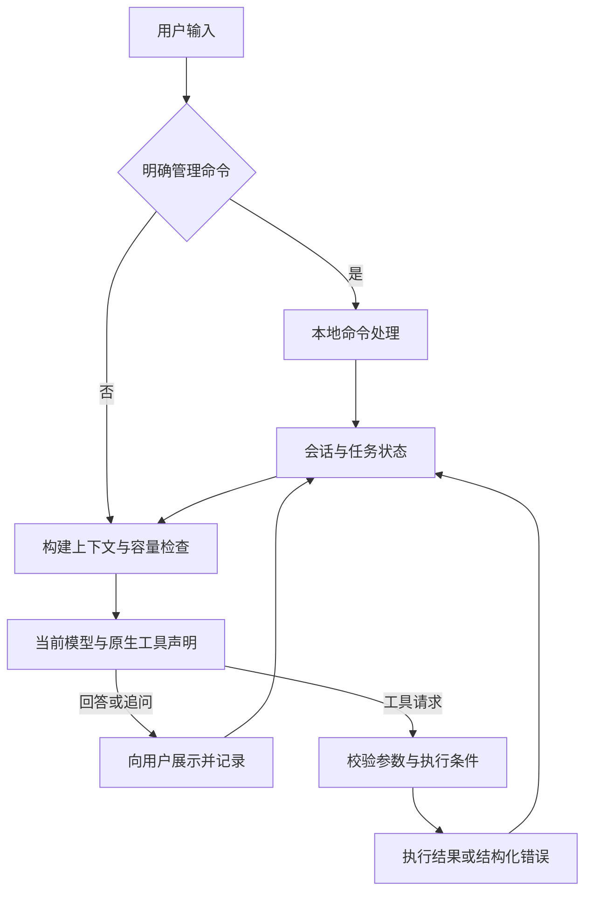

# Petroleum RTO Agent — ReAct改造项目状态与实施规划

_建立及最后更新：2026-09-09（Asia/Shanghai）｜状态：设计方向已确认，实施尚未开始｜适用于下一次对话接续实施_

---

## 📋 1. 当前状态与文档职责

本阶段将现有固定语义分类入口改为**统一的LLM工具循环**，接入五个指定模型、`/model`切换和已有上下文管理组件。用户可以输入任意自然语言，由模型结合对话、任务状态与工具声明决定回答、追问或调用工具。

本文件是ReAct改造阶段进度、范围、验证、风险和下一步的唯一状态来源；后续直接更新相关章节，不再按对话逐次堆叠讨论全文。

| 项目 | 当前事实 |
| --- | --- |
| 本轮交付 | 将架构讨论记录、新阶段规划及项目入口调整保存为改造前Git基线；用户已要求提交并推送到GitHub |
| 用户已确认 | 任意自然语言统一入口、标准工具调用、小工具集合、多模型切换、优先复用已有压缩方法；费用不是现阶段首要约束 |
| 本轮执行范围 | 文档交接及Git提交/推送；不进行运行代码改造、不安装依赖、不调用真实模型或启动RTO |
| 下一轮启动 | 用户在新对话发起实施后，按第8节从P0/P1开始，小批推进；无需重新讨论是否采用上述方向 |
| 当前源码基线 | `bbea4d75c1bd4c3e8e8481d310890face7f372f4`；新对话须重新检查工作树，不能把本行当作永久HEAD |
| 改造代码 | 尚未实现；`/model`、原生工具循环、自动压缩均不能宣称可用 |
| 真实模型验证 | 五个精确ID均未在本阶段调用；资料说明不等于DMX真实兼容证明 |
| 技术路线 | 优先采用LangChain `create_agent`、现有摘要中间件及必要LangGraph状态能力；版本和DMX适配在P0/P1核实 |
| 已有计算底座 | 复用严格业务意图、受信工况、确定性问题构造、求解和M2/M4配对评价 |
| 当前下一步 | 明确五个精确模型与端点、工具、thinking协议的映射，随后实现最小模型响应与工具循环纵切 |

### 新旧文档的关系

- **新阶段：** [STATUS_REACT_REBUILD.md](STATUS_REACT_REBUILD.md)，标题为“ReAct改造项目状态与实施规划”。以后记录本阶段的实际实施与验证。
- **改造前基线：** [STATUS.md](STATUS.md)，保留原文件名和内容，不再向其中追加新阶段状态。其内部“当前”“下一步”等措辞属于截至本次交接前的记录。
- [领域智能体架构](architecture/02_领域智能体架构与功能设计.md)与[源码区领域Agent说明](domain_model/01_聚合式垂域模型综合说明.md)目前描述旧实现。代码改造到位后同步重写，不能提前把新方案写成现有能力。
- `AGENTS.md`、根README和文档导航改为优先指向本文件，避免新对话继续读取旧阶段为唯一状态。

### 本轮文件与验证记录

| 项目 | 结果 |
| --- | --- |
| 新建 | 本文件 |
| 导航调整 | `AGENTS.md`、根`README.md`、`docs/README.md` |
| 旧状态文件 | 本轮保持逐字节不变；交接前SHA-256为`a0380e44b65637ad6cb54c811c40219624f11e213a3ae20ac442df9504c604f9` |
| 既有用户文件 | 两个未跟踪PNG附件不修改、不删除、不纳入本阶段实现范围 |
| 文档验证 | 本文件24个本地链接及两份README链接均存在；单一一级标题、代码围栏与五个精确ID检查通过；`git diff --check`通过；旧状态SHA-256一致。架构图已作文本检查，未运行渲染验证 |
| 未执行 | 应用测试、真实DMX请求、物理RTO；本轮没有运行代码变化 |
| 删除 | 本轮没有删除代码、旧文档或运行产物 |
| Git交付范围 | `AGENTS.md`、根`README.md`、`docs/README.md`、旧`docs/STATUS.md`已有讨论记录及本文件；两个PNG附件保持未跟踪。目标为既有`origin/main`，提交标识与推送结果以Git记录和远程分支核对为准 |

## 🎯 2. 已确定的需求与范围

| 编号 | 已确定要求 | 完成后的可观察行为 |
| --- | --- | --- |
| R01 | 任意自然语言进入同一LLM循环 | 聊天、工况、优化、插入问题均不先进入固定分类器 |
| R02 | 模型接收标准工具声明 | 请求中实际存在原生`tools`，模型输出真实工具调用，结果随后回传 |
| R03 | 工具按业务需求设计 | 工况、问题准备、静态求解、动态复核、结果读取有明确职责 |
| R04 | 完整多轮上下文 | 用户、助手、程序展示内容与工具结果可参与后续理解，查询后指代不丢失 |
| R05 | 工况参与优化思路形成 | 确认前可读取工况、准备问题，模型有依据地解释方案 |
| R06 | 修改和确认可靠衔接 | “只调温度”改变草案；修改失败时旧双变量方案不能被继续执行 |
| R07 | `/model`精确切换 | 简名用于显示，完整ID用于请求；保留对话、草案和已有结果 |
| R08 | thinking按模型适配 | 开关能力、强度、推理续传、终端展示分别处理 |
| R09 | 模型相关容量管理 | 每次模型请求前计量并预留生成空间，工具返回后也检查 |
| R10 | 采用已有压缩方法 | 优先现成摘要组件；关键业务状态独立于摘要，压缩后可继续任务 |
| R11 | 最终回答基于实际工具结果 | 数值、单位、验证阶段和失败状态保持准确；解释失败仍可交付已有关键结果 |
| R12 | 完整替换旧生产入口 | 不保留新失败后悄悄退回旧分类器的双轨运行方式 |

### 范围解释

1. “用户提出优化目标”只是一个使用案例，不能写成所有请求的第一步。系统提示应说明角色、工具用途和业务规则，不让模型先输出固定`routes`。
2. 明确的终端管理命令可以本地处理，如`/model`、`/help`、`/clear`和已有的明确确认/取消命令。其余自然语言交给同一LLM，包括待确认时的追问。
3. 天气是通用入口的示例，不代表本阶段已经接入天气数据。没有相应工具时，模型应说明无法获取实时天气；不将其强行改写为RTO请求。新增天气/搜索服务另按实际需求确定。
4. 现阶段优先保证理解与任务连续性，不以节省token为由保留低容量常量或提前丢弃必要信息。仍需要容量、超时和无进展停止条件，避免协议溢出和无限循环。
5. 本阶段不增加现场读写、策略自动审批/发布、HYSYS后端、后台服务、数据库、队列或插件平台。框架仅引入完成当前需求所必需的依赖与能力。

所有计算结果仍属于合成工程仿真。该事实保持在系统说明和结果语义中，普通聊天无需每轮重复声明。

## 🔍 3. 改造前事实与问题

下表是已核对的旧实现与用户暴露的问题，不是新阶段验收结果。源码和测试名称可能在改造中变化，后续应更新事实而非维持旧断言。

| 位置 | 当前事实 | 改造要解决的问题 |
| --- | --- | --- |
| [cli.py](../src/petroleum_rto/assistant/cli.py) | 一个客户端分别给ChatSession和IntentAdapter | 两条调用路径不共享完整对话；换模型可能只换一边 |
| [chat.py](../src/petroleum_rto/domain_model/chat.py) | 只发送model/messages；只返回content字符串 | 工具调用、推理字段、真实结束原因和usage未进入运行时 |
| [chat_settings.py](../src/petroleum_rto/domain_model/chat_settings.py) | 默认`deepseek-v4-flash-0731`；没有模型目录 | 不支持`/model`及模型相关参数 |
| [dmx_intent_adapter.py](../src/petroleum_rto/assistant/dmx_intent_adapter.py) | routing/intent/confirmation三种自定义外层JSON合同 | 模型先分类，程序进入固定分支；没有标准工具反馈循环 |
| [runtime.py](../src/petroleum_rto/assistant/runtime.py) | 工况本地回复不进入Chat历史；待确认时进入专用小分类 | 装置身份问答偏题，跨轮指代和任务中查询受限 |
| 同上 | 修改失败保留原草案及其可确认资格 | 用户排除压力后，仍可能被引导确认原双变量方案 |
| [chat.py](../src/petroleum_rto/domain_model/chat.py) | 64条消息、128 KiB历史等固定限制；无自动摘要 | 限制不依据实际模型；历史提交可能发生在响应之后并失败 |
| [RTO运行入口](../src/petroleum_rto/rto/runtime/api.py) | 确认后读取Context并构造Problem | 新设计需把审阅方案绑定到确认前读到的明确快照 |
| [求解编排](../src/petroleum_rto/rto/orchestration/service.py) | 求解器调用M2评价服务，之后对短名单做M4 | 应按真实阶段拆工具，不能误拆成独立线性的“求解→仿真→评价” |

先前本地替身已复现：默认有system消息时，31轮短问答留下63条历史；第32次模型替身返回后，提交65条历史失败。该记录不是本轮重新测试，也不是供应商故障。

旧阶段记录过全仓`988 passed`等验证，只能证明当时的代码基线。新Agent、五模型兼容、压缩后语义和真实v4结果均不能继承这些结论。历史运行目录还保留旧v2/v3结果，不能将其作为当前v4七字段结果的验收样本。

## 🧭 4. 目标架构与工具合同

### 4.1 统一入口

图中的回边表示下一次需要模型判断时复用状态，不代表每次展示回答后自动继续无休止生成。收到最终回答、等待用户补充、取消或不可恢复错误时结束本轮。

### 4.2 最小模块分工

| 职责 | 应维护的信息 | 实施边界 |
| --- | --- | --- |
| CLI | 输入输出、`/model`等管理命令、流式显示 | 保留现有`rto-chat`和模块启动方式 |
| Agent循环 | 当前轮模型调用、工具结果反馈、结束条件 | 复用框架循环，不自造文本Thought/Action解析器 |
| 模型适配 | 精确ID、接口路径、请求/响应结构、推理续接 | 按真实协议差异实现；不让供应商对象进入RTO核心 |
| 会话与上下文 | 共同记录、当前任务、摘要、模型专属续接数据 | 同一事实一个权威来源；原始记录与发送视图分开 |
| 领域工具 | 参数校验、受信引用、结构化结果 | 通过`rto.runtime`等公共边界调用领域能力 |
| RTO核心 | Intent、Context、Problem、求解、证据、评价 | 保留确定性构造、基准配对和完整性规则 |

这是一组职责，不要求机械地一行建一个类、工厂或注册系统。现有代码能直接复用时优先复用；只有真实协议或测试隔离需要才增加抽象。

### 4.3 首批工具职责

下列名称是规划用名，尚不是已发布API。P0/P3落地时一次确定最终名称和参数合同；工具Schema应尽量由同一参数模型生成，避免提示词和代码各维护一套字段规则。

| 工具 | 主要输入 | 主要输出 | 执行条件 |
| --- | --- | --- | --- |
| `get_plant_info` | 当前装置引用，单装置时可省略 | 装置/工艺身份、支持目标与变量、能力限制 | 只读；元数据来自权威配置或模型信息 |
| `read_operating_context` | 当前配置工况的选择；不接受自造测量值 | 快照引用、单位、数据时间、来源及必要工况字段 | 只读；保存实际不可变快照 |
| `prepare_optimization` | 业务目标、允许变量、偏好、快照引用；修改时含原方案引用 | 新草案版本、问题引用、目标/变量/约束摘要及待确认状态 | 校验并构造，不求解、不仿真 |
| `solve_optimization` | 已准备方案/问题引用 | 静态求解引用、候选、M2配对评价、规定的动态复核短名单 | 对应方案版本已经确认 |
| `verify_optimization` | 静态求解引用 | 完整短名单M4结果、最终选择、简洁结果引用 | 同一问题/快照；沿用该方案的确认范围 |
| `inspect_optimization` | 当前或明确给定的结果/阶段引用及所需内容 | 已有结果、阶段状态、解释所需证据投影 | 只读；未计算内容不能伪装为已知 |

取消、确认和草案状态操作按真实交互需求提供最小动作接口；它们不形成一个前置的聊天分类器。正式Schema中不接受任意路径、任意公式、完整模型生成Context、算法名或`confirmed=true`之类自授资格字段。

每个工具结果必须有可判别的成功/失败状态及对应引用；数值携带明确单位，工况携带时间与来源。调用和结果通过原生调用ID关联。返回必要信息供模型判断，详细轨迹通过引用按需读取。

### 4.4 求解与验证不可被模型文字替代

- 静态搜索内部本来就需要多次仿真与评价。`solve_optimization`应封装完整的静态搜索及配对评价，不让LLM自行逐个拼装求解器内部调用。
- 所有候选与同一快照的基准配对；错误、硬约束和目标收益按现行领域规则处理。
- 模型可以查看静态结果、解释、继续复核或停止；只完成M2时只能声称得到静态候选。最终推荐仍需达到现行合同要求的M4复核范围。
- 重复工具请求应先检查已有阶段记录，不因模型重试而重复开展同一阶段计算。响应丢失时先查完成状态，不能盲目重新执行。
- 若拆阶段改变持久化流程、恢复语义或公共结果合同，显式升级相应版本。若七字段业务结果语义未变，则不为目录调整单独升级该结果合同。
- 关键数值和验证状态保留程序可直接展示的结果，模型解释失败时仍交付已有结果；模型结论与工具事实的一致性需要独立验收。

## 🔌 5. DMX接口与五模型设计

### 5.1 文档核对的结论

DMX是当前计划使用的网关，优先参考其[文档入口](https://doc.dmxapi.cn/)和[原厂SDK接入说明](https://doc.dmxapi.cn/sdk.html)。SDK兼容说明不能证明每个模型支持全部参数；实施必须同时确认**完整模型ID、端点、模式、工具及推理续接**的组合。

| 能力 | 文档已提供 | 仍需实际核实 |
| --- | --- | --- |
| SDK接入 | 使用对应原厂SDK并设置网关地址 | 所选SDK/框架是否保留额外推理字段和完整工具响应 |
| 模型列表 | `GET /v1/models`，使用模型调用令牌 | 精确ID是否对当前账户可用；列表本身不证明参数能力 |
| Chat函数调用 | 原生`tools`声明与`tool_calls`输出 | 本地执行后的tool消息回传、多次调用及流式参数拼接 |
| Responses函数调用 | 函数工具和`function_call`输出结构 | `function_call_output`续接及所需reasoning项、响应状态 |
| 推理与输出 | 厂商相关开关、强度和独立返回字段 | 精确版本/后缀ID是否遵循这些字段，哪些设置会被忽略 |
| 缓存与usage | 平台及模型相关用量信息 | 实际响应字段与命中情况；缓存不替代上下文压缩 |

对应DMX页面：[模型列表](https://doc.dmxapi.cn/model-list.html)、[Chat函数调用](https://doc.dmxapi.cn/function-call.html)、[Responses函数调用](https://doc.dmxapi.cn/res-function-call.html)、[Responses流式](https://doc.dmxapi.cn/res-chat-stream.html)。这些示例不能替代一次完整的本地工具往返验收。

两种工具协议不能混用：Chat使用嵌套的`tools[].function`，保存assistant工具调用后回传带匹配`tool_call_id`的tool消息；Responses使用扁平函数定义，按`call_id`回传`function_call_output`，并续接协议需要的原始output项。自定义本地函数始终由应用执行，不能把[Responses概览](https://doc.dmxapi.cn/responses.html)的“服务端循环”概述理解为DMX会执行本地RTO。

文档示例也需要审查：[GPT-5.4示例](https://doc.dmxapi.cn/GPT-5.4.html)中的`truncation:auto`不能当成语义摘要方案，过滤reasoning项的写法也不能照搬到要求推理续传的循环；Qwen页面的流式文字要求与示例不完全一致。最终依据精确模型协议和实际往返结果，而非复制单页示例。

### 5.2 精确模型清单

以下是用户指定的配置目标，不是已验证可用清单。

| 显示名 | 请求使用的完整ID | 资料核实与待办 |
| --- | --- | --- |
| Qwen Max | `qwen3.8-max-0902` | 原厂明确为可开关的混合思考模型；DMX精确ID、工具循环、字段透传待验 |
| Kimi K3 | `kimi-k3` | 原厂明确始终思考；DMX精确ID、完整推理回传与迁入上下文待验 |
| GPT Sol CDX | `gpt-5.6-sol-cdx` | 未查到精确后缀ID的公开合同；不得默换`gpt-5.6-sol`。Responses为候选协议，先核实 |
| DeepSeek Pro | `deepseek-v4-pro-0813` | 原厂V4支持双模式；DMX日期ID及实际开关/续接待验 |
| DeepSeek Flash | `deepseek-v4-flash-0731` | 当前配置ID；拟作为非思考用法的初始模型，需验证关闭参数实际生效 |

使用完整ID作为唯一配置键；显示名和菜单编号不参与网络模型匹配。不自动删除后缀、拼接thinking后缀或静默降级到另一模型。某个模型兼容性未解决时明确记录该项，不妨碍其他模型推进，也不能宣称五模型完成。

### 5.3 thinking与端点差异

- Qwen原厂对`qwen3.8-max-0902`列出混合模式；开关使用`enable_thinking`，Qwen3.8的强度支持`low/medium/xhigh`。DMX的通用Qwen示例不能直接证明这个精确ID的能力。[千问思考模式](https://platform.qianwenai.com/docs/developer-guides/text-generation/thinking)、[千问Chat参数](https://platform.qianwenai.com/docs/api-reference/chat/openai-chat)、[DMX Qwen](https://doc.dmxapi.cn/thinking-qwen.html)
- Kimi原厂对`kimi-k3`规定始终思考，强度为`low/high/max`；不能套用旧K2模型的关闭参数。多轮和工具循环应保留其完整assistant消息。[Kimi K3](https://platform.kimi.ai/docs/guide/kimi-k3-quickstart)、[推理消息说明](https://platform.kimi.ai/docs/guide/use-thinking-models)
- DMX DeepSeek页列出Flash默认不思考、使用`enable_thinking`，Pro关闭思考须用`thinking.type=disabled`；原厂默认/字段并不完全相同。因此精确网关ID的行为必须验证，不用型号昵称决定开关。[DMX DeepSeek](https://doc.dmxapi.cn/thinking-deepseek.html)、[原厂Thinking](https://api-docs.deepseek.com/guides/thinking_mode/)
- DMX GPT-5.6文档指出Chat Completions中带工具时需要`reasoning_effort=none`，推理与工具组合优先走Responses。这个系列说明不能证明`gpt-5.6-sol-cdx`的精确合同。[DMX GPT-5.6](https://doc.dmxapi.cn/GPT-5.6.html)
- OpenAI推理摘要不等于原始隐藏思维链；必要的reasoning状态项应按协议续接，不能只提取可见回答。[OpenAI推理说明](https://developers.openai.com/api/docs/guides/reasoning)

统一的产品设置可以是“模型默认/开启/关闭”和该模型支持的强度，但实际请求由模型配置映射。常开模型不提供无效关闭选项；不支持的温度、预算或强度不发送，不用全局`thinking: true/false`覆盖五个模型。

“开启思考”“返回及续传推理状态”“终端显示推理”分别控制。默认显示回答与必要进展；调试显示只能展示接口确实提供的推理文本/摘要。关闭显示不能删除协议要求续传的字段；不透明状态不能通过伪造文字代替。

### 5.4 模型适配与响应处理

以实际调用接口为边界组织少量适配代码，避免为每个模型复制整套Agent。模型配置至少能驱动精确ID、显示名、端点类型、思考能力、可用强度、上下文/生成上限及续接处理。配置只登记有消费者且有依据的字段；未知能力明确标未知，不伪填容量。

客户端不能继续只返回字符串。应完整承接：回答内容、原生调用ID/名称/参数、必要推理状态、结束原因、usage和服务端声明的模型。工具请求允许没有普通content；流式工具参数在完整接收并校验后执行，不能边收到JSON碎片边执行。

记录请求模型和响应声明模型的区别。响应中的model也只是供应商声明，不能当成独立身份认证。传输/解析/工具/业务错误按阶段区分，保留安全信息；认证值和原始敏感载荷不进入日志或摘要。

## 🗂️ 6. 会话、模型切换与上下文管理

### 6.1 三类状态

| 内容 | 保存目的 | 使用方式 |
| --- | --- | --- |
| 共同会话记录 | 用户输入、助手回复、程序展示、已完成工具与结果 | 供追问、来源检查和重新构建上下文 |
| 业务任务状态 | 工况快照、方案版本、确认资格、阶段进度、结果引用 | 程序维护，摘要不得授予或改变执行资格 |
| 模型专属续接信息 | reasoning项、必要推理字段、响应链 | 按对应模型协议保留；不直接跨模型照搬 |

每次调用构建一个发送视图，包含系统要求、工具声明、任务状态投影、近期对话、旧历史摘要与当前必要事实。完整记录不等于每次全量发送；历史重发不等于重复添加同一消息。持久化和保留期限根据当前本地用途决定，不因“记忆”额外建设数据库服务。

### 6.2 `/model`行为

- `/model`显示当前简名、完整ID、实际配置的思考模式与可选列表；支持菜单编号和`/model <完整ID>`。
- 查询或切换模型本身不发起模型调用、不确认方案或执行工具。菜单编号只在明确选择模型时解释，普通自然语言不能被菜单状态拦截。
- 只维护一个当前模型选择。换模型不重建整个Agent或清空任务，不自动改写启动默认配置。
- 保留共同会话、草案、工况与已有结果；按目标模型重新计量并构建合法上下文。
- 在一轮结束或明确中止后切换；未完成工具调用先结清状态，不能交给新模型重新执行。
- 结清是记录实际完成、失败或取消情况，不代表为切换模型而执行尚未获准的工具。
- 原始reasoning、响应ID等不跨模型当作原生历史重放。需要时给目标模型创建新的上下文段，提供清楚标注来源的旧对话背景和业务事实；不补造目标模型的推理字段。
- 切换成功仅表示后续请求采用该ID，不代表模型已经联网验证可用。无效ID或不支持的设置不静默回退。
- 各模型采用自己的合法参数，不继承前一个模型不兼容的强度、temperature或专属字段。是否记住每个模型在当前会话内的用户选择由CLI最小交互确定。

### 6.3 预算、压缩与缓存

优先使用LangChain现成摘要中间件，并核对框架与供应商推理协议的兼容性。该组件可根据模型资料按容量比例触发，支持自定义计量；其默认计量和摘要输入截断也需审查，不能直接照抄演示参数。[LangChain摘要中间件](https://docs.langchain.com/oss/python/langchain/middleware/built-in)

实施要求：

1. 每次模型请求前计量，包括工具返回后；计算系统说明、Schema、消息、摘要、工况及协议要求的推理状态。
2. 按模型窗口和最大生成长度预留空间；推理token是否包含在生成预算中按该接口口径处理，避免漏算或重复算。
3. 单条超长工具结果先投影、分页或留引用；不能只等待下一次摘要修复已经无法发送的请求。
4. 压缩旧交互，保留近期完整调用关联。摘要覆盖的历史不再整段重复注入，原始记录保持可回查。
5. 草案变量、确认资格、工况引用和结果引用从程序状态投影，不仅靠自由文本摘要保存。
6. 确保压缩不会破坏需要保留推理的模型协议；必要时采用受支持的新上下文段方式，并验证关键任务信息保留。不能假设通用摘要组件自动正确处理所有thinking模型。
7. 触发阈值与保留量依据实际窗口、生成需求和多轮案例验证确定；不把旧64条限制简单换成另一个无依据常量。
8. 缓存优先使用供应商已有能力，保持稳定前缀并记录可用的usage。缓存不扩大上下文，也不保证命中；不另造本地缓存平台。

`previous_response_id`只是某些接口的服务端关联能力。它不是本阶段统一会话模型的必要前提，也不能直接跨模型沿用；先保证应用能正确维护记录和原生工具结果。

## 🔒 7. 工况、方案修改与确认语义

### 7.1 优化用例的预期路径

1. 用户提出自然语言需求；模型决定是否读取工况和能力，缺少目标时正常追问或说明可选方向，不擅自填目标。
2. 工况工具保存一份受信快照，向模型返回必要字段、时间和引用。当前来源仍是配置的离线案例，不冒充现场实时数据。
3. 模型提交业务要求与快照引用；问题准备工具校验、构造不可变Problem，并返回可审阅方案。
4. 程序生成目标、变量、约束、工况时间和计算范围等关键确认内容；模型补充优化思路。计算前的判断不能声称已有实际收益。
5. 用户确认对应方案版本；同一次确认覆盖该方案的静态求解与规定动态复核。
6. 后续工具引用同一问题、同一快照；刷新工况或修改要求时建立新方案，不静默替换用户审阅过的事实。

这是离线任务的明确快照语义。将来若改为确认时实时重读现场数据，需要另行定义变化判断；不要把未来实时规则偷偷混入当前离线方案。

### 7.2 待确认不是另一套聊天入口

推荐让`prepare_optimization`正常返回草案，模型展示后结束本轮；等待确认作为业务状态保存。下一条自然语言仍进入同一Agent，所以用户可以聊天、查询、修改或使用`/model`。

若采用框架HITL，仅约束具体执行工具，不能长期把整个Session卡在只能接收approve/reject的中断里。官方中断组件提供暂停和恢复机制，但我们的自然语言交互与方案版本检查仍需实现。[LangChain人工介入](https://docs.langchain.com/oss/python/langchain/human-in-the-loop)

| 用户行为或异常 | 应产生的状态变化 |
| --- | --- |
| 询问“这是什么装置”、闲聊、查询结果 | 正常回答，保留草案 |
| 明确只调温度、不调压力 | 旧方案立即失去可执行资格；生成并展示新版本 |
| 修改失败或需要澄清 | 保留旧方案用于恢复，但不能引导裸确认执行旧版本 |
| “确认，但不要调压力” | 按修改处理，新方案展示后再确认 |
| 单独“确认”或明确确认命令 | 只接受当前已展示且仍可确认的版本 |
| 确认含义不明确、模型协议失败 | 本轮不执行；若仍有未处理修改或用户意图未决，暂停草案确认资格，澄清前不能裸确认执行旧版本 |
| 切换模型 | 不视为确认，也不改变方案内容 |
| 工具已经完成但模型解释失败 | 保存实际结果，允许查询和直接展示，不重算 |
| 用户取消 | 取消待执行方案；已经完成的证据保留 |

自然语言确认仍依赖模型理解，不能声称程序校验能证明所有口语的含义。确认动作必须关联真实用户轮次、已展示方案和当前版本；模型文字、工具返回文字或摘要不能自授确认。相关真实多轮案例必须单独验证。

确认消息必须来自方案展示之后的新用户输入，禁止同轮准备方案后由模型自行确认并计算。确认资格暂停后，需要完成澄清并展示有效方案，或由用户明确恢复旧版本并重新展示，然后才能接受后续确认。

## 🛠️ 8. 分阶段实施规划

所有阶段当前均为**未开始**。阶段交付记录实际改动、删除、测试、未验证项和下一步；不以完成百分比代替证据。P0不应扩展成与当前五模型无关的供应商研究。

### P0—P2：先打通模型和通用循环

| 阶段 | 范围与工作项 | 验收及停止条件 |
| --- | --- | --- |
| P0 基线与接口合同 | 检查工作树、受支持入口、五模型文档；形成精确ID/端点/thinking/tools映射；选定兼容Python 3.12的最小框架版本 | 未知项明确保留；不猜后缀ID。可先用已确认模型推进，五模型最终完成仍须逐项验证 |
| P1 模型响应适配 | 在现有domain-model可选依赖范围加入必需SDK/框架依赖并锁定版本；实现完整响应、工具消息、流式、推理续接和安全诊断 | 本地HTTP替身验证实际载荷和响应；至少覆盖一次纯问答、一次空content工具请求、两次连续工具往返、错误和流式中断 |
| P2 单一Agent与模型选择 | 现有CLI装配接入新循环，共同消息记录、原生工具反馈、唯一active model、`/model`；用简单只读领域工具先打通 | 自由问答零工具、工况工具结果进入后续理解、复合问题、多次工具调用、切模型保留任务；不经过旧路由链 |

首次真实DMX验证应在实施对话已包含该验证范围时，用不含项目敏感内容的短消息和本地无副作用工具进行；不运行RTO。记录精确请求ID、端点、模式、工具次数、结束原因和安全错误类别。公开模型列表只证明可见性，不能替代工具和thinking试验。当前交接轮没有执行或追加授权真实请求。

### P3—P4：接入优化业务

| 阶段 | 范围与工作项 | 验收及停止条件 |
| --- | --- | --- |
| P3 工况、问题与确认 | 在公共运行边界提供快照与问题准备；实现草案版本、修改失效、取消和确认；关键摘要由程序产生 | 确认前零求解/零物理仿真；只调温度；失败后旧版本不能执行；待确认可闲聊、查询和/model；目标不被猜造 |
| P4 分阶段RTO工具 | 提取公共静态求解与动态复核入口，复用现有核心；记录阶段引用和实际完成状态，明确重复请求行为 | 同问题同快照、基准配对、完整短名单复核、缺失阶段如实展示、结果引用和关键事实准确；公共CLI行为保持受支持 |

实现P4前检查现行[ProblemBuilder](../src/petroleum_rto/rto/problem/builder.py)、[编排服务](../src/petroleum_rto/rto/orchestration/service.py)、[M2](../src/petroleum_rto/rto/evaluation/m2.py)及[M4](../src/petroleum_rto/rto/evaluation/m4.py)的真实调用关系。不要复制一套solver/evaluator，也不要从Agent直接导入CDU内部类型。

### P5—P6：完成长对话与替换验收

| 阶段 | 范围与工作项 | 验收及停止条件 |
| --- | --- | --- |
| P5 上下文压缩与跨模型续接 | 接入选定摘要组件、目标模型计量、工具大结果处理、推理协议保留和模型切换投影 | 请求前处理超限；压缩后保留关键排除条件；无孤立工具结果；无跨模型伪造推理；框架摘要默认截断不导致静默丢任务 |
| P6 清理与总验收 | 删除被替代的入口与测试，更新现行主文档、帮助及本文件；执行最终回归和独立真实多轮验收 | 一个生产Agent入口；无旧分类回退；五模型兼容状态明确；源码、配置、测试、文档和运行证据一致 |

P1/P2就应有基础容量预检和合法协议消息，不能等P5才避免请求溢出。P5补齐自动摘要及长任务行为。实际物理RTO采用列明范围的最小单变量案例，先定向再扩大；不要在每次提示词调整后重跑高成本计算。

### 删除与保留边界

**由新Agent替代后删除：** 旧`AssistantTurnDecision`及`assistant-turn-decision`外层合同、routing/confirmation/intent专用提示与解码、固定自由文本分类分支、分离的普通Chat/意图调用链、旧64条历史控制及只维护这些行为的测试/导出/说明。实施中按可达性逐项核对，不先重构待删代码。

**继续保留或迁移：** 凭据读取、安全错误分类、`OptimizationIntent`业务校验、能力/政策、Context/Problem、求解和配对评价、结果引用、路径保护及已有完成结果的恢复能力。

`rto.communication`是独立公共合同的一部分，必须检查实际消费者与当前支持承诺，不能因为移除Agent分类器就整目录删除。过渡代码只服务实施，最终不保留两个可选生产入口；继续支持`rto-chat`与`python -m petroleum_rto.domain_model`，不新增长期`rto-chat-v2`。

## 🧪 9. 验收清单、证据与待核实事项

### 9.1 用户可观察的关键案例

| 编号 | 场景 | 必须看到的结果 |
| --- | --- | --- |
| A01 | 普通闲聊、工艺知识、天气问题 | 模型自由处理；没有天气工具就不伪造实时天气，不强行进入优化 |
| A02 | “装置是催化重整还是常压”→“它是什么装置” | 依据受信装置身份回答，指代持续正确 |
| A03 | 查工况后问“刚才压力是绝压吗” | 能引用已返回事实与单位，不重新猜测 |
| A04 | 工况查询后提出优化 | 工况结果实际进入模型上下文，模型可形成有依据的方案 |
| A05 | “只调整温度，不调压力”及错写、强调重复 | 草案变量正确收窄，未改字段沿用 |
| A06 | 修改失败、含条件确认、协议异常后再说确认 | 旧双变量草案不能执行；给出可继续的说明 |
| A07 | 待确认时闲聊、查询、/model后再返回任务 | 对话不中断，任务不丢失，不把查询误当确认 |
| A08 | 单次用户输入触发两次以上工具调用 | 每次结果关联正确，模型看结果后继续，无重复副作用 |
| A09 | 压缩前后继续讨论“不调整压力” | 要求及受信草案一致，原始依据可回查 |
| A10 | 大工具结果、接近窗口、长回答 | 发送前处理预算，不出现回复收到后丢弃；截断不当作成功完成 |
| A11 | 五模型各自问答、工具、thinking模式 | 精确ID未替换，合法参数生效，必要推理状态保留 |
| A12 | 跨模型切换、无效ID、模式不支持 | 保留业务状态，拒绝非法设置，不复制不兼容响应链 |
| A13 | 工具失败或模型解释失败 | 准确区分阶段，保留已完成结果；失败不变成用户表达有误 |
| A14 | 静态完成而动态未完成/失败 | 不称完整验证；如实保留阶段事实与原因 |
| A15 | RTO重复调用、响应丢失后恢复 | 查询已有阶段再决定，不重复执行同一已完成阶段 |

### 9.2 验证层次

1. 本地协议/HTTP替身：检查请求载荷、消息序列、状态迁移与执行次数，不能证明真实模型理解自然语言。
2. 领域定向：问题确定性、同快照、基准配对、失败语义、结果恢复和公共入口。
3. 真实DMX小案例：五模型逐项记录；优先无副作用工具、多轮、thinking及切换，不将替身答案当真模型证据。
4. 最小实际RTO纵切：采用当前合同生成并读取真实新结果；物理验证范围和运行目录提前明确，旧v2/v3产物不充数。
5. 最终一次全仓回归、规则与类型检查；新变更或失败才重复扩大验证，不以测试数量为目标。

真实接口探针先使用合成数据：每个精确ID测试普通问答，再测试两次有依赖的工具调用，第二步必须使用第一步返回的随机标记，证明结果确实进入模型上下文。分别核实合法thinking开关/强度、流式参数完整接收、正常结束及中断处理；先验证最小Schema，再核实`strict`支持。失败不降级成正文猜工具，也不自动替换模型。记录安全的请求关联信息和字段/usage情况，不保存凭据。

当前相关测试入口：[Agent行为](../tests/domain_model/unit/test_agent_runtime.py)、[Chat协议](../tests/domain_model/unit/test_simple_chat.py)、[CLI](../tests/domain_model/unit/test_chat_cli.py)、[架构边界](../tests/domain_model/unit/test_architecture_boundary.py)、[问题构造](../tests/rto/unit/test_unified_problem_builder.py)、[M2](../tests/rto/unit/test_unified_m2_evaluation.py)、[M4](../tests/rto/unit/test_unified_m4_evaluation.py)、[RTO CLI](../tests/rto/unit/test_rto_runtime_cli.py)。

应改写或删除的旧断言包括：工况回复永不进入Chat、修改合同失败后继续允许原方案确认、修订澄清时精确确认执行旧方案，以及必须确认后才读取工况。新断言应保护本文件规定的新行为，不为通过旧测试恢复旧设计。

### 9.3 当前待核实事项

| 项目 | 当前状态 | 推进方式 |
| --- | --- | --- |
| `gpt-5.6-sol-cdx`精确合同 | 公开说明缺口 | 查DMX精确模型资料及最小接口探测；不改ID、不猜能力 |
| 其余四模型在DMX的实际参数 | 原厂/通用网关资料已有，精确组合未验 | 按模型分别验证thinking、工具、流式和结束原因 |
| thinking与摘要兼容 | 方案已有，未实现/验证 | 核对选定组件保留行为，必要时以新上下文段续接 |
| 框架版本及依赖范围 | 未安装、未锁定 | P0/P1核对Python 3.12与已有环境，选最小支持集 |
| 本地会话跨进程恢复 | 本阶段最低要求为进程内连续 | 不为未来多用户服务预建数据库；如明确需要重启恢复再增加实际文件持久化合同 |
| 分阶段持久化版本 | 尚未设计到代码 | P4按实际变化决定版本和恢复要求，不静默改变v4 |

这些是具体实现待办，不代表全部工作停滞。一个模型未验证时可以推进公共工具和其他模型；对仍未验证部分保持准确状态。

## 🚀 10. 下一对话交接与更新规则

### 新对话先读什么

1. `AGENTS.md`和本文件，确认本阶段范围与最新进度。
2. `docs/README.md`及涉及模块主文档，区分旧实现描述和本阶段目标。
3. 当前源码、`pyproject.toml`、测试、工作树；本次基线提交包含旧`STATUS.md`的既有讨论记录，两个用户PNG附件仍留在本地，开始实施前重新核对状态。
4. 仅在追溯旧验证时读取旧`STATUS.md`；不要把其中“必须闭集路由”“确认后才读工况”等旧约束当成新阶段要求。

### 可直接用于新对话的开工说明

> 请读取`AGENTS.md`和`docs/STATUS_REACT_REBUILD.md`，开始ReAct改造实施。保留任意自然语言统一进入LLM的方向，采用标准工具调用和已有上下文管理组件，按五个完整模型ID实现/model及推理适配。先推进P0/P1，核对DMX文档和当前源码，列清本批范围后实现并做对应最小验证；完成一批再扩大。保护现有RTO核心、凭据与无关附件，不恢复旧分类入口，不向旧docs/STATUS.md追加状态。尚未核实的精确模型能力要明确记录，不猜测或静默替换。真实DMX与物理RTO验证先明确本批执行范围，不把历史测试当作本轮证据。

这段文字供用户在新对话发起实施使用，本文件的生成本身没有启动实现或后台任务。

### 后续状态如何维护

- 每批更新第1节快照、第8节阶段进度、第9节证据/待核实项，以及下方简明变更记录。
- 已确定的需求和边界只在用户改变范围或实现证据要求修正时改动；不要再次粘贴整段会话。
- 每次交付说清本批完成、删除、已执行验证、未验证项、风险和一个具体下一步。
- 更新后的新状态与源码/配置/测试一致，才能宣布相应阶段完成。完整改造完成后同步当前架构主文档；旧基线文档继续保留历史角色。

| 日期 | 实际变更 | 验证与状态 |
| --- | --- | --- |
| 2026-09-09 | 建立独立ReAct改造状态、汇总用户已确定方向和分阶段规划，更新入口；旧状态不追加 | 本地链接、Markdown结构、精确模型ID、差异检查和旧文件哈希核对通过；代码、真实模型和RTO实施未开始 |
| 2026-09-09 | 按用户要求整理改造前Git基线，提交范围为包含工作协议在内的五个文档文件，排除两个PNG附件 | 仅文档变化，沿用文档检查并复核暂存范围；未运行应用测试、真实DMX或RTO。提交与远程同步以Git记录核对，下一实施步骤仍为P0/P1 |
