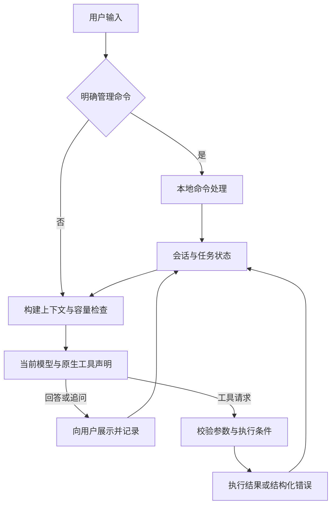

# Petroleum RTO Agent — ReAct改造项目状态与实施规划

_建立及最后更新：2026-09-09（Asia/Shanghai）｜状态：/model编号选择及终端提示修复完成；领域模块157项通过；两种桌面入口实测通过｜适用于下一次对话接续实施_

---

## 📋 1. 当前状态与文档职责

本阶段将现有固定语义分类入口改为**统一的LLM工具循环**，接入五个指定模型、`/model`切换和已有上下文管理组件。用户可以输入任意自然语言，由模型结合对话、任务状态与工具声明决定回答、追问或调用工具。

本文件是ReAct改造阶段进度、范围、验证、风险和下一步的唯一状态来源；后续直接更新相关章节，不再按对话逐次堆叠讨论全文。

| 项目 | 当前事实 |
| --- | --- |
| 本轮交付 | /model现在显示编号和命令示例，随后回复1可在本地切换Qwen；无效编号提示重试、0退出选择。74项定向及领域模块157项通过，两种桌面入口实测通过 |
| 用户已确认 | 任意自然语言统一入口、标准工具调用、小工具集合、多模型切换、优先复用已有压缩方法；费用不是现阶段首要约束；本轮明确采用方案1收紧确认授权 |
| 本轮执行范围 | 用户报告/model后输入1被当作聊天，并要求终端提示切换方法；修复一次性菜单选择及提示、对应测试和现行文档，沿桌面feat/react-agent交付；不扩大到CDX容量或自然语言应用帮助 |
| 后续阶段 | P0–P5已实现；P6旧链清理、确认和协议修复已有验证。Flash思考已移出支持范围，其外部缺字段历史仍保留；CDX容量策略和部分模型组合验证仍待处理，独立RTO CLI和v4合同不变 |
| 当前源码基线 | 当前开发及测试目录统一为/Users/idc/Desktop/petroleum_rto_agent，分支feat/react-agent；main保留e234c2e旧版本。本轮提交标识以git log为准；ba1c保留为停用迁移快照，后续不在其中开发 |
| 改造代码 | 原生工具循环、七个领域工具、一个分页工具、版本确认、M2/M4、`/model`与`/thinking`及自动压缩已实现 |
| 真实模型验证 | CDX生产解析器tiny连续工具调用通过，容量None仍阻止常规请求；Flash四组合对照证实原始响应缺推理不能靠参数/非流式稳定修复。4个资格表达通过有限合成复验；其它模型沿用前轮记录 |
| 技术路线 | LangChain 1.4.0 / langchain-core 1.6.2 / LangGraph 1.2.11；httpx原生传输，domain-model extra和uv.lock锁定；已接入锁定的摘要中间件，关闭默认裁剪及重试 |
| 本地启动准备 | 桌面uv.lock环境已同步，rto-chat和python -m petroleum_rto.domain_model均实测加载桌面ReactAgent，/help和/model通过，默认Flash非思考；原有密钥原位保留，无需复制配置，无真实模型请求 |
| 已有计算底座 | 复用严格业务意图、受信工况、确定性问题构造、求解和M2/M4配对评价 |
| 当前下一步 | 模型编号选择由本地菜单确定处理；后续补齐自然语言应用帮助、当前LLM配置和程序展示内容的会话投影，再处理CDX容量预算 |

### 新旧文档的关系

- **新阶段：** [STATUS_REACT_REBUILD.md](STATUS_REACT_REBUILD.md)，标题为“ReAct改造项目状态与实施规划”。以后记录本阶段的实际实施与验证。
- **改造前基线：** [STATUS.md](STATUS.md)，保留原文件名和内容，不再向其中追加新阶段状态。其内部“当前”“下一步”等措辞属于截至本次交接前的记录。
- [领域智能体架构](architecture/02_领域智能体架构与功能设计.md)与[源码区领域Agent说明](domain_model/01_聚合式垂域模型综合说明.md)已同步当前原生工具实现与P6删除边界；确认授权缺陷及模型限制以本文件为准。
- `AGENTS.md`、根README和文档导航改为优先指向本文件，避免新对话继续读取旧阶段为唯一状态。

### 阶段文件与最近验证记录

| 项目 | 结果 |
| --- | --- |
| 新建 | 累计新增模型配置/native适配、领域工具、ReactAgent、会话压缩模块、共享AgentTurn、staged公共边界、五份测试及uv.lock |
| 本轮修改 | ReactAgent增加一次性模型选择状态和终端用法/成功/错误提示；补17项菜单边界回归，调整既有CLI及方案保持测试；更新架构、领域说明和本状态，无新依赖或文件删除 |
| 旧状态文件 | 本轮保持逐字节不变；交接前SHA-256为`a0380e44b65637ad6cb54c811c40219624f11e213a3ae20ac442df9504c604f9` |
| 既有用户文件 | 两个未跟踪PNG附件不修改、不删除、不纳入本阶段实现范围 |
| 代码验证 | 本轮74项定向通过（1.07秒），随后领域模块157项通过（0.91秒，包含前述定向中的领域测试，不累计相加）；3个改动Python文件Ruff/格式、158源文件mypy通过。两种桌面启动入口实际/model→99→1→/model→0→/exit通过；前轮全仓1008项仅作为既有证据 |
| 存量格式问题 | 全src/tests格式扫描有64个文件失败；逐个从HEAD复核可复现，均为本批前已存在；未扩大范围格式化这些文件 |
| 未通过或未执行 | 本轮没有失败的代码检查；未重新运行全仓/物理仿真或真实DMX，菜单修改不涉及这些边界。Flash思考历史失败保留，CDX容量门禁和自然语言应用帮助仍待处理，菜单通过不证明真实模型问答质量 |
| 前轮删除 | 4份旧v2/v3运行目录、`.pytest_cache`、`.mypy_cache`、`.ruff_cache`；共1,991个文件，删除前分配空间1,397,252,096字节（约1.40 GB / 1.30 GiB） |
| 前轮清理验证 | 目标均未被Git跟踪；取得4份workflow独占锁后删除；删除后全部目标不存在，全部已跟踪文件、两个PNG及策略记录哈希一致，随后仅更新本状态文档。项目磁盘占用由约1.7 GiB降至374 MiB |
| 保留与限制 | 保留源码、测试、配置、原始数据、正式CDU验证报告、运行环境及小型策略记录；已删除运行的物理证据不能再从本地重载，对应旧策略记录仅作历史留存，不构成现行可用验证证据 |
| Git状态 | 桌面feat/react-agent跟踪origin/feat/react-agent；此前9f46152及ab14f28已上传，本轮菜单修复沿同分支提交与同步，最终提交标识以git log为准。main保留e234c2e，两个PNG仍未跟踪，凭据/数据/环境不纳入Git |

### 模型菜单编号选择与终端提示

- **本轮范围：** 修复用户复现的`/model`后回复`1`被当成聊天的问题；用户补充要求在终端直接展示切换方法。仅修改本地选择状态、菜单提示、相关测试和两份现行模块说明，不调整模型容量或自然语言帮助上下文。
- **已实现并验证：** 无参`/model`开启一次选择，编号/精确ID在本地切换；菜单直接提示编号示例、`/model 1`、输入0退出及继续聊天方式；成功显示当前模型与思考状态，无效编号本地报错并允许重试。其他命令仍执行原语义，尤其`/cancel`仍取消优化方案。切换不调用模型或改变方案确认资格。
- **验证结果：** 定向74项通过，领域模块157项通过；后者包含前者的领域测试，不作为独立数量累加。覆盖菜单内/外数字、有效编号和精确ID、无效输入重试、空行/忙碌保持、普通聊天/其他命令退出、方案对象/资格/业务轮次保持、/cancel原语义。两种桌面入口实际验证提示和选择流程；模拟传输的CLI回归确认只有后续聊天触发一次Qwen精确ID请求且thinking开启。3个Python文件Ruff及格式、158源文件mypy、3份文档35个本地链接/围栏及差异检查通过；独立代码复审未发现必修问题。
- **边界与下一步：** 无新依赖或删除；本轮未重新运行全仓、物理仿真或真实DMX，因为本地菜单修改不触及这些计算边界。一次编辑工具脚本语法错误发生在执行前，未产生文件更改，修正后完成。沿现有feat/react-agent提交交付；自然语言应用帮助及CDX容量仍按顶部待办继续。

### GitHub分支发布

- **授权与完成：** 用户反馈GitHub仅显示main并要求新版可见。本轮将桌面feat/react-agent的9f46152推送到原有origin，建立同名远程跟踪分支；保留main，不创建PR或合并。
- **核对结果：** 推送目标与用户截图一致；独立只读核对41个项目文件范围，没有新增真实凭据、运行数据或PNG。git push成功，git ls-remote返回feat/react-agent=9f461527d50bf22e6452d8e7f5fc32174fb690a9、main=e234c2e040ceaeaf3fee24a86179cee380b355f1。
- **变更与未执行：** 修正本状态顶部过时的未提交/不推送描述并补充交付记录，本轮没有业务代码改动或删除。沿用迁移轮1008项通过的既有证据，不重复运行测试、仿真或真实DMX请求。
- **限制与下一步：** 远程发布不代表应用帮助和CDX容量问题已解决。交付入口为[GitHub新版分支](https://github.com/lvguima/petroleum_rto_agent/tree/feat/react-agent)；后续继续在桌面同名分支处理顶部所列剩余事项。

### P3–P4前轮实施与证据

- **已实现：** 准备固定Context/Intent/Problem，程序展示版本摘要；修改尝试先撤销旧资格，失败不恢复；同轮自确认、错误引用与改变任务的并行批次拒绝。待确认仍走同一模型循环，聊天/查询可keep；`/model`保留方案，`/confirm`顺序完成M2/M4，`/cancel`保留已有结果。
- **阶段边界：** M2在原有`static-selection-ready`检查点返回候选及配对评价；M4处理全部入围列表。当前进程重复调用使用缓存；重新准备同一问题后按v4检查点严格重载。完整阶段零新增仿真，半阶段崩溃不新增恰好一次保证。新Agent不再复用旧四动作网关；指定结果查询严格校验证据。
- **真实最小案例：** 收率最大化、只调温度，工况`63d5ee06e6a397967a1519149991d1bb05c6027e7a7d18a6c56aba25f7980784`，问题`58f167c8bc87f209a3af36daa4639aa227a0db0892c91380ee90baf02f92b7d7`，运行`offline-rto-1459c1ff1bb7f3d1`。7次M2、4次M4（完整入围列表及配对基准）；结果`feasible_not_publishable`，628.35 K保持不变，收率0.4919579477，预测改善0。117.83秒包含首次两阶段、重复验证和严格重载；当前代码复验结果一致、M2/M4均零新增。
- **证据位置：** `/private/tmp/petroleum-rto-p3p4-validation/summary.json`及同目录日志，完整仿真在其`runs/`下，原始产物386,045,095字节。没有写入项目`runs/`或复用已删除旧结果；临时目录不是长期归档。
- **失败记录：** 首次全仓975通过、36失败、34错误，均涉及工作树缺少Git忽略的原始输入。原文件仍在桌面原项目；复制`data/cdu/raw/original_data`到当前工作树同一忽略目录（约58 MiB）后再跑：1045通过、1项依赖边界失败。新增公开入口的白名单现已同步且独立检查通过。后续定向381通过、1失败是测试把普通OSError误当中断；原领域合同实际返回evaluation_error，已分别覆盖该语义和KeyboardInterrupt恢复，最新20项定向通过。最终冻结功能代码后全仓1049项全部通过（160.13秒）；随后仅格式调整，AST一致。未跳过失败测试或降低约束。
- **删除与保留：** 替换P2只读占位和旧网关复用，未删除计算核心、原始输入、旧模块、结果或附件；P6集中清理旧模块。保持旧STATUS原始哈希和既有清理记录；本批未提交/推送。
- **剩余限制：** 自然语言confirm/keep仍由LLM判断；检查全文/轮次/版本不能证明语义，真实DMX未验。未决输入及协议失败暂停资格，重新准备展示后确认。查询工况不覆盖已绑定方案，只有prepare才绑定新快照。跨进程不恢复授权；P5进展见下方当前记录。

### P5前轮实施与证据

- **实现范围：** 新增`assistant/context.py`，复用LangChain 1.4.0 `SummarizationMiddleware`。原始消息和发送视图分离，以稳定消息ID记录摘要覆盖水位；每次模型调用前按当前模型的真实协议载荷估计容量，包括系统说明、工具Schema、推理字段和当前任务状态。接近容量时分批摘要旧历史，保留当前轮和近期完整工具关联；已覆盖原文不重复发送。
- **组件边界：** 显式关闭默认摘要输入裁剪及`with_retry`；摘要模型沿用当前精确ID、端点、thinking和传输，不带工具声明，拒绝空内容/工具响应。只有载荷缩小才提交水位。每轮摘要次数单独受既有`max_model_calls`约束；该预算与Agent调用预算分别计数。锁定版本的安全切点和摘要模型替换使用内部接口，升级依赖须复验。
- **大结果和业务状态：** 增加只读`read_tool_result`，按字符偏移读取完整工具结果，支持中文、emoji和JSON转义内容，不重做原工具。每次模型调用重新投影程序方案，阶段详情提供受控引用，Context/Problem/版本/确认资格独立；摘要文字不能恢复资格。切模型保留摘要和水位，已覆盖历史不再发送，另一模型原始推理不重放。
- **已执行：** 新增23项定向通过，覆盖多批完整摘要、失败不重试/不提交、无进展及调用预算、必需内容超限、精确分页还原、同批多工具关联、当前模型和跨模型推理字段、摘要不能自授确认、工具返回后压缩及原生分页往返。摘要提示全量覆盖的断言证明输入没有被组件预先裁掉，不证明真实摘要一定保留所有语义。
- **最终证据：** `/private/tmp/petroleum-rto-p5-validation/pytest-final.log`记录最终冻结代码全仓1072通过、161.41秒；首次1071通过后，因补充工具组边界修复再次完整回归，未把首次结果冒充最终验证。全src/tests Ruff、162文件mypy、5文件格式、9文档92本地链接/结构、差异及旧STATUS哈希核对通过；Mermaid未图形渲染。临时日志不是长期归档。
- **修复记录：** 初次集成修正类型声明和第八个工具的旧集合断言；测试断言改为核对实际Unicode内容和消息对象，避免转义误判。额外检查发现分批选择的二分中点可能落在首个完整工具组内部，已改为向组尾继续搜索，新增回归通过。未跳过测试或放松执行边界。
- **删除与保留：** 替换仅报容量超限的发送策略、切模型时整段合并旧历史的投影及每轮仅一次的任务状态投影；原始历史、现有业务状态、旧模块及无关附件保留。P6统一清理旧模块，本批没有增加依赖、磁盘格式或后台服务。
- **限制与未执行：** 真实DMX摘要保真、网关实际容量与五模型组合仍待验，GPT精确容量未知。未增加持久化会话或内存淘汰；摘要、分页全文及原始会话只在进程内，`/clear`清除。单条不可拆分历史、当前轮或必需状态过大时明确停止；无无限容量承诺。本轮未另行运行独立RTO优化案例，全仓回归仍覆盖计算功能；计算核心未变化，P3/P4证据保留。P6未实施；本批未提交或推送。

## 🎯 2. 已确定的需求与范围

| 编号 | 已确定要求 | 完成后的可观察行为 |
| --- | --- | --- |
| R01 | 任意自然语言进入同一LLM循环 | 聊天、工况、优化、插入问题均不先进入固定分类器 |
| R02 | 模型接收标准工具声明 | 请求中实际存在原生`tools`，模型输出真实工具调用，结果随后回传 |
| R03 | 工具按业务需求设计 | 工况、问题准备、静态求解、动态复核、结果读取有明确职责 |
| R04 | 完整多轮上下文 | 用户、助手、程序展示内容与工具结果可参与后续理解，查询后指代不丢失 |
| R05 | 工况参与优化思路形成 | 确认前可读取工况、准备问题，模型有依据地解释方案 |
| R06 | 修改和确认可靠衔接 | “只调温度”改变草案；修改失败时旧双变量方案不能被继续执行 |
| R07 | `/model`精确切换 | 简名用于显示，完整ID用于请求；保留对话、草案和已有结果 |
| R08 | thinking按模型适配 | 开关能力、强度、推理续传、终端展示分别处理 |
| R09 | 模型相关容量管理 | 每次模型请求前计量并预留生成空间，工具返回后也检查 |
| R10 | 采用已有压缩方法 | 优先现成摘要组件；关键业务状态独立于摘要，压缩后可继续任务 |
| R11 | 最终回答基于实际工具结果 | 数值、单位、验证阶段和失败状态保持准确；解释失败仍可交付已有关键结果 |
| R12 | 完整替换旧生产入口 | 不保留新失败后悄悄退回旧分类器的双轨运行方式 |

### 范围解释

1. “用户提出优化目标”只是一个使用案例，不能写成所有请求的第一步。系统提示应说明角色、工具用途和业务规则，不让模型先输出固定`routes`。
2. 明确的终端管理命令可以本地处理，如`/model`、`/help`、`/clear`和已有的明确确认/取消命令。其余自然语言交给同一LLM，包括待确认时的追问。
3. 天气是通用入口的示例，不代表本阶段已经接入天气数据。没有相应工具时，模型应说明无法获取实时天气；不将其强行改写为RTO请求。新增天气/搜索服务另按实际需求确定。
4. 现阶段优先保证理解与任务连续性，不以节省token为由保留低容量常量或提前丢弃必要信息。仍需要容量、超时和无进展停止条件，避免协议溢出和无限循环。
5. 本阶段不增加现场读写、策略自动审批/发布、HYSYS后端、后台服务、数据库、队列或插件平台。框架仅引入完成当前需求所必需的依赖与能力。

所有计算结果仍属于合成工程仿真。该事实保持在系统说明和结果语义中，普通聊天无需每轮重复声明。

## 🔍 3. 改造前事实与问题

下表是已核对的旧实现与用户暴露的问题，不是新阶段验收结果。源码和测试名称可能在改造中变化，后续应更新事实而非维持旧断言。

| 位置 | 当前事实 | 改造要解决的问题 |
| --- | --- | --- |
| [cli.py](../src/petroleum_rto/assistant/cli.py) | 一个客户端分别给ChatSession和IntentAdapter | 两条调用路径不共享完整对话；换模型可能只换一边 |
| chat.py（P6已删除，历史实现见基线Git） | 只发送model/messages；只返回content字符串 | 工具调用、推理字段、真实结束原因和usage未进入运行时 |
| [chat_settings.py](../src/petroleum_rto/domain_model/chat_settings.py) | 默认`deepseek-v4-flash-0731`；没有模型目录 | 不支持`/model`及模型相关参数 |
| dmx_intent_adapter.py（P6已删除，历史实现见基线Git） | routing/intent/confirmation三种自定义外层JSON合同 | 模型先分类，程序进入固定分支；没有标准工具反馈循环 |
| runtime.py（P6已删除，历史实现见基线Git） | 工况本地回复不进入Chat历史；待确认时进入专用小分类 | 装置身份问答偏题，跨轮指代和任务中查询受限 |
| 同上 | 修改失败保留原草案及其可确认资格 | 用户排除压力后，仍可能被引导确认原双变量方案 |
| chat.py（P6已删除，历史实现见基线Git） | 64条消息、128 KiB历史等固定限制；无自动摘要 | 限制不依据实际模型；历史提交可能发生在响应之后并失败 |
| [RTO运行入口](../src/petroleum_rto/rto/runtime/api.py) | 确认后读取Context并构造Problem | 新设计需把审阅方案绑定到确认前读到的明确快照 |
| [求解编排](../src/petroleum_rto/rto/orchestration/service.py) | 求解器调用M2评价服务，之后对短名单做M4 | 应按真实阶段拆工具，不能误拆成独立线性的“求解→仿真→评价” |

先前本地替身已复现：默认有system消息时，31轮短问答留下63条历史；第32次模型替身返回后，提交65条历史失败。该记录不是本轮重新测试，也不是供应商故障。

旧阶段记录过全仓`988 passed`等验证，只能证明当时的代码基线。新Agent、五模型兼容、压缩后语义和真实v4结果均不能继承这些结论。原先留存的四份旧v2/v3运行结果已于2026-09-09按用户要求清理，不能再本地重载，也不能作为当前v4七字段结果的验收样本。

清理的运行目录位于`runs/rto/`：`offline-rto-20579057338a4ec6`、`offline-rto-3c70c7c35ea7370f`、`offline-rto-8cf168e748c9e46d`、`offline-rto-c1048389862bfe0a`。此前功能测试使用的`/private/tmp/petroleum-rto-functional-20260905-PTYhYx`在本轮检查时已不存在，不计入本轮释放空间。一个既有Agent终端进程仍保留；检查时未持有上述结果文件，清理未中断该进程。

## 🧭 4. 目标架构与工具合同

### 4.1 统一入口

图中的回边表示下一次需要模型判断时复用状态，不代表每次展示回答后自动继续无休止生成。收到最终回答、等待用户补充、取消或不可恢复错误时结束本轮。

### 4.2 最小模块分工

| 职责 | 应维护的信息 | 实施边界 |
| --- | --- | --- |
| CLI | 输入输出、`/model`等管理命令、流式显示 | 保留现有`rto-chat`和模块启动方式 |
| Agent循环 | 当前轮模型调用、工具结果反馈、结束条件 | 复用框架循环，不自造文本Thought/Action解析器 |
| 模型适配 | 精确ID、接口路径、请求/响应结构、推理续接 | 按真实协议差异实现；不让供应商对象进入RTO核心 |
| 会话与上下文 | 共同记录、当前任务、摘要、模型专属续接数据 | 同一事实一个权威来源；原始记录与发送视图分开 |
| 领域工具 | 参数校验、受信引用、结构化结果 | 通过`rto.runtime`等公共边界调用领域能力 |
| RTO核心 | Intent、Context、Problem、求解、证据、评价 | 保留确定性构造、基准配对和完整性规则 |

这是一组职责，不要求机械地一行建一个类、工厂或注册系统。现有代码能直接复用时优先复用；只有真实协议或测试隔离需要才增加抽象。

### 4.3 首批工具职责

以下七个原生工具已接入。正式字段由`assistant/native_tools.py`中的Pydantic参数模型生成并校验；公共RTO准备与阶段入口位于`rto/runtime/staged.py`。

| 工具 | 主要输入 | 主要输出 | 执行条件 |
| --- | --- | --- | --- |
| `get_plant_info` | 无参数 | 装置/工艺身份、支持目标与变量、能力限制 | 只读；元数据来自权威配置或模型信息 |
| `read_operating_context` | 无参数；读取当前配置，不接受自造测量值 | 快照引用、单位、数据时间、来源及必要工况字段 | 只读；保存实际不可变快照 |
| `prepare_optimization` | 业务目标、允许变量、偏好、快照引用；修改时含原方案引用 | 新草案版本、问题引用、目标/变量/约束摘要及待确认状态 | 校验并构造，不求解、不仿真 |
| `manage_optimization` | plan_ref、confirm/cancel/keep、实际user_turn_id及完整用户原文 | 版本确认、取消或保持资格 | 修改当轮不得确认，未决或失败暂停旧资格 |
| `solve_optimization` | 已确认plan_ref | 静态求解引用、候选、M2配对评价、规定的动态复核短名单 | 对应方案版本已经确认 |
| `verify_optimization` | plan_ref及static_ref | 完整短名单M4结果、最终选择、简洁结果引用 | 同一问题/快照；沿用该方案的确认范围 |
| `inspect_optimization` | 可选受控workflow_id；省略时查询会话状态 | 已有结果、阶段状态、解释所需证据投影 | 只读；未计算内容不能伪装为已知 |

取消、确认和草案状态操作按真实交互需求提供最小动作接口；它们不形成一个前置的聊天分类器。正式Schema中不接受任意路径、任意公式、完整模型生成Context、算法名或`confirmed=true`之类自授资格字段。

每个工具结果必须有可判别的成功/失败状态及对应引用；数值携带明确单位，工况携带时间与来源。调用和结果通过原生调用ID关联。返回必要信息供模型判断，详细轨迹通过引用按需读取。

### 4.4 求解与验证不可被模型文字替代

- 静态搜索内部本来就需要多次仿真与评价。`solve_optimization`应封装完整的静态搜索及配对评价，不让LLM自行逐个拼装求解器内部调用。
- 所有候选与同一快照的基准配对；错误、硬约束和目标收益按现行领域规则处理。
- 模型可以查看静态结果、解释、继续复核或停止；只完成M2时只能声称得到静态候选。最终推荐仍需达到现行合同要求的M4复核范围。
- 重复工具请求应先检查已有阶段记录，不因模型重试而重复开展同一阶段计算。响应丢失时先查完成状态，不能盲目重新执行。
- 若拆阶段改变持久化流程、恢复语义或公共结果合同，显式升级相应版本。若七字段业务结果语义未变，则不为目录调整单独升级该结果合同。
- 关键数值和验证状态保留程序可直接展示的结果，模型解释失败时仍交付已有结果；模型结论与工具事实的一致性需要独立验收。

## 🔌 5. DMX接口与五模型设计

### 5.1 文档核对的结论

DMX是当前计划使用的网关，优先参考其[文档入口](https://doc.dmxapi.cn/)和[原厂SDK接入说明](https://doc.dmxapi.cn/sdk.html)。SDK兼容说明不能证明每个模型支持全部参数；实施必须同时确认**完整模型ID、端点、模式、工具及推理续接**的组合。

| 能力 | 文档已提供 | 仍需实际核实 |
| --- | --- | --- |
| SDK接入 | 使用对应原厂SDK并设置网关地址 | 所选SDK/框架是否保留额外推理字段和完整工具响应 |
| 模型列表 | `GET /v1/models`，使用模型调用令牌 | 精确ID是否对当前账户可用；列表本身不证明参数能力 |
| Chat函数调用 | 原生`tools`声明与`tool_calls`输出 | 本地执行后的tool消息回传、多次调用及流式参数拼接 |
| Responses函数调用 | 函数工具和`function_call`输出结构 | `function_call_output`续接及所需reasoning项、响应状态 |
| 推理与输出 | 厂商相关开关、强度和独立返回字段 | 精确版本/后缀ID是否遵循这些字段，哪些设置会被忽略 |
| 缓存与usage | 平台及模型相关用量信息 | 实际响应字段与命中情况；缓存不替代上下文压缩 |

对应DMX页面：[模型列表](https://doc.dmxapi.cn/model-list.html)、[Chat函数调用](https://doc.dmxapi.cn/function-call.html)、[Responses函数调用](https://doc.dmxapi.cn/res-function-call.html)、[Responses流式](https://doc.dmxapi.cn/res-chat-stream.html)。这些示例不能替代一次完整的本地工具往返验收。

两种工具协议不能混用：Chat使用嵌套的`tools[].function`，保存assistant工具调用后回传带匹配`tool_call_id`的tool消息；Responses使用扁平函数定义，按`call_id`回传`function_call_output`，并续接协议需要的原始output项。自定义本地函数始终由应用执行，不能把[Responses概览](https://doc.dmxapi.cn/responses.html)的“服务端循环”概述理解为DMX会执行本地RTO。

文档示例也需要审查：[GPT-5.4示例](https://doc.dmxapi.cn/GPT-5.4.html)中的`truncation:auto`不能当成语义摘要方案，过滤reasoning项的写法也不能照搬到要求推理续传的循环；Qwen页面的流式文字要求与示例不完全一致。最终依据精确模型协议和实际往返结果，而非复制单页示例。

### 5.2 精确模型清单

以下是用户指定的配置目标，不是已验证可用清单。

| 显示名 | 请求使用的完整ID | 资料核实与待办 |
| --- | --- | --- |
| Qwen Max | `qwen3.8-max-0902` | 原厂明确为可开关的混合思考模型；DMX精确ID、工具循环、字段透传待验 |
| Kimi K3 | `kimi-k3` | 原厂明确始终思考；DMX精确ID、完整推理回传与迁入上下文待验 |
| GPT Sol CDX | `gpt-5.6-sol-cdx` | 未查到精确后缀ID的公开合同；不得默换`gpt-5.6-sol`。Responses为候选协议，先核实 |
| DeepSeek Pro | `deepseek-v4-pro-0813` | 原厂V4支持双模式；DMX日期ID及实际开关/续接待验 |
| DeepSeek Flash | `deepseek-v4-flash-0731` | 当前配置ID；拟作为非思考用法的初始模型，需验证关闭参数实际生效 |

使用完整ID作为唯一配置键；显示名和菜单编号不参与网络模型匹配。不自动删除后缀、拼接thinking后缀或静默降级到另一模型。某个模型兼容性未解决时明确记录该项，不妨碍其他模型推进，也不能宣称五模型完成。

### 5.3 thinking与端点差异

- Qwen原厂对`qwen3.8-max-0902`列出混合模式；开关使用`enable_thinking`，Qwen3.8的强度支持`low/medium/xhigh`。DMX的通用Qwen示例不能直接证明这个精确ID的能力。[千问思考模式](https://platform.qianwenai.com/docs/developer-guides/text-generation/thinking)、[千问Chat参数](https://platform.qianwenai.com/docs/api-reference/chat/openai-chat)、[DMX Qwen](https://doc.dmxapi.cn/thinking-qwen.html)
- Kimi原厂对`kimi-k3`规定始终思考，强度为`low/high/max`；不能套用旧K2模型的关闭参数。多轮和工具循环应保留其完整assistant消息。[Kimi K3](https://platform.kimi.ai/docs/guide/kimi-k3-quickstart)、[推理消息说明](https://platform.kimi.ai/docs/guide/use-thinking-models)
- DMX DeepSeek页列出Flash默认不思考、使用`enable_thinking`，Pro关闭思考须用`thinking.type=disabled`；原厂默认/字段并不完全相同。因此精确网关ID的行为必须验证，不用型号昵称决定开关。[DMX DeepSeek](https://doc.dmxapi.cn/thinking-deepseek.html)、[原厂Thinking](https://api-docs.deepseek.com/guides/thinking_mode/)
- DMX GPT-5.6文档指出Chat Completions中带工具时需要`reasoning_effort=none`，推理与工具组合优先走Responses。这个系列说明不能证明`gpt-5.6-sol-cdx`的精确合同。[DMX GPT-5.6](https://doc.dmxapi.cn/GPT-5.6.html)
- OpenAI推理摘要不等于原始隐藏思维链；必要的reasoning状态项应按协议续接，不能只提取可见回答。[OpenAI推理说明](https://developers.openai.com/api/docs/guides/reasoning)

统一的产品设置可以是“模型默认/开启/关闭”和该模型支持的强度，但实际请求由模型配置映射。常开模型不提供无效关闭选项；不支持的温度、预算或强度不发送，不用全局`thinking: true/false`覆盖五个模型。

当前用户已收敛支持范围：Flash固定非思考并拒绝开启，其余模型切换后默认开启，仍保留各自合法的显式设置。原厂Flash能力与当前渠道支持范围分开说明；不继续增加Flash思考补偿逻辑。

“开启思考”“返回及续传推理状态”“终端显示推理”分别控制。默认显示回答与必要进展；调试显示只能展示接口确实提供的推理文本/摘要。关闭显示不能删除协议要求续传的字段；不透明状态不能通过伪造文字代替。

### 5.4 模型适配与响应处理

以实际调用接口为边界组织少量适配代码，避免为每个模型复制整套Agent。模型配置至少能驱动精确ID、显示名、端点类型、思考能力、可用强度、上下文/生成上限及续接处理。配置只登记有消费者且有依据的字段；未知能力明确标未知，不伪填容量。

客户端不能继续只返回字符串。应完整承接：回答内容、原生调用ID/名称/参数、必要推理状态、结束原因、usage和服务端声明的模型。工具请求允许没有普通content；流式工具参数在完整接收并校验后执行，不能边收到JSON碎片边执行。

记录请求模型和响应声明模型的区别。响应中的model也只是供应商声明，不能当成独立身份认证。传输/解析/工具/业务错误按阶段区分，保留安全信息；认证值和原始敏感载荷不进入日志或摘要。

## 🗂️ 6. 会话、模型切换与上下文管理

### 6.1 三类状态

| 内容 | 保存目的 | 使用方式 |
| --- | --- | --- |
| 共同会话记录 | 用户输入、助手回复、程序展示、已完成工具与结果 | 供追问、来源检查和重新构建上下文 |
| 业务任务状态 | 工况快照、方案版本、确认资格、阶段进度、结果引用 | 程序维护，摘要不得授予或改变执行资格 |
| 模型专属续接信息 | reasoning项、必要推理字段、响应链 | 按对应模型协议保留；不直接跨模型照搬 |

每次调用构建一个发送视图，包含系统要求、工具声明、任务状态投影、近期对话、旧历史摘要与当前必要事实。完整记录不等于每次全量发送；历史重发不等于重复添加同一消息。持久化和保留期限根据当前本地用途决定，不因“记忆”额外建设数据库服务。

### 6.2 `/model`行为

- `/model`显示当前简名、完整ID、实际配置的思考模式与可选列表；支持菜单编号和`/model <完整ID>`。
- 查询或切换模型本身不发起模型调用、不确认方案或执行工具。菜单编号只在明确选择模型时解释，普通自然语言不能被菜单状态拦截。
- 只维护一个当前模型选择。换模型不重建整个Agent或清空任务，不自动改写启动默认配置。
- 保留共同会话、草案、工况与已有结果；按目标模型重新计量并构建合法上下文。
- 在一轮结束或明确中止后切换；未完成工具调用先结清状态，不能交给新模型重新执行。
- 结清是记录实际完成、失败或取消情况，不代表为切换模型而执行尚未获准的工具。
- 原始reasoning、响应ID等不跨模型当作原生历史重放。需要时给目标模型创建新的上下文段，提供清楚标注来源的旧对话背景和业务事实；不补造目标模型的推理字段。
- 切换成功仅表示后续请求采用该ID，不代表模型已经联网验证可用。无效ID或不支持的设置不静默回退。
- 各模型采用自己的合法参数，不继承前一个模型不兼容的强度、temperature或专属字段。是否记住每个模型在当前会话内的用户选择由CLI最小交互确定。

### 6.3 预算、压缩与缓存

当前已使用锁定的LangChain现成摘要中间件，配套容量投影与分页，关闭其默认输入裁剪及重试；本地协议兼容测试已通过，真实供应商行为仍待验。该组件可根据模型资料按容量比例触发，支持自定义计量；其默认计量和摘要输入截断也需审查，不能直接照抄演示参数。[LangChain摘要中间件](https://docs.langchain.com/oss/python/langchain/middleware/built-in)

实施要求：

1. 每次模型请求前计量，包括工具返回后；计算系统说明、Schema、消息、摘要、工况及协议要求的推理状态。
2. 按模型窗口和最大生成长度预留空间；推理token是否包含在生成预算中按该接口口径处理，避免漏算或重复算。
3. 单条超长工具结果先投影、分页或留引用；不能只等待下一次摘要修复已经无法发送的请求。
4. 压缩旧交互，保留近期完整调用关联。摘要覆盖的历史不再整段重复注入，原始记录保持可回查。
5. 草案变量、确认资格、工况引用和结果引用从程序状态投影，不仅靠自由文本摘要保存。
6. 确保压缩不会破坏需要保留推理的模型协议；必要时采用受支持的新上下文段方式，并验证关键任务信息保留。不能假设通用摘要组件自动正确处理所有thinking模型。
7. 触发阈值与保留量依据实际窗口、生成需求和多轮案例验证确定；不把旧64条限制简单换成另一个无依据常量。
8. 缓存优先使用供应商已有能力，保持稳定前缀并记录可用的usage。缓存不扩大上下文，也不保证命中；不另造本地缓存平台。

`previous_response_id`只是某些接口的服务端关联能力。它不是本阶段统一会话模型的必要前提，也不能直接跨模型沿用；先保证应用能正确维护记录和原生工具结果。

## 🔒 7. 工况、方案修改与确认语义

### 7.1 优化用例的预期路径

1. 用户提出自然语言需求；模型决定是否读取工况和能力，缺少目标时正常追问或说明可选方向，不擅自填目标。
2. 工况工具保存一份受信快照，向模型返回必要字段、时间和引用。当前来源仍是配置的离线案例，不冒充现场实时数据。
3. 模型提交业务要求与快照引用；问题准备工具校验、构造不可变Problem，并返回可审阅方案。
4. 程序生成目标、变量、约束、工况时间和计算范围等关键确认内容；模型补充优化思路。计算前的判断不能声称已有实际收益。
5. 用户确认对应方案版本；同一次确认覆盖该方案的静态求解与规定动态复核。
6. 后续工具引用同一问题、同一快照；刷新工况或修改要求时建立新方案，不静默替换用户审阅过的事实。

这是离线任务的明确快照语义。将来若改为确认时实时重读现场数据，需要另行定义变化判断；不要把未来实时规则偷偷混入当前离线方案。

### 7.2 待确认不是另一套聊天入口

`prepare_optimization`正常返回草案，程序在模型轮结束后展示关键确认摘要；等待确认作为业务状态保存。下一条自然语言仍进入同一Agent，所以用户可以聊天、查询、修改或使用`/model`。

若采用框架HITL，仅约束具体执行工具，不能长期把整个Session卡在只能接收approve/reject的中断里。官方中断组件提供暂停和恢复机制，但我们的自然语言交互与方案版本检查仍需实现。[LangChain人工介入](https://docs.langchain.com/oss/python/langchain/human-in-the-loop)

| 用户行为或异常 | 应产生的状态变化 |
| --- | --- |
| 询问“这是什么装置”、闲聊、查询结果 | 正常回答，保留草案 |
| 明确只调温度、不调压力 | 旧方案立即失去可执行资格；生成并展示新版本 |
| 修改失败或需要澄清 | 保留旧方案用于恢复，但不能引导裸确认执行旧版本 |
| “确认，但不要调压力” | 按修改处理，新方案展示后再确认 |
| 单独“确认”“确认执行”或`/confirm`（仅忽略首尾空白） | 只接受当前已展示且仍可确认的版本 |
| 确认含义不明确、模型协议失败 | 本轮不执行；若仍有未处理修改或用户意图未决，暂停草案确认资格，澄清前不能裸确认执行旧版本 |
| 切换模型 | 不视为确认，也不改变方案内容 |
| 工具已经完成但模型解释失败 | 保存实际结果，允许查询和直接展示，不重算 |
| 用户取消 | 取消待执行方案；已经完成的证据保留 |

执行确认合同2.1.0沿用2.0.0的输入规则：只接受整条输入`/confirm`、`确认`或`确认执行`，仅忽略首尾空白；标点、引用及附加条件不被忽略。中文确认仍交同一模型调用工具，工具层只按实际完整输入授予资格，不以模型的语义判断代替授权。确认动作同时关联真实用户轮次、已展示方案和当前版本；模型文字、工具返回文字或摘要不能自授确认。

确认消息必须来自方案展示之后的新用户输入，禁止同轮准备方案后由模型自行确认并计算。确认资格暂停后，需要完成澄清并展示有效方案，或由用户明确恢复旧版本并重新展示，然后才能接受后续确认。

## 🛠️ 8. 分阶段实施规划

P0–P4代码及本地验收完成；P3/P4定向、真实最小案例与全仓1049项回归通过。P5已实现并通过新增23项定向与最终全仓1072项回归；P6已清理旧调用链并开展真实验收；CDX容量、部分模型组合尚未解决；确认授权已按方案1收紧，当前验证见顶部记录。阶段交付记录实际改动、删除、测试、未验证项和下一步；不以完成百分比代替证据。P0不应扩展成与当前五模型无关的供应商研究。

### P0—P2：先打通模型和通用循环

| 阶段 | 范围与工作项 | 验收及停止条件 |
| --- | --- | --- |
| P0 基线与接口合同 | 检查工作树、受支持入口、五模型文档；形成精确ID/端点/thinking/tools映射；选定兼容Python 3.12的最小框架版本 | 未知项明确保留；不猜后缀ID。可先用已确认模型推进，五模型最终完成仍须逐项验证 |
| P1 模型响应适配 | 在现有domain-model可选依赖范围加入必需SDK/框架依赖并锁定版本；实现完整响应、工具消息、流式、推理续接和安全诊断 | 本地HTTP替身验证实际载荷和响应；至少覆盖一次纯问答、一次空content工具请求、两次连续工具往返、错误和流式中断 |
| P2 单一Agent与模型选择 | 现有CLI装配接入新循环，共同消息记录、原生工具反馈、唯一active model、`/model`；用简单只读领域工具先打通 | 自由问答零工具、工况工具结果进入后续理解、复合问题、多次工具调用、切模型保留任务；不经过旧路由链 |

首次真实DMX验证应在实施对话已包含该验证范围时，用不含项目敏感内容的短消息和本地无副作用工具进行；不运行RTO。记录精确请求ID、端点、模式、工具次数、结束原因和安全错误类别。公开模型列表只证明可见性，不能替代工具和thinking试验。当前交接轮没有执行或追加授权真实请求。

### P0–P2本批验收记录

- 生产装配：保留原rto-chat及模块启动方式，改为ReactAgent；没有旧路由回退。旧运行时仅提取共享AgentTurn，领域代码未重构。
- 本地协议：Chat与Responses均完成两次工具往返；空content调用、推理/加密状态、usage、声明模型、并列工具和SSE结束可验证。错误、截断或缺失推理不会进入执行。
- 会话：工况/程序展示进入上下文；40轮连续问答未触发旧上限；切模型保留快照及历史并剥离跨模型推理；已完成查询在后续网络/容量失败后保留；Ctrl-C结清未完成调用；程序失败提示也进入后续上下文，避免追问失败原因时缺少事实。
- 参数边界：锁定框架对空Schema跳过校验，初次新增测试出现1失败/34通过；补充局部校验后通过全部回归。静态检查初次3项类型问题均已修正，未隐藏失败或降低检查规则。
- 容量：原厂1M窗口作为四模型候选预检依据，使用保守字节估计，非精确tokenizer；GPT后缀未知容量阻止请求。P0–P2时尚无摘要；P5现已接入，但不宣称无限对话。
- 现行说明已同步：主README、导航、两份架构说明、领域Agent说明，以及RTO文档中的Agent接入边界。没有改写旧STATUS。

### P3—P4：接入优化业务

| 阶段 | 范围与工作项 | 验收及停止条件 |
| --- | --- | --- |
| P3 工况、问题与确认 | 在公共运行边界提供快照与问题准备；实现草案版本、修改失效、取消和确认；关键摘要由程序产生 | 确认前零求解/零物理仿真；只调温度；失败后旧版本不能执行；待确认可闲聊、查询和/model；目标不被猜造 |
| P4 分阶段RTO工具 | 提取公共静态求解与动态复核入口，复用现有核心；记录阶段引用和实际完成状态，明确重复请求行为 | 同问题同快照、基准配对、完整短名单复核、缺失阶段如实展示、结果引用和关键事实准确；公共CLI行为保持受支持 |

P4已核对并复用现行[ProblemBuilder](../src/petroleum_rto/rto/problem/builder.py)、[编排服务](../src/petroleum_rto/rto/orchestration/service.py)、[M2](../src/petroleum_rto/rto/evaluation/m2.py)及[M4](../src/petroleum_rto/rto/evaluation/m4.py)的真实调用关系。不要复制一套solver/evaluator，也不要从Agent直接导入CDU内部类型。

### P5—P6：完成长对话与替换验收

| 阶段 | 范围与工作项 | 验收及停止条件 |
| --- | --- | --- |
| P5 上下文压缩与跨模型续接 | 已接入锁定摘要组件、目标模型计量、全文分页、推理协议保留和模型切换投影 | 本地23项新增及全仓1072项通过；无默认摘要输入截断、无孤立工具结果、摘要不恢复资格；真实摘要语义保真及DMX协议仍待验 |
| P6 清理与总验收 | 删除被替代的入口与测试，更新现行主文档、帮助及本文件；执行最终回归和独立真实多轮验收 | 一个生产Agent入口；无旧分类回退；五模型兼容状态明确；源码、配置、测试、文档和运行证据一致 |

P1/P2就应有基础容量预检和合法协议消息，不能等P5才避免请求溢出。P5补齐自动摘要及长任务行为。实际物理RTO采用列明范围的最小单变量案例，先定向再扩大；不要在每次提示词调整后重跑高成本计算。

### 删除与保留边界

**由新Agent替代后删除：** 旧`AssistantTurnDecision`及`assistant-turn-decision`外层合同、routing/confirmation/intent专用提示与解码、固定自由文本分类分支、分离的普通Chat/意图调用链、旧64条历史控制及只维护这些行为的测试/导出/说明。实施中按可达性逐项核对，不先重构待删代码。

**继续保留或迁移：** 凭据读取、安全错误分类、`OptimizationIntent`业务校验、能力/政策、Context/Problem、求解和配对评价、结果引用、路径保护及已有完成结果的恢复能力。

`rto.communication`是独立公共合同的一部分，必须检查实际消费者与当前支持承诺，不能因为移除Agent分类器就整目录删除。过渡代码只服务实施，最终不保留两个可选生产入口；继续支持`rto-chat`与`python -m petroleum_rto.domain_model`，不新增长期`rto-chat-v2`。

## 🧪 9. 验收清单、证据与待核实事项

### 9.1 用户可观察的关键案例

| 编号 | 场景 | 必须看到的结果 |
| --- | --- | --- |
| A01 | 普通闲聊、工艺知识、天气问题 | 模型自由处理；没有天气工具就不伪造实时天气，不强行进入优化 |
| A02 | “装置是催化重整还是常压”→“它是什么装置” | 依据受信装置身份回答，指代持续正确 |
| A03 | 查工况后问“刚才压力是绝压吗” | 能引用已返回事实与单位，不重新猜测 |
| A04 | 工况查询后提出优化 | 工况结果实际进入模型上下文，模型可形成有依据的方案 |
| A05 | “只调整温度，不调压力”及错写、强调重复 | 草案变量正确收窄，未改字段沿用 |
| A06 | 修改失败、含条件确认、协议异常后再说确认 | 旧双变量草案不能执行；给出可继续的说明 |
| A07 | 待确认时闲聊、查询、/model后再返回任务 | 对话不中断，任务不丢失，不把查询误当确认 |
| A08 | 单次用户输入触发两次以上工具调用 | 每次结果关联正确，模型看结果后继续，无重复副作用 |
| A09 | 压缩前后继续讨论“不调整压力” | 要求及受信草案一致，原始依据可回查 |
| A10 | 大工具结果、接近窗口、长回答 | 发送前处理预算，不出现回复收到后丢弃；截断不当作成功完成 |
| A11 | 五模型各自问答、工具、thinking模式 | 精确ID未替换，合法参数生效，必要推理状态保留 |
| A12 | 跨模型切换、无效ID、模式不支持 | 保留业务状态，拒绝非法设置，不复制不兼容响应链 |
| A13 | 工具失败或模型解释失败 | 准确区分阶段，保留已完成结果；失败不变成用户表达有误 |
| A14 | 静态完成而动态未完成/失败 | 不称完整验证；如实保留阶段事实与原因 |
| A15 | RTO重复调用、响应丢失后恢复 | 查询已有阶段再决定，不重复执行同一已完成阶段 |

### 9.2 验证层次

1. 本地协议/HTTP替身：检查请求载荷、消息序列、状态迁移与执行次数，不能证明真实模型理解自然语言。
2. 领域定向：问题确定性、同快照、基准配对、失败语义、结果恢复和公共入口。
3. 真实DMX小案例：五模型逐项记录；优先无副作用工具、多轮、thinking及切换，不将替身答案当真模型证据。
4. 最小实际RTO纵切：采用当前合同生成并读取真实新结果；物理验证范围和运行目录提前明确，旧v2/v3产物不充数。
5. 最终一次全仓回归、规则与类型检查；新变更或失败才重复扩大验证，不以测试数量为目标。

真实接口探针先使用合成数据：每个精确ID测试普通问答，再测试两次有依赖的工具调用，第二步必须使用第一步返回的随机标记，证明结果确实进入模型上下文。分别核实合法thinking开关/强度、流式参数完整接收、正常结束及中断处理；先验证最小Schema，再核实`strict`支持。失败不降级成正文猜工具，也不自动替换模型。记录安全的请求关联信息和字段/usage情况，不保存凭据。

新入口验收：[上下文压缩与分页](../tests/domain_model/unit/test_context_compaction.py)、[原生Agent](../tests/domain_model/unit/test_react_agent.py)、[模型协议](../tests/domain_model/unit/test_native_protocol.py)、[优化工具](../tests/domain_model/unit/test_optimization_tools.py)、[分阶段RTO](../tests/rto/integration/test_staged_runtime.py)。

现存旧合同及计算回归入口（旧Agent部分待P6按消费者清理）：Agent行为（P6已删除，历史实现见基线Git）、Chat协议（P6已删除，历史实现见基线Git）、[CLI](../tests/domain_model/unit/test_chat_cli.py)、[架构边界](../tests/domain_model/unit/test_architecture_boundary.py)、[问题构造](../tests/rto/unit/test_unified_problem_builder.py)、[M2](../tests/rto/unit/test_unified_m2_evaluation.py)、[M4](../tests/rto/unit/test_unified_m4_evaluation.py)、[RTO CLI](../tests/rto/unit/test_rto_runtime_cli.py)。

应改写或删除的旧断言包括：工况回复永不进入Chat、修改合同失败后继续允许原方案确认、修订澄清时精确确认执行旧方案，以及必须确认后才读取工况。新断言应保护本文件规定的新行为，不为通过旧测试恢复旧设计。

### 9.3 当前待核实事项

| 项目 | 当前状态 | 推进方式 |
| --- | --- | --- |
| `gpt-5.6-sol-cdx`精确合同 | 目录可见；工具事件聚合已修复且生产解析器小请求往返通过，精确容量未知 | 本地门禁尚未修改；下一步采用有来源的暂定应用预算，不改ID、不冒充渠道实测 |
| 其余四模型在DMX的实际参数 | 已完成部分真实组合，详见P6矩阵；Flash现限定非思考 | Flash不再适配思考，其余模型保留必要推理保护；不把有限实测当成所有模式的稳定保证 |
| thinking与摘要兼容 | 本地Chat/Responses验证通过；真实Flash到Kimi及4次摘要案例通过 | 扩大验证前不宣称全部模型摘要保真；当前状态仍由程序独立维护 |
| 自然语言确认授权 | 2.0.0输入校验保持，2.1.0修复状态投影和展示；4个最新真实合成表达通过 | 保留三种明确输入；有限措辞案例已改善，不保证所有自然语言回复均准确 |
| 框架版本及依赖范围 | 已迁移并在桌面目录同步锁定环境；基础dependencies仍为空 | LangChain及httpx仅在domain-model extra；RTO能力查询在屏蔽全部Agent依赖时仍成功且solver_called=false |
| 本地会话跨进程恢复 | 本阶段最低要求为进程内连续 | 不为未来多用户服务预建数据库；如明确需要重启恢复再增加实际文件持久化合同 |
| 应用帮助与模型配置上下文 | 新版/help、/model、/thinking仅本地显示，不记录到对话；系统提示、任务投影和工具没有提供命令/当前LLM配置。本地Wire已核实缺口 | 复用现有命令与模型事实源，提供静态帮助和动态配置投影，并记录可见菜单；不增加关键词业务路由。真实问答质量仍待验 |
| 测试版本与Git交付识别 | 先前用户运行了桌面旧版；现已迁移到桌面feat/react-agent并验证实际导入、脚本和两入口 | 从桌面目录退出旧进程后重新启动；源码位置与启动身份提示仍可继续改善 |
| 分阶段持久化版本 | 复用现有v4阶段文件、事件及恢复语义，没有新增磁盘格式 | 新增静态回执单独使用optimization-static-receipt 1.0.0；七字段业务结果不变，确认资格不落盘 |

这些是具体实现待办，不代表全部工作停滞。一个模型未验证时可以推进公共工具和其他模型；对仍未验证部分保持准确状态。

## 🚀 10. 下一对话交接与更新规则

### 新对话先读什么

1. `AGENTS.md`和本文件，确认本阶段范围与最新进度。
2. `docs/README.md`及涉及模块主文档，区分旧实现描述和本阶段目标。
3. 当前源码、`pyproject.toml`、测试、工作树；本次基线提交包含旧`STATUS.md`的既有讨论记录，两个用户PNG附件仍留在本地，开始实施前重新核对状态。
4. 仅在追溯旧验证时读取旧`STATUS.md`；不要把其中“必须闭集路由”“确认后才读工况”等旧约束当成新阶段要求。

### 可直接用于新对话的开工说明

> 只在`/Users/idc/Desktop/petroleum_rto_agent`的`feat/react-agent`分支继续开发；ba1c已停用。读取`AGENTS.md`和`docs/STATUS_REACT_REBUILD.md`并检查实际Git状态。P6旧调用链已删除，保留独立D0公共合同。确认2.1.0只允许/confirm或整句确认、确认执行。用户已决定Flash仅非思考，其余模型切换后默认开启；不要恢复Flash思考适配。CDX事件聚合已修复并通过有限生产解析器实网，容量门禁尚未调整。用户追问最常见上下文长度，查证所选原厂型号为百万级；未确定统一250K应用预算。最新验证及下一步以顶部为准；不要恢复旧分类器或扩大确认权限。状态只更新新文档，保留两个无关PNG。

以上是后续对话开工提示；本轮已推进P6，没有启动后台服务或新对话。

### 后续状态如何维护

- 每批更新第1节快照、第8节阶段进度、第9节证据/待核实项，以及下方简明变更记录。
- 已确定的需求和边界只在用户改变范围或实现证据要求修正时改动；不要再次粘贴整段会话。
- 每次交付说清本批完成、删除、已执行验证、未验证项、风险和一个具体下一步。
- 更新后的新状态与源码/配置/测试一致，才能宣布相应阶段完成。完整改造完成后同步当前架构主文档；旧基线文档继续保留历史角色。

| 日期 | 实际变更 | 验证与状态 |
| --- | --- | --- |
| 2026-09-09 | 建立独立ReAct改造状态、汇总用户已确定方向和分阶段规划，更新入口；旧状态不追加 | 本地链接、Markdown结构、精确模型ID、差异检查和旧文件哈希核对通过；代码、真实模型和RTO实施未开始 |
| 2026-09-09 | 按用户要求整理改造前Git基线，提交范围为包含工作协议在内的五个文档文件，排除两个PNG附件 | 仅文档变化，沿用文档检查并复核暂存范围；未运行应用测试、真实DMX或RTO。提交与远程同步以Git记录核对，下一实施步骤仍为P0/P1 |
| 2026-09-09 | 清理4份旧运行和3类检查缓存，更新本状态记录 | 删除1,991个文件，约1.40 GB；删除目标及保留文件哈希检查通过。未重跑会生成新产物的测试或仿真；旧运行无法再本地重载，现行数据与正式报告保留。此清理记录尚未另行提交，下一实施步骤仍为P0/P1 |
| 2026-09-09 | 在独立工作树开始P0–P2 | 保留既有清理记录和附件；先核对框架与模型合同，再实现和定向验证。P3/P4优化执行不进入本批，真实网关未验证 |
| 2026-09-09 | 完成P0–P2本地交付 | 166项Agent/协议回归、全src/tests Ruff、160文件strict mypy及本批9文件格式通过；全仓格式64个存量失败已从HEAD复现；85个本地链接和差异检查通过。修正框架空Schema绕过校验。移除旧生产装配，旧实现待P6删除；真实DMX、GPT精确容量及P3以后仍未完成；未提交 |
| 2026-09-09 | P3–P4实现与验证 | 20项新增定向、全仓1049项、Ruff、161文件mypy、10文件格式及85文档链接检查通过；真实单变量M2/M4与严格重载零新增通过。补齐忽略的原始输入，保留初次失败原因。新工具绕开旧四动作网关，P5/P6未开始；未提交 |
| 2026-09-09 | P5实现与本地验收完成 | 复用现成摘要组件，新增全文分页和摘要水位，替换发送投影；23项新增、全仓1072项、Ruff、162文件mypy、5文件格式及92本地文档链接通过。原始记录/业务状态保留；无新依赖。真实DMX、GPT容量及P6待完成；未提交 |
| 2026-09-09 | P6清理与真实验收 | 删除8文件，迁移凭据保护，修复Flash空SSE增量；全仓966及随后相关149通过。真实测试暴露确认误判与Flash思考/CDX兼容问题，P6总验收未通过，确认授权修复方式待用户决定；未提交 |
| 2026-09-09 | 确认合同2.0.0修复与复验 | 用户选择方案1；30项定向、全仓981及真实Flash 8个合成案例授权/变量断言通过。无新增删除；模型兼容与资格措辞问题保留；未提交 |
| 2026-09-09 | 继续处理剩余问题 | 确认状态2.1.0、Responses事件聚合与DeepSeek历史推理检查已实现；125项定向、全仓1005及有限实网通过；外部缺字段/容量问题保留 |
| 2026-09-09 | 收敛Flash模式并核实容量 | Flash拒绝开启思考，其他模型切换后默认开启；99项定向、1008项全仓及静态检查通过。所选原厂型号普遍百万窗口，未确认250K预算，容量门禁未改；无新实网或依赖 |
| 2026-09-09 | 核对启动及常用操作 | 核实当前工作树入口、已安装依赖、密钥文件存在性与权限、模型菜单及确认/中断语义；提供首次配置和启动步骤。仅更新状态说明，无源码变更，不重复测试或调用DMX；CDX门禁下一步保持不变 |
| 2026-09-09 | 诊断用户测试版本与帮助偏题 | git worktree核实桌面main/ba1c detached同基线，重构未提交；用户/help与旧runtime逐项匹配。新版本地Wire核实命令显示及当前模型配置未进入LLM消息。仅分析并更新状态，无源码修改、Git提交合并、外部请求或全仓重跑；此前1008项证据保持原范围 |
| 2026-09-09 | 桌面迁移与独立分支验收 | feat/react-agent承接新版；清理8旧文件及501生成文件，494保留文件不变；桌面两入口、99定向、全仓1008和静态/文档检查通过。main旧版本保留，本轮不推送；后续从桌面继续开发 |

### P6本轮执行记录

- **清理依据与范围：** 全仓生产/测试引用核对后，删除`assistant/runtime.py`、`assistant/dmx_intent_adapter.py`、`assistant/tools.py`、`domain_model/chat.py`及4份专用测试，共8文件、删除前193,194字节。新native唯一仍依赖的编码泄露检查迁入credentials；5项设置/凭据测试迁入`test_credentials.py`，包根移除旧导出与固定历史上限。CLI测试改用当前HELP/AgentTurn，架构白名单不再允许旧Agent访问D0协商器。源码、测试、脚本已无旧实现引用。
- **保留边界：** `rto.communication`公共合同、配置、gold及回归保留；`run_confirmed_optimization`是已有受信调用方公共API，当前Agent不调用它。核心RTO、CDU、v4持久化及既有P0–P5实现保留，未新增依赖或修改物理算法。旧STATUS和两个PNG不修改，全部改动未提交。
- **本地验证：** 初次迁移91项领域测试通过；迁入凭据保护并新增3项编码检查后，领域/D0/RTO入口145通过；修复SSE并新增4个边界用例后全仓966通过（161.42秒）。提示補强后相关149项通过。首次Ruff两处导入/导出排序已修复；最终Ruff与158文件mypy通过。删除的旧链测试不作为新行为回归，118项中5项当前保护迁回、7项新增，测试总数变化有明确口径。
- **真实Flash修复：** SSE后续增量使用`role:null`、`function.name:null`表示无新增内容，旧解析器错误拒绝。现在接受这些空增量，仍拒绝非assistant角色、非字符串参数、未知函数字段及未正常结束的数据。修复后默认非思考模式两次依赖工具调用与最终随机标记核对通过。
- **实际失败与未决设计：** 合成真实多轮中，重复变量要求被Flash文字解释为无修改确认。补强系统提示后，三句复验中的“只调整出口温度，不调整压力目标”仍产生`manage_optimization(confirm)`。手写合成backend因缺少Context字段报错，不能把这次报错当作授权边界保护。随后使用真实AgentDomainTools本地重现：同一句话配confirm可得到`authorized=true`，未调用solver。说明全文/轮次/版本只能验证来源，不能证明语义；提示补强不足以修复。当轮询问用户收紧方式后暂停。用户随后“采用1吧”授权收紧，修复与复验见后续记录；原失败证据保留。
- **真实会话与摘要：** 使用真实ReactAgent/上下文/方案管理，加手写合成领域backend（无RTO物理调用），完成装置身份、绝压、错写修改、重复要求、闲聊、切Kimi和压缩。双变量被收窄为仅温度，切换及4次摘要后保留排除压力和未授权状态。摘要触发使用诊断性较小容量预算，不是供应商真实容量证明；只覆盖一个实测案例。回答仍有冗长、暴露内部引用等UX问题，不能宣称全部自然语言体验可靠。
- **安全与证据：** 受限网络首次未连通，网络访问批准后成功；显式使用桌面原项目受保护凭据，未复制/输出密钥，所有外发内容均为合成消息/工具值，实际RTO执行禁用。日志仅保存输出、安全元数据或字段形状，不保存原始推理。首轮工具探针误读metadata字段导致usage/声明模型记为null，这些null是探针记录缺口，不代表供应商缺字段；后续Flash/Agent/CDX探针已正确读取response_metadata。证据位于`/private/tmp/petroleum-rto-p6-validation/`，包括`deleted.json`、`retired-tests.txt`、`pytest.log`、`live-dmx.json`、`live-dmx-flash.json`、`flash-thinking.json`、`live-agent.json`、`live-repeated-constraints.json`、`confirmation-boundary-reproduction.json`及后续对照记录；临时目录不是长期归档。

| 精确模型 | 实际已验证 | 未通过或未覆盖 |
| --- | --- | --- |
| qwen3.8-max-0902 | 目录可见；默认思考/关闭思考、流式、strict Schema、两次依赖工具及最终随机标记通过 | 全部强度、完整业务多轮和摘要未测；网关窗口未测 |
| kimi-k3 | 目录可见；默认思考两次依赖工具通过；真实Agent跨模型续接、4次摘要和单变量保留通过 | 全部强度与更多业务表达未测；一条案例不证明普遍摘要保真 |
| deepseek-v4-pro-0813 | 目录可见；默认思考/关闭思考两次依赖工具和随机标记通过 | 全部强度、跨用户轮思考及摘要未测 |
| deepseek-v4-flash-0731 | 目录可见；非流式短答成功；SSE空增量修复后默认两次工具通过，观察到cached_tokens；真实Agent多轮已测 | 开启思考时第二次响应缺reasoning_content但usage记推理token，当前拒绝续接；原厂thinking.type一次对照成功，但随机标记复验仍失败，故不改生产映射。历史确认误判已按合同2.0.0增加工具层校验；2.1.0修复状态说明，最新真实复验见后续记录 |
| gpt-5.6-sol-cdx | 目录可见；独立非流式Responses短答成功，服务端声明gpt-5.6-sol | 原流式工具empty-response已定位并修复事件聚合，最新复验见后续记录；精确CDX容量仍无依据，生产Agent继续阻止请求；不替换ID或伪填容量 |

这些是有限合成验收结果，不是五模型全能力认证。CDX独立探针手工构造很小的请求，只诊断候选端点，不使用伪造ModelProfile，也不解除生产容量预检。Flash思考字段缺失在两种参数写法下均复现，未通过放松校验或补造推理隐藏失败。

### P6确认合同2.0.0修复与复验

- **授权与实现：** 用户明确选择方案1。执行确认合同升级为2.0.0：只接受整条输入`/confirm`、`确认`或`确认执行`，仅忽略首尾空白；标点、引用及附加条件不被忽略。新增实际输入校验及结构化拒绝，模型误发confirm不能授权；恢复须重新准备、展示并在后续轮确认。中文确认保留原生工具循环，/confirm保留本地入口，未改计算核心或持久化合同。
- **本地验证：** 30项优化工具定向、全仓981项通过（163.60秒）。覆盖错写、重复变量、条件/引用/否定/标点、原文伪造、失败后keep及裸确认不能恢复、模型强行confirm/solve的结构化拒绝及重新展示后正常M2/M4。真实AgentDomainTools的旧误授权案例复验为`confirmation-input-required`、authorized/eligible均false、solver未调用。Ruff、158文件mypy、3文件格式与文档/差异检查通过。
- **真实复验：** 默认Flash使用实际React循环和领域授权管理，领域工况、问题和M2/M4为手写合成替身。6个已展示单温度方案案例中，4种错写/重复/条件输入没有确认或执行，单独“确认”“确认执行”各完成一次合成M2/M4；另2个双变量起始案例均调用prepare，改为仅温度并展示新方案，未执行。8个案例授权/变量断言通过；本轮没有声称全部自然语言语义准确或真实物理端到端通过。
- **仍有体验问题：** 重复变量且方案已一致时，模型有时keep，有时只查询后追问；个别回复声称已有确认资格，但当轮程序实际上暂停了资格。双变量修订也出现模型把尚待程序展示的新方案描述为“确认资格失效”。这不改变实际授权状态；正式程序轮末状态仍负责提示，后续需改善措辞一致性，本轮未继续扩大为通用回复质量改造。
- **证据：** `/private/tmp/petroleum-rto-p6-validation/pytest-confirmation-v2.log`、`confirmation-boundary-v2.json`、`live-confirmation-v2.json`和`live-confirmation-revision-v2.json`。修正合成探针原先缺少Context导致的假失败，正常确认可真实经过manage；不保存原始推理、不复制或输出凭据。临时目录不是长期归档。
- **范围与下一步：** 本轮无删除、无新依赖；旧STATUS哈希及无关PNG保持，未提交推送。下一步核实Flash思考续接和CDX工具/容量；部分资格措辞质量仍待处理。

### P6剩余问题修复与验证

- **授权与范围：** 用户要求继续处理Flash思考续接、CDX工具/容量和确认状态说明；两项协议调查并行，主agent统一集成。没有新增依赖、物理算法或确认输入。此前未提交改动和两个PNG保留。
- **确认状态已修复：** 投影合同2.1.0沿用2.0.0的三种确认输入，新增当前输入未处理、待展示、待确认、已授权、暂停和完成的明确状态；可确认标记只读当前值，未解决输入在轮末清理上轮资格。程序展示一致下一步，模型被要求重复变量也重新prepare。72项相关回归通过（本轮新增3项）；4个真实Flash合成表达均重新准备为仅温度、程序展示后可确认、当轮无授权/计算，逐条复核未再出现资格失效或误称可执行。仍有内部ID、冗长及一例重复prepare/陈旧版本措辞，程序最后展示当前版；未声称普遍自然语言质量已保证。
- **CDX已修复部分：** 真实SSE将完整函数放在output_item.done，completed.response.output为空，原聚合器因此empty-response；现在按连续索引收集完整done项，并核对added项完整性、身份、重复及终帧一致性，缺失或冲突不执行。新增15个协议回归通过；独立事件聚合tiny探针两组各3请求通过read/echo/随机标记。修复后的生产解析器再完成1组3请求的实网复验并通过；该组未产生推理token，不把它单独当作真实加密推理续接证明（前述两组独立诊断首轮含加密推理并原样续接）。精确CDX模型目录仅id/object/created/owned_by/supported_endpoint_types，无容量；[DMX常规GPT页面](https://doc.dmxapi.cn/GPT-5.6.html)与[旧CDX示例](https://doc.dmxapi.cn/codex-plus-plus.html)均不能证明sol-cdx容量，继续保留生产容量门禁。
- **Flash外部未解决：** 同一个真实助手前缀（完整推理）和合成随机标记，对四种参数/传输组合做第2步对照：enable_thinking+SSE一次返回推理，另三种原始HTTP200响应均缺reasoning_content却报告70个推理token。成功分支的最终正文也缺推理并报告25个推理token。证明问题不只在SSE或某个开关，不能定位到网关内部还是上游；不补造字段、不放宽校验、不切换默认参数或传输。6次HTTP200及首次独立ReadTimeout均保留。
- **Flash本地保护补齐：** [DeepSeek官方](https://api-docs.deepseek.com/guides/thinking_mode/)要求带tools请求回传所有旧轮推理，包括无调用的最终回复。发送前新增历史完整性检查；最终正文可保留显示，但缺推理时下一请求在网络前停止并给出关闭思考/切模型提示。显式模式切换沿用已有背景投影，无工具摘要不被误拒绝。新增6个协议/Agent回归，与本轮其它改动合计125项定向通过；Ruff与158文件mypy通过；最终冻结代码全仓1005项通过（162.35秒），日志pytest-final.log。
- **验证范围与失败记录：** 所有网络输入为合成值、M2/M4为替身，未执行真实物理RTO端到端或五模型全强度认证。资格探针首次源文件切分报SyntaxError，未发送请求；随后自动审批等待超时，按允许重试一次后通过；没有绕开审批或输出密钥。Mermaid尚未渲染。本轮无新增删除，未提交推送。
- **证据与下一步：** `/private/tmp/petroleum-rto-p6-followup/`保存live-qualification.json、flash/compare.json、flash/findings.json及cdx/相关探针，临时目录不是长期归档。生产CDX解析器实网与全仓回归均通过；独立只读复核未发现当前状态/模式切换/摘要的确定缺陷。外部仍需DMX给出稳定推理响应与精确容量合同，当前不宣称P6总验收全部通过。

待DMX核对的具体证据：Flash失败响应`21a062395c635811-1788940777474-9286b14a`、`21a062395c635811-1788940780107-658c720d`、`21a062395c635811-1788940783719-48275b0f`均在原始响应缺推理，具体形状及用量见flash/compare.json；CDX生产修复复验首响应`resp_0667ab6a234e925b016aa121de67f887d196dc919ef9a6dd6e`，模型目录缺窗口字段。未发送任何外部消息，后续取得供应商合同后再解除对应限制。

### 模型能力、容量门禁与流式显示复核

- **用户问题与本轮范围：** 用户要求查证Flash是否支持思考、CDX为何被禁用、流式/非流式及容量依据，并指出容量未知即禁用不合理，不希望为Flash强行增加适配。本轮只读源码和官方/DMX文档；无新模型请求、源码或测试变更，之前1005项证据保持其原范围。
- **查证事实：** [DeepSeek模型表](https://api-docs.deepseek.com/quick_start/pricing/)明确Flash当前为Flash-0731，支持思考/非思考和工具，1M上下文、最大384K输出；[DMX思考说明](https://doc.dmxapi.cn/thinking-deepseek.html)也说明Flash支持思考，但渠道默认非思考，用enable_thinking开启。因此缺字段不是原厂天生无思考能力的证明。当前DMX组合不稳定，可建议仅保留非思考使用，不继续补偿或补造字段；尚未实施停用/thinking on。
- **容量查证：** [OpenAI Sol模型页](https://developers.openai.com/api/docs/models/gpt-5.6-sol)为1,050,000窗口、128,000最大输出；[当前Chat Latest](https://developers.openai.com/api/docs/models/chat-latest)为400,000窗口，因此不能把所有当前模型都按百万处理。DMX常规GPT页面也列Sol百万窗口，未找到精确sol-cdx容量依据；已有CDX实网响应model为gpt-5.6-sol，但这不证明网关窗口等同原厂。
- **设计判断与建议（未实施）：** 容量缺资料不应直接等同模型不可调用；当前unknown-model-capacity是本地过严策略。建议将已核实模型上限与应用暂定请求预算区分：有依据时按模型预算压缩，缺精确依据仍可正常请求，预算清楚标为暂定；CDX可参考Sol官方1.05M而不冒充网关实测值。真实上下文超限需结构化识别，再按既有压缩路径处理并有界重发模型请求，不能重做已完成工具或无限重试。此设计变更尚未写入运行代码。
- **当前流式事实：** DmxNativeModel默认use_stream=true，CLI没有覆盖，网络请求按SSE流式接收；NativeTransport聚合完整响应后交给Agent，CLI等待handle整轮返回再print，所以当前没有终端逐字展示。LangGraph stream_mode=updates也不是终端token流。所谓结束帧更准确叫response.completed完成事件，只结束一次模型响应；后续工具执行和下一次模型请求仍可继续。[OpenAI流式说明](https://developers.openai.com/api/docs/guides/streaming-responses)
- **下一步：** 将容量未知的整模型禁用调整为明确暂定预算；Flash渠道支持范围可收敛到已验证非思考模式；若改进终端体验，应接通正文增量展示，工具参数仍完整接收校验后执行。本轮仅给出核实结果与修改建议，没有宣称这些建议已实现。

### Flash模式收敛与常见上下文容量核实

- **授权与实际变更：** 用户决定切换Flash不开思考、其他模型默认开启。Flash的模型选择构造拒绝on，禁用强度；请求保持enable_thinking=false。CLI清楚解释拒绝原因并保留设置、会话和方案。跨型号切换恢复各自默认，其他模型合法开关仍保留，Kimi不能关闭。删除不可达的Flash思考历史检查，Pro完整推理续接继续校验；没有补造字段、增加重试或更改传输。
- **测试变更与失败记录：** 删除已不支持的2个Flash思考参数化用例；将通用DeepSeek最终回复、恢复及摘要测试迁到Pro。新增模式拒绝、无网络副作用、拒绝后会话续接、四模型切换默认恢复覆盖。首次98通过、1失败是摘要测试仍开启Flash，迁移该夹具后99项定向全部通过；未放松生产校验。最终冻结功能代码全仓1008项全部通过（162.05秒），较前轮1005净增3项；日志pytest-full.log。
- **静态与独立检查：** 全src/tests Ruff、158源文件mypy、6个本轮Python文件格式、9份Markdown的49个本地链接及代码围栏、差异检查通过，旧STATUS哈希一致。并行只读复核未发现支持入口可绕开Flash限制或误伤其他模型续接；不把静态复核等同真实渠道认证。
- **容量资料：** [Qwen精确0902快照](https://help.aliyun.com/zh/model-studio/qwen3-8-max)、[Kimi K3](https://platform.kimi.ai/docs/guide/kimi-k3-quickstart)、[DeepSeek当前版本表](https://api-docs.deepseek.com/quick_start/pricing/)分别明确百万上下文，DeepSeek表映射Flash0731和Pro0813；[GPT Sol](https://developers.openai.com/api/docs/models/gpt-5.6-sol)为1,050,000。故在用户所选原厂型号中百万级占多数，不支持250K是普遍型号上限的说法，也没有全市场分布统计。原厂容量与精确DMX渠道容量分开；CDX不能直接继承原厂认证结论。
- **容量决策范围：** 用户提出“二百五十”后，收到单位澄清时转问“目前最常见的上下文长度是多少”；未确认250K或250万。因此本轮只核实资料，没有改动窗口、输出预算、摘要阈值或CDX门禁。250K可以是主动应用预算，但不应伪装模型真实容量。所选模型以百万级为资料基准，精确CDX渠道仍需暂定预算策略。
- **未执行与限制：** 本轮无真实DMX请求、无独立物理优化案例、未渲染Mermaid；已有Qwen/Kimi/Pro思考工具往返与CDX小请求成功记录来自前轮，不证明所有强度、跨轮和长上下文稳定。Flash思考不再属于当前支持范围，但此前渠道失败如实保留。没有新增依赖或删除用户产物；两个PNG不动；未提交或推送。
- **下一步：** 依据容量讨论落实有来源的应用预算，解除CDX未知容量即禁止请求的过严策略；精确渠道窗口未知仍需明确标注。证据目录为/private/tmp/petroleum-rto-flash-policy，临时目录不是长期归档。

### 桌面目录迁移与独立分支

- **用户授权：** 新代码必须位于桌面专用项目，以新版覆盖旧版，建立独立分支；旧版已提交，可删除明确淘汰的旧代码。本轮不顺带修改应用帮助上下文或CDX容量逻辑。
- **迁移已执行：** 建立feat/react-agent，按Git差异复制33文件并删除4旧源码、4旧测试；清理build、旧egg-info及42个源码/测试/脚本缓存目录，共501生成文件、10,389,638字节。没有整目录镜像删除，未复制旧虚拟环境。覆盖前备份相关桌面文件，原有状态清理记录已包含在新版中。
- **保留核对：** 凭据、原始数据、运行结果、报告、配置、旧STATUS和两个PNG共494文件，迁移前后内容哈希与权限一致；不输出凭据及其哈希。两个PNG不纳入Git。
- **执行异常：** 迁移脚本创建的自动审批连续两次超时，未创建脚本或执行覆盖；改为分步Git、只读清单和明确同步后成功。离线依赖同步因缺少锁定ast-serialize缓存失败，随后正常同步同一uv.lock。文档更新首次因命令编码SyntaxError未执行，ASCII编码重试成功。首次格式检查因默认缓存目录受限，改用no-cache通过；首次链接扫描因Git转义中文路径失败，改用NUL分隔通过，未修改被检查的源码。
- **验证状态：** 桌面环境已同步；99项定向和全仓1008项通过（163.62秒），Ruff、158文件mypy、11文件格式及9文档91本地链接通过。实际CLI和模块入口均从桌面加载ReactAgent，/help、/model、/exit本地冒烟通过，无网络模型请求。没有新增独立用户优化或真实DMX验证；既有帮助上下文和CDX门禁问题仍未修复。
- **证据与下一步：** /private/tmp/petroleum-rto-desktop-migration.UnEjlZ保存清单、原文件备份和迁移统计。交付分支为桌面feat/react-agent，本轮提交标识以git log为准；main历史保留，不推送远程。后续开发只使用桌面目录，ba1c停用快照保留以避免破坏当前对话环境。

- **环境变更：** 使用既有uv.lock同步了33个安装项，并移除未在锁定项目依赖中的旧环境包；没有复制工作树虚拟环境或增加新的依赖声明。独立只读复核确认editable安装、入口脚本和源码路径均指向桌面，新旧目录的非文档项目文件完全一致。
