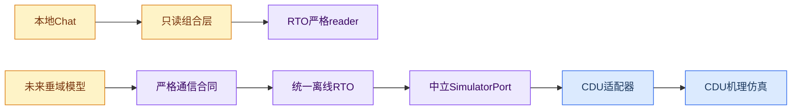

# 项目目录与模块边界

_更新日期：2026-08-21 · 本文只描述现行目录、依赖方向和长期扩展边界。_

## 设计结论

项目采用“类型分层、模块命名空间”：安装源码位于`src/petroleum_rto/<module>/`，配置、数据、测试、报告和本地运行产物按类型放在顶层目录，再以模块名隔离。

当前系统只保留三条活动能力：CDU机理仿真、目标数量无关的离线RTO，以及不自动执行RTO的本地对话工具。旧RTO执行版本和旧垂域供应商治理栈不属于现行架构，也不作为扩展点。



## 物理目录

```text
petroleum_rto_agent/
├── src/petroleum_rto/
│   ├── cdu/                 # 机理模型、控制、校正、验证与运行证据
│   ├── rto/                 # 统一1..N目标离线RTO
│   │   ├── capabilities/    # 原子能力与系统政策
│   │   ├── communication/   # 未来垂域模型的严格请求/响应边界
│   │   ├── context/         # 受信运行上下文加载
│   │   ├── contracts/       # 中立问题、候选、证据和结果合同
│   │   ├── problem/         # 确定性问题构造与特征提取
│   │   ├── solvers/         # 当前求解实现及其最小端口
│   │   ├── compilation/     # 候选到仿真计划的编译
│   │   ├── evaluation/      # M2/M4配对评价
│   │   ├── selection/       # 硬门禁后的最终选择
│   │   ├── orchestration/   # 可恢复离线编排与严格artifact
│   │   ├── strategies/      # 不可变策略及追加式生命周期
│   │   ├── adapters/        # 具体仿真后端适配器
│   │   └── runtime/         # 公共API与CLI
│   ├── domain_model/        # 极简Chat客户端和本地设置
│   └── assistant/           # Chat与严格只读摘要的薄组合CLI
├── configs/
│   ├── cdu/                 # CDU模型、案例、控制和验证配置
│   └── rto/
│       ├── capabilities/    # 能力目录与系统政策
│       ├── contexts/        # 受信运行上下文fixture
│       └── intents/         # 统一意图fixture
├── data/
│   ├── cdu/                 # CDU来源、gold与本地原始资料
│   └── rto/                 # 当前合同/算法gold
├── tests/
│   ├── cdu/
│   ├── rto/
│   └── domain_model/
├── scripts/cdu/             # CDU维护脚本
├── reports/cdu/             # 仍属当前模型证据的报告
├── runs/
│   ├── cdu/                 # 本地CDU运行证据，不纳入Git
│   └── rto/                 # 本地workflow与策略库，不纳入Git
└── docs/                    # 项目状态、现行主文档和CDU历史来源
```

不存在活动内容的目录不为对称性保留。新资产只有出现真实消费者时才创建对应目录。

本地Chat直接读取`chat_settings.py`中的接口、模型和系统提示词，以及Git忽略的`dmx_api.json`本地密钥。会话只在内存中，不写垂域运行artifact。`assistant`可以严格读取既有RTO结果或受信仿真配置的安全投影，但不得启动求解、仿真、审批或发布。

## 统一RTO职责

RTO只使用一套非空目标向量表达`1..N`目标。目标数是问题特征，不是合同版本、工作流分支或目录分支。当前治理对象分工如下：

| 对象 | 唯一职责 | 不得承担 |
| --- | --- | --- |
| `CapabilityCatalog` | 定义可执行的metric、objective、decision、guardrail和selector原子能力 | 本次运行值、自然语言解释 |
| `SystemPolicy` | 定义硬门禁、预算、执行路由和发布要求 | 上游自由覆盖、业务偏好解释 |
| `OptimizationIntent` | 表达原子能力ID、方向、优先级和结果请求 | 运行事实、公式、自由阈值、求解器ID |
| `OperatingContext` | 保存由受信调用方注入的本次运行事实 | 从业务意图或模型回答推导事实 |
| `OptimizationProblem` | 保存确定性构建后的不可变求解问题 | 运行期再解释意图或修改政策 |

`OperatingContext`的严格、版本化合同本身就是当前上下文结构的唯一事实源。仓库不再维护一份字段完全重复、却没有独立执行者的`ContextSchema`伪配置；来源可信度由调用边界和上下文证据负责，不能靠未执行的标签声明。

执行顺序固定为：严格意图解析 → 受信上下文绑定 → 问题构造 → 路由选择 → 候选搜索 → 同上下文基准配对仿真 → 统一评价 → 硬门禁 → 显式偏好选择 → artifact与策略治理。

问题构造器只编译，不求解；路由只选择与问题中已绑定执行路线一致的求解实现；求解器只能通过候选评价端口取得结果；评价器只解释原始仿真证据。相同物理执行在内部可信链路中不得为了“保险”反复重建同一资源或重验同一不变量。

## 模块依赖

- `petroleum_rto.cdu`不得导入RTO。
- RTO核心只依赖中立合同和端口；只有`rto.adapters`中的具体CDU适配器可以导入`petroleum_rto.cdu.runtime`。
- RTO不得要求其他仿真后端伪装成CDU内部summary、loop ID或资源路径；新增后端必须先证明中立合同足够表达现有评价所需证据。
- `rto.communication`可以独立定义不可信模型输出的严格边界，但不得调用求解、仿真、审批或发布。
- `domain_model`只负责本地模型调用，不导入RTO求解器、CDU或通信运行栈。
- `assistant`是唯一同时组合Chat与RTO只读投影的薄层；RTO和Chat核心不相互导入。
- 不建立未命名归属的业务共享层。至少两个模块真实复用且语义稳定后，才考虑提升为公共合同。

## 信任边界与证据

严格校验放在文件、网络、不可信模型响应、外部仿真适配器和持久化读取边界。运行manifest必须验证精确文件集、大小、哈希、相对证据路径和可确定性重建的业务结果；manifest最后提交，避免把半写入目录视为完成。

哈希只证明内容自洽与意外损坏检测，不证明身份或抵抗能够重签manifest的攻击者。源码指纹只覆盖实际影响对应运行部件的源码闭包，不能因无关模块修改而改变。

策略payload和release不可变，状态变化使用追加事件。发布仍是离线人工治理动作，不代表现场批准或控制权。

## CDU稳定资源标识

CDU既有正式证据把部分历史相对字符串写入内容并参与指纹：

| 稳定逻辑标识 | 当前物理位置 |
| --- | --- |
| `configs/...` | `configs/cdu/...` |
| `data/...` | `data/cdu/...` |
| `reports/modeling/...` | `reports/cdu/...` |
| `base_files/...` | `data/cdu/raw/...` |

这些字符串是不可变CDU证据的逻辑资源标识，不是RTO版本兼容层。`petroleum_rto.cdu.repository.resolve_cdu_repository_path`负责把它们映射到当前位置。新增资源直接使用当前物理目录；不得为了目录美观批量改写既有证据字节。

## 变更门禁

目录或模块边界变化至少检查：

1. 新文件具有明确模块归属，空目录和无消费者配置没有被保留；
2. CDU→RTO导入为零，具体仿真依赖只存在于适配器；
3. 单个和多个目标使用同一意图、问题、评价、workflow与artifact合同；
4. 能力、上下文和路由各有唯一事实源，配置字段都有运行时消费者；
5. 不可信模型响应不能绕过通信合同进入问题构造；
6. 每个候选继续满足同上下文基准配对、硬门禁和错误隔离；
7. 严格reader可重载当前artifact且不触发新仿真；
8. 删除功能时同步删除入口、导出、配置、数据、测试、文档和产物；
9. 最小专项、模块回归、静态检查和文档链接通过；
10. [实施状态](../STATUS.md)与仓库事实同步。
