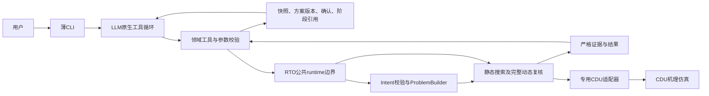

# 项目目录与模块边界

_更新日期：2026-09-09 · 本文只描述现行目录、依赖方向和长期边界。_

## 设计结论

项目采用“类型分层、模块命名空间”：安装源码位于`src/petroleum_rto/<module>/`，配置、数据、测试、报告和本地运行产物按类型放在顶层目录，再以模块名隔离。

当前活动能力包括CDU机理仿真、目标数量无关的离线RTO，以及本地领域Agent。任意自然语言进入同一LLM工具循环；模型选择工具，代码校验业务字段、绑定不可变工况并构造问题，用户确认方案版本后执行完整M2/M4。没有前置闭集意图路由，缺失目标时应查询能力并追问。



## 物理目录

```text
petroleum_rto_agent/
├── src/petroleum_rto/
│   ├── cdu/                 # 机理模型、控制、校正、验证与运行证据
│   ├── rto/
│   │   ├── capabilities/    # 原子能力与系统政策
│   │   ├── communication/   # D0严格请求、响应与协商
│   │   ├── context/         # 受信运行上下文加载
│   │   ├── contracts/       # 中立问题、候选、证据和结果合同
│   │   ├── problem/         # 确定性问题构造
│   │   ├── solvers/         # 当前网格搜索实现
│   │   ├── compilation/     # 候选到仿真计划的编译
│   │   ├── evaluation/      # M2/M4配对评价
│   │   ├── selection/       # 硬门禁后的最终选择
│   │   ├── orchestration/   # 离线编排、内部恢复和结果投影
│   │   ├── strategies/      # 独立的不可变策略与生命周期
│   │   ├── adapters/        # 具体仿真后端适配器
│   │   └── runtime/         # 公共API与CLI
│   ├── domain_model/        # 原生模型传输、多模型配置与凭据
│   └── assistant/           # 原生工具循环、会话压缩、方案状态和CLI
├── configs/{cdu,rto}/       # 版本化模型与RTO配置
├── data/{cdu,rto}/          # 来源、gold和本地原始资料
├── tests/{cdu,rto,domain_model}/
├── scripts/cdu/
├── reports/cdu/
├── runs/{cdu,rto}/          # 本地运行产物，不纳入Git
└── docs/                    # 状态、现行主文档和历史来源
```

不存在活动内容的目录不为对称性保留。新资产只有出现真实消费者时才创建。

## Agent组合边界

当前生产入口由`assistant/cli.py`装配`ReactAgent`、`DmxNativeModel`和领域工具。自然语言统一进入LangChain `create_agent`，模型根据原生tools决定调用或直接回答。CLI管理命令本地处理，不形成业务分类入口。

- `assistant/react.py`保存共享消息、当前模型和上下文段，处理模型切换、终止及已完成工具记录。
- `assistant/native_tools.py`提供装置身份、不可变工况快照和已有结果查询；受信Context留在程序中，只向模型投影必要字段。
- `assistant/context.py`复用锁定的LangChain摘要组件，仅压缩发送视图，保留原始记录、完整工具配对与独立方案状态，提供大结果分页工具。
- `domain_model/native.py`处理Chat/Responses请求、完整回复、SSE聚合、调用ID与推理状态续接，每次请求前检查容量。
- `domain_model/models.py`登记五个精确ID及有依据的参数；未知容量不伪填。依赖在domain-model extra及uv.lock中锁定。
- 旧Agent、分类/确认适配器、四动作网关及Chat客户端已删除；`assistant/turn.py`提供终端回合数据类型。凭据加载与编码泄露检查统一位于`domain_model/credentials.py`。独立D0公共合同保留，当前Agent不调用它。

当前模型可调用查询、准备、确认/取消、静态搜索和动态复核工具；不暴露策略写入、任意路径或现场接口。`/result [workflow_id]`只接收受控结果编号；普通自然语言查询的工具结果进入同一会话。模型切换保留快照和结果引用，不传递另一模型的原始推理字段。

优化准备/确认、分阶段RTO及自动摘要已接入。Agent只依赖`rto.runtime`公共端口，不导入具体求解器或CDU内部对象。

## 统一RTO职责

RTO只使用一套非空目标向量表达`1..N`目标。目标数是问题特征，不是合同或目录分支。

| 对象 | 唯一职责 | 不得承担 |
| --- | --- | --- |
| `CapabilityCatalog` | 定义可执行metric、objective、decision、guardrail和selector | 本次运行值、自然语言解释 |
| `SystemPolicy` | 定义硬门禁、预算、执行路线和发布要求 | 上游自由覆盖、业务语义解释 |
| `OptimizationIntent` | 表达目标、方向、优先级、决策和结果请求 | 运行事实、公式、阈值、路径、算法 |
| `OperatingContext` | 保存受信调用方提供的本次运行事实 | 从用户话术或模型回答推断事实 |
| `OptimizationProblem` | 冻结能力、政策、意图、工况和执行路线 | 运行时重新解释意图或修改政策 |

执行顺序为：严格意图 → 当前能力复核 → 最新受信工况 → 问题一次构造 → 路由 → 候选搜索 → 同上下文基准配对 → M2/M4评价 → 硬门禁 → 最终选择 → 内存结果投影。

新鲜运行完成后，内存记录直接生成七字段摘要和`result.json`，编排器再用受控结果位置组成回执返回Agent；不为答复回读文件、重复校验哈希、重放物理证据或比较策略副本。`alternative_candidates`始终存在，可为空；每项包含最终排序、调整量、预测效果、验证阶段和验证状态。M2表示只完成稳态评价，M4才表示已有动态复核。备选候选只是同次计算中的其他设定点组合，不是策略草案。

当前内部workflow合同版本为`4.0.0`，manifest版本为`offline-rto-manifest-4.0.0`。七字段结果改变了公共结果合同，因此当前reader不兼容旧v3六字段结果。内部workflow仍保存阶段文件和manifest以支持离线恢复；需要检查当前版本已有内部证据时，开发者可显式调用`rto-offline inspect`，该路径不属于普通聊天或确认后的结果生成。

普通run不创建策略草案。策略v3由独立的`StrategyBuilder`和`StrategyRepository`处理，生命周期审批与发布必须显式进行。

## 模块依赖

- `petroleum_rto.cdu`不得导入RTO。
- RTO核心只依赖中立合同和端口；只有`rto.adapters`中的具体CDU适配器可导入CDU运行时。
- `rto.communication`只处理不可信模型输出，不读取Context、不求解、不仿真。
- `domain_model`只负责本地模型传输，不导入RTO求解器或CDU。
- `assistant`组合模型与RTO受控端口；不得直接导入编排器、求解器、仿真器、策略审批或发布函数。
- 至少两个模块真实复用且语义稳定后，才考虑提升公共抽象。

## 信任与声明边界

严格校验只放在文件、网络、不可信模型响应、外部仿真适配器和持久化内部workflow等真实边界。构造完成的不可变内部对象可信传递，不重复证明同一不变量。

内部manifest的哈希用于文件自洽和损坏检测，不是身份认证。`result.json`是从内存结果生成的可读投影，不进入普通回复后的证据重放。策略payload和release不可变，状态变化采用追加事件；任何策略状态都不等于现场批准或控制权。

所有输出仍属于合成工程仿真。界面不在每轮重复边界套话，但文档和机器合同不得把结果表述为现场验证、产品放行、实际收益、安全边界或可直接下装的控制策略。

原生模型与摘要请求不自动重试，失败使用安全分类并保留已完成工具结果。D0独立公共合同的有界修复只适用于该服务的调用方，不能冒充当前Agent行为。

## 变更门禁

目录或模块边界变化至少检查：

1. 新文件有明确归属，配置字段有真实消费者；
2. CDU不反向依赖RTO，具体后端依赖只存在于适配器；
3. 单目标和多目标继续使用同一合同与workflow；
4. 模型响应不能生成受信工况、算法、公式、路径或权限；
5. 准备时能力校验、快照绑定和Problem单次构造成立；确认不更换Context；
6. 每个候选保持同上下文基准配对、硬门禁和错误隔离；
7. 受信回执、当前会话`last-result`、七字段`result.json`、受控`/result`证据重载和开发者inspect职责不混淆；
8. 普通run不自动生成策略，策略治理仍为显式独立动作；
9. 模型失败提示进入会话，不能根据模拟器是否空闲猜测网络故障；
10. 工况查询结果实际回传同一模型循环，身份、单位、时间和来源保持可追溯；
11. Chat失败保留准确阶段与安全元数据，HTTP 200后的本地校验失败不被改写为未连通；
12. 原生模型及摘要请求无自动重试，错误不回退至已删除分类器；
13. 只读工具可组合；任务变更工具逐个执行，不能越过下一轮确认；`/confirm`与`/cancel`本地处理，自然语言仍由模型判断；
14. 会话回执与磁盘结果分责：重启后不以全局文件修改时间猜测“用户的上次结果”；
15. 删除功能时同步删除入口、导出、测试和文档；
16. 无具体目标的泛化优化请求只给能力引导，不生成目标、不冷拒绝；正式策略动作仍不可达；
17. `max_candidates`作为推荐加备选的总上限，备选M2/M4状态如实呈现且不得被称为策略；
18. 当前v4 workflow和七字段结果不由旧v3 reader兼容；
19. [实施状态](../STATUS_REACT_REBUILD.md)与仓库事实同步。
