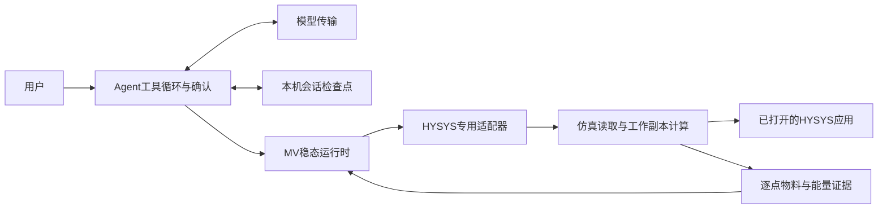

# 项目目录与模块边界

_更新：2026-09-11。当前行为以源码及[STATUS](../STATUS_REACT_REBUILD.md)为准。_

## 当前依赖

模型只查询、准备、取消和检查结果。程序保存受信观测和固定方案，用户确认后由单一SteadyComparison节点执行。当前支持目录内24项MV的单项或组合基准/候选比较，不提供旧CDU计算、M2/M4、优化搜索或策略发布。

## 目录职责

| 目录 | 当前职责 |
| --- | --- |
| src/petroleum_rto/assistant/ | LangChain工具循环、参数校验、会话恢复、确认、摘要、结果展示和CLI |
| src/petroleum_rto/domain_model/ | 模型配置、Chat/Responses传输、流式和本机私有凭据 |
| src/petroleum_rto/rto/runtime/steady.py | 固定方案、串行比较和严格结果重建 |
| src/petroleum_rto/rto/adapters/hysys_steady.py | 当前仿真后端装配与来源校验 |
| src/petroleum_rto/rto/_file_lock.py | 本地运行单写者保护 |
| src/petroleum_rto/simulation/ | 不可变观测、HYSYS读取、基准副本、单点计算、恢复和证据 |
| src/petroleum_rto/_windows_files.py | Windows私有文件保护 |
| configs/simulation/ | 实际读取器消费的变量与物料/能量边界定义 |
| scripts/simulation/ | 连接、单点及固定ABBA复现诊断 |
| tests/{simulation,domain_model,rto}/ | 当前仿真、Agent及文件锁的验证 |
| reports/{simulation,domain_model}/ | 正式验收记录 |
| runs/ | 本机工作副本、结果、会话及验证产物，Git忽略 |
| hysys/ | 用户提供的模型与原始脚本，保留来源 |
| data/cdu/、reports/cdu/、docs/cdu/ | 退役模型的历史资料与证据，不是运行时输入或当前能力 |

其他文档位于docs/并由[导航](../README.md)区分当前说明与历史资料。旧CDU源码、模型配置、实验测试、专用脚本与打包入口已退役；旧RTO的D0、求解、评价及策略实现没有当前消费者，随旧CLI下线。

## 仿真与证据边界

simulation/models.py与comparison.py只消费纯Python值，不依赖COM、RTO或Agent。HYSYS读写与案例拥有权控制留在仿真模块内。读取器核对指定案例、变量绑定、单位及状态；基准使用SaveCopyAs保存源内存副本。

单点只写方案选定的MV：先核对绑定和单位，暂停求解、批量写入活动规格或真实属性，读回全部目标后Reset/Run，核对未选输入、目标与稳定状态，随后保存该点物料/组分/能量边界并恢复。恢复和边界模块共享案例拥有权检查；它们都是当前依赖。只关闭程序拥有的工作案例，不关闭源案例或退出HYSYS。

当前单点采用hysys-mv-point/1.0.0；历史hysys-t39-point版本仍按原合同读取，不得冒充新MV方案。完整结果从方案、基准及逐点证据严格重建，不能仅信任会话中的成功标签。既有HYSYS成功与失败验收资料均保留。

## Agent与运行时边界

Agent仅依赖明确的rto.runtime.steady函数，不直接导入仿真内部或COM。稳态运行时仅通过专用适配器消费后端，模型传输不依赖运行时。包初始化保持轻量，不能因导入当前入口而加载已退役链路。

不可信模型输出不能携带受信测量值、任意路径、算法、公式或执行权限。准备不求解；确认绑定已展示方案，方案变更撤销旧确认。重启展示已保存状态，未完成任务必须明确/resume后继续；完整结果查询不调用模型或仿真。

严格校验放在网络、文件、不可信输出、外部适配器和持久化读取边界。内部哈希用于损坏检测，不是身份认证或现场控制权。当前结果仅是合成工程仿真；重复性、质量约束、优化排序与COM硬超时的限制见STATUS。

变更须同步入口、源码、配置、测试、文档及状态。删除依赖后验证实际导入、当前会话恢复和严格结果读取；历史代码不能以空壳兼容接口继续存在。
