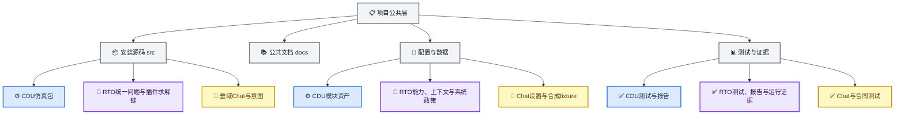
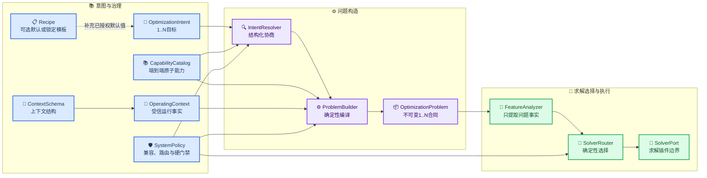

# 项目目录与模块边界

_版本：V1.5 · 更新日期：2026-08-21 · 本文规定项目扩展时的物理目录、模块归属和路径兼容策略。_

---

## 🎯 设计结论

项目采用**类型分层、模块命名空间**：Python安装源码按模块放入`src/petroleum_rto/`，其他资产按类型保留顶层目录，再在其下按`cdu`、`rto`和`domain_model`模块隔离。`docs/`是跨模块公共文档入口，不嵌入任何单一代码工作目录。

这一结构同时满足四个目标：

1. CDU、RTO与垂域模型代码、测试和资产有明确归属；
2. 公共状态、架构和项目资料只有一个外部入口；
3. 新模块可以按同一规则扩展，不需要再次搬迁既有模块；
4. RTO使用一套目标数量无关的合同与执行链，新求解方法以插件扩展，不再按“单目标版本”和“多目标版本”分裂主线。



## 📦 物理目录

```text
petroleum_rto_agent/
├── src/petroleum_rto/
│   ├── cdu/                 # 已实现的机理仿真与M7公共接口
│   ├── assistant/           # Chat与RTO结果解释的薄组合CLI
│   ├── domain_model/        # 极简DMX Chat客户端及严格意图兼容代码
│   │   ├── chat_settings.py # 用户直接编辑的URL、模型和系统提示词
│   │   ├── chat.py          # model+messages的Chat Completions调用
│   │   ├── adapters/        # 旧严格意图调用兼容实现，不是Chat主入口
│   │   ├── data/            # 旧兼容bundle，不是当前模型配置源
│   │   └── dmx_api.json     # 仅本地SK；Git忽略且不进入package data
│   └── rto/                 # 目标数量无关的RTO业务包
│       ├── adapters/        # 具体仿真后端和评价端口适配
│       ├── capabilities/    # 原子能力、上下文结构、系统政策与公开投影
│       ├── communication/   # 垂域模型请求、响应、修复与澄清协议
│       ├── contracts/       # 中立1..N问题、候选、结果和引用合同
│       ├── context/         # 受信OperatingContext加载与校验
│       ├── evaluation/      # 统一KPI、约束、配对与证据评价
│       ├── orchestration/   # 不跨越模块边界的应用编排
│       ├── unified_inputs/  # 与上下文无关的统一意图与解析
│       ├── problem/         # 确定性问题构造和特征分析
│       ├── solvers/         # SolverPort、注册表、路由器与求解插件
│       └── strategies/      # 经验证策略的不可变负载与生命周期
├── configs/
│   ├── cdu/                 # CDU模型、案例、控制、场景和验证配置
│   ├── domain_model/        # 旧严格意图供应商配置；普通Chat不读取
│   └── rto/
│       ├── capabilities/    # catalog、context_schema与system_policy
│       ├── contexts/        # 受信运行上下文实例
│       └── intents/         # 统一意图fixture
├── data/
│   ├── cdu/
│   │   ├── catalog/         # 版本化观测与来源目录
│   │   ├── gold/            # 正式协调与验证证据
│   │   └── raw/             # 只读原始资料，不纳入Git
│   ├── domain_model/
│   │   └── gold/            # 合成自然语言意图金标准
│   └── rto/
│       └── gold/            # RTO算法与政策金标准
├── tests/
│   ├── cdu/                 # CDU单元、集成和回归测试
│   ├── domain_model/        # 极简Chat、组合CLI及旧兼容合同测试
│   ├── rto/                 # RTO合同、编译、搜索、评价、策略库和编排测试
│   └── conftest.py          # 全项目共享测试夹具
├── scripts/cdu/             # CDU专用维护和基准脚本
├── reports/
│   ├── cdu/                 # CDU正式报告与清单
│   └── rto/                 # RTO正式离线验证报告与机器摘要
├── runs/
│   ├── cdu/                 # CDU本地运行产物，不纳入Git
│   ├── domain_model/        # 旧严格意图artifact；普通Chat不落盘
│   │   ├── sessions/        # 不可变意图会话快照
│   │   ├── discoveries/     # 不可变模型发现报告
│   │   ├── evaluations/     # 不可变模型评测报告
│   │   └── locks/           # 首轮会话并发保护锁
│   └── rto/                 # RTO workflow、M7证据和策略库，不纳入Git
└── docs/
    ├── STATUS.md            # 全项目唯一状态源
    ├── architecture/        # 跨模块架构规则
    ├── project/             # 项目级来源文档
    ├── cdu/                 # CDU现行文档与历史归档
    ├── domain_model/        # DMX Chat与RTO结果解释现行说明
    └── rto/                 # RTO现行说明、使用指南与历史归档
```

RTO已按相同模式创建`configs/rto/`、`data/rto/`、`tests/rto/`、`reports/rto/`和`runs/rto/`。其中`data/rto/gold/`保存小型算法金标准，`runs/rto/`保存本地严格证据和策略库且不纳入Git，`reports/rto/`只保存可审阅的正式摘要。当前没有独立RTO维护脚本，因此不创建空的`scripts/rto/`。

当前普通垂域对话只读取`chat_settings.py`中的URL、模型和系统提示词，以及Git忽略的`dmx_api.json`本地SK；会话仅在内存中，不写`runs/domain_model/`。`configs/domain_model/`、包内provider bundle、发现、评测和严格会话artifact属于旧兼容实现，不是当前Chat配置源，也不作为新功能扩展点。

上述列表是新增能力的活动归属，不要求为了目录外观立即搬迁历史文件。既有`catalogs/`、`profiles/`、V1/V2合同和旧工作流现只服务历史artifact回放与兼容，不是新业务能力的扩展点。已建立的垂域模型模块只能依赖`rto.communication`、经脱敏投影的公开能力清单和统一意图合同，不能导入RTO求解器或CDU/HYSYS内部对象，也不能绕过通信服务直接调用`ProblemBuilder`。

## 🧩 统一RTO对象与执行边界

RTO不通过强制profile穷举“目标×变量×场景”组合。它由原子能力、受信上下文、系统政策和统一问题合同组合；`Recipe`如果存在，只是一组可复用的已授权默认值或锁定选择。



四个治理对象不得相互代替：

| 对象 | 负责内容 | 不负责内容 |
| --- | --- | --- |
| `CapabilityCatalog` | 定义metric、objective、decision、guardrail和selector等端到端原子能力，并在内部保存可执行绑定 | 不枚举所有业务组合，不保存本次运行值 |
| `ContextSchema` | 定义受信上下文的字段、类型、单位、可选性和来源规则 | 不保存具体运行值，不表达业务目标 |
| `SystemPolicy` | 定义能力兼容性、执行路由、资源预算、硬门禁和发布要求 | 不代替业务意图，不接受上游任意覆盖 |
| `Recipe`（可选） | 在前三者已授权边界内复用默认选择、偏好或锁定集合 | 不是请求必填字段，不能新增原子能力、上下文字段或放宽系统政策 |

`OperatingContext`是通过`ContextSchema`校验后由受信调用方注入的本次运行事实，不属于垂域模型输出。RTO内部可以维护供本地入口使用的`PublicCapabilityManifest`，但垂域模型唯一允许外发的是进一步收窄的`DomainCapabilityManifest 1.1.0`。它由内部能力事实确定性投影，只保留业务安全的metric、objective、decision、selector、基数规则和`result_output_rules`，并排除`context_fields`、边界、硬门禁、执行路由、公式、内部引用和适配器绑定；不得另行维护成第二份能力事实源。

严格意图兼容路径继续使用`DomainModelRequest 1.2.0`与`DomainModelResponse 1.1.0`，确保自然语言不能绕过`IntentCommunicationService`直接进入RTO。普通Chat路径不读取`ProviderCatalog`：它只把`chat_settings.py`中的模型ID和内存`messages`发送到固定Chat Completions地址。以后切换同接口模型只改一个模型常量。

统一`OptimizationIntent`和`OptimizationProblem`都用一个非空目标向量表示`1..N`目标。目标数为1时，路由器可选择兼容的标量求解插件；目标数大于1时，可选择产生Pareto集合的插件。这是问题特征、系统路由政策与插件能力的差异，不是合同版本、工作流主线或强制profile的差异。

执行链模块遵循以下边界：

| 模块 | 输入与输出 | 禁止行为 |
| --- | --- | --- |
| `IntentCommunicationService` | 向垂域模型提供自足公开能力快照，严格校验完整响应，并返回修复、澄清、不支持或已解析结果 | 不读取运行上下文，不选择求解器，不接受局部Patch或无限重试，不绕过Resolver |
| `IntentResolver` | 用受限语义能力视图将严格意图解析为已解析意图或结构化澄清/不支持结果 | 不读取运行上下文，不选求解器，不调仿真，不静默补造业务意图 |
| `ProblemBuilder`（当前入口为`UnifiedProblemBuilder`） | 意图成功解析后，将意图、受信`OperatingContext`、`CapabilityCatalog`和`SystemPolicy`确定性编译为不可变`OptimizationProblem`；当前入口在`build()`内先调用`IntentResolver`并仅在`resolved`时继续 | 不搜索、不调仿真，不吸收业务语义解释职责，不为适配某个求解器改写问题 |
| `FeatureAnalyzer`（当前为`ProblemFeatureAnalyzer`） | 从不可变问题提取目标数、变量数、网格规模、结果形状、预算、梯度和动态复核等事实 | 不注册、选择或调用求解器 |
| `SolverRouter` | 根据版本化路由政策、问题特征和显式注册表确定性选择兼容插件，或返回结构化不支持结果 | 不求解、不调仿真、不修改问题；受信override也必须经过同一能力检查 |
| `SolverPort` | 以无副作用`supports(features)`声明能力，通过`solve(problem, evaluator)`求解，候选评价经中立`CandidateEvaluatorPort`进入统一评价链 | 不解析业务自然语言，不取得上下文事实，不依赖CDU/HYSYS内部对象 |

## 🔗 模块依赖

- `petroleum_rto.cdu`不得导入RTO代码。
- `petroleum_rto.domain_model`保存DMX Chat客户端；严格意图兼容代码只能从`rto.communication`取得合同。DMXAPI、HTTP、凭据和模型参数不得进入RTO核心。
- `petroleum_rto.assistant`是唯一可同时组合Chat客户端与`rto.runtime`严格结果reader的薄人机层；它只能读取既有结果并生成安全摘要，不得启动求解、仿真、审批或发布。
- `unified_inputs`只能依赖受限语义能力视图和中立意图合同，不得依赖运行上下文、求解器或仿真后端。
- `problem`可以依赖中立合同、能力、政策和上下文，不得依赖具体求解插件或仿真后端。
- `FeatureAnalyzer`只读不可变问题；`SolverRouter`只依赖问题特征、系统路由政策和求解器注册表。
- 求解插件只能依赖`SolverPort`、中立问题/候选/结果合同与`CandidateEvaluatorPort`，不得依赖垂域模型或CDU/HYSYS内部对象。
- 只有RTO的CDU适配器可以导入`petroleum_rto.cdu.runtime`公共接口。
- 垂域模型只能使用`DomainModelRequest`内的安全`DomainCapabilityManifest`快照，不得自行加载RTO内部`PublicCapabilityManifest`、能力绑定、求解器或CDU/HYSYS对象。
- 未来共享合同只有在至少两个模块确实复用且语义稳定后才进入公共包；不能预先建立“万能shared”目录。
- 文档、配置、测试、脚本和报告必须放入实际归属模块，禁止重新放回无模块名的根级目录。

## 🔄 历史路径兼容

M5～M7正式证据把以下旧相对路径写入内容并参与指纹：

| 稳定逻辑标识 | 当前物理位置 |
| --- | --- |
| `configs/...` | `configs/cdu/...` |
| `data/...` | `data/cdu/...` |
| `reports/modeling/...` | `reports/cdu/...` |
| `base_files/...` | `data/cdu/raw/...` |

这些旧字符串现在是**稳定资源标识**，不是推荐的新物理路径。`petroleum_rto.cdu.repository.resolve_cdu_repository_path`负责在读取历史证据时完成映射，并保留旧布局的只读兼容回退。这样可以移动文件而不重写历史JSON、Markdown报告、资源字节或已有指纹。

新增配置、数据和报告必须直接使用当前物理目录。只有需要与不可变历史证据对照的合同字段继续保存稳定逻辑标识。

旧RTO V1/V2配置、合同和工作流仅作为迁移回放与回归基线。新增原子能力进入`CapabilityCatalog`，新增系统限制进入`SystemPolicy`，新增求解方法实现`SolverPort`；不再开辟另一个按目标数量命名的合同或业务包。历史路径的删除必须等待`docs/STATUS.md`授权，并具备相同fixture的可审计回放证据。

## ✅ 变更门禁

目录调整或新增模块时至少检查：

1. 根目录没有新增未归属的业务代码、配置、数据、脚本或报告；
2. Python公共导入路径和CLI入口保持可用；
3. 历史逻辑资源标识仍能解析到现存文件；
4. M5/M6正式证据和M7包内资源保持逐字节一致；
5. 统一意图和问题合同用同一schema覆盖单个和多个目标，添加求解插件不要求修改意图、问题或构造器；
6. 省略`Recipe`的合法请求可正常构造，`Recipe`不得覆盖`CapabilityCatalog`、`ContextSchema`或`SystemPolicy`；
7. 外发`DomainCapabilityManifest`由内部事实确定性产生，不暴露`context_fields`、边界、门禁、路由、公式、内部引用或适配器绑定，并包含安全的`result_output_rules`；
8. 受信`OperatingContext`与垂域模型意图保持独立，澄清回路不得要求垂域模型猜测运行事实；
9. 测试收集、静态检查、文档本地链接和默认运行目录通过；
10. 普通Chat只读取一个可编辑模型ID和本地SK；`/result`必须先严格读取现有RTO运行，只外发选中设定值、目标改善和离线声明，不外发上下文、求解器、公式、路径、证据、策略payload或凭据；
11. [实施状态](../STATUS.md)与仓库事实同步。
