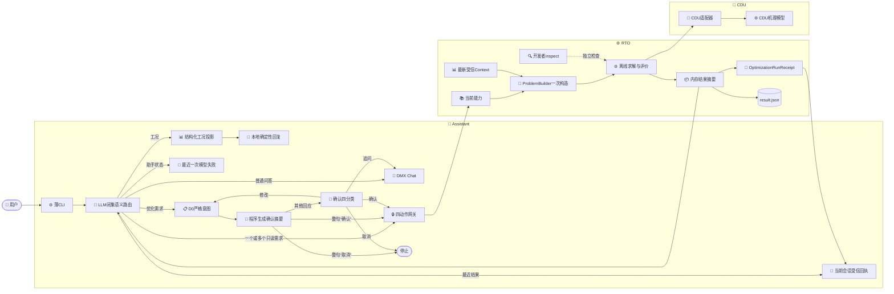

# 项目目录与模块边界

_更新日期：2026-09-03 · 本文只描述现行目录、依赖方向和长期边界。_

## 设计结论

项目采用“类型分层、模块命名空间”：安装源码位于`src/petroleum_rto/<module>/`，配置、数据、测试、报告和本地运行产物按类型放在顶层目录，再以模块名隔离。

当前活动能力只有三条：CDU机理仿真、目标数量无关的离线RTO，以及本地领域Agent。Agent由LLM按整句语义一次选择一个或多个闭集需求，代码再校验组合并执行固定只读能力；动作权限、D0意图校验、确认摘要、受信工况、问题构造、求解和结果生成仍由代码控制。用户只表达“帮我优化”或日常语义的“生成优化策略”而未给出目标时，系统展示能力和示例，不猜测目标，也不直接拒绝。



## 物理目录

```text
petroleum_rto_agent/
├── src/petroleum_rto/
│   ├── cdu/                 # 机理模型、控制、校正、验证与运行证据
│   ├── rto/
│   │   ├── capabilities/    # 原子能力与系统政策
│   │   ├── communication/   # D0严格请求、响应与协商
│   │   ├── context/         # 受信运行上下文加载
│   │   ├── contracts/       # 中立问题、候选、证据和结果合同
│   │   ├── problem/         # 确定性问题构造
│   │   ├── solvers/         # 当前网格搜索实现
│   │   ├── compilation/     # 候选到仿真计划的编译
│   │   ├── evaluation/      # M2/M4配对评价
│   │   ├── selection/       # 硬门禁后的最终选择
│   │   ├── orchestration/   # 离线编排、内部恢复和结果投影
│   │   ├── strategies/      # 独立的不可变策略与生命周期
│   │   ├── adapters/        # 具体仿真后端适配器
│   │   └── runtime/         # 公共API与CLI
│   ├── domain_model/        # 极简Chat客户端和本地设置
│   └── assistant/           # 语义路由、D0组合、确认状态、工具网关和CLI
├── configs/{cdu,rto}/       # 版本化模型与RTO配置
├── data/{cdu,rto}/          # 来源、gold和本地原始资料
├── tests/{cdu,rto,domain_model}/
├── scripts/cdu/
├── reports/cdu/
├── runs/{cdu,rto}/          # 本地运行产物，不纳入Git
└── docs/                    # 状态、现行主文档和历史来源
```

不存在活动内容的目录不为对称性保留。新资产只有出现真实消费者时才创建。

## Agent组合边界

`assistant/cli.py`只处理输入输出；`assistant/runtime.py`保存有界对话、最多一份D0澄清状态、最多一份待确认意图、当前会话最近一份受信结果回执和最近一份安全分类的模型失败状态；`assistant/dmx_intent_adapter.py`负责严格的闭集语义响应；`assistant/tools.py`只暴露四项领域动作：

- `show_capabilities`
- `show_simulation_status`
- `run_offline`
- `inspect_result`

闭集语义路由不是字符模板。模型可把不同自然语言表达归入`chat`、`capabilities`、`operating-status`、`assistant-status`、`last-result`、`optimization`或`unsupported-action`，并在同一轮返回多个不重复的语义需求。代码严格校验闭集、去重和组合，再执行固定只读路径；模型不能输出工具名、任意路径或新的route。当前`AssistantTurnDecision`版本为`3.0.0`。

只有给出具体优化目标并要求推荐设定值或操作方案时，日常语义的“策略”才进入`optimization`。没有目标的“帮我优化”“生成一条优化策略”进入`capabilities`，由本地回复列出可用目标、可调变量和可照着说的例句，不构造空Intent、不替用户选目标。明确要求正式创建、审批、发布、下装或现场控制时仍进入`unsupported-action`，但回复会说明可以先生成离线设定点建议。

`optimization`可与只读需求并存，但一个模型响应最多携带一份完整D0响应，解析后也只保存一份`OptimizationIntent`。它不会在首轮直接运行；仍需先展示确认摘要并等待下一轮确认，确认后只执行一次`run_offline`。

`assistant-status`只识别用户对助手、模型调用或上一轮界面错误的追问。路由成功后，受信代码依据最近一份安全结构化失败状态回答，不把供应商原文交给模型，也不调用工况工具或从模拟器的`idle`等状态猜测失败原因。该状态只记录模型侧失败，不宣称服务已经恢复。

`operating-status`仍由LLM在闭集中进行语义路由。路由成功后，受信代码通过`show_simulation_status`读取结构化白名单投影，严格校验并确定性地生成简洁中文回复。正常成功路径不再把该投影发给DMX做第二次润色。

普通问答、显式`/result`解读、当前会话`last-result`追问、优化完成后的结果解读和确认问题解答仍使用Chat，并分别保留准确的阶段标记。当轮同时需要能力、工况等只读投影时，代码先按固定路径取数并合并输出，不把工具决策交给Chat。`DmxChatError`进入运行时后保留安全的`code`、`retryable`、`http_status`和阶段；若供应商已返回HTTP 200但内容未通过本地结构、大小或内容校验，界面可明确说明“服务已响应，本地解析失败”，但不回显响应正文。

多个目标未明确同等重要、顺序不确定或互相冲突时，模型按用户提及顺序生成可确认的优先级草案。确需澄清时，双目标只询问第一优先，三目标以上要求完整排序；界面显示能力目录业务名，机器值仍使用已发布指标ID。

优化意图解析成功后，受信代码按严格`OptimizationIntent`和能力目录中的业务名称确定性生成确认摘要，再在进程内保存意图和这份摘要；模型不提供确认文字。摘要明确列出目标顺序、可调变量、结果数量，以及确认后才读取当前配置离线工况。`max_candidates=N`表示推荐方案和其他候选合计最多N个，所以摘要写成“1个推荐方案和最多N-1个其他候选”，不会把N误写成备选数量。

待确认时，整句精确等于“确认”或“取消”，本地程序就直接执行或清除任务，不再请求模型。带标点的“确认？”、“开始算吧”以及其他表达都交给精简的四分类合同判断`confirm`、`revise`、`cancel`或`question`；该调用只携带已展示摘要和本轮话语，不携带完整能力、D0输出合同或原始优化请求。`revise`确定后才用完整Intent模式生成并校验一份替代意图，新意图成功前保留原任务。

用户确认时，`run_confirmed_optimization`重新加载当前能力并解析同一意图，随后读取一次最新受信`OperatingContext`、构造一次不可变`OptimizationProblem`并将同一对象交给编排器。工况在确认前的正常波动不会让一份旧问题引用失效，因为此时尚未生成问题。

普通聊天不会调用RTO。确认运行后，RTO向Agent返回一份受信`OptimizationRunReceipt`：其中`workflow_id`是确定性工作流标识，`result_source`固定为`<workflow_id>/result.json`，`result_summary`是七字段结果。除既有推荐字段外，`alternative_candidates`列出未选中的其他候选及其实际M2或M4验证状态；推荐方案不会在该数组中重复。运行时把这份回执留为当前会话的“最近结果”；磁盘`result.json`仍只包含七个业务字段，不嵌入回执外层。

`/result`可直接接收裸`workflow_id`，并只在固定`runs/rto`根下解析对应`result.json`；也保留用户显式给出运行目录或`result.json`的读取方式。读取路径只做真实文件边界和最小字段形状校验，不进入开发者严格workflow检查。成功读取后，该摘要成为当前会话新的“最近结果”，因而可继续用自然语言追问。模型不能生成路径或调用这个命令。独立仿真、策略创建、审批、发布和现场动作不在Agent工具集合中。

## 统一RTO职责

RTO只使用一套非空目标向量表达`1..N`目标。目标数是问题特征，不是合同或目录分支。

| 对象 | 唯一职责 | 不得承担 |
| --- | --- | --- |
| `CapabilityCatalog` | 定义可执行metric、objective、decision、guardrail和selector | 本次运行值、自然语言解释 |
| `SystemPolicy` | 定义硬门禁、预算、执行路线和发布要求 | 上游自由覆盖、业务语义解释 |
| `OptimizationIntent` | 表达目标、方向、优先级、决策和结果请求 | 运行事实、公式、阈值、路径、算法 |
| `OperatingContext` | 保存受信调用方提供的本次运行事实 | 从用户话术或模型回答推断事实 |
| `OptimizationProblem` | 冻结能力、政策、意图、工况和执行路线 | 运行时重新解释意图或修改政策 |

执行顺序为：严格意图 → 当前能力复核 → 最新受信工况 → 问题一次构造 → 路由 → 候选搜索 → 同上下文基准配对 → M2/M4评价 → 硬门禁 → 最终选择 → 内存结果投影。

新鲜运行完成后，内存记录直接生成七字段摘要和`result.json`，编排器再用受控结果位置组成回执返回Agent；不为答复回读文件、重复校验哈希、重放物理证据或比较策略副本。`alternative_candidates`始终存在，可为空；每项包含最终排序、调整量、预测效果、验证阶段和验证状态。M2表示只完成稳态评价，M4才表示已有动态复核。备选候选只是同次计算中的其他设定点组合，不是策略草案。

当前内部workflow合同版本为`4.0.0`，manifest版本为`offline-rto-manifest-4.0.0`。七字段结果改变了公共结果合同，因此当前reader不兼容旧v3六字段结果。内部workflow仍保存阶段文件和manifest以支持离线恢复；需要检查当前版本已有内部证据时，开发者可显式调用`rto-offline inspect`，该路径不属于普通聊天或确认后的结果生成。

普通run不创建策略草案。策略v3由独立的`StrategyBuilder`和`StrategyRepository`处理，生命周期审批与发布必须显式进行。

## 模块依赖

- `petroleum_rto.cdu`不得导入RTO。
- RTO核心只依赖中立合同和端口；只有`rto.adapters`中的具体CDU适配器可导入CDU运行时。
- `rto.communication`只处理不可信模型输出，不读取Context、不求解、不仿真。
- `domain_model`只负责本地模型传输，不导入RTO求解器或CDU。
- `assistant`是唯一同时组合Chat、D0和RTO受控端口的薄层；不得直接导入编排器、求解器、仿真器、策略审批或发布函数。
- 至少两个模块真实复用且语义稳定后，才考虑提升公共抽象。

## 信任与声明边界

严格校验只放在文件、网络、不可信模型响应、外部仿真适配器和持久化内部workflow等真实边界。构造完成的不可变内部对象可信传递，不重复证明同一不变量。

内部manifest的哈希用于文件自洽和损坏检测，不是身份认证。`result.json`是从内存结果生成的可读投影，不进入普通回复后的证据重放。策略payload和release不可变，状态变化采用追加事件；任何策略状态都不等于现场批准或控制权。

所有输出仍属于合成工程仿真。界面不在每轮重复边界套话，但文档和机器合同不得把结果表述为现场验证、产品放行、实际收益、安全边界或可直接下装的控制策略。

语义入口只对可重试的传输失败或供应商`5xx`立即重试一次；`429`限流不立即重试，其他失败按稳定分类停止。这个有界恢复与外层JSON结构替代、D0完整替代彼此分责，不形成无限重试。连续结构失败仍在内部记录准确阶段和安全分类，但面向用户返回当前能力、变量和表达示例，不显示“意图解析失败”。待确认阶段失败时还会明确原方案仍保留且没有开始计算。普通Chat、结果解读和确认问题解答不使用这次自动重试。

## 变更门禁

目录或模块边界变化至少检查：

1. 新文件有明确归属，配置字段有真实消费者；
2. CDU不反向依赖RTO，具体后端依赖只存在于适配器；
3. 单目标和多目标继续使用同一合同与workflow；
4. 模型响应不能生成受信工况、算法、公式、路径或权限；
5. 确认时能力复核、Context单次读取和Problem单次构造成立；
6. 每个候选保持同上下文基准配对、硬门禁和错误隔离；
7. 受信回执、当前会话`last-result`、七字段`result.json`、轻量`/result`和开发者inspect职责不混淆；
8. 普通run不自动生成策略，策略治理仍为显式独立动作；
9. 助手状态追问只依据最近模型失败事件，不与模拟器工况串线；
10. 工况路由后由本地代码校验并成文，不再进入第二次DMX润色；
11. Chat失败保留准确阶段与安全元数据，HTTP 200后的本地校验失败不被改写为未连通；
12. 模型调用重试只覆盖语义/D0入口的一次传输或`5xx`，`429`和普通Chat不立即重试；
13. 一次语义决策可组合多个只读需求，但不能组合多份Intent或越过下一轮确认执行RTO；整句“确认”或“取消”应由本地直接处理；
14. 会话回执与磁盘结果分责：重启后不以全局文件修改时间猜测“用户的上次结果”；
15. 删除功能时同步删除入口、导出、测试和文档；
16. 无具体目标的泛化优化请求只给能力引导，不生成目标、不冷拒绝；正式策略动作仍不可达；
17. `max_candidates`作为推荐加备选的总上限，备选M2/M4状态如实呈现且不得被称为策略；
18. 当前v4 workflow和七字段结果不由旧v3 reader兼容；
19. [实施状态](../STATUS.md)与仓库事实同步。
