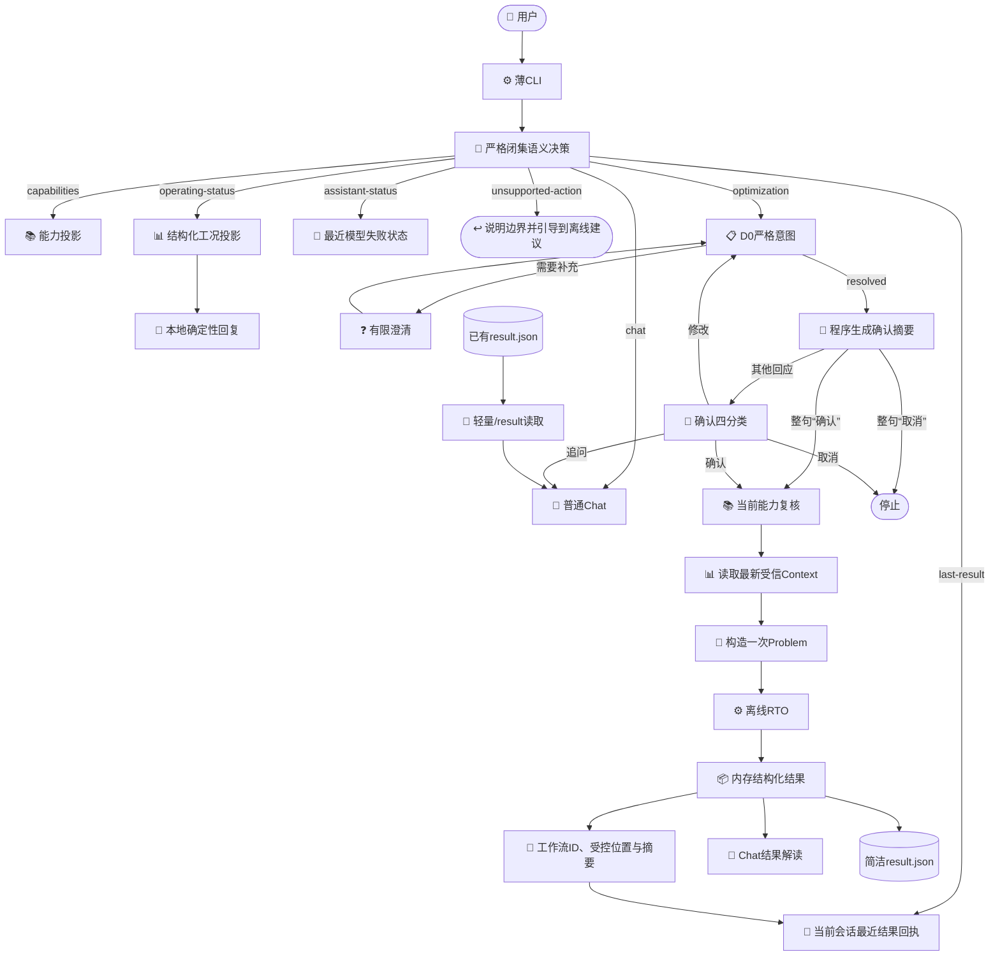

# 石油加工领域智能体架构与功能设计

_现行设计 · 2026-09-03 · 当前范围是本地、同步、单进程的离线工程Agent。_

## 当前结论

本项目采用一个薄的领域Agent，不建设通用自主规划器。大模型负责自然语言语义分类、业务意图结构化、有限澄清、待确认回复分类和结果解释；受信代码负责动作闭集、合同校验、确认摘要、当前能力、运行工况、问题构造、求解、仿真和评价。

用户不需要逐字命中模板。错别字、漏字或多字、同音或形近写法、业务简称、近义词和口语表达先由模型结合整句语义与当前能力目录做通用归一；能唯一对应时生成使用已发布ID的规范意图，存在多个合理对应时进入澄清。没有给出目标的“帮我优化”或“生成优化策略”不会进入空意图，也不会被冷拒绝，而是转成能力说明，列出可选目标、变量和表达示例。这里没有本地错词字典或逐字匹配分支。

模型每轮可以返回一个或多个不重复的闭集语义需求，例如同时选择“最近结果”和“可优化能力”。它不输出工具名、任意路径或执行计划；受信代码严格校验组合后，只调用已编排的固定只读能力。优化需求即使与只读问题并存，也只能产生一份可校验D0意图；只有D0状态为`resolved`时，系统才保存一份待确认任务，下一轮确认后才运行一次。

待确认界面只展示程序依据严格Intent和能力目录生成的自然语言摘要，包括目标顺序、可调整变量、推荐与其他候选的总数。模型不能编写或改动这份摘要。整句只有“确认”或“取消”时由本地程序直接处理；带标点的确认、其他自然说法、修改、提问和犹豫都进入小范围模型分类。系统不向用户展示内部问题标识、哈希令牌、求解状态字段、文件路径或重复边界套话。

## 责任分配

| 主体 | 负责 | 不负责 |
| --- | --- | --- |
| 大模型 | 闭集语义分类、D0意图、澄清、非直接确认回复的四分类、普通Chat、结果解读与确认问题解答 | 确认摘要、运行事实、工况投影成文、算法、门禁、路径、审批、现场控制 |
| 受信代码 | 严格解码、动作授权、确认摘要、整句“确认”/“取消”直达、工况校验与确定性成文、能力复核、Context加载、Problem构造、RTO与结果投影 | 猜测未表达的业务目标、生成现场事实 |
| 用户或治理主体 | 确认一次离线计算；在独立流程中审核策略 | 被模型替代授权 |

`OptimizationIntent`与`OperatingContext`始终分离。模型只能生成业务意图，不能生成或修改受信工况。

## 当前架构

普通Chat、已有结果解释和开发者严格检查是三条不同路径：

- 普通Chat不调用领域工具；
- `/result`只读简洁`result.json`并解释；
- `rto-offline inspect`由开发者显式调用，用于内部workflow诊断，不参与正常Agent回复。

## 闭集语义协议

### 首轮路由

模型输出必须符合版本`3.0.0`的`assistant-turn-decision`合同。常规模式返回一个非空、不重复的`routes`数组，其元素只允许：

| route | 含义 | 后续动作 |
| --- | --- | --- |
| `chat` | 一般工艺、控制或RTO知识问答 | 进入普通Chat |
| `capabilities` | 询问可优化目标或变量 | 读取安全能力投影 |
| `operating-status` | 询问当前合成工况 | 读取结构化白名单投影，本地校验并确定性成文 |
| `assistant-status` | 追问助手、模型调用或上一轮界面错误 | 由受信代码解释最近一次安全分类的模型失败 |
| `last-result` | 追问当前会话最近一次完成的RTO结果 | 使用运行时保存的受信回执摘要 |
| `optimization` | 给出具体目标并要求离线设定值或日常优化方案 | 同一响应携带完整D0结果；确认摘要稍后由程序生成 |
| `unsupported-action` | 请求独立仿真、正式策略创建/审批/发布、下装或现场动作 | 说明边界并引导到可用的离线建议，不调用越权动作 |

这是一种受约束的语义理解，不是本地关键词优先，也不是自由工具调用。模型可以理解错别字、简称、近义词以及“把炉子烧得更省一些”“兼顾收率和能耗”等口语说法，但返回类别、字段、引用和业务能力仍必须通过严格解码。同一条消息包含多个独立需求时，模型应把它们分别放入`routes`，代码拒绝重复项、未知项及`optimization`与`unsupported-action`的冲突组合。

“优化策略”在日常表达中可指一组离线设定值：用户同时给出具体目标时，它进入`optimization`。如果只说“帮我优化”或“生成一条优化策略”而没有目标，则进入`capabilities`，本地回复当前目标、变量和一个可直接照抄的请求示例；系统不自行补目标，也不把这类可引导请求当成不支持。只有明确要求正式创建、审批、发布、下装或现场控制时才进入`unsupported-action`，正式策略治理仍不在Agent动作中。

`optimization`可与只读route同时出现，但外层只有一份`optimization_response`，因而一轮最多形成一份严格Intent和一个待确认任务。首次提出新优化需求时，句尾的“开始吧”只表达希望发起优化，系统仍先展示确认摘要并等待下一轮确认，不能直接计算。

`operating-status`的模型职责到路由结束。路由成功后，运行时调用`show_simulation_status`取得结构化投影，严格校验状态、工况模式、进料、设定值、时间和数据质量后，由本地函数生成简洁回复。正常成功路径不将该投影送入Chat，也没有第二次DMX润色。

常规和Intent提示按“任务、输出、路由、优化理解、严格意图、修复”分段，只保留当前合同需要的规则；确认模式使用独立的短提示和短合同，不重复发送完整能力、原始优化请求或D0输出结构。

如果供应商已经返回内容、但外层`assistant-turn-decision`不是合法JSON或不符合严格结构，运行时只请求一次不携带原始错误响应的完整替代；第二次仍失败便停止。内部保留“响应合同错误”等安全分类供后续状态追问，面向用户则展示当前能力、变量和请求示例，不输出“意图解析失败”。语义与D0入口对可重试的传输失败或供应商`5xx`只立即重试一次；`429`限流不立即重试，其他模型失败按稳定分类停止，普通Chat不获得这次自动重试。传输或服务失败不会伪装成用户表达问题。

### 待确认路由

存在待确认意图时，本地程序只对整句严格等于“确认”或“取消”做直达处理，并直接执行或清除任务，不调用模型。带标点的“确认？”、“开始计算”等其他确认说法，以及提问、犹豫、修改或混合表达都进入下列四分类：

| route | 用户表达 | 行为 |
| --- | --- | --- |
| `confirm` | 确认、开始计算、可以执行 | 消费待确认状态并运行一次 |
| `revise` | 改目标、变量、优先级或结果形式 | 生成并校验一份新的完整D0意图 |
| `cancel` | 不算了、取消 | 删除待确认状态 |
| `question` | 询问目标、变量或计算内容 | 回答问题，保留待确认状态 |

四分类模型只看到已展示的确认摘要、本轮用户话语、严格的`request_ref`和四个允许值，不接收完整能力目录、原始优化请求、D0输出合同或求解信息。选择`revise`后，运行时才另用Intent模式基于旧Intent和修改内容生成完整替代；新Intent成功前，原待确认方案始终保留。确认分类或修改生成出现结构解码失败时，界面明确说明没有开始计算并重新展示原方案；供应商调用失败时也会说明原方案仍保留。

`/confirm`是等价的本地快捷方式，不接受问题引用或哈希参数。`/cancel`和`/clear`可确定性清除待处理状态。

### D0严格意图

优化route中的业务负载仍必须经过现有D0合同：

- 只允许已发布目标、方向、优先级、决策变量、选择方法和结果请求；
- 不允许Context、任意公式、自由门禁、内部路径或算法选择；
- 未知字段、重复键、错误类型、错误请求关联和未发布能力失败关闭；
- 一个意图轮次最多一次完整替代修复；已知歧义转为有限用户选项；
- 只有`resolved_intent`可以进入待确认状态。

D0内部请求关联用于防止模型响应串线，但它不是用户确认令牌，也不展示在问答界面。

语义归一不会放宽D0：无论用户原话如何，进入待确认状态的目标、方向、变量和选择方法仍必须全部来自当前发布能力。严格意图通过后，程序按能力目录中的`business_name`生成确认摘要；用户可在计算前确认或修改模型的理解，模型不能借确认文字覆盖结构化意图。

多个目标在原话中依次出现，且用户没有明确表示同等重要、顺序不确定或互相冲突时，模型按提及顺序形成一份建议优先级，程序在确认摘要中明确复述；这是一份可修改的草案，不是代码猜测隐藏偏好。确实需要优先级澄清时，选项显示能力目录中的中文业务名，内部值仍使用已发布`metric_id`。恰有两个目标只询问哪个是第一优先，另一个唯一成为第二优先；三个及以上目标仍要求完整排序。

## 确认与执行

解析成功时，程序根据严格`OptimizationIntent`和当前能力确定性生成摘要，运行时只保存这两项。摘要中的`max_candidates=N`表示推荐与其他候选合计最多N个；若请求返回备选，则显示“1个推荐和最多N-1个其他候选”。它不提前读取Context，也不构造Problem。

确认后的顺序固定为：

1. 消费当前待确认状态，防止同一确认重复触发；
2. 加载当前能力，并重新解析已保存的严格意图；
3. 读取一次最新受信`OperatingContext`；
4. 用当前能力、意图和Context构造一次不可变`OptimizationProblem`；
5. 若同一问题已有完成结果，只轻量读取其`result.json`；否则将同一Problem交给RTO编排器执行；
6. 新计算从返回的内存记录生成结构化回复和`result.json`，已有计算直接复用该简洁结果。

因此，意图确认前炉温或进料的正常波动不会使旧问题立即作废：系统没有保存旧问题，而是在确认时使用最新工况。当前能力若已不再支持该意图，则在创建运行前拒绝。

## 工具与权限

Agent静态工具集合只有四项：

| 动作 | 作用 | 领域副作用 |
| --- | --- | --- |
| `show_capabilities` | 返回可用目标、变量、目标数和结果形式 | 无 |
| `show_simulation_status` | 返回合成工况白名单摘要 | 无 |
| `run_offline` | 确认后运行一份严格意图 | 写离线运行与简洁结果 |
| `inspect_result` | 读取已有简洁`result.json` | 无 |

模型不能注册、发现或拼接新动作。独立仿真、任意文件访问、策略创建、审批、发布、DCS/SIS/Historian读写均不在Agent工具集中。

一次常规语义决策可以组合多个固定只读动作，例如同时返回能力和工况摘要。它不能在该轮执行优化；优化分支只保存一份Intent，下一轮确认才最多执行一次`run_offline`。RTO内部的搜索、评价和恢复属于一个受信workflow，不是模型自主工具链。

## 结果路径

### 刚完成的计算与会话回执

确认运行入口统一返回一份`OptimizationRunReceipt`；新运行由内存记录生成，已完成的同一workflow则轻量读取其简洁结果后构造。回执包含：

- `workflow_id`：形如`offline-rto-<16位十六进制指纹>`的确定性工作流标识；
- `result_source`：严格等于`<workflow_id>/result.json`的受控相对位置；
- `result_summary`：下列七字段业务结果。

`result_summary`包含：

- `status`
- `targets`
- `operating_context`
- `baseline_values`
- `recommended_adjustments`
- `predicted_effects`
- `alternative_candidates`

运行时先保存整份受信回执，再把`result_summary`交给模型组织自然语言回复。同一份七字段投影写为格式化`result.json`；文件本身不包含`workflow_id`、`result_source`或外层`result_summary`包装。正常完成路径不为答复再次打开文件，不重复校验manifest哈希，不重放M2/M4物理证据，也不比较策略副本。

`alternative_candidates`始终存在，可为空。它只列未被选为推荐的候选，并按最终全局`rank`升序排列；推荐方案仍只放在`recommended_adjustments`和顶层`predicted_effects`中，不重复进入备选。每项给出`adjustments`、`predicted_effects`、`verification_stage`和`verification_status`：M2表示只完成稳态评价，M4表示已有动态复核。备选是同一次优化的其他设定点组合，不是策略草案，也不能把M2候选写成已完成M4。

结果解读提示要求：只有数组非空时才逐项说明其他候选；保留每项实际阶段和状态；明确解释M2与M4的差别；不得把候选称为策略。它不能借自然语言改写结构化结果。

用户后续自然语言追问“刚才为什么这样调”时，`last-result`只使用当前会话这份受信回执中的摘要，可与`capabilities`等其他只读需求合并回答。

这些解释仍属于Chat路径：`/result`标记为“结果解读”，刚完成的离线运行标记为“优化结果解读”，待确认状态中的业务追问标记为“确认问题解答”。阶段标记用于失败后的准确说明，不改变它们使用Chat的事实。

### 已有结果

`/result <结果编号|目录|result.json>`只做轻量文件边界检查。“结果编号”就是裸`workflow_id`；它或受控`<workflow_id>/result.json`必须在固定`runs/rto`根下解析。用户也可显式给出运行目录或结果文件。最终目标必须是普通`result.json`文件，内容必须是UTF-8 JSON对象，且拒绝重复键、非有限数和不符合上述七字段的形状。成功读取的摘要会替换当前会话的最近结果，后续自然语言追问因此有明确上下文。它不读取内部workflow、manifest、仿真证据或策略仓库。

### 内部证据与策略

RTO仍可保存内部阶段文件和manifest用于恢复。当前offline workflow版本为`4.0.0`，manifest版本为`offline-rto-manifest-4.0.0`；七字段结果是新的严格合同，当前reader不兼容旧v3六字段结果。`rto-offline inspect`保留为显式开发者诊断入口，可严格检查当前版本workflow；它与普通Agent完成路径、`/result`和自然语言解释分离。

普通run不自动生成策略草案或策略库条目。策略v3属于独立治理流程；即使某策略以后被批准或发布，也不获得现场控制权。

## 会话与外发

当前只保存进程内会话状态：有界普通Chat历史、最多一份D0澄清、最多一份待确认意图、当前会话最近一份受信结果回执和最近一份安全结构化模型失败。进程退出或`/clear`后，“最近结果”的会话关联消失，但已有`result.json`保留。系统不按全局文件修改时间猜测哪份是重启前该用户的上次结果；需要恢复时，用户用明确`workflow_id`调用`/result`，成功读取后它就成为新会话的最近结果。

允许发给模型的内容只有用户输入、安全能力投影、必要的D0合同、程序生成的确认摘要和简洁结果。确认四分类只发已展示摘要和当前话语；直接工况查询返回的结构化白名单投影在本地成文，不发给Chat。禁止发送凭据、完整Context、原油组成、求解器内部对象、公式、内部路径、原始仿真证据或策略payload。用户已请求的备选候选属于简洁结果投影，不是内部候选全集。

模型或工具失败时，界面返回简洁的当前动作说明，不反射凭据、供应商响应正文、内部标识或冗长权限说明。外层结构连续失败时，用户看到的是当前能力、变量和可照着说的示例；“响应合同错误”等技术分类只留在内部。待确认阶段失败会说明原方案仍保留且本次没有开始计算。用户随后追问“刚才为什么失败”等问题时，`assistant-status`路由只读取最近失败状态，由受信代码说明已知阶段和类别；它不读取模拟器工况、不把`idle`解释为服务失败，也不声称当前服务已经恢复。

普通Chat及上述三类解释失败时，运行时保留`DmxChatError`的安全`code`、`retryable`、`http_status`和准确阶段。HTTP 200后的本地结构、大小或内容校验失败仍保留200，因此后续状态追问可说明“服务已响应，但本地解析失败”，而不误报为未连通。普通Chat不自动重试；仅语义/D0入口保留既有的一次有界恢复。

## 非目标与验收边界

当前不实现：

- Web服务、数据库、队列、后台任务或跨进程会话；
- 通用Planner、动态插件、RAG、多智能体或供应商治理平台；
- 独立仿真、自动策略治理、现场数据接入或控制下装；
- HYSYS即插即用声明。

最小验收关注：

1. 同一意图的多种自然表达、常见错写、简称和口语可归一到已发布能力并进入正确闭集routes；
2. 普通知识问题、状态查询、优化需求和越权请求不串路由；
3. D0非法字段、关联错误、Context或算法注入不能进入确认；
4. 完整两轮流程成立：第一轮只形成严格Intent并展示程序摘要、不运行RTO；第二轮整句“确认”本地执行一次、整句“取消”本地清除，其他回应使用小范围四分类；
5. 确认时只读取一次最新Context、构造一次Problem；
6. 完成回复来自内存结果，`result.json`含七个严格顶层字段；备选按实际M2/M4状态展示且不与推荐重复；
7. 复合只读问题不丢失独立需求，优化即使并存也只生成一份Intent并等待下轮确认；
8. 当前会话可用受信回执追问最近结果，`/result <结果编号>`可恢复指定磁盘结果；
9. `/result`轻量读取不进入内部证据重建；
10. 模型失败追问进入`assistant-status`，回答与模拟器状态隔离；
11. 工况路由成功后本地校验并成文，不发起第二次DMX润色；
12. Chat失败保留准确阶段、安全元数据与HTTP 200本地解析语义；
13. 语义/D0的传输或`5xx`最多立即重试一次，`429`和普通Chat不立即重试；
14. 无具体目标的泛化优化或“生成策略”得到能力引导，不猜目标、不冷拒绝；
15. `max_candidates`是推荐和备选的总上限，备选候选不得表述为正式策略；
16. 当前v4 workflow与七字段结果不兼容旧v3 reader；
17. 普通run不创建策略，审批、发布和现场动作仍不可达。

具体实施与验证状态以[项目实施状态](../STATUS.md)为准。
