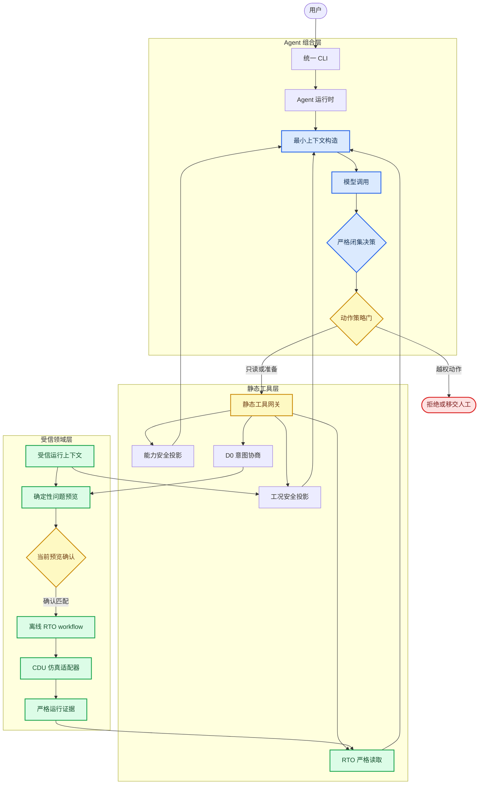
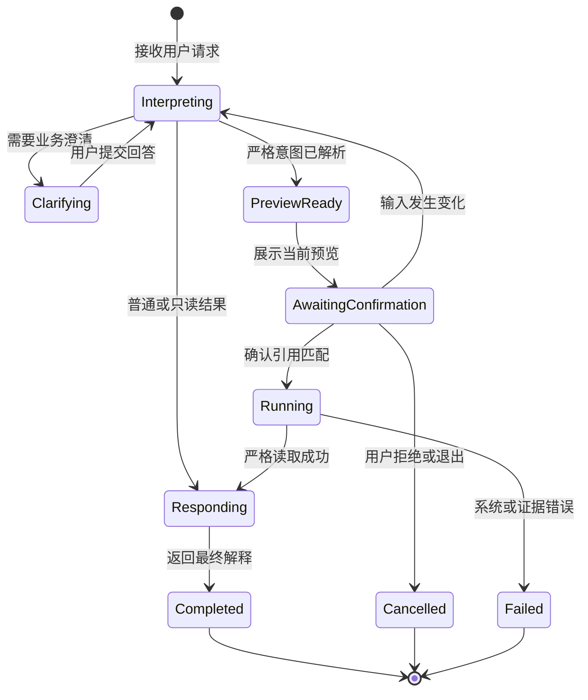

# 石油加工领域智能体架构与功能设计

_状态：设计草案 v0.1 · 2026-08-21 · 本文定义目标架构和首版功能边界，不证明相关 Agent 运行能力已经实现。_

---

## 📋 结论与当前基线

本项目应建设一个**单一、受控、领域型智能体**。大模型只负责自然语言理解、有限澄清、闭集动作选择和证据解释；受信事实、问题构造、求解、机理仿真、评价、严格读取和策略治理继续由现有确定性模块负责。

首版不建设通用自主规划器。每个用户轮次最多选择一个领域动作；需要多个步骤的离线 RTO 由现有 workflow 在一次获准动作内确定性完成。模型不能直接执行 RTO、批准或发布策略，也不能产生 `OperatingContext`。

这一选择吸收了主流 Agent 的模型—工具反馈循环、上下文工程和外部权限门思想，但遵循从简单、可组合模式开始的工程建议[^1]。Claude Code 的上下文—行动—验证循环[^2]、Codex 的模型—工具—结果循环及 Harness 分层[^3][^4]只作为设计参考，不构成本项目的功能声明。

> ⚠️ **设计状态：** 已实现能力仍以[项目实施状态](../STATUS.md)、源码、版本化配置和自动验证为准。本文中的“目标”或“首版”均表示待评审设计，不得表述为已经可用。

### 当前能力与目标差距

| 能力 | 当前事实 | 首版目标 |
| --- | --- | --- |
| 普通对话 | 已有 DMX 内存 Chat | 纳入统一 Agent 入口 |
| 仿真工况查询 | 已有白名单安全投影 | 作为只读动作保留 |
| RTO 结果解释 | 已有 `/result` 严格读取 | 作为只读动作保留 |
| 严格意图协议 | D0 合同和服务已实现 | 接入真实模型适配器 |
| Agent 动作选择 | 未实现 | 新增严格闭集决策 |
| RTO 预览与确认 | RTO API 已有相应基础 | 接入 Agent 确认门 |
| Agent 发起离线 RTO | 未实现 | 确认后调用现有 workflow |
| 会话持久化 | 未实现 | 首版仍不实现 |
| 策略审批、发布、现场控制 | 不属于 Chat | 不向 Agent 暴露 |

当前模块事实分别见[目录与模块边界](01_项目目录与模块边界.md)、[RTO 系统综合说明](../rto/01_RTO系统综合说明.md)、[垂域模型与 RTO 通信协议](../rto/02_垂域模型与RTO通信协议.md)、[源码区 DMX 对话工具](../domain_model/01_聚合式垂域模型综合说明.md)和[CDU Mini Loop 综合说明](../cdu/01_CDU_Mini_Loop机理模型综合说明.md)。

## 🎯 目标与非目标

### 设计目标

1. 为普通对话、工况查询、RTO 意图协商、离线执行和结果解释提供一个用户入口
2. 保持 `OptimizationIntent` 与 `OperatingContext` 分离，模型输出始终位于不可信边界
3. 复用现有 CDU、RTO、D0 和严格 reader，不复制领域规则或证据合同
4. 让每次动作的输入、权限、结果和失败都可解释、可测试；离线执行继续复用现有恢复能力
5. 在没有真实复杂度前保持同步、单进程、本地 CLI 和最小依赖

### 首版非目标

- 不接入 DCS、SIS、Historian、LIMS 或任何现场写入
- 不自动批准、发布、下装或替代人工审核
- 不提供任意 Shell、Python、文件写入、网络访问或动态插件工具
- 不建设多智能体、任务委派、后台服务、数据库、队列或常驻进程
- 不建设 RAG、向量数据库、长期记忆或跨用户画像
- 不引入 LangChain、LangGraph、MCP 或新的模型供应商框架
- 不宣称 HYSYS 或第二仿真后端已经可替换接入

### 三类责任主体

| 主体 | 负责 | 不负责 |
| --- | --- | --- |
| 大模型 | 理解、澄清、闭集动作建议、解释安全投影 | 运行事实、算法、门禁、审批 |
| 受信代码 | 校验、授权、构造、求解、仿真、评价、证据 | 猜测用户意图、自由生成业务事实 |
| 用户或正式治理主体 | 确认计算、审核策略、承担发布授权 | 被模型自动替代 |

## 🔗 总体架构

Agent 是现有模块之上的薄组合层，不成为新的业务事实源。当前 `assistant` 命名空间继续承担组合职责；`domain_model` 只提供模型传输，`rto.communication` 只处理严格意图，RTO 与 CDU 保持现有依赖方向。

### 不可跨越的边界

- 模型只能看到公开能力、用户原话和经批准的安全投影，不能读取原始 `OperatingContext`
- `AgentDecision` 只是动作建议，必须由运行时校验，不能直接调用领域实现
- `resolved_intent` 是唯一可以进入受信上下文绑定的模型产物
- `ProblemBuilder` 仍只构造问题，不求解；求解器仍只通过统一评价边界取得证据
- 结果解释只能消费严格 reader 生成的摘要，不能消费任意路径或未校验 JSON
- 当前 `approve_strategy` 和 `publish_strategy` 即使存在于 RTO API，也不得注册为 Agent 工具

## ⚙️ 单轮执行协议

### 闭集决策

首版模型输出采用严格标签联合，不依赖供应商原生 function calling。概念上只允许三类决策：

| 决策 | 含义 | 运行时行为 |
| --- | --- | --- |
| `respond` | 普通领域回答 | 返回文本，不调用领域工具 |
| `clarify` | 需要用户补充 | 返回有限问题并停止本轮 |
| `request_action` | 请求一个闭集动作 | 校验动作、参数和权限后至多执行一次 |

决策中不得包含受信事实、求解器 ID、公式、硬门禁、内部路径或批准状态。未知字段、非法动作、参数越界和错误关联必须失败关闭；允许一次完整模型修复，不能做局部 JSON Patch 或无限重试。

### 每轮限制

- 每个用户轮次最多执行一个领域动作
- 一个动作不能再次动态发现或调用其他 Agent 工具
- D0 严格意图继续沿用最多两次完整模型生成和最多三轮用户澄清
- 离线 RTO 的内部阶段由现有 workflow 确定性执行，不计为模型自主工具链
- 模型或工具失败后停止本轮，不自动换模型、换算法或扩大权限
- 普通回答、澄清和只读查询均不能创建 RTO 运行目录

### 执行状态

确认只表示“允许本地执行本次离线计算”，不等于策略审核、发布批准或现场操作授权。首版确认状态只存在于当前进程；进程重启、意图变化、上下文变化或预览指纹变化后必须重新预览和确认。

## 📚 首版功能与工具

下表中的动作名是设计级标识；实现时优先包装现有 API，不为名称对称新增无消费者接口。

| 动作 | 复用能力 | 副作用 | 权限 |
| --- | --- | --- | --- |
| `answer` | DMX Chat | 外发用户消息 | 自动 |
| `show_capabilities` | RTO 安全能力投影 | 无领域写入 | 自动 |
| `show_simulation_status` | 白名单工况投影 | 无仿真执行 | 自动 |
| `prepare_optimization` | D0＋ProblemBuilder | 只生成内存预览 | 自动 |
| `run_offline` | 现有 RTO workflow | 计算并写严格 artifact | 当前预览确认 |
| `inspect_result` | 统一 RTO 严格 reader | 无新增仿真 | 自动 |
| `explain_result` | 结果安全摘要＋DMX Chat | 外发最小摘要 | 自动 |

### 普通对话与能力查询

普通工程问题继续使用当前 Chat。用户询问“可以优化什么”时，Agent 返回安全能力投影，不把能力目录中的内部绑定、决策边界、公式、硬门禁或求解路线发送给模型。

### 工况查询

继续沿用当前自然语言工况上下文识别和 `build_chat_operating_status()` 白名单投影。识别器只决定是否补充工况事实，不承担整轮意图路由。用户同时查询状态并要求优化时，当前只读 Chat 必须保留完整原句、解释工况并明确动作尚未执行；未来 Agent 应把优化部分送入 `prepare_optimization` 或澄清，不能折叠成纯状态查询，更不能越过预览确认进入 `run_offline`。

### 优化准备与澄清

用户提出优化请求后，Agent 把原始消息和安全能力清单交给 D0 严格通信链。只有 `resolved` 结果才可由受信组合层加载固定 `OperatingContext` 并构造问题预览。`repair_required`、`needs_clarification`、`unsupported` 和 `failed` 保持现有语义。

问题预览至少向用户展示：

- 目标、方向、优先级和结果形式
- 允许变化的高层决策变量
- 使用的受信上下文引用及可公开摘要
- 已绑定执行路线的公开名称和计算预算摘要
- 预计写入位置的类别，不暴露任意内部路径给模型
- 本次预览指纹或等价确认引用

### 离线执行与结果解释

用户确认当前预览后，运行时直接调用确定性 `run_offline`，不再让模型决定算法、参数或是否跳过阶段。运行完成后必须先 `inspect_offline` 严格重载，再把安全摘要交给模型解释。严格读取失败时不发送任何结果给模型。

## 🔐 信任、权限与外发

### 动作等级

| 等级 | 典型行为 | 默认处理 |
| --- | --- | --- |
| P0 | 普通回答 | 允许，执行外发检查 |
| P1 | 能力、工况、既有结果只读 | 允许，使用安全投影 |
| P2 | 严格意图、问题构造、无求解预览 | 允许，不写运行证据 |
| P3 | 离线 RTO 或独立仿真执行 | 必须确认当前预览 |
| P4 | 策略审批、发布、现场读写 | 首版拒绝或移交人工 |

模型只能建议 P0 至 P2 动作。P3 由确定性会话状态和用户确认触发，不能由模型自行升级。P4 不进入工具清单，因此不存在通过提示词获得权限的路径。

### 外发最小化

允许发送给模型的内容只有：

- 用户主动输入的文本
- 安全能力投影
- 工况白名单投影
- D0 请求、修复和澄清所需字段
- 严格结果 reader 生成的最小摘要

禁止发送凭据、原始配置文件、完整 `OperatingContext`、原油组成、内部引用和路径、求解器细节、公式、原始仿真证据、策略 payload、未选候选详情或任何思维链。外发校验由代码执行，不能仅依赖系统提示词。

### 工具边界

- 工具注册表为代码中的静态闭集，不做动态发现
- 每个工具采用严格类型输入和结构化结果，拒绝未知字段与非有限数
- 文件路径只由显式命令或受信代码解析，模型不得自由构造路径
- 网络只由现有 DMX 客户端发起，工具层不获得通用网络能力
- 工具结果必须标注来源、声明范围和适用的证据引用；模型文本不能覆盖这些字段

## 💾 会话、上下文与证据

### 首版会话状态

首版继续使用进程内状态，不新增数据库。最小状态只包含：

- 有界消息历史
- D0 当前请求、修复或澄清状态
- 最多一个待确认动作及其预览引用
- 最近一次安全结果摘要或严格 artifact 引用

进程退出后普通会话和待确认动作丢失；已有 RTO artifact 仍由现有严格 reader 恢复。首版不自动总结长期会话，达到现有消息或字节上限后要求用户清理会话。

### 上下文装配

| 上下文层 | 内容 | 加载时机 |
| --- | --- | --- |
| 固定规则 | 角色、动作闭集和权限规则 | 每次模型调用 |
| 会话上下文 | 有界对话与澄清状态 | 当前进程内 |
| 任务上下文 | 能力或安全投影 | 对应动作按需加载 |
| 证据上下文 | 严格 reader 摘要 | 读取成功后加载 |
| 禁止上下文 | 凭据、原始证据、受信事实全集 | 永不加载 |

### 证据策略

首版不另建通用 Agent artifact 或聊天日志，避免出现第二套半可信证据系统。离线计算的可重建事实继续由 RTO workflow artifact 和 CDU 运行证据负责；Agent 只保留当前进程中的动作状态。

如果未来需要跨进程审批或审计，再单独设计版本化 Agent 事件合同、严格 reader 和 manifest。不得先写一个普通 JSONL 文件便宣称具备可信审计能力，也不得保存模型思维链、凭据或原始供应商响应正文。

## 🧪 错误语义与验收

### 错误保持原则

| 来源 | 必须保留的语义 | Agent 行为 |
| --- | --- | --- |
| D0 通信 | 修复、澄清、已解析、不支持、失败 | 原样路由下一动作 |
| 模型供应商 | 认证、限流、超时、传输等失败 | 停止，不伪装成业务错误 |
| 权限策略 | 未确认或禁止动作 | 明确拒绝，不调用工具 |
| RTO 评价 | 过程不可行、无已验证候选、不可发布 | 不用收益或语言润色覆盖 |
| 系统边界 | I/O、资源、适配器、证据错误 | 作为系统失败停止 |
| 严格读取 | 文件集、哈希或重建失败 | 不向模型外发结果 |

异常消息文本不是分类依据。Agent 可以增加用户可理解的上下文，但不得把系统错误改称工艺不可行，也不得把 `feasible_not_publishable` 解释为已获批准。

### 最小测试集

1. 严格决策解析：联合分支、未知字段、重复键、超限和一次完整修复
2. 动作路由：普通问答、能力、工况、优化准备、结果读取及“工况＋优化”复合请求的正反例
3. 信任边界：模型生成工况、求解器、公式、路径和审批状态时全部拒绝
4. 确认门：未确认、过期确认、输入变化和引用不匹配均不执行
5. 外发边界：凭据、原始上下文、内部引用和路径不进入 payload
6. RTO 纵切：预览零求解，确认后运行，strict inspect 零新增仿真
7. 结果忠实度：数值、单位、约束和状态与安全摘要一致
8. 失败隔离：供应商、系统、过程不可行和证据错误不串类

### 首版完成门禁

- 所有版本化金标准和反例通过
- 任意未确认路径都不能创建 RTO 运行
- 任意模型输出都不能生成或覆盖受信 `OperatingContext`
- 相同预览恢复不改变问题和执行路线
- 运行结果必须经严格 reader 重载，重载不得触发新仿真
- 源码、测试、文档和 `STATUS.md` 对实现状态的表述一致

## ✍️ 实施顺序与框架决策

### 分阶段落地

| 阶段 | 最小交付 | 进入条件 |
| --- | --- | --- |
| 0 设计评审 | 本文、动作闭集、确认规则、测试矩阵 | 用户确认设计 |
| 1 只读 Agent | 统一普通 Chat、能力、工况和结果读取 | MS1 当前主线收口 |
| 2 意图与预览 | DMX→D0 适配、严格意图、问题预览 | 阶段 1 门禁通过 |
| 3 确认后执行 | 当前预览确认、离线 RTO、严格解释 | 阶段 2 反例通过 |
| 4 按需演化 | 持久任务、UI 或外部协议 | 出现真实消费者 |

阶段 1 至 3 均保持同步、单进程和本地 CLI。阶段 4 不是默认承诺，必须重新确认需求和授权。

### 最小源码边界

| 位置 | 计划职责 | 添加时机 |
| --- | --- | --- |
| `assistant/cli.py` | 仅负责人机输入输出 | 复用现有文件 |
| `assistant/runtime.py` | 单轮状态机、确认门和动作协调 | 阶段 1 |
| `assistant/tools.py` | 静态安全工具及权限元数据 | 阶段 1 |
| `assistant/dmx_intent_adapter.py` | 实现 D0 所需模型调用适配 | 阶段 2 |

小型数据类先放在唯一消费者附近。没有第二个实现前不新增通用模型工厂、工具插件系统、持久化仓储接口、planner、memory 或 provider registry。

### 框架选择

首版直接复用当前 Python 合同和 DMX 客户端，不引入 Agent 框架。OpenAI 和 Anthropic 的工程资料都强调先强化单智能体和 Harness，再由真实复杂度决定是否拆分[^1][^5]。

| 选项 | 当前决定 | 重新评估触发条件 |
| --- | --- | --- |
| 直接 Python 运行时 | 采用 | 当前最小需求可覆盖 |
| LangChain | 不采用 | 多供应商中间件出现真实重复 |
| LangGraph | 不采用 | 跨进程恢复、多审批分支成为需求 |
| MCP | 不采用 | 外部 Agent 客户端需要稳定调用本项目 |
| RAG | 不采用 | 出现大规模、动态、需检索的文档语料 |
| 多智能体 | 不采用 | 单智能体因职责冲突被评测证明不足 |

LangChain 的 `create_agent` 已提供模型—工具循环和中间件[^6]，LangGraph 的检查点适合中断恢复和人工审批[^7]，MCP 用于把 AI 应用连接到外部工具和数据源[^8]。这些都是未来可能使用的手段，不是当前正确性的前提，也不应取代现有模块合同。

## 🔗 参考资料

### 项目内部资料

- [项目实施状态](../STATUS.md)
- [目录与模块边界](01_项目目录与模块边界.md)
- [RTO 系统综合说明](../rto/01_RTO系统综合说明.md)
- [垂域模型与 RTO 通信协议](../rto/02_垂域模型与RTO通信协议.md)
- [源码区 DMX 对话工具](../domain_model/01_聚合式垂域模型综合说明.md)
- [CDU Mini Loop 综合说明](../cdu/01_CDU_Mini_Loop机理模型综合说明.md)

[^1]: Anthropic. (n.d.). "Building effective agents." *Anthropic Engineering*. https://www.anthropic.com/engineering/building-effective-agents

[^2]: Anthropic. (n.d.). "How Claude Code works." *Claude Code Documentation*. https://code.claude.com/docs/en/how-claude-code-works

[^3]: OpenAI. (n.d.). "Unrolling the Codex agent loop." *OpenAI*. https://openai.com/index/unrolling-the-codex-agent-loop/

[^4]: OpenAI. (n.d.). "Unlocking the Codex harness: how we built the App Server." *OpenAI*. https://openai.com/index/unlocking-the-codex-harness/

[^5]: OpenAI. (n.d.). "A practical guide to building AI agents." *OpenAI*. https://openai.com/business/guides-and-resources/a-practical-guide-to-building-ai-agents/

[^6]: LangChain. (n.d.). "Agents." *LangChain Documentation*. https://docs.langchain.com/oss/python/langchain/agents

[^7]: LangChain. (n.d.). "Persistence." *LangGraph Documentation*. https://docs.langchain.com/oss/python/langgraph/persistence

[^8]: Model Context Protocol. (n.d.). "What is the Model Context Protocol?" https://modelcontextprotocol.io/docs/getting-started/intro
