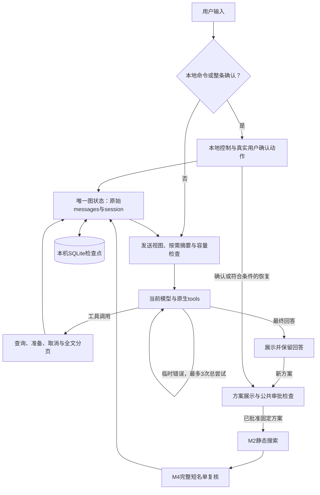

# 石油加工领域智能体架构与功能设计

_2026-09-11 · 单一图状态、本机会话恢复、固定审批执行、正文流与有限重试；批次验收状态见项目状态。_

## 🧭 统一入口

除本地命令和三种整条确认输入外，自然语言进入同一个LangChain `create_agent`图。模型接收完整工具声明，决定直接回答、追问或请求工具；程序校验并执行已注册函数，将结果作为原生工具消息返回模型。审批、M2和M4通过该图的公共中间件节点衔接，模型不能选择或调用计算阶段。没有前置业务分类器，也没有失败后回退到旧路由的路径。

模型回答与程序状态展示完成后等待新的用户输入；待审批节点挂起。重启只读取状态并展示恢复摘要，状态回边不代表自动请求模型或自动续算。

## 🧩 职责与组成

| 模块 | 当前职责 | 边界 |
| --- | --- | --- |
| `assistant/cli.py` | 两个终端入口的唯一装配、会话锁生命周期、恢复摘要、行编辑、进度与正文流 | 交互终端使用readline和input；非交互流按行输入、输出最终结果；退出关闭HTTP和SQLite资源 |
| `assistant/react.py` | 单一create_agent图、模型选择、管理命令、公共审批与固定M2/M4节点、普通模型有限重试与中断处理 | 图中messages/session是活动状态的唯一来源；普通重试只包裹模型调用，客户端与领域服务通过runtime context注入 |
| `assistant/state.py` | 版本化会话字段、严格读取、模型选择与上下文状态重建 | 校验保存字段、方案身份及快照/全文引用；默认值只用于创建新状态 |
| `assistant/session.py` | 官方SqliteSaver、严格JSON序列化、本机单会话互斥与关闭 | 无任意对象或pickle回退；数据库及锁文件0600，拒绝符号链接和第二个写入者 |
| `assistant/context.py` | 容量计量、官方摘要发送视图、原文覆盖关联与工具全文分页 | 公共摘要钩子只修改一次性发送视图，有效批次逐批提交检查点；原始messages不被替换，摘要不能修改授权 |
| `assistant/native_tools.py` | 五个无独立活动状态的领域工具 | 状态由ToolRuntime传入并通过Command更新；Context和Problem固定，模型仅传业务字段及引用 |
| `domain_model/models.py` | 五个精确ID、端点类别、thinking及容量依据 | 不删除后缀、不猜模型别名；按明确的应用上下文预算计量 |
| `domain_model/native.py` | 标准模型生成/流接口、Chat/Responses编解码、推理续接、真实用量与请求计数 | 正文分片可显示；完整校验后才发出工具调用和原生续接字段；结构化区分临时与永久错误，传输自身不重复重试 |
| `domain_model/credentials.py` | 原有受保护本地凭据读取 | 不跟随符号链接、不外发或反射凭据 |
| `rto/runtime/staged.py` | 固定方案的严格保存/重建、静态与动态阶段入口及只读重载、程序确认摘要 | 从保存的能力包和Context重建同一Problem，不因当前配置变化替换问题；隐藏具体后端 |
| RTO与CDU | 保持已有问题、求解、仿真、配对评价及治理合同 | 静态停止点复用原编排；M4必须处理完整入围列表 |

LangChain、httpx和官方`langgraph-checkpoint-sqlite`仅列在`domain-model`可选依赖，版本由`pyproject.toml`与`uv.lock`固定。SQLite包要求的aiosqlite和sqlite-vec随之锁定；本项目只使用同步检查点，不启用向量扩展、数据库服务或后台任务。RTO/CDU核心不导入框架。运行时关闭环境变量可能开启的LangSmith追踪。

## 🔧 当前工具合同

| 工具 | 参数 | 返回 | 执行条件 |
| --- | --- | --- | --- |
| `get_plant_info` | 无 | 当前provider、工艺身份、模型标识、可用目标和变量 | 读取配置与能力，零仿真 |
| `read_operating_context` | 无 | 快照引用、负荷、设定值、单位、时间、质量与来源 | 保存不可变Context，返回必要事实 |
| `prepare_optimization` | 目标向量、允许的available变量子集、返回方案数、snapshot_ref及previous_plan_ref | 新版本、问题引用与确认摘要 | 不求解、不仿真；失败也撤销旧资格 |
| `cancel_optimization` | 当前plan_ref | 取消后续执行，保留已有结果 | 只能取消当前方案，不能批准或启动计算 |
| `inspect_optimization` | 可选受控workflow_id | 当前方案/阶段/结果，或严格重载指定完整结果 | 不接受路径，不创建结果 |
| `read_tool_result` | result_ref、字符offset及可选max_characters | 原文片段、总字符数及next_offset | 只接受当前持久化会话中的全文引用，不读取任意路径，不重做原工具 |

Agent工具合同升级为`3.0.0`：移除模型可调用的manage/solve/verify入口，由本地确认和固定图节点承担审批执行；增加独立取消工具。`prepare_optimization`仍不接受`constraints`：系统硬约束和发布改善门禁自动加入，额外业务约束必须明确告知用户当前不支持，不可静默忽略。允许变量是available项的非空子集，不要求包含全部登记变量，deferred项不可加入。`max_candidates`表示推荐与其他候选合计的返回数量，默认1；最大值来自对应`execution_routes.top_k`，不是`maximum_m2_candidates`搜索预算。`snapshot_ref`必须使用工况工具返回的引用，不能填context_id。

参数Schema错误以`invalid-tool-arguments`及安全字段位置返回，不反射输入值或未知字段名；业务准备错误以`optimization-preparation-rejected`及issues返回，保留不支持目标/变量、方向错误、返回数量范围和快照/旧方案引用原因。调用层仍先撤销修改资格；失败不恢复旧授权。未知配置或证据异常继续使用通用错误，不能把异常原文和内部路径直接外发。

五个领域工具之外，`read_tool_result`是会话上下文工具。参数模型同时生成Schema并用于校验。无参数工具拒绝任何额外字段；针对所锁定框架的空Schema校验跳过行为，保留局部补充校验。工具失败返回结构化错误；未知工具由框架返回错误给模型，不执行任意函数。

工艺身份根据当前受信`cdu-m7`提供者标识映射为常压蒸馏；未知提供者返回未知，不假定所有配置都是CDU。快照使用既有Context指纹，不能由模型提交测量值来创建。

## 🗂️ 会话与切换

单一官方图的`messages`保留用户消息、完整助手响应、调用和工具结果；`session`保存模型/思考选择、工况、固定方案、审批与阶段回执、摘要及全文分页。本地展示和失败记录有明确程序来源。没有第二套可独立修改的活动消息账本，也没有64条历史上限。

实际CLI持有`runs/assistant/session.sqlite`的独占本机锁，官方SqliteSaver保存图检查点与待提交写入；第二个CLI明确报错，退出或进程终止释放锁。保存数据只允许JSON及明确列举的框架消息/审批类型，凭据和HTTP客户端不入库。首次启用从新会话开始，不迁移旧进程尚未持久化的内存。格式、字段、文件或阶段证据缺失/损坏时明确拒绝，不悄悄用当前配置填补旧状态。

会话记录与原生发送视图分开。相同模型保留完整assistant或Responses output；切换模型/思考设置时建立新原生上下文段，旧对话、工具调用及结果作为带来源的背景记录注入，原始推理和响应链不跨模型重放。原始记录并未删除；快照和最近结果也保持不变。

`/model`在本地开启一次模型选择，可直接回复编号或完整ID，也保留`/model <编号或完整ID>`的一步切换方式。选择成功或输入0后退出；无效编号允许重试，空行保持；普通文本和其他命令退出选择后按原语义处理。选择状态与会话、方案及确认资格独立，未打开选择时数字仍是普通聊天。菜单操作不联网、不清空任务、不触发执行；`/thinking`的列表展示不开启选择。当前轮未结束时拒绝切换；中断后将未取得结果的工具调用标记为中止，不能当作成功执行。

新会话以`chat_settings.py`的默认型号`gpt-5.6-sol-cdx`启动；恢复时以已保存的用户模型/思考选择为准，不用新的默认值覆盖旧选择。`/help`与每次模型请求中的`application_help`复用命令、菜单及状态渲染，包含当前模型、思考强度、能力入口与待办。投影由当前图状态派生且独立于摘要，不增加持久化帮助账本；取消后的空方案状态也必须发送，防止历史任务误导自然语言回答。具体装置能力继续通过受信领域工具读取。

切换模型时，Flash固定使用非思考模式，其余模型默认开启思考，不继承前一模型的模式或强度。当前Flash渠道的`/thinking on`被明确拒绝，保留原设置及会话；这是已验证使用范围的限制，不代表原厂Flash没有思考能力。Kimi始终思考，其他模型仍可显式调整合法模式。

方案位于唯一`session`状态中：保存内容完整绑定能力包、Intent、Context与Problem，并记录版本、程序展示轮次、审批状态及阶段回执。严格codec仅从保存内容重建不可变PreparedOptimization并核对确定性Problem；外部配置修改或删除不会悄悄替换原问题。模型切换不修改这些业务事实。

待审批时聊天、查询和切换模型保留方案；不再要求模型调用keep。修改仍须重新prepare，进入修改路径就撤销旧版本资格，参数或业务校验失败也不能恢复旧授权。程序在轮末展示固定方案，通过公共`interrupt`节点等待下一条真实确认输入，准备当轮不执行计算。

只接受整条输入`/confirm`、`确认`或`确认执行`，仅忽略首尾空白。三者均在本地转换成同一个LangGraph `Command(resume=...)`审批动作，核对原文、用户轮次、方案版本和展示先后；确认动作无需模型请求。标点、引用、附加条件和模型复述不能授权。确认后图固定执行M2静态搜索、完整短名单M4复核及程序结果展示，再自动请求当前模型说明结果；审批与计算本身不依赖这次模型说明。

完成报告由`presentation.py`从严格结果回执生成，先显示推荐调整、同工况基准与预测、改善及备选核验状态，再显示工况与结果编号。两位小数和百分数仅用于展示，微小非零值保留必要精度，原始JSON不变；不显示内部路径和物理执行计数。

完成后的解释复用同一`create_agent`图，以临时运行上下文携带可读报告，不新增持久化阶段或第二个Agent。公开模型包装将本次消息设为报告、工具设为空，并在进入工具节点前拒绝任何工具响应。它只作一次逻辑说明调用，继续使用当前模型与官方有限重试，最多3次HTTP；不触发历史摘要或重做计算。报告在模型请求前显示并已保存，解释失败仍可查询结果。恢复计算完成后同样说明；重复确认和`/result`只读展示，零新增HTTP。

重启只展示恢复摘要，不请求模型或计算。待审批方案仍须确认；已批准未完成方案只有在展示恢复摘要后输入`/resume`才继续，普通追问不续算，`/resume`也不能批准新方案。`/cancel`删除待执行方案、保留已有结果；`/clear`删除当前会话全部检查点、待提交写入、原始记录、快照、摘要、分页、方案和授权，再保存保留模型选择的新空状态，现有磁盘RTO证据保留。

所有改变任务或执行计算的调用独占一条模型响应；混排批次整体拒绝，领域工具执行由局部互斥保持串行。稳定custom流需要一个框架等待线程，因此图执行配置为2；该设置不允许领域工具并发执行。这样不会出现同一批的修改、确认和求解相互竞态。

### 执行进度

Agent消费稳定的`updates`与`custom`流：updates只记录框架消息，custom承载程序生成的工具起止、RTO进度和真实模型尝试事件。工具完成事件在实际调用结束时发送，同批查询也保持起止顺序；错误不显示完成。CLI仅在交互终端把`handle(..., on_progress=...)`的回调逐行刷新，最终`AgentTurn`不重复包含进度。完成报告通过回调先显示，`streamed_outputs`记录本轮已经显示的报告，让CLI避免重复；仅接入正文回调的客户端先收到明确标记的程序报告和说明分界，仍保持报告在前。管道输出按报告、模型说明的顺序保留最终内容。

RTO通过`rto.runtime`公开的`RtoProgress`及可选回调传出中立事件，不导入LangChain。M2在实际评价边界统计已完成的搜索点评价，细化未结束时总数未知；M4按完整入围名单报告已复核数和总数。计数包含未通过评价的点，不等于物理执行次数、可行候选数或最终方案数。已有完整阶段经只读证据校验后报告复用；失败与无可行结果分别报告。进度是临时显示信息，不是持久化证据。

三种确认输入和`/resume`使用同一组固定阶段节点与进度格式。Ctrl-C停止继续调度，保留此前已完成记录，并将未完成的工具调用明确标记为中止。交互CLI同时消费标准`messages`流显示模型正文；程序进度与摘要响应不混入正文，最终输出跳过已经显示的正文，管道仍只输出最终结果。

每次图运行创建独立的公开`RunControl`。仅当运行位于主线程且SIGINT仍使用Python默认处理器时，临时转发器先调用`request_drain`，再触发原有`KeyboardInterrupt`；图完成或失败后恢复原处理器，不覆盖外部自定义SIGINT处理。普通模型每次handler和摘要每次`invoke`在请求前检查drain，因此框架等待后台清理期间也不会发起下一次HTTP重试。回调异常退出同样先请求drain，再关闭图流。这一控制仅属于当前运行，没有新增取消框架、配置或持久化字段。它仍可能等待当前HTTP、退避或工具调用结束，底层计算沿原受支持边界中断，不承诺立即终止所有工作。

## 🔌 协议与容量

标准`_stream`返回`ChatGenerationChunk`/`AIMessageChunk`；`_generate`聚合相同片段，保持两条调用路径一致。正文可逐片显示，完整工具调用、原生续接内容及实际返回的`usage_metadata`只在严格结束校验后提交一次，缺失用量不伪造。Chat使用`assistant.tool_calls`及匹配`tool_call_id`的tool结果；Responses使用`function_call`和`function_call_output`，保留原始output项及加密推理状态，不展示原始推理。Responses按输出索引收集完整`output_item.done`，结束帧与事件必须一致；截断、重复、身份冲突或未正常结束均拒绝，不使用未完成参数执行工具。已显示正文后失败会明确标记回答不完整。

普通模型调用通过官方`ModelRetryMiddleware`重试；`ObservableModelRetry`直接继承该组件，只在公共`wrap_model_call`真正进入每次handler时发送`ModelAttempt`事件，重试循环和默认退避由框架处理。`retry_on`只接受结构化`RetryableNativeModelError`，`max_retries=MAX_MODEL_ATTEMPTS-1`允许当前模型最多3次总尝试，`on_failure="error"`保留安全原因而不创建伪助手答复。上下文先生成发送视图，重试只包裹后续普通模型请求，不重跑`before_model`摘要、已完成工具或M2/M4。

超时、网络连接/读取中断、远端传输协议错误及选定临时HTTP状态可重试；认证、权限、其它永久HTTP、响应解析及协议校验失败不重试。已显示部分正文后发生可重试错误时，程序先说明上次回答未完整生成，并标明第2/3次尝试，再显示重新生成的正文；只有`on_text`回调的客户端也收到明确程序分隔。失败片段不会拼入后续成功消息，图只保存完整成功的模型消息；三次耗尽后明确报告已尝试3次，保留已完成状态。正常收完传输但缺少完整结束协议的`incomplete-stream`属于永久错误，不因已有文字而重试。不会自动换模型或切换协议。

DeepSeek Pro开启思考且请求带工具时，发送前检查每条保留的原生助手历史均含推理字段，包括没有工具调用的最终答复；字段缺失以`missing-reasoning-history`停止外发，保留原文，可显式关闭思考或切换模型后以背景数据继续。无工具的摘要请求不应用此历史要求。Flash已限定非思考使用，不保留不可达的Flash思考历史检查，也不补造推理或增加兼容重试。[DeepSeek思考续接要求](https://api-docs.deepseek.com/guides/thinking_mode/)

每次请求前按实际选定模型检查系统提示、工具Schema、对话及协议推理信息，并预留当前生成预算；标准模型profile随选择更新。当前采用保守UTF-8字节估计加消息框架余量，不等于供应商tokenizer的精确计量。GPT Sol CDX使用用户指定的256K应用上下文预算（256,000 tokens），其余预算以`models.py`为准。传输的`request_count`在实际外发边界累计普通、摘要及其重试次数；尝试进度事件不代替HTTP计数。应用预算不冒充网关实测最大窗口或模型最大输出。

每轮普通模型逻辑调用次数由框架中间件限制；摘要逻辑批次有单独的每轮预算，复用同一个`max_model_calls`值，不消耗Agent工具循环次数。两条路径共享`MAX_MODEL_ATTEMPTS=3`，各自每次最多3次HTTP尝试，摘要的公开`with_retry`不再叠加普通模型中间件。因此普通与摘要外发各自最多为逻辑上限的3倍，合计最多`6 * max_model_calls`；这是既有逻辑预算与统一尝试常量推导的上限，没有独立配置或重复计数器。失败的摘要批次也保存预算消耗；发送前缩小过大摘要输入不计为HTTP尝试。图执行步数按逻辑预算推导。这些限制与可保存的对话轮数无关；超限保留记录并停止。

### 上下文压缩的实际流程

1. 每次调用前（包括工具返回后）构造当前模型的真实协议载荷，计入系统说明、工具Schema、最近消息、必要推理状态及当前任务投影。输入预算为模型窗口减去本次生成预留；使用保守字节估计，不声称精确token计数。
2. 超长工具结果改为带明确省略标记的全文引用；原ToolMessage仍保存在记录中。`read_tool_result`按Unicode字符偏移读取，单页按当前容量限制编码长度，保留调用ID，不再次执行原业务工具。方案中的静态/最终详情也通过引用提供，核心方案、版本和资格仍直接投影。
3. 接近容量时，通过官方组件公开的`keep`参数尽量保留约半个输入预算的近期记录，由组件决定不拆开工具组的实际切点。触发预留取输入预算约五分之一与一次输出预算中的较大者。当前用户输入及本轮工具交互始终保留；摘要输入过大时增加保留量，缩小较旧前缀后再处理，不裁掉原文。
4. 使用当前所选模型，通过`SummarizationMiddleware.before_model`公共钩子在一次性发送视图上生成摘要；`trim_tokens_to_summarize=None`关闭摘要前预裁剪。组件返回的消息更新只通过`add_messages`应用到该视图，不应用到图中的原始messages。`SummaryModel.invoke`要求非空、无工具调用的摘要；公开`with_retry`仅重试结构化的`RetryableNativeModelError`，每批总尝试最多3次，永久错误、解析错误和无效摘要不重试。
5. 仅当替换后真实协议载荷变小，才保存该批摘要和原文覆盖关联；公共图钩子先提交检查点，再处理下一批。`covered_until`从官方返回的保留后缀推导，只关联已归档原文，不自行决定切点。后续批次失败不覆盖此前有效摘要，原始消息、分页全文和失败批次的预算消耗仍保存。
6. 最终发送视图只包含摘要、未覆盖的近期记录和重新读取的程序任务状态，不重复发送已覆盖原文。切模型时保留消息ID、摘要及原文关联，旧记录转为带来源的背景数据，旧原生推理不跨模型重放；当前模型未摘要的消息继续保留原生推理及工具关联。

摘要文字不能创建Context、修改PreparedOptimization或恢复确认资格。用户的变量排除同时由当前方案的业务字段保护；仍未进入方案的普通对话要求只能依靠摘要语义保真，真实模型可能遗漏，不能用替身测试宣称绝对可靠。

摘要路径已移除私有`_find_safe_cutoff_point`调用和`_summary_model`改写，切点与摘要执行使用锁定版本的公共中间件能力。应用只负责容量、当前轮保护、有效提交和原文关联；没有第二套活动消息账本。本轮验证状态见项目状态文档。[官方摘要组件说明](https://docs.langchain.com/oss/python/langchain/middleware/built-in)

原始消息、有效摘要、覆盖关联、预算计数和分页原文随唯一图状态持久化；同模型或切模型后跨进程恢复，启动仍不请求模型或执行计算，方案资格独立保留。没有历史会话列表或自动淘汰，`/clear`一并清除这些状态。单个不可拆分的长消息/工具批次、当前轮或必须直传的任务状态仍可能无法容纳；此时明确停止并保留原文，不承诺无限长对话。

## 🛑 状态与失败

| 情况 | 当前处理 |
| --- | --- |
| 工具请求没有正文 | 原生调用合法时正常执行 |
| 工具JSON重复键、非法类型或响应截断 | 不交给执行层 |
| 普通模型遇到结构化临时网络、限流或服务错误 | 同模型最多3次总尝试；不重跑摘要或已完成工具，耗尽时保留安全原因并明确次数 |
| 普通模型永久错误、解析失败或完整传输缺少结束协议 | 不重试；不执行未完整收到的调用，已显示文字标记为不完整 |
| 已显示部分正文后开始重试 | 先说明上次未完整并标明新尝试，再显示新正文；失败片段不进入成功消息 |
| 查询已完成，下一次模型调用失败 | 查询结果与快照保留，下一轮可继续 |
| 调用关联缺失或跨模型原生历史 | 发送前拒绝，避免生成无效请求 |
| 模型/工具循环达到预算 | 停止本轮，保留已完成状态 |
| 无天气工具或未确认优化 | 不伪造实时信息；模型没有审批或阶段执行工具，图节点核对真实授权 |
| 修改失败 | 保留旧数据，撤销旧版本资格，重新准备展示后才能确认 |
| 待审批查询或闲聊 | 保留方案并等待确认，不自动计算 |
| 已批准任务重启或收到普通追问 | 展示/保留状态，等待明确/resume，不自动续算 |
| 会话版本、字段、文件或阶段证据损坏 | 明确拒绝恢复，不以当前配置或仅存回执补全事实 |
| 仅静态搜索完成 | 返回候选及M2证据，不能表述为最终推荐 |
| 最终结果已完成但解释失败 | 程序展示核验结果，保留可查询回执 |
| 摘要遇到结构化临时网络、限流或服务错误 | 同模型每批最多3次总尝试；耗尽后不提交该批替换，保存失败计数与此前有效摘要 |
| 摘要永久错误、解析失败、空白、返回工具或不缩小载荷 | 不重试、不提交该批替换；保留原文及此前已提交摘要 |
| 摘要关联丢失或必需内容超限 | 停止请求，不猜测水位或静默丢弃内容 |
| 无效模型/思考设置 | 保留原设置，返回明确错误 |

模型的自然语言是否始终忠于工具事实仍需真实模型验收；HTTP替身能证明请求与状态行为，不能证明所有问法的理解准确性。当前不把自由文本摘要作为授权或受信工况。

## 🚧 迁移与后续

旧Agent运行时、意图/确认分类适配器、四动作网关和旧Chat客户端及专用测试已删除；共享回合类型保留在`assistant/turn.py`。凭据与编码泄露检查位于`domain_model/credentials.py`，包根不再导出旧客户端和固定会话限制。当前只有一套生产Agent装配。

独立`rto.communication`严格请求/响应与协商公共合同、配置及gold验证继续保留；当前Agent不调用该协商器。`run_confirmed_optimization`是保留的受信调用方公共API，不是当前Agent路径。详见[通信边界](../rto/02_垂域模型与RTO通信协议.md)。

LC2–LC4增加单一状态、本机持久化、公共审批与固定执行、标准正文流，并移除重复活动状态和旧模型阶段入口。LC5摘要路径已使用公共接口、逐批检查点与受限摘要重试，私有切点和摘要模型改写已删除。LC6已接入官方普通模型有限重试、真实尝试进度、派生HTTP上限、流式重试分隔与中断后的drain检查；当前HTTP、退避和底层计算仍受支持边界限制，自动fallback保持关闭。LC7应用帮助和默认模型已接入，现行说明与源码一致；本轮全部本地用例及五个精确模型的必要实网检查完成，证据与未测范围见[总验收报告](../../reports/domain_model/lc7_final_acceptance_20260911.md)，已有历史探针不替代本轮证据。详情见[项目状态](../STATUS_REACT_REBUILD.md)及[Agent使用说明](../domain_model/01_聚合式垂域模型综合说明.md)。

## 💾 阶段证据与恢复

M2在原有`static-selection-ready`检查点返回；固定M4节点要求已有完整静态检查点，严格重建同一问题与证据，复核全部入围候选并最终选择。`read_prepared_static`和`read_prepared_result`只读重载，缺失证据不能触发补算。七字段结果和v4持久化文件/事件格式不变；静态回执保持独立合同。

图在M2和M4节点分别保存阶段回执。重启、显式恢复或复用已有完整结果时，从v4磁盘证据重载并比对保存内容；取消后保留的最近结果也须独立验真。阶段内容匹配后复用，完整阶段不新增仿真；半个阶段仍按原编排恢复，不新增每候选事务或恰好一次保证。

`physical_m2_executions`和`physical_m4_executions`描述生成原回执时的调用计数。恢复读取只校验其非负整数形状，不重新证明过去的计数，也不把旧值当成本次新增仿真；其他回执字段与严格重载结果比对。完整性指纹用于检出损坏，不等同于身份认证或恶意防篡改证明。
