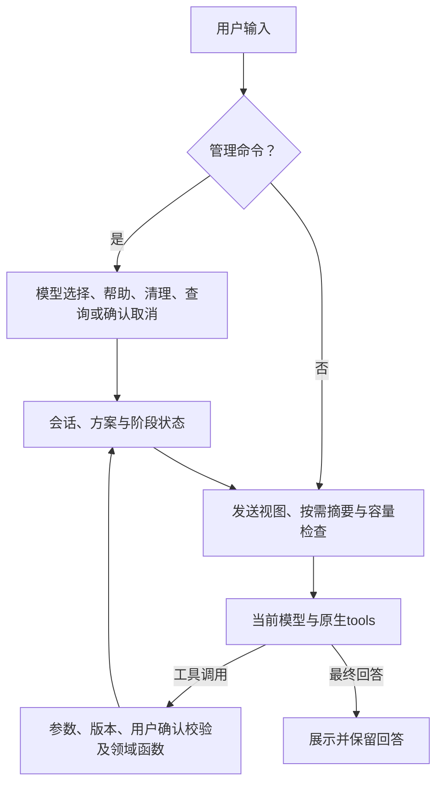

# 石油加工领域智能体架构与功能设计

_2026-09-09 · 当前原生工具架构；P6旧调用链清理已实施，验收状态见项目状态。_

## 🧭 统一入口

任意自然语言进入同一个LangChain `create_agent`循环。模型接收完整工具声明，决定直接回答、追问或请求工具；程序校验并执行已注册函数，将结果作为原生工具消息返回模型。没有前置业务分类器，也没有失败后回退到旧路由的路径。

模型生成最终回答后结束当前轮，等待新的用户输入。图中的状态回边表示需要下一次模型调用时读取状态，不代表自动无限生成。

## 🧩 职责与组成

| 模块 | 当前职责 | 边界 |
| --- | --- | --- |
| `assistant/cli.py` | 现有两个终端入口的唯一生产装配、输入输出和资源关闭 | 可选依赖延迟加载；没有旧Agent装配分支 |
| `assistant/react.py` | 共享消息、模型选择、工具循环、管理命令、中断处理 | 复用框架循环；不解释文本Thought/Action |
| `assistant/context.py` | 容量计量、历史摘要、水位关联、工具全文分页 | 仅改变发送视图；摘要不能修改业务状态 |
| `assistant/native_tools.py` | 七个领域工具、工况快照、方案版本与确认资格 | Context和Problem固定，模型仅传业务字段及引用 |
| `domain_model/models.py` | 五个精确ID、端点类别、thinking及容量依据 | 不删除后缀、不猜模型别名；未知容量保持未知 |
| `domain_model/native.py` | Chat/Responses编解码、SSE聚合、推理续接、请求预检 | 接收完整工具参数后才返回可执行调用；不自动重试 |
| `domain_model/credentials.py` | 原有受保护本地凭据读取 | 不跟随符号链接、不外发或反射凭据 |
| `rto/runtime/staged.py` | 准备快照绑定的问题、静态与动态阶段入口、程序确认摘要 | 向Agent隐藏具体仿真/求解器对象 |
| RTO与CDU | 保持已有问题、求解、仿真、配对评价及治理合同 | 静态停止点复用原编排；M4必须处理完整入围列表 |

LangChain和httpx仅列在`domain-model`可选依赖。锁文件固定传递依赖；不需要单独数据库、后台服务或外部追踪。运行时关闭环境变量可能开启的LangSmith追踪。

## 🔧 当前工具合同

| 工具 | 参数 | 返回 | 执行条件 |
| --- | --- | --- | --- |
| `get_plant_info` | 无 | 当前provider、工艺身份、模型标识、可用目标和变量 | 读取配置与能力，零仿真 |
| `read_operating_context` | 无 | 快照引用、负荷、设定值、单位、时间、质量与来源 | 保存不可变Context，返回必要事实 |
| `prepare_optimization` | 目标向量、完整可调变量列表、已有约束ID、候选数、snapshot_ref及修改前plan_ref | 新版本、问题引用与确认摘要 | 不求解、不仿真；失败也撤销旧资格 |
| `manage_optimization` | plan_ref、confirm/cancel/keep、当前user_turn_id及完整用户原文 | 确认、取消或保持状态 | 后续真实用户轮；本轮修改不能confirm/keep |
| `solve_optimization` | 已确认plan_ref | 静态引用、候选、M2配对评价、完整入围列表 | 绑定同一Context和Problem |
| `verify_optimization` | plan_ref及对应static_ref | 完整M4复核及最终业务结果 | 不能跳过静态、替换快照或挑选候选子集 |
| `inspect_optimization` | 可选受控workflow_id | 当前方案/阶段/结果，或严格重载指定完整结果 | 不接受路径，不创建结果 |
| `read_tool_result` | result_ref、字符offset及可选max_characters | 原文片段、总字符数及next_offset | 只接受进程内已保存引用，不读取任意路径，不重做原工具 |

七个领域工具之外，`read_tool_result`是会话上下文工具。参数模型同时生成Schema并用于校验。无参数工具拒绝任何额外字段；针对所锁定框架的空Schema校验跳过行为，增加一个局部补充校验。工具失败返回结构化错误；未知工具由框架返回错误给模型，不执行任意函数。

工艺身份根据当前受信`cdu-m7`提供者标识映射为常压蒸馏；未知提供者返回未知，不假定所有配置都是CDU。快照使用既有Context指纹，不能由模型提交测量值来创建。

## 🗂️ 会话与切换

程序保存用户消息、完整助手响应、调用与工具结果；本地查询展示也以明确标注的背景数据加入发送视图。没有64条历史上限，也不会在收到回答后因历史条数增加而丢弃它。

会话记录与原生发送视图分开。相同模型保留完整assistant或Responses output；切换模型/思考设置时建立新原生上下文段，旧对话、工具调用及结果作为带来源的背景记录注入，原始推理和响应链不跨模型重放。原始记录并未删除；快照和最近结果也保持不变。

`/model`在本地开启一次模型选择，可直接回复编号或完整ID，也保留`/model <编号或完整ID>`的一步切换方式。选择成功或输入0后退出；无效编号允许重试，空行保持；普通文本和其他命令退出选择后按原语义处理。选择状态与会话、方案及确认资格独立，未打开选择时数字仍是普通聊天。菜单操作不联网、不清空任务、不触发执行；`/thinking`的列表展示不开启选择。当前轮未结束时拒绝切换；中断后将未取得结果的工具调用标记为中止，不能当作成功执行。

切换模型时，Flash固定使用非思考模式，其余模型默认开启思考，不继承前一模型的模式或强度。当前Flash渠道的`/thinking on`被明确拒绝，保留原设置及会话；这是已验证使用范围的限制，不代表原厂Flash没有思考能力。Kimi始终思考，其他模型仍可显式调整合法模式。

方案是独立业务状态：不可变PreparedOptimization绑定能力包、Intent、Context与Problem；PendingPlan保存当前版本、程序展示轮次、确认资格及阶段结果。模型切换不改变这些对象。

每次待确认的自然语言输入先暂停资格，模型明确识别为不改方案的聊天/查询时调用`keep`保持此前资格；实际完整输入符合确认合同才`confirm`，修改则`prepare`。未决输入、失败或取消不会悄悄沿用旧授权。程序在轮末展示确认摘要，准备当轮不可能合法确认。`/confirm`跳过模型，直接检查当前已展示版本并顺序完成两阶段；已完成时只返回结果。

执行确认合同2.1.0沿用2.0.0的输入规则：只接受整条输入`/confirm`、`确认`或`确认执行`，仅忽略首尾空白；标点、引用及附加条件不被忽略。实际用户输入在工具执行层校验，即使模型误发confirm也无法授权。工具错误使用结构化`confirmation-input-required`，暂停资格并要求重新准备展示；原文、轮次、版本和展示先后检查继续保留。程序状态向模型投影当前确认合同版本和允许输入。2.1.0明确区分正在处理当前输入、等待程序展示、等待用户确认、已授权、暂停和已有结果；`confirmation_available`只代表当前实际资格，不再把上轮资格混入。本轮输入未解决时，轮末明确暂停，模型后续查询也不能看到遗留的可确认标记。程序展示具体下一步，模型说明优化思路与变量范围。`manage`是任务状态工具，不是前置四分类路由。

所有改变任务或执行计算的调用独占一条模型响应；混排批次整体拒绝，框架工具执行并发度设置为1。这样不会出现同一批的修改、确认和求解相互竞态。

## 🔌 协议与容量

Chat使用`assistant.tool_calls`及匹配`tool_call_id`的tool结果；Responses使用`function_call`和`function_call_output`，并保留需要续传的原始output项及加密推理状态。终端只显示最终回答，接收和保留推理字段不等于展示完整思维链。Responses流式读取按输出索引收集完整`output_item.done`：结束帧输出为空时使用完整事件；若结束帧也有输出则必须一致。出现过added的项必须完成，重复、索引不连续、身份冲突或未正常结束均拒绝，不使用未完成增量拼出可执行调用。

DeepSeek Pro开启思考且请求带工具时，发送前检查每条保留的原生助手历史均含推理字段，包括没有工具调用的最终答复；字段缺失以`missing-reasoning-history`停止外发，保留原文，可显式关闭思考或切换模型后以背景数据继续。无工具的摘要请求不应用此历史要求。Flash已限定非思考使用，不保留不可达的Flash思考历史检查，也不补造推理或增加兼容重试。[DeepSeek思考续接要求](https://api-docs.deepseek.com/guides/thinking_mode/)

每次请求前检查系统提示、工具Schema、对话及协议推理信息，并预留当前生成预算。当前采用保守UTF-8字节估计加消息框架余量，明确不等于供应商tokenizer的精确计量。容量来自模型资料，网关实际限额仍待验证；未知容量阻止发送。生成预算是应用选择，不冒充模型最大输出。

每轮Agent模型调用次数由框架中间件限制；摘要有单独的每轮次数预算，复用同一个`max_model_calls`值，因此摘要请求不消耗Agent工具循环次数，但总请求数也不是只有该值。图执行步数按Agent预算推导。这些是防止循环失控的资源限制，与对话可保存多少轮无关；超限保留记录并停止。

### 上下文压缩的实际流程

1. 每次调用前（包括工具返回后）构造当前模型的真实协议载荷，计入系统说明、工具Schema、最近消息、必要推理状态及当前任务投影。输入预算为模型窗口减去本次生成预留；使用保守字节估计，不声称精确token计数。
2. 超长工具结果改为带明确省略标记的全文引用；原ToolMessage仍保存在记录中。`read_tool_result`按Unicode字符偏移读取，单页按当前容量限制编码长度，保留调用ID，不再次执行原业务工具。方案中的静态/最终详情也通过引用提供，核心方案、版本和资格仍直接投影。
3. 接近容量时，尽量保留约半个输入预算的近期完整记录，选择更旧前缀做摘要。触发预留取输入预算约五分之一与一次输出预算中的较大者。当前用户输入及本轮工具交互不参与摘要；切点不能拆开一个assistant调用及其多个tool结果。
4. 使用当前所选模型和锁定的LangChain `SummarizationMiddleware`分批摘要；大历史逐批装入摘要模型容量，合并既有摘要。关闭组件默认输入裁剪和自动重试，摘要调用不带工具，不接受空摘要或工具调用响应。只有替换后实际载荷变小才提交该批摘要及覆盖水位。
5. 发送视图只包含摘要、未覆盖的近期记录和重新读取的程序任务状态；不再重复发送已覆盖原文。原始记录保持完整。切模型时保留消息ID和摘要覆盖水位，旧记录转为带来源的背景数据，旧原生推理不跨模型重放；未压缩的当前模型消息继续保留原生推理及工具关联。

摘要文字不能创建Context、修改PreparedOptimization或恢复确认资格。用户的变量排除同时由当前方案的业务字段保护；仍未进入方案的普通对话要求只能依靠摘要语义保真，真实模型可能遗漏，不能用替身测试宣称绝对可靠。

本地集成依赖LangChain 1.4.0的摘要模型替换和安全切点两个内部接口，升级框架时必须复验。选择它是为了复用现成摘要与工具配对处理，同时保留本项目实际协议计量及原始记录。[官方摘要组件说明](https://docs.langchain.com/oss/python/langchain/middleware/built-in)

当前会话、摘要、水位和分页原文均在进程内；没有磁盘会话恢复或内存自动淘汰。`/clear`一并清除这些状态。单个不可拆分的长消息/工具批次、当前轮或必须直传的任务状态仍可能无法容纳；此时明确停止并保留原文，不承诺无限长对话。

## 🛑 状态与失败

| 情况 | 当前处理 |
| --- | --- |
| 工具请求没有正文 | 原生调用合法时正常执行 |
| 工具JSON重复键、非法类型或响应截断 | 不交给执行层 |
| SSE未正常完成、网络失败 | 不执行未完整收到的调用，无自动重试 |
| 查询已完成，下一次模型调用失败 | 查询结果与快照保留，下一轮可继续 |
| 调用关联缺失或跨模型原生历史 | 发送前拒绝，避免生成无效请求 |
| 模型/工具循环达到预算 | 停止本轮，保留已完成状态 |
| 无天气工具或未确认优化 | 不伪造实时信息；未确认的求解/复核由工具层拒绝 |
| 修改失败或用户要求未决 | 保留旧数据，暂停旧版本资格，重新准备展示后才能确认 |
| 仅静态搜索完成 | 返回候选及M2证据，不能表述为最终推荐 |
| 最终结果已完成但解释失败 | 程序展示核验结果，保留可查询回执 |
| 摘要网络失败、无效或不缩小载荷 | 不重试、不提交该批替换；保留原文及此前成功摘要 |
| 摘要关联丢失或必需内容超限 | 停止请求，不猜测水位或静默丢弃内容 |
| 无效模型/思考设置 | 保留原设置，返回明确错误 |

模型的自然语言是否始终忠于工具事实仍需真实模型验收；HTTP替身能证明请求与状态行为，不能证明所有问法的理解准确性。当前不把自由文本摘要作为授权或受信工况。

## 🚧 迁移与后续

旧Agent运行时、意图/确认分类适配器、四动作网关和旧Chat客户端及专用测试已删除；共享回合类型保留在`assistant/turn.py`。凭据与编码泄露检查位于`domain_model/credentials.py`，包根不再导出旧客户端和固定会话限制。当前只有一套生产Agent装配。

独立`rto.communication`严格请求/响应与协商公共合同、配置及gold验证继续保留；当前Agent不调用该协商器。`run_confirmed_optimization`是保留的受信调用方公共API，不是当前Agent路径。详见[通信边界](../rto/02_垂域模型与RTO通信协议.md)。

方案、阶段执行、摘要、容量计量和分页已接入。详情与本地/真实验证区别见[项目状态](../STATUS_REACT_REBUILD.md)及[Agent使用说明](../domain_model/01_聚合式垂域模型综合说明.md)。

## 💾 阶段证据与恢复

M2在原有`static-selection-ready`检查点返回；verify要求已存在全部静态检查点、严格重建同一问题与证据，复核全部入围候选并最终选择。七字段结果和v4持久化文件/事件格式不变；新的静态回执有独立1.0.0版本，包含候选、目标单位、同基准配对值、约束结果和阶段引用。

同一进程完成阶段使用缓存；重新准备同一问题后从已有v4文件严格重载，完整阶段不重复仿真。半个阶段崩溃恢复仍按原编排处理，不新增每候选事务或恰好一次执行保证。会话/确认资格不持久化，重启不会恢复授权。`inspect_optimization`指定完整运行时重载证据，不能仅凭七个顶层字段相信磁盘JSON。
