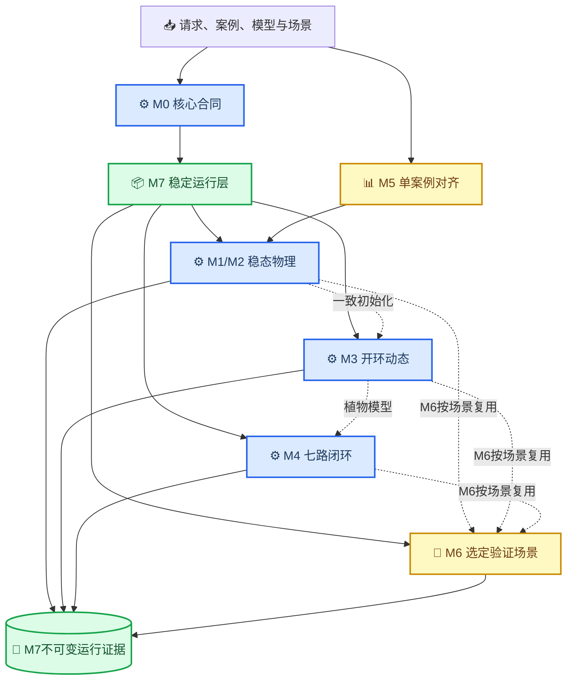

# CDU Mini Loop 机理模型综合说明

_版本：V1.0 · 更新日期：2026-08-19 · 本文是已完成机理模型 M0～M7.2 的现行技术主入口；实施进度与授权边界以 [STATUS](../STATUS.md) 为准。_

---

## 📋 文档定位

本文整合原 M0～M7 实施方案、M3～M7专项口径、M7模型卡、数据字典、使用说明和发布清单，统一说明当前 CDU Mini Loop 的模型目的、方程层级、数据来源、控制边界、验证证据、运行接口和禁止用途。

原有文档的主体技术内容已完整移入 [`archive/`](archive/) 作为历史设计和验收证据；只修复了搬迁后失效的相对链接，并把当前不存在的历史交付路径改为非点击式记录。出现表述差异时，按以下优先级处理：

1. 可运行源码、版本化配置、自动测试和正式产物
2. [STATUS](../STATUS.md) 中的最新事实和授权范围
3. 本综合说明
4. `archive/` 中的阶段历史文档

当前模型已经完成 M0～M7、M7.1和M7.2，但仍是**缩减阶、确定性、低可信工程仿真模型**。它可作为后续 RTO 的离线评价后端，不是现场数字孪生、控制器整定工具、质量放行系统或安全系统。

### 快速事实

| 项目 | 当前事实 |
| --- | --- |
| 模型对象 | 300 万吨/年常压原油蒸馏装置的 CDU Mini Loop |
| 基准案例 | `case_20260604`，新鲜原油进料 `407.3 t/h` |
| 稳态层 | M1设备链＋M2回流与热回收闭合 |
| 动态层 | M3集中参数开环动态，54维状态，事件感知RK4 |
| 控制层 | M4七路合成数字PI闭环 |
| 对齐层 | M5单案例净边界协调和两个切割温度校正 |
| 验证层 | M6适用域、工程包络、异常与保护逻辑验证 |
| 交付层 | M7统一Python API、CLI、严格运行证据和隔离打包能力 |
| 现行接口版本 | M7.2稀疏JSON和单命令预览确认接口 |
| 当前用途 | 离线分析、方向性比较、软件验证和RTO候选评价 |

## 🔗 系统边界与总体架构

CDU Mini Loop 把工艺物理、动态状态、基础控制、数据对齐、工程验证和运行交付分层实现。上层调用方只能通过稳定运行合同使用模型，不能直接依赖内部设备类或控制器实现。



M7根据 `run_type` 直接分派到M2、M3、M4或两个便携M6预设。普通M2/M3/M4运行不会隐式执行完整M6验证，其 `domain_status` 通常为 `not_applicable`；需要的RTO适用域和业务约束必须由上层评价方案显式检查。

### 软件模块

| 模块 | 主要职责 | 代码位置 |
| --- | --- | --- |
| 核心合同 | 单位、版本、配置、流股、守恒和数值工具 | `src/petroleum_rto/cdu/core/` |
| 物性与设备 | 七组分物性、传热、分离和质量代理 | `properties/`、`equipment/` |
| 稳态流程 | 开环设备链、回流撕裂和热回收闭合 | `flowsheet/` |
| 开环动态 | 状态、初始化、执行机构、传感器和RK4 | `dynamics/` |
| 合成闭环 | PI、回路组装、场景、性能和结果契约 | `control/` |
| 数据对齐 | 观测目录、协调、校正和正式产物 | `calibration/` |
| 工程验证 | 适用域、灵敏度、保护、场景和证据 | `validation/` |
| 稳定运行 | 请求、预览、执行、读写、批恢复和CLI | `runtime/` |

### 明确不属于机理模型的职责

- 理解自然语言优化目标或业务优先级
- 决定哪些变量允许RTO优化
- 搜索最优候选或对多个候选进行业务排序
- 把策略发布到DCS、SIS或其他现场系统
- 把合成质量代理解释为真实产品化验结果

这些职责由未来的垂域模型、确定性问题构造器、RTO、统一评价器和策略库承担，现行边界见[RTO系统综合说明](../rto/01_RTO系统综合说明.md)。

## 📚 工艺与数据基础

### 工艺主链

模型覆盖以下缩减流程：

`新鲜原油＋注水 → 预热 → 脱盐 → 再预热 → 闪蒸 → 常压炉 → 常压塔 → 塔顶冷凝/回流＋侧线产品＋渣油`

主要产品边界包括汽油、煤油、轻柴油、重柴油和渣油；内部回流、塔顶循环和三路循环取热不作为装置净产品。工艺背景、资料清单和数据可信度详见[常压蒸馏工艺及数据分析](01_常压蒸馏工艺及数据分析.md)。

### 七组分表示

原油使用六个低可信烃类伪组分和水：

| 组分 | 代表范围 | 当前可信度 |
| --- | --- | --- |
| `light_ends` | 轻端 | 低 |
| `naphtha` | 石脑油范围 | 低 |
| `kerosene` | 煤油范围 | 低 |
| `light_diesel` | 轻柴油范围 | 低 |
| `heavy_diesel` | 重柴油范围 | 低 |
| `residue` | 重端/渣油 | 低 |
| `water` | 水相 | 中等物性初值 |

盐作为独立示踪量保存，不并入主体质量分数。现有原油化验时间错位且馏程不完整，M5没有重新拟合六伪组分，因此产品质量只能作为方向性代理。

### 基准工况

| 变量 | 基础案例值 | M5有效覆盖/说明 |
| --- | ---: | --- |
| 新鲜原油进料 | `407.3 t/h` | 保持基准上下文 |
| 原油入口温度 | `35 ℃` | 低可信案例输入 |
| 闪蒸温度 | `220 ℃` | M5覆盖为 `200.6 ℃` |
| 炉出口温度 | `355.2 ℃` | 当前RTO候选设定值基准 |
| 塔顶温度 | `113.5 ℃` | M4有控制回路，M2当前不形成有效决策响应 |
| 塔顶压力 | `0.051 MPa(g)` | 模型内部转为绝压 |
| 回流比 | `0.45` | M2直接输入，当前无对应M4高层目标回路 |
| 洗水比 | `0.04` | M5覆盖为 `0.0465407262` |

基础案例是工程建模输入，不等于全部字段已由现场校验。DCS压力在输入边界按表压解释并只转换一次为绝压。

### 工艺边界候选

当前资料可支持的操作约束候选包括炉出口温度 `350～370 ℃`、塔顶温度 `95～115 ℃`、塔顶压力 `0.03～0.10 MPa`。原工艺卡没有确认该压力的基准；当前case仅把DCS点暂按表压转换。以上数值进入RTO约束目录前仍需记录版本、压力基准、适用产品方案和现场确认状态。

## ⚙️ M0～M2 稳态模型

### M0核心合同

M0统一内部SI单位，并冻结模型、参数集、配置、案例和场景的独立版本。核心对象包括 `MaterialStream`、`UnitResult`、`EquipmentState`、`ControlSignals`、`SimulationResult` 和 `BalanceReport`。

以下输入在求解前拒绝：未知字段、错误单位、非有限值、负流量、组成不闭合和错误版本组合。相同规范输入必须产生相同输入指纹。

### M1设备链

M1实现等效预热器、电脱盐器、平滑闪蒸、常压炉、缩减阶常压塔、塔顶冷凝和产品分离。每台设备输出流股、诊断和局部守恒；全流程输出五产品、热负荷和质量方向性代理。

模型不包含完整塔板水力学、严格热力学相平衡、真实换热网络或设备几何，因此M1结果用于结构和方向性验证，不代表现场稳态精度。

### M2回流与热回收闭合

M2把塔顶冷凝油按回流比拆分为汽油产品和内部回流，采用欠松弛撕裂迭代闭合回流流量、组成和温度；三路循环取热被缩减为等效回收热，并反馈至原油预热和常压炉燃料负荷。

每次有效稳态结果必须同时满足：

- 回流迭代收敛
- 新鲜进料与全部净出口总质量闭合
- 各组分和盐守恒
- 流量、温度、压力和产品组成有限且非负
- 失败时保存迭代次数、残差、原因和最后有效状态

M2是后续RTO大量候选的首要评价层。现有正式性能基线中，M2单次执行中位约 `0.170 s`，不包含artifact写出。

## ⏱️ M3 开环动态模型

M3从已收敛且守恒的M2稳态解一致初始化，建立54维集中参数状态，包括三个液体库存、塔顶气相库存、炉/塔/换热热状态、执行机构和传感器一阶状态。固定名义输出网格由事件感知RK4积分；非网格事件按左极限积分、右连续命令执行，未来命令不得提前影响状态。

### 动态物理边界

- 闪蒸罐、回流罐、塔底和塔顶气相保存显式质量库存
- 三条侧线为代数采出，不虚构容器库存
- 塔顶绝压由气相组分库存、绝对温度和固定气相体积推导
- 炉温、预热、塔温、冷凝和循环取热采用局部一阶动态
- 11个执行量只受显式命令事件驱动，不存在隐藏液位或压力控制
- 模型只声明物料、组分和盐的瞬时/累计守恒，不声明全装置瞬态热量守恒

### 主要数值门禁

| 验收项 | 当前门槛 |
| --- | --- |
| 初始导数 | `max(abs(rhs(0,x0,u0))) <= 1e-6` |
| 基准保持 | `4 h`、`dt=1 s`，名义非零状态最大相对漂移 `<=1e-6` |
| 累计守恒 | 归一化残差 `<=1e-6` |
| 局部方向性 | 11个命令各自 `±5%` 单因素响应方向正确 |
| 步长敏感性 | `1 s` 与 `0.5 s`：全程 `<=0.5%`、终点 `<=0.2%` |
| 失败隔离 | 非有限、负库存、非正绝压或守恒失败立即停止并保留端点 |

M3适合诊断植物响应方向、时间常数和未来模型替换回归；它不是每个RTO候选都必须执行的主筛选层。

## 🎛️ M4 合成PI闭环

M4在M3植物外增加七路独立数字PI、设定值斜坡、幅值/变化率限制、抗积分饱和、手自动无扰切换和炉温流量前馈。PI状态不写回M3的54维植物状态。

### 回路与操纵量所有权

| 回路 | 被控量 | 唯一操纵量 |
| --- | --- | --- |
| `feed_flow` | 新鲜进料实际流量 | `fresh_feed_flow_kg_s` |
| `flash_inventory` | 闪蒸罐库存代理 | `flash_liquid_outflow_kg_s` |
| `furnace_temperature` | 炉出口温度 | `furnace_fuel_duty_w` |
| `top_pressure` | 塔顶绝压 | `top_gas_vent_kg_s` |
| `reflux_inventory` | 回流罐库存代理 | `gasoline_draw_kg_s` |
| `bottom_inventory` | 塔底库存代理 | `residue_draw_kg_s` |
| `top_temperature` | 塔顶温度 | `pump_around_1_duty_w` |

回流量、冷凝负荷、第二和第三循环取热在M4中保持独立名义设定。所谓“液位”是`当前质量库存/名义质量库存`，不是几何液位；PI输出是流量或热负荷命令，不是真实阀位。

### 闭环验收

M4标准场景为7200 s，在600 s把进料设定值提高5%。成功结果必须通过植物执行、植物守恒、自动投入无冲击、基准保持、七路性能和真实库存安全。

| 验收项 | 当前门槛 |
| --- | --- |
| 库存安全 | 三个真实库存比全程 `0.8～1.2` |
| 连续饱和 | 任一幅值或速率饱和 `<=300 s` |
| 尾窗 | 最后600 s无饱和，平均绝对归一误差 `<=0.2%` |
| 温压与库存恢复 | 在版本化恢复时限内进入 `±0.5%` 带并驻留 |
| 重复性 | 相同输入结果字典逐项相同 |

这些阈值是合成局部验收口径，不是现场PI整定或设备安全限值。

## 📊 M5 数据协调与基准校正

M5只处理一套弱时间对齐现场资料。原始文件保持只读，观测目录保存数值、单位、时间、来源定位、SHA-256、可信度和用途；协调值、模型先验和模型预测分别标源。

### 固定处理链

`只读原始资料 → 观测目录 → 净边界协调 → 派生案例 → 两参数M2校正 → 正式证据套件`

装置净边界为：

`fresh_feed + wash_water = gasoline + kerosene + light_diesel + heavy_diesel + residue + offgas + aqueous + brine`

塔顶回流、顶循和泵循环明确排除。未可靠测得的 `offgas`、`aqueous` 和 `brine` 使用宽松M2潜变量先验，不能标成现场测量。

### 校正白名单

M5只校正常压塔第三和第四切割温度：

| 参数 | 基础值 | M5值 |
| --- | ---: | ---: |
| `column.cut_points_k[2]` | `583.15 K` | `571.7046875 K` |
| `column.cut_points_k[3]` | `638.15 K` | `647.9546875 K` |

正式结果只声明 `case_alignment_only`。六伪组分、炉效率、热损失、动态时间常数和控制参数没有因M5而升级可信度。

## 🧪 M6 验证、适用域与保护

M6根据输入是否被当前方程真实表示，将请求路由到M2、M3、M4、M6监督逻辑或求解前结构拒绝。场景执行状态与验证结论分开保存。

| 场景状态 | 含义 |
| --- | --- |
| `passed` | 直接表示且求解、守恒和预期逻辑通过 |
| `limited` | 使用代理、异常包络或存在未量化来源 |
| `rejected` | 未知、不支持、越出受限域或输入非法 |
| `failed` | 本可执行，但求解、守恒或结果契约失败 |

22维验证输入中的代表性正常域包括进料负荷 `0.95～1.05`名义比、进料温度 `±5 K`、稳态回流 `±5%`和三路循环取热 `±5%`。燃料热值和动态回流只以代理表示；汽提蒸汽和动态进料含水脉冲没有独立方程，必须求解前拒绝。

M6保护状态机验证延迟、回差、锁存、复位、优先级和PI手动跟踪，但全部阈值和动作都是合成验证包络，不代表现场SIS。局部不确定区间由固定Jacobian和工程输入半宽传播，只能称为工程包络，不是统计置信区间。

## 📦 M7 稳定运行与证据

### 运行类型与状态

| `run_type` | 模型层 | 用途 |
| --- | --- | --- |
| `steady_recycle` | M2 | 稳态候选评价 |
| `open_loop_dynamic` | M3 | 开环动态诊断 |
| `closed_loop_dynamic` | M4 | 闭环动态复核 |
| `validation_scenario` | M6 | 选定验证或结构拒绝 |

公共状态固定为 `success`、`limited`、`rejected`、`not_converged` 和 `failed`。`result.json`顶层保存 `engine_status`，`manifest.json`另保存并交叉核对 `domain_status`，避免一个状态同时承担执行和适用域两种含义；业务可行性仍由模型外评价器判定。

### 稳定接口

现有公共Python入口包括：

```python
from pathlib import Path

from petroleum_rto.cdu.runtime import load_preset, preview, read_run, run

request = load_preset("steady-baseline")
resolved = preview(request)
record = run(
    request,
    output_root=Path("runs"),
    expected_preview_fingerprint=resolved.preview_fingerprint,
)
result = read_run(record.run_dir)
```

默认无自定义字段的固定预设可直接运行；自定义请求必须先预览并确认相同指纹。预览只解析有效模型、案例、场景和指纹，不调用M2/M3/M4求解器。M7.2稀疏JSON只写关心的字段，其余继承preset；前三个模型preset可受控覆盖工况、两个切割点、动态参数、三个库存初态比例和M3/M4事件，但不接受任意路径、原始54维状态或PI整定注入。路径穿越和固定preset之外的请求由M7合同拒绝。

CLI提供 `presets`、`inputs`、`template`、`preview`、`run`、`batch` 和 `inspect`。当前接口是Python API＋CLI＋文件证据边界，不是HTTP服务，也没有Redis或消息队列。历史隔离打包和仓库外干净安装已经验证，但当前工作树不含可直接读取的 `dist/m7-2-final/` 候选。

### 固定预设

| 预设 | 运行层 | 说明 |
| --- | --- | --- |
| `steady-baseline` | M2 | 有效基准稳态 |
| `open-loop-feed-step` | M3 | 2 h进料 `+5%` 开环 |
| `closed-loop-feed-step` | M4 | 2 h进料SP `+5%` 闭环 |
| `m6-abnormal-pump-trip` | M6 | 循环泵停运受限验证 |
| `m6-structural-rejection` | M6 | 汽提蒸汽结构拒绝 |

两个M6 preset只便携复现一个包内异常场景和一个求解前结构拒绝，不会重跑完整22场景source-closed验证矩阵，也不接受custom输入。

### 运行证据

每次运行目录使用manifest-last语义，典型文件包括：

```text
runs/<run_id>/
├── request.json
├── inputs/*.json
├── result.json
├── timeseries.jsonl
├── events.jsonl
├── error.json
└── manifest.json
```

`manifest.json`最后发布；缺少manifest、存在暂存文件、文件数量漂移或哈希不一致时，严格reader拒绝读取。运行清单保存请求、结果、有效输入、包内资源、版本、环境和安装源码树指纹。批处理顺序执行、单项失败隔离、证据不覆盖并支持恢复。

### 受控输入角色

M7白名单表示“运行接口能够解析并防错”，不等于M6工程适用域、RTO搜索域或现场安全域。普通 `preview/run` 接受输入也不会自动触发完整M6检查。进入RTO前必须由独立变量目录重新标注角色，并由问题构造器与评价器显式应用适用域和约束。

| 输入 | 当前模型能力 | 建议RTO角色 |
| --- | --- | --- |
| 新鲜原油进料负荷 | M2输入；M4有进料SP | `OperatingContext`，V1固定 |
| 炉出口温度目标 | M2输入；M4炉温SP | V1决策变量 |
| 塔顶压力目标 | M2输入；M4压力SP | V1决策变量 |
| 回流比 | M2直接输入 | 暂缓；当前没有M4高层目标回路 |
| 塔顶温度目标 | M4有SP | 暂缓；当前M2稳态方程不形成有效响应 |
| 三路循环取热 | M2/M3可写 | 暂缓；控制所有权和基准附近辨识度不足 |

RTO输出应使用绝对物理量。编译为M4比例时，温度必须先转K、表压必须先转绝压，不能直接用摄氏温度或表压相除。

## ✅ 已完成验证与性能证据

| 阶段 | 当前状态 | 主要完成证据 |
| --- | --- | --- |
| M0 | 已完成 | 核心合同、单位、守恒、版本和异常输入 |
| M1 | 已完成 | 设备链、产品结果和设备/全流程守恒 |
| M2 | 已完成 | 回流/热回收闭合、收敛与失败契约 |
| M3 | 已完成 | 54维动态、4 h保持、方向、步长和重复性 |
| M4 | 已完成 | 七路PI、2 h恢复、库存/饱和/守恒门禁 |
| M5 | 已完成 | 19条观测、净边界协调、两参数校正和正式套件 |
| M6 | 已完成 | 22维、22场景、11规则、双分析计划和正式证据 |
| M7.2 | 已完成 | 640项全仓库pytest、ruff、strict mypy、隔离包和干净安装 |

精确测试计数、哈希和历史失败/返修证据以[STATUS](../STATUS.md)为准。代表性性能见[执行性能基线](../../reports/cdu/M7_PERFORMANCE_BASELINE.md)和[Artifact I/O基线](../../reports/cdu/M7_ARTIFACT_IO_BASELINE.md)：

| 场景 | 执行中位数 | 说明 |
| --- | ---: | --- |
| M2稳态 | `0.170 s` | 不含artifact I/O |
| M3 2 h动态 | `136.639 s` | 7201样本 |
| M4 2 h闭环 | `143.770 s` | 7201样本 |
| M6泵停运 | `22.627 s` | 601样本 |

这些数值绑定原M7基础候选和记录环境，不是跨机器SLA；M7.1/M7.2没有把它们改写成新源码性能报告。

## 🚫 适用范围与禁止用途

### 允许用途

- 离线教学、工艺关系讨论和软件测试
- 名义点附近的方向性、敏感性和候选相对比较
- 守恒、控制逻辑、异常路径和接口契约验证
- 生成带版本、来源和限制标签的合成样本
- 作为V1 RTO的离线、确定性候选评价后端

### 禁止用途

- 现场闭环控制或自动下发设定值
- DCS、SIS、联锁、报警或安全完整性设计/验证
- 产品质量保证、化验替代、放行或操作许可
- 确认真实阀门行程、设备极限、几何液位或现场保护定值
- 把M5单案例结果外推为其他原油、季节、负荷或设备状态的已验证精度
- 删除 `limited/rejected/failed` 标签后把结果解释成普通成功

后续替换为HYSYS模型时，必须通过独立 `SimulatorPort` 适配器接入，不能让RTO和策略库依赖当前Python模型内部对象。

## 🔍 运行与维护指引

### 常用入口

```bash
cdu-mini presets
cdu-mini inputs --preset steady-baseline
cdu-mini template --preset steady-baseline --output request.json
cdu-mini run --request request.json --output runs
cdu-mini inspect runs/<run_id>
```

普通 `run --request` 会显示合并后的完整输入并请求人工确认；非交互调用必须显式传入预览指纹。旧运行目录的 `inputs/` 是证据副本，不能编辑后重算。

### 维护规则

- 机理模型内部修改必须保持M0～M7既有契约和冻结回归，除非新里程碑明确升级版本
- 新RTO变量不能直接从M7输入白名单推导，必须进入版本化 `DecisionVariableCatalog`
- 新KPI先确认模型输出语义、单位、方向和可信度，再进入评价器
- 模型、案例、控制、场景或评价器版本变化后，既有策略必须重新验证
- 每次运行和每条策略都必须能回溯到请求、有效输入、模型版本和证据指纹

## 🔗 历史来源与关联材料

以下历史文档保留原始细节，但不再作为主入口：

| 归档文件 | 原职责 |
| --- | --- |
| [M0～M7实施方案](archive/01_CDU_Mini_Loop实施方案.md) | 原阶段路线与完成门槛 |
| [M3动态口径](archive/02_M3_动态模型假设与验收口径.md) | 动态状态、守恒和数值门禁 |
| [M4控制口径](archive/03_M4_PI控制假设与验收口径.md) | 七路PI、事件和闭环验收 |
| [M5校正口径](archive/04_M5_数据协调与基准校正口径.md) | 数据协调、参数白名单和来源 |
| [M6验证口径](archive/05_M6_验证不确定度与适用域口径.md) | 适用域、保护和工程包络 |
| [M7封装口径](archive/06_M7_封装与可复现交付口径.md) | 运行合同、证据和发布门禁 |
| [M7数据字典](archive/M7_DATA_DICTIONARY.md) | 字段级请求、结果和manifest说明 |
| [M7模型卡](archive/M7_MODEL_CARD.md) | 发布身份、能力和禁止用途 |
| [M7发布清单](archive/M7_RELEASE_CHECKLIST.md) | 历史发布签署证据 |
| [M7使用说明](archive/M7_USAGE.md) | 完整CLI、API、构建和排错说明 |

现行后续材料：

- [RTO历史方案与冻结记录](../rto/archive/README.md)
- [RTO解耦设计讨论稿](../rto/archive/07_RTO策略库与机理仿真解耦设计讨论稿.docx)
- [当前实施状态](../STATUS.md)
