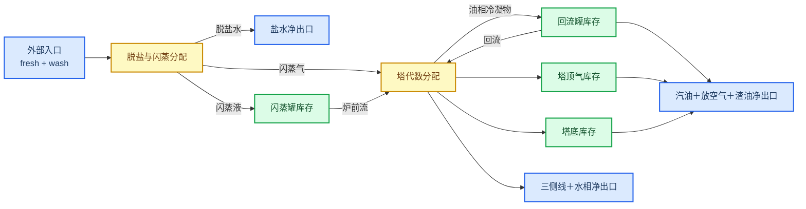

# M3 动态模型假设与验收口径

_本文仅约束 CDU Mini Loop 的 M3 开环动态模型；以 M2 收敛稳态解为名义点，不引入闭环控制、优化或现场保护声明。实施边界见 [M0～M7 实施方案](./01_CDU_Mini_Loop实施方案.md)。_

---

## 📋 范围与配置结论

M3 的交付对象是“稳态一致初始化＋固定名义输出网格的 RK4＋开环命令时间表＋动态守恒诊断”。现有单一模型配置已足够，`dynamic` 必须严格且仅包含下列 11 个正数字段。

| 用途 | 字段 | 当前值 |
| --- | --- | ---: |
| 默认积分步长 | `default_time_step_s` | 1 s |
| 热动态 | `furnace_time_constant_s` | 120 s |
| 热动态 | `preheater_time_constant_s` | 90 s |
| 冷凝油气分配动态 | `condenser_time_constant_s` | 60 s |
| 塔温动态 | `tower_temperature_time_constant_s` | 300 s |
| 执行机构动态 | `actuator_time_constant_s` | 8 s |
| 传感器动态 | `sensor_time_constant_s` | 15 s |
| 闪蒸罐库存 | `flash_residence_time_s` | 600 s |
| 回流罐库存 | `reflux_drum_residence_time_s` | 900 s |
| 塔底库存 | `tower_bottom_residence_time_s` | 1200 s |
| 塔顶气相库存 | `top_gas_volume_m3` | 500 m³ |

场景层必须显式传入时长和步长；基准保持场景为 4 h、1 s。`default_time_step_s` 是为配置兼容保留的名义参考值，M3 当前入口不会在场景缺失步长时自动回退到该字段。不再增加独立的 M3 配置块：

- 时间常数和库存尺度只取自上表；其余尚不可由单个 M2 点辨识的响应系数，作为源码中的具名低可信工程初值单独披露，不伪装成已标定配置参数。
- 状态有效性由非负库存、正温度、正绝压和现有设备上限定义，不把任意的名义倍率写成现场安全边界。
- 验收阈值是软件测试口径，不是待标定的工艺参数，因此留在本文和测试中。

当前必须披露的局部响应工程初值如下。它们只用于约 `±5%` 的局部扰动，决定响应幅度但不能由现有 M2 单点数据识别，也不构成现场动态精度声明。

| 源码常量 | 当前值 | 含义与置信度 |
| --- | ---: | --- |
| `CONDENSER_LOGIT_COOLING_SENSITIVITY` | 1.00 | 相对冷凝负荷偏差对油气分配 logit 的灵敏度；低可信工程初值 |
| `TOWER_TOP_FURNACE_TEMPERATURE_GAIN` | 0.20 K/K | 炉温偏差到塔顶温度平衡点的增益；低可信工程初值 |
| `KEROSENE_FURNACE_TEMPERATURE_GAIN` | 0.35 K/K | 炉温偏差到煤油侧线温度平衡点的增益；低可信工程初值 |
| `LIGHT_DIESEL_FURNACE_TEMPERATURE_GAIN` | 0.50 K/K | 炉温偏差到轻柴油侧线温度平衡点的增益；低可信工程初值 |
| `HEAVY_DIESEL_FURNACE_TEMPERATURE_GAIN` | 0.65 K/K | 炉温偏差到重柴油侧线温度平衡点的增益；低可信工程初值 |

后续只有取得时间对齐的输入—响应数据后，才能把这些初值升级为可校准、带不确定度和版本来源的正式参数；M3 当前只通过守恒、方向性和数值一致性验证它们。

场景步长定义名义输出网格。若 step 或 pulse 的起止时刻不落在该网格上，积分器必须在事件边界确定性拆分子步：到达不连续点的前一子步使用命令左极限，不连续点样本及后续子步使用右连续命令；每个拆分后的 RK4 子步内部保持固定步长。诊断必须分别报告名义步数和实际积分子步数，不能让未来命令提前影响事件前状态。

## 🎯 名义点与零导数初始化

初始化只接受“已收敛且已通过 M2 全边界守恒门禁”的结果。初始状态按下列规则构造：

- 闪蒸罐、回流罐和塔底的各组分库存，由名义出口流量×停留时间×名义出口组成得到。
- 盐单独作为示踪量初始化，不并入主体质量；回流罐的盐初值和导数均为零。
- 塔顶气各组分库存同时满足 M2 名义气相组成和理想气体绝压关系。
- 热状态、执行机构实际值和传感器测量值分别等于 M2 名义值、基准命令和名义真值。

设初始状态为 `x0`、基准命令为 `u0`，则初始化的硬门禁为 `max(abs(rhs(0, x0, u0))) <= 1e-6`。任一前置失败、状态非法或初始导数超阈值都必须拒绝仿真，不能以后续积分“消化”初始偏差。

## 🔗 物料网络与全边界守恒

对每个主体组分 `k`，四个显式库存——闪蒸罐、回流罐、塔底和塔顶气——必须满足：

`dΣM_k/dt = fresh_k + wash_k - brine_k - aqueous_k - gasoline_k - vent_k - kerosene_k - light_diesel_k - heavy_diesel_k - residue_k`

对所有主体组分求和得到总质量守恒。盐的独立边界为：

`d(S_flash + S_bottom)/dt = S_fresh + S_wash - S_brine - S_residue`

其中闪蒸罐出料、油相冷凝物、回流和塔底入料都是内部流，只能在局部方程中出现，在净边界中恰好抵消一次。所有有库存的出口必须使用当前库存组成，不得继续使用 M2 名义组成。盐只能按“新鲜料→盐水”或“新鲜料→闪蒸罐→塔底→渣油”流动。

## ⚙️ 压力、冷凝与热动态假设

### 绝压

模型内部的所有压力均为绝压。塔顶压力不另外作为可独立漂移的物理状态，而由气相各组分库存、绝对温度和固定气相体积推导：

`P_abs = R * T_gas / V_gas * Σ(m_k / MW_k)`

压力传感器对该真值做一阶滞后。表压资料只能在案例输入边界完成向绝压的一次转换，不得在动态方程中重复加减大气压。

### 冷凝分配

冷凝负荷只在每个组分的“油相＋气相”合计份额内改变气相占比，两者份额之和不变；水仍按模型定义进入水相，盐不进入塔顶。名义冷凝负荷必须精确返回 M2 油气分配；增大冷凝负荷时，气相份额不得增大。

### 局部热动态

M3 仅对炉出口温度、预热负荷、塔顶/侧线温度和冷凝/循环取热效应作集总一阶动态核算，基本形式为 `dx/dt = (x_equilibrium(u) - x) / tau`。塔温对炉温偏差正向响应，对对应循环取热偏差反向响应。

现有状态没有覆盖各容器完整焓库存，因此 M3 只能声明上述局部动态关系和方向性，不能声明全装置瞬态热量守恒。内部热回收不得在 M2 已约束的炉前预热目标之外再追加一次。

## 📈 相对名义点边界与方向性

M3 的标准方向性试验每次只改变一个命令，对非零名义命令使用 `u_test = u0 * (1 ± 5%)`。这是局部试验域，不是现场操作界限。相对偏差和步长比较都使用 M2 名义值归一化；名义值为零的坐标使用对应绝对守恒容差。

| 单一正阶跃 | 首个必须满足的响应方向 |
| --- | --- |
| 新鲜进料流量增大，其他采出不变 | 闪蒸罐总库存增大 |
| 闪蒸罐出料增大 | 闪蒸罐总库存减小 |
| 汽油采出或回流增大 | 回流罐总库存减小 |
| 渣油采出增大 | 塔底总库存减小 |
| 塔顶放空增大 | 塔顶气库存和绝压减小 |
| 炉燃料负荷增大 | 炉出口温度升高 |
| 冷凝负荷增大 | 气相份额和塔顶绝压不增大 |
| 某循环取热负荷增大 | 对应塔温降低 |

执行机构命令、实际值、流量和负荷不得为负；温度和绝压必须为正；炉前流量必须为正才能求解炉温；炉平衡温度和当前炉温均不得超过现有 `furnace.maximum_outlet_temperature_k`。当前 CDU 动态方程只施加一阶执行机构滞后，不施加无来源的行程或变化率上限；高于名义值的有限非负命令不得静默夹到某个名义倍率。通用执行机构模块虽能表达行程、速率和失效位置，但只有取得可追溯的设备资料并进入版本化参数后，才可把这些限制接入具体设备。

汽油、煤油、轻柴油、重柴油和渣油必须输出当前逐组分流率，以及由该组成派生的低可信质量代理。它们只是观察输出，不是 M3 库存或传感器状态，也不能反写流量、分配份额、状态导数或执行机构命令。

## 🚫 无隐藏控制与失败语义

- 仿真输入只来自基准命令和显式命令事件。压力、液位、温度或质量代理值不能在 M3 中自动改写任何命令。
- 进出料长期不匹配导致的库存或压力漂移是正确的开环语义；不得添加隐式液位、压力或物料平衡器使状态自动回到名义点。
- 配置、场景、M2 前置或初始化非法时，在积分前拒绝。
- 所有结果必须强制标识为合成仿真数据，并保留场景名称、版本和用途；任何调用方都不能将该标识改写为现场数据。
- 任一已接受步的状态/输出非有限、组分或盐质量为负、液体或气体总库存非正、温度/绝压非正、炉前流量非正或炉温超上限时，仿真立即失败。
- 任一积分阶段的总质量、逐组分或盐瞬时残差超过模型配置容差，或者完整轨迹的累计守恒超过本文件门槛时，仿真结果必须标记为失败，不能只记录诊断后仍返回成功。
- 失败结果必须标识失败时刻、原因和最后有效状态，不得将部分轨迹标识为成功，也不得用裁剪后的状态继续运行。

## ✅ M3 首版验收门槛

| 验收项 | 可自动判定的通过口径 |
| --- | --- |
| 初始化 | M2 结果成功且全边界守恒；`max(abs(rhs(0, x0, u0))) <= 1e-6` |
| 零漂移 | 基准命令运行 4 h、`dt = 1 s`；所有名义非零状态的最大相对漂移 `<= 1e-6` |
| 名义零坐标 | 仍为零，或其绝对偏差不超过“对应守恒流率容差×仿真时长” |
| 瞬时动态守恒 | 每次诊断的总质量、组分和盐残差分别不超过现有 `mass_tolerance_kg_s`、`component_tolerance_kg_s` 和 `salt_tolerance_kg_s` |
| 累计动态守恒 | `abs(库存变化 - 累计净边界流入) / max(累计外部流入, 1 kg) <= 1e-6`；每个主体组分同样检查，盐单独检查 |
| 方向性 | 按上表执行单命令 `±5%` 阶跃；执行机构先按命令方向响应，相关真值在首个特征时间内呈现预期符号，全程连续、有限且不触发失败 |
| 无隐藏控制 | 新鲜进料 `+5%` 且净采出不变时，总库存必须按累计净流入增长，不得自动回到初值 |
| 步长敏感性 | 对同一场景比较 `dt = 1 s` 与 `dt = 0.5 s`；共同时刻的关键状态最大归一化差异 `<= 0.5%`，终点归一化差异 `<= 0.2%` |
| 重复性 | 相同 M2 结果、配置、初值、场景和步长的两次运行，状态时间序列、状态码、诊断和输入指纹逐项相同 |
| 失败隔离 | 任一硬边界被破坏时返回失败而非成功，且保留失败原因、失败时刻与最后有效状态 |

步长对比的关键状态至少包括三个液体总库存、塔顶绝压、炉出口温度、塔顶温度和三个侧线温度。上述阈值只证明数值一致性、内部守恒和定义内的方向性，不构成现场动态精度声明。
