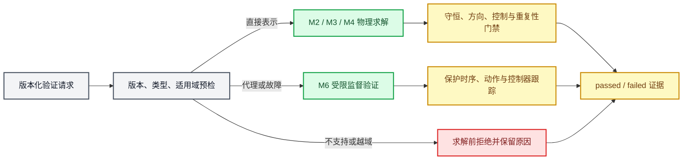

# M6 验证、不确定度与适用域口径

_本文只约束 CDU Mini Loop 的 M6 工程验证层。M6 复用已经验收的 M2 稳态、M3 动态、M4 合成 PI 闭环和 M5 单案例对齐结果，但不修改其结果语义，也不把模型保护逻辑解释为现场 SIS。总体范围见 [M0～M7 实施方案](./01_CDU_Mini_Loop实施方案.md)，M5 数据边界见 [M5 数据协调与基准校正口径](./04_M5_数据协调与基准校正口径.md)。_

---

## 📋 交付声明与范围

M6 的交付对象是可复现的工程验证证据，而不是新的现场精度声明。一次有效 M6 运行必须同时说明：验证了什么、用哪一层模型验证、输入是否位于适用域、是否使用代理、结果为何通过/受限/拒绝/失败，以及哪些不确定性仍未量化。

- 顶层结果强制标记 `synthetic=true`、`data_origin=M6_synthetic_validation` 和 `claim_scope=engineering_validation_only`。
- M5 结果仍只有 `case_alignment_only`；弱时间对齐、低可信伪组分和单案例两参数校正不能升级成跨原油或动态现场验证。
- M6 仿真保护只验证模型内的延迟、回差、锁存、复位和控制器跟踪逻辑，不使用现场联锁定值，不声称复刻、设计或验证现场 SIS。
- M6 不原地修改 M0～M5 基线 JSON 或正式产物。M5 的审计型参数文件不是 `ModelConfig`，必须通过受控覆盖层重建有效输入并单独记录 M5 文件哈希和 pipeline 指纹。
- 现场观测、M2/M3/M4 预测和 M6 派生验证证据必须分节标源，不能用一个全局现场标识覆盖模型结果。

## 🧱 分层执行与状态语义

M6 不把所有输入强行塞入同一个求解器，而是按当前方程是否真实表示该输入选择执行层：

| 执行层 | 允许用途 | 结果边界 |
| --- | --- | --- |
| M2 稳态 | 组成、进料温度、回流、循环取热、案例/参数单因素 | 必须收敛并通过全流程及逐设备守恒 |
| M3 开环动态 | 11 个既有执行量的阶跃/脉冲、方向和异常响应 | 必须保留事件因果性、瞬时/累计守恒和失败端点 |
| M4 闭环动态 | 基准、进料 `+5%/-5%`、控制恢复和饱和 | 成功仍须满足 M4 七路全自动固定门禁 |
| M6 监督逻辑 | 偏置、冻结、健康标志、阀卡、泵停运、保护动作与跟踪 | 独立 M6 结果；不能伪装成 M4 `success` |
| 结构性拒绝 | 当前模型没有对应输入或物理关系 | 求解前 `rejected`，保留原因且证明未调用模型 |

场景执行状态和验证结论分开保存：

- `passed`：输入由当前模型直接表示，求解、守恒和预期方向/逻辑全部通过。
- `limited`：使用明确代理、逻辑注入、异常验证包络或存在未量化来源；结果可作工程验证，但不是正常预测。
- `rejected`：输入未知、非有限、超出受限域、组成非法，或当前模型结构没有该输入。
- `failed`：输入本可执行，但求解、守恒、方向、保护时序或结果契约失败。
- `verification_outcome` 单独记录预期状态是否实现；例如汽提蒸汽场景应是 `scenario_status=rejected` 且 `verification_outcome=passed`，不能把诚实拒绝误写成模型失败。

## 🧪 验证矩阵与单因素映射

每项能力声明必须关联至少一个自动测试、版本化场景或冻结运行证据。首版单因素映射固定如下：

| 因素 | 当前映射 | 表示级别 | 首版正常域 |
| --- | --- | --- | --- |
| 进料负荷 | 稳态进料流量；动态 `fresh_feed_flow_kg_s` 或进料回路 SP | 直接 | 名义 `0.95～1.05` |
| 原油轻重端 | `naphtha` 与 `residue` 之间等质量分数转移，水、盐及其余组分不变 | 直接但低可信 | 轻重端位移 `-0.02～0.02` |
| 进料温度 | `CaseConfig.feed.temperature_k` | 直接 | 名义 `±5 K` |
| 燃料热值 | 可用炉燃料功率比例 | 代理 | 代理值 `0.95～1.05`；一经请求至少 `limited` |
| 冷却能力 | 冷凝器可用冷却功率/命令比例 | 动态代理 | `0.95～1.05` |
| 汽提蒸汽 | 无独立物流、能量或分离方程 | 不支持 | 始终预检拒绝 |
| 回流 | M2 回流比；动态回流流量仅作局部代理 | 稳态直接、动态代理 | 名义 `±5%` |
| 三路循环取热 | 三个 `pump_around_*_duty_w` 独立比例 | 直接 | 名义 `±5%` |

轻重端位移只是一维工程对比，不是重新拟合六伪组分。位移后总组成必须严格为 1，`water`、盐流率和其他四个烃类分数不变；任一组分为负时在求解前拒绝。

正常场景库至少包括进料 `+5%/-5%`、轻质化/重质化、进料温度升降、可用燃料功率下降、冷却能力下降、回流和三路循环取热单因素。异常场景库至少登记含水脉冲、进料骤降、循环泵停运、燃料饱和、传感器偏置/冻结和阀门卡涩。当前不支持时必须保留 `rejected` 或 `limited` 证据，不能删除场景或返回无标识正常结果。

## 🛡️ 仿真保护状态机

保护状态机是纯函数式、版本化的 M6 监督层。输入包括数值信号、独立的 `valid/healthy/stale` 质量标志和显式复位请求；非有限数不得写入 M3 `DynamicState` 冒充测量失效。

每条规则按以下状态推进：

`normal → pending_trip → active → pending_clear → latched_clear → normal`

- 高限在信号达到 `trip` 后开始计时，动作后只有低于 `clear` 才开始清除；低限相反。
- 待触发期间条件短暂消失必须取消计时；触发计时保存首次连续满足条件的绝对时刻，避免步长累计误差。
- 非锁存规则在清除条件连续满足后恢复；锁存规则即使条件清除仍保持动作，只有安全条件成立且收到新的显式复位请求才复位。
- 不安全复位产生 `reset_rejected` 事件，不能排队等待以后自动复位。
- 同一时刻事件按 `priority → rule_id → event_kind` 稳定排序；相同输入重复运行必须逐项相同。
- 保护、故障和控制优先级固定为：故障约束高于保护动作，保护动作高于普通 PI 请求。

首版低可信合成阈值仅用于行为验证：

| 规则 | 触发/清除 | 延迟 | 合成动作与跟踪 |
| --- | --- | ---: | --- |
| 低炉前流量 | 名义比 `0.75/0.80` | `10 s` | 炉温回路手动跟踪到低燃料边界 |
| 高炉出口温度 | `638.15/635.15 K` | `10 s` | 燃料降至合成低边界 |
| 高塔顶压力 | 名义比 `1.05/1.03` | `15 s` | 放空升至合成高边界 |
| 三库存高 | 名义比 `1.18/1.15` | `30 s` | 对应采出提高 |
| 三库存低 | 名义比 `0.82/0.85` | `30 s` | 对应采出降低 |
| 循环泵停运 | 健康标志失效 | `2 s` | 限制负荷并跟踪相关回路 |
| 测量失效 | 独立有效性标志失效 | `5 s` | 对应回路手动保持最后有效命令 |

这些数值不是现场液位、阀位、报警或联锁定值。库存信号仍是质量库存/名义库存代理，不是几何液位。

控制器跟踪验证复用 M4 `NormalizedPIController` 的手自动接口：动作时手动输出取保护后命令，积分项跟踪最终受限输出；安全复位切回自动时首个输出必须在数值容差内连续。该轨迹保存为 M6 保护证据，不改变 M4“成功结果七路全程自动”的契约。

## 📐 适用域、越域距离与拒绝

每个维度保存参考值、正常域、受限域、单位、输入层、直接/代理/不支持表示、来源、可信度和假设。正常域必须包含参考值并被受限域包含。

参考点分侧归一化距离定义为：

`d_ref = |x - x_ref| / |x_normal_boundary - x_ref|`

正常域内越域距离为 0；正常域外、受限域内按对应侧的正常边界到受限边界归一化；超出受限边界时越域距离大于 1。总体距离取各维最大值，并保留主导维度和逐维原因。

- 所有直接输入位于正常域：`passed`。
- 任一输入位于受限域、使用代理、运行异常验证包络或存在未量化来源：`limited`。
- 非有限、未知、超出受限/物理边界、组成非法或请求不支持变量：`rejected`，且必须发生在求解前。
- 输入可执行但数值求解、守恒或结果契约失败：`failed`。

## 📊 局部灵敏度与工程区间传播

M6 灵敏度固定参考点、输入顺序、输出顺序和差分步长。中央差分为：

`J[j,i] = (y_j(x_i + h_i) - y_j(x_i - h_i)) / (2 h_i)`

每个正负评价都独立执行适用域、求解、守恒、有限性和非负性门禁；一个评价失败不能覆盖其他有效结果，失败阶段、输入和指纹必须保留。

稳态输出至少覆盖五产品质量流量和收率、炉燃料负荷、实际回收热负荷及现有产品质量代理；选定动态输出至少覆盖最大炉温、最大塔顶压力、三库存最大偏差、最终偏差和响应/恢复指标。

M5 的参数搜索上下界和正则尺度不是统计置信区间。M6 若采用它们，只能标记为 `engineering_parameter_envelope`。闪蒸温度和洗水比的现有误差只是显示/抄录分辨率传播，弱时间对齐误差仍未量化。

首版区间使用固定 Jacobian 的绝对灵敏度和：

`R_j = numerical_margin_j + Σ_i |J[j,i]| r_i`

`output_interval_j = [y0_j - R_j, y0_j + R_j]`

其中 `r_i` 是输入区间相对同一参考点的最大半宽。不同区间比较时必须保持相同分析基准、参考点、Jacobian、余量方法和输出集合；新输入区间逐维包含旧区间时，每个输出下界不得升高、上界不得降低、宽度不得缩小。不同基准指纹的区间禁止作单调性比较。

该结果只能称为“局部一阶工程包络”，不是概率置信区间，也不是对非线性全域的严格包络。参数相关性、交互项、原油结构误差和现场时序误差必须进入 `unquantified_sources`，使顶层结论保持 `limited`。

## 🧾 结果、事件与来源契约

一次 M6 结果至少保存：

- 软件、模型、基础参数、M5派生参数、基础案例、M5派生案例、控制、场景和M6配置版本；
- M5正式manifest、gold、参数文件及pipeline指纹，以及有效模型/案例/目录对象指纹；
- 适用域逐维状态、总体距离、原因和是否在求解前拒绝；
- 每个场景的请求值、执行层、场景状态、预期状态、验证结论、底层状态、守恒与方向/逻辑证据；
- 灵敏度参考值、步长、有量纲/归一化矩阵、每次评价状态与指纹；
- 输入区间、输出工程包络、未量化来源和单调性验证；
- 保护事件的序号、时刻、规则、前后状态、条件、动作、复位结论、控制器模式和跟踪输出；
- 失败阶段、原因、失败时刻和最后有效证据，且失败结果不能覆盖有效结果。

来源至少分为 `source_traced_field_observation_catalog`、`M2_steady_model_prediction`、`M3_open_loop_simulation`、`M4_closed_loop_simulation` 和 `M6_synthetic_validation`。M6 派生导数和区间即使使用 M2 输出，也必须标为 M6 合成验证并记录上游预测来源。

## ✅ M6 首版完成门槛

| 验收项 | 通过口径 |
| --- | --- |
| 能力矩阵 | 每项正式能力声明都有自动测试、版本化场景或冻结运行证据；未表示能力明确不声明 |
| 状态 | 所有场景具有确定的 `passed/limited/rejected/failed` 和独立验证结论 |
| 守恒与失败 | 直接物理运行沿用M2～M4守恒门禁；失败保留原因、阶段、时刻和最后有效结果 |
| 方向与响应 | 正常单因素和选定异常的预期方向、响应与控制恢复有自动证据 |
| 保护时序 | 触发延迟、短脉冲取消、回差、锁存、安全/不安全复位和稳定事件排序均有反例 |
| 控制器跟踪 | 保护手动跟踪最终命令，安全复位回自动时输出无跳变；不伪装成M4成功 |
| 适用域 | 正常边界、刚越正常域、刚越受限域、未知/不支持输入及非法组成均有求解前反例 |
| 不确定度 | 固定参考Jacobian，区间扩大或可信度降低时每个输出区间不缩小；不同基准禁止比较 |
| 重复性 | 相同全部输入的场景、保护时间线、灵敏度、区间和序列化结果逐项相同 |
| 可信度 | 顶层只声明工程合成验证；燃料热值代理、汽提蒸汽缺口、M5单案例和保护非SIS边界完整披露 |

任何版本/指纹漂移、M5套件失效、输入越域、结构不支持、求解不收敛、守恒失败、保护抖动、区间反向缩小或来源混淆都必须形成明确拒绝/失败结果，不能返回无标识正常结果。
