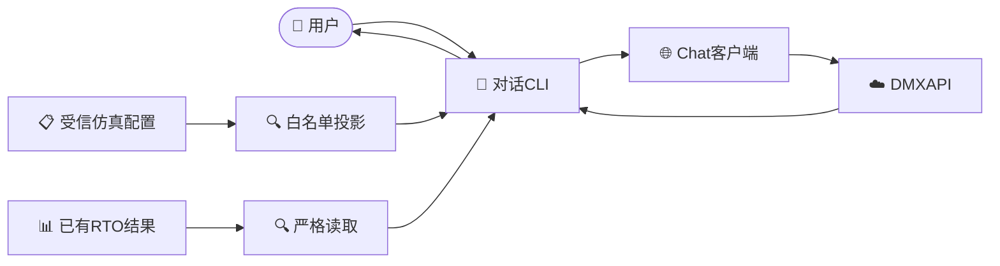

# 源码区 DMX 对话工具

_本说明只描述当前源码工作区中的内存对话、仿真基准工况解释和既有离线 RTO 结果解释。_

---

## 📋 当前定位

当前人机入口由本地设置、受保护密钥、最小 Chat 客户端和组合 CLI 构成。它是开发源码区工具，不是正式安装产品，也不是 RTO 执行入口。



普通消息不会发现或评测模型、调用工具、生成严格 RTO 意图、启动 RTO，或持久化会话。当前源码中没有供应商 profile、模型发现、质量评测、多协议路由、会话证据或意图运行时。

## ⚙️ 配置与启动

| 文件 | 当前职责 | 是否进入 Git |
| --- | --- | --- |
| [`chat_settings.py`](../../src/petroleum_rto/domain_model/chat_settings.py) | Chat 地址、模型 ID、系统提示词 | 是 |
| `src/petroleum_rto/domain_model/dmx_api.json` | 本地 DMXAPI 密钥 | 否 |

密钥文件可以是一行密钥，也可以是只含 `api_key` 的 JSON 对象。读取器只接受不向组或其他用户开放权限的普通文件，并拒绝符号链接、宽松权限、重复键、超限内容和读取期间发生的长度变化。密钥不得进入设置、命令行、消息、摘要或错误输出。

源码工作区启动方式：

```bash
env PYTHONPATH=src .venv/bin/python -m petroleum_rto.domain_model
```

`rto-chat` 是同一 CLI 的脚本入口；当前不围绕它建设安装、发布或用户级配置体系。

## 💬 会话与只读入口

普通文本进入同一进程内的内存会话。只有成功的用户/模型轮次会写入历史；`/clear` 清除历史并保留配置的系统提示词。

| 命令 | 作用 |
| --- | --- |
| `/result <run-dir或result.json>` | 严格读取既有统一 RTO 运行并解释安全摘要 |
| `/clear` | 清空当前内存会话 |
| `/help` | 显示帮助 |
| `/exit` | 退出 |

当前没有 `/status`。当普通自然语言明确询问当前 CDU 仿真工况、进料、炉温、塔顶压力、库存、运行模式或仿真状态时，CLI 才读取固定的受信 `OperatingContext`，把白名单数据作为模型上下文，并只显示模型整理后的自然语言回答；不会先向用户输出原始 JSON。这里的识别只决定是否补充工况上下文，不负责解释整轮业务意图，因此“状态查询＋优化目标”这类复合原句会完整交给模型。一般工艺、控制原理和 RTO 原理问题仍是普通对话。

## 🔐 网络与凭据边界

Chat 请求只发送显式模型 ID 和 `role/content` 消息。当前限制为：

- 消息历史最多 64 条、128 KiB
- 序列化请求最多 256 KiB
- 原始响应和解析后响应分别最多 128 KiB
- 45 秒同步超时，不自动重试、不回退、不流式展示
- 禁止重定向和环境代理，验证 TLS 证书
- 活动密钥及其常见编码不得出现在消息 payload 或供应商响应正文中
- 失败或超限轮次不改变会话历史

这些校验只保护真实的文件、网络、凭据和不可信响应边界，不引入通用传输层或供应商框架。

## 📊 RTO 结果解释

`/result` 只接受统一 RTO 严格 reader 能够重载的已有运行。CLI 先显示本地确定性结果，再向模型发送最小摘要：

- 最终优化状态
- 选中设定值及规范单位
- 目标基准值、候选值和改善量
- 已验证约束状态与离线发布条件

摘要不包含运行上下文、原油与初态、求解器、公式、内部路径、引用、指纹、原始证据、未选候选、策略 payload 或凭据。模型只解释摘要；模型失败也不影响本地结果显示。对话提示不再主动重复数据来源、验证范围或控制权限说明，用户明确询问时再回答。

## 🔗 与严格意图协议的关系

[垂域模型与统一 RTO 通信协议](../rto/02_垂域模型与RTO通信协议.md)是未来垂域模型生成严格 `OptimizationIntent` 时必须经过的不可信输入边界。它定义安全能力投影、请求关联、完整响应、有界修复、确定性澄清和仅 `resolved` 可交接等规则。

普通 Chat 回复不是 `OptimizationIntent`，不得进入 `ProblemBuilder`。当前没有 Chat 到严格意图的转换，也没有自动 RTO；两条路径只共享长期安全边界，不共享运行时。复合请求可以得到真实工况解释和目标理解，但模型必须把优化表述为尚未执行的下一步，不能把“开始调整”说成已经运行 RTO 或改变了设定值。

## 🚫 当前不包含

- 正式安装产品或用户级配置系统
- 会话持久化、模型发现、质量评测、多协议路由或 RAG
- Web 界面、HTTP 服务、数据库、队列或常驻进程
- 自动意图生成、RTO 执行、策略审批、发布或现场下装
- DCS、Historian 或实时现场数据

当前授权、验证结果和下一步以[项目实施状态](../STATUS.md)为准。
