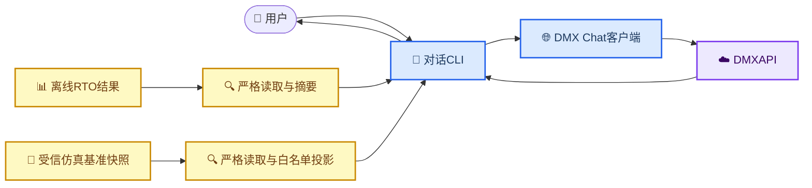

# DMX垂域模型与对话入口

_当前说明只覆盖已授权的最小能力：DMX多轮对话、可见模型回复、仿真基准工况查询和离线RTO结果解释。_

---

## 📋 当前设计

普通使用路径只有四个部件：可编辑设置、本地密钥、Chat客户端和组合CLI。模型调用遵循DMXAPI的`/v1/chat/completions`示例，请求只包含`model`与`messages`，鉴权头为`Authorization: <sk>`。[^1]



当前普通对话不使用模型发现、逐模型审批、质量评测、多协议路由、会话数据库或工具调用。旧的供应商profile与评测实现暂时保留为兼容代码，但不再是当前Chat入口的配置来源，也不应继续扩展。

## ⚙️ 配置位置

| 文件 | 用户需要修改的内容 | 是否进入Git |
| --- | --- | --- |
| [`chat_settings.py`](../../src/petroleum_rto/domain_model/chat_settings.py) | `DMX_CHAT_URL`、`DMX_CHAT_MODEL`、`DMX_SYSTEM_PROMPT` | 是 |
| `src/petroleum_rto/domain_model/dmx_api.json` | DMXAPI密钥 | 否 |

当前默认模型是`deepseek-v4-flash-0731`。如果以后切换到同一Chat接口下的Kimi，只改`DMX_CHAT_MODEL`；只有供应商明确要求不同地址时才改`DMX_CHAT_URL`，不需要增加审批或评测字段。

密钥文件可以保存一行SK，也兼容以下形式：

```json
{
  "api_key": "sk-请替换为本地密钥"
}
```

该文件必须保持Git忽略并限制为当前用户读写。SK不得写入`chat_settings.py`、命令行参数、对话历史、RTO摘要、日志或运行证据。

## 🚀 对话CLI

在当前源码工作区中，使用已经验证的命令启动：

```bash
env PYTHONPATH=src .venv/bin/python -m petroleum_rto.domain_model
```

如果已经把项目安装到当前虚拟环境，两个命令名进入同一个最小界面：

```bash
rto-intent
# 或
rto-chat
```

会话只保存在当前进程内，普通输入会持续追加到`messages`，因此可以多轮追问。工况查询不需要命令，用户直接用自然语言提问即可；其他显式操作命令包括：

| 命令 | 作用 |
| --- | --- |
| `/result <run-dir或result.json>` | 严格读取一个已存在的离线RTO运行，显示设定值并让模型解释 |
| `/clear` | 清除当前内存对话 |
| `/help` | 显示命令说明 |
| `/exit` | 退出；文件结束符也会退出 |

示例：

```text
你> 解释一下常压蒸馏RTO在做什么
模型> ...

你> /result runs/rto/offline-rto-v2-c69e0e46572af52f
已载入离线RTO结果：2个设定值，3个目标
模型> 根据这次离线工程仿真结果……

你> 这两个设定值分别代表什么？
模型> ...
```

模型响应直接显示给用户；一期不做流式输出、聊天记录落盘、自动恢复或Web界面。

## 🔒 RTO结果边界

当前实现以前只有“自然语言意图→RTO”，没有“RTO结果→模型→用户”的反向路径。新CLI通过用户显式执行`/result`补齐该回路，但不会自动启动RTO。

当用户自然语言询问当前常压装置工况、仿真运行状态、进料、炉温、塔顶压力、设定值、库存或运行模式时，CLI会自动识别查询意图，严格读取`configs/rto/contexts/case_20260604.json`并生成白名单摘要。摘要只包含模式、进料、两个当前设定值、初始库存比、数据时间、数据质量和离线声明；模型根据原问题解释相关数据，后续追问仍沿用同一内存会话。

这里的“当前”是**当前配置的仿真基准工况**，不是现场实时状态。CDU/RTO是按需执行的离线程序，不是后台常驻仿真服务；工况查询本身不运行新仿真。摘要会明确标记`on_demand_offline`、`idle`、`live_plant_data=false`和`engineering_simulation_only`。未来若接入HYSYS、DCS或Historian，只替换受信状态来源，不应让模型自行猜测。

RTO侧先使用现有严格reader检查运行产物，再只生成下列摘要：

- 最终优化状态
- 选中设定值、数值与规范单位
- 目标的基准值、候选值和改善量
- 已验证约束的通过状态
- 是否满足离线发布条件
- `engineering_simulation_only`、`field_validated=false`和`control_authority=none`

以下内容不会通过`/result`交给模型；自然语言工况查询只允许前述单独的白名单投影：

- `OperatingContext`、当前工况、进料、原油与初始状态
- 求解器、公式、内部路径、引用和指纹
- 原始仿真证据、未选候选、Pareto全集和策略payload
- API密钥、请求头或其他凭据

模型只负责解释本地确定的摘要，不能修改数值、批准策略、运行仿真或下装设定值。CLI同时直接显示设定值，因此即使模型解释失败，用户仍能看到RTO的确定性结果。

## 🧩 与严格意图合同的关系

RTO侧的[`OptimizationIntent`通信协议](../rto/02_垂域模型与RTO通信协议.md)继续保留，因为它负责保证只有合法、已解析的业务意图才能进入`ProblemBuilder`。本轮简化的是供应商调用和人机界面，不把自然语言直接交给求解器，也不放宽RTO合同。

普通聊天回答不是`OptimizationIntent`，不能直接触发优化。自动把对话转换为意图、自动运行RTO或把新结果主动推送给模型，都属于后续功能，只有用户明确要求时再增加。

## 📍 当前状态

- 本地SK和默认DeepSeek模型已配置
- `deepseek-v4-flash-0731`已通过一轮真实“你好”联网冒烟并返回正常中文回复
- D2.2真实联动已完成：模型拒绝猜测当前工况，本地RTO完成30次M2和4次M4，授权后的`/result`解释及实时状态区分追问均通过
- D2.3已删除专用工况命令：自然语言工况、进料、炉温、塔顶压力、库存和仿真状态问句自动读取安全快照；真实普通问句联调已完成，模型正确解释数值和非实时边界
- 当前虚拟环境尚未生成`rto-chat`/`rto-intent`入口脚本，源码启动命令已验证可用
- 本次RTO由独立统一CLI启动，Chat没有自动运行求解或仿真；全程未审批、发布或现场下装

完整命令、用户可见模型原文、RTO数值和证据见[D2.2 DeepSeek与RTO真实联动测试报告](../../reports/domain_model/D2_2_DEEPSEEK_RTO_LINKAGE_REPORT.md)。

实时授权、验证和未执行项以[`docs/STATUS.md`](../STATUS.md)为准。

## 🔗 参考

[^1]: DMXAPI. “统一请求与模型范围.” https://doc.dmxapi.cn/fanwei.html
