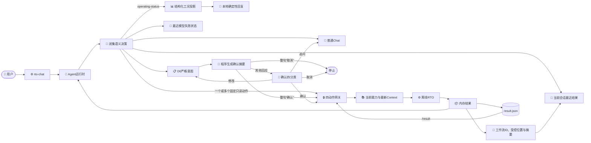

# 源码区领域Agent

_更新日期：2026-09-03 · 本文描述当前源码区的内存对话、LLM闭集语义路由、D0严格意图、程序生成确认摘要、离线RTO和轻量结果解释。_

## 当前定位

当前入口由本地设置、受保护密钥、最小DMX客户端、严格意图适配器、D0通信服务、Agent运行时、四动作工具网关和薄CLI组成。它是开发源码区工具，不是现场控制系统。



模型负责理解不同说法，但不能自由选择工具。普通语义决策可在一个`routes`数组中选择`chat`、`capabilities`、`operating-status`、`assistant-status`、`last-result`、`optimization`和`unsupported-action`中的一个或多个不重复需求。待确认时，整句“确认”或“取消”先由本地程序直接处理，只有其余表达才要求模型在`confirm`、`revise`、`cancel`和`question`中恰选一个。当前外层`AssistantTurnDecision`合同版本为`3.0.0`，所有模型输出都经过严格合同校验。

`routes`只表示语义需求，不是工具调用计划。代码拒绝未知route、重复route和冲突组合，再把通过的只读需求映射到固定动作；模型无法输出工具名或任意路径。`optimization`即使与只读需求并存，也只能携带一份完整D0响应并保存一份Intent，该轮不执行RTO。外层合同不再接收模型生成的确认文字。

`operating-status`仍由模型完成闭集语义路由，但路由后的工况回复已与Chat分离：运行时读取固定动作返回的结构化投影，校验状态、模式、进料、设定值、时间和数据质量后，由本地函数确定性地生成简洁中文回复。正常成功路径没有第二次DMX润色，该投影也不写入普通Chat历史。

## 配置与启动

| 文件 | 当前职责 | 是否进入Git |
| --- | --- | --- |
| [`chat_settings.py`](../../src/petroleum_rto/domain_model/chat_settings.py) | Chat地址、模型ID和系统提示词 | 是 |
| `src/petroleum_rto/domain_model/dmx_api.json` | 本地DMXAPI密钥 | 否 |

密钥文件可以是一行密钥，也可以是只含`api_key`的JSON对象。读取器拒绝符号链接、宽松权限、重复键、超限内容和读取期间变化；密钥不得进入设置、命令行、消息、摘要或错误输出。

源码工作区启动：

```bash
env PYTHONPATH=src .venv/bin/python -m petroleum_rto.domain_model
```

`rto-chat`是同一CLI的脚本入口。

## 交互方式

用户可直接用自然语言：

- 提问一般工艺或RTO知识；
- 询问当前合成工况；
- 追问助手或最近一次模型调用为什么失败；
- 追问当前会话最近一次完成的优化结果；
- 询问可以优化哪些目标和变量；
- 提出单目标或多目标优化需求；
- 对待确认任务表示确认、修改、取消或追问。

不同措辞由模型做语义理解，不要求出现固定关键词。错别字、漏字或多字、同音或形近写法、业务简称、近义词和口语表达也采用同一条模型语义路径，不建立本地错词字典或字符串特例。同一条消息有多个独立问题时，模型返回多个闭集route，受信代码再组合固定只读动作和回复。

如果用户只说“帮我优化”或日常语义的“生成一条优化策略”而没有具体目标，系统不会猜测目标或直接说不支持，而是列出当前可用目标、可调变量和一条可照着说的示例。用户给出具体目标并要求设定值或方案时，日常语义的“策略”可进入离线优化；正式策略创建、审批、发布、下装和现场控制仍不在Agent动作中，界面会引导到可提供的离线建议。

### 命令快捷方式

| 命令 | 作用 |
| --- | --- |
| `/capabilities` | 读取安全能力投影，不调用求解器 |
| `/confirm` | 确认当前自然语言优化请求并开始一次离线计算 |
| `/result <结果编号、目录或result.json>` | 轻量读取简洁结果并解释；结果编号即`workflow_id` |
| `/cancel` | 取消当前澄清或待确认任务 |
| `/clear` | 清空内存对话和待处理状态 |
| `/help` | 显示帮助 |
| `/exit` | 退出 |

`/confirm`不需要复制任何内部标识。没有待确认任务时不会运行。未知斜杠命令不会退化为自由工具调用。

## 从优化需求到确认

优化请求的同一次模型响应包含闭集路由和完整D0响应，不包含确认文字。模型先结合整句与当前能力目录规范化用户表达：唯一合理映射进入严格意图，多个合理映射进入有限澄清；没有给出任何目标的泛化请求进入能力引导。严格意图通过后，程序使用能力目录中的业务名称确定性生成确认摘要，说明本次目标及优先级、允许调整的变量、推荐与其他候选的数量，以及确认后才读取当前配置离线工况。这使用户能在计算前纠正系统理解，同时不显示内部引用、哈希、文件、算法、求解标志或权限套话。

首次请求即使以“开始吧”“就算吧”结尾，也只是发起一项新的优化需求，不能被当成对尚不存在任务的确认。系统仍先展示规范化意图，下一轮确认后才计算。

用户依次提出多个目标、但没有明确说明同等重要、顺序不确定或互相冲突时，模型按提及顺序形成一份建议优先级，程序在确认摘要中复述，用户仍可修改。确实存在优先级歧义时，界面使用能力目录中的中文业务名：双目标只询问哪个是第一优先，所选目标成为`priority=1`、另一个唯一成为第二优先；三个及以上目标要求完整排序。界面编号只用于选择，送回D0的值仍是已发布`metric_id`。

D0继续校验：

- 目标、方向、优先级和决策变量属于当前发布能力；
- 选择方法、目标顺序和结果请求相互一致；
- 响应与当前请求关联；
- 不含受信Context、自由公式、任意阈值、内部路径或求解器选择；
- 未知字段、错误类型、重复键和非有限数均被拒绝。

合同错误可进行一次完整替代修复；已知业务歧义会询问有限选项。只有`resolved_intent`可进入待确认状态。

存在待确认任务时，系统先检查整句是否严格等于“确认”或“取消”。命中后由本地代码直接开始计算或清除任务，不调用模型。带标点的“确认？”、“开始算吧”等其他确认说法，以及提问、犹豫、修改或混合表达不会走本地直达，而是进入小范围模型分类：

- 未被本地直接处理、但明确同意的表达进入`confirm`；
- “把能耗改成第一优先”“不要调压力”等进入`revise`并生成新的完整意图；
- “这会调整哪些变量”等进入`question`，回答后继续等待确认；
- “取消”进入`cancel`并删除任务。

确认四分类只发送已展示摘要和当前用户话语，不重复发送完整能力目录、原始优化请求或D0输出合同。若分类为`revise`，才另用Intent模式基于原Intent生成并严格校验一份完整替代；新意图成功前原方案保持不变。分类或修改生成出现结构解码失败时，系统明确说明本次没有开始计算、原方案仍保留，并重新展示原摘要；供应商调用失败时也会说明原方案仍保留。

确认摘要由程序生成，只用于人机核对。实际执行使用已经通过D0校验的结构化意图，摘要不能覆盖该意图。`max_candidates=N`表示推荐方案和其他候选合计最多N个；要求备选时，摘要写为1个推荐加最多N-1个其他候选。

## 确认后的工作逻辑

意图解析阶段不读取工况、不构造Problem。用户确认后：

1. 待确认状态先被消费；
2. 系统加载当前RTO能力，并重新验证结构化意图是否仍受支持；
3. 系统从固定受信来源读取一次最新`OperatingContext`；
4. `ProblemBuilder`只构造一次不可变`OptimizationProblem`；
5. 若同一问题已有完成结果，只读取其简洁`result.json`；否则同一Problem进入离线workflow，模型不能改变算法、预算或门禁；
6. 新计算从内存运行记录立即生成简洁结果，已有计算直接复用该结果。

由于Problem在确认时才生成，确认前的正常工况波动不会触发旧问题哈希失效。若能力发生了不兼容变化，系统在创建运行前返回简洁错误。

## 结果回执、后续追问与`/result`

确认计算完成后，RTO返回一份受信`OptimizationRunReceipt`：

- `workflow_id`：形如`offline-rto-<16位十六进制指纹>`的确定性工作流标识；
- `result_source`：严格等于`<workflow_id>/result.json`的受控相对位置；
- `result_summary`：七部分结果摘要。

`result_summary`直接从内存生成，包含：

- 状态`status`
- 优化目标`targets`
- 工况摘要`operating_context`
- 基准值`baseline_values`
- 推荐调整`recommended_adjustments`
- 预测效果`predicted_effects`
- 其他候选`alternative_candidates`

运行时先把整份回执保存为当前会话的“最近结果”，再把`result_summary`交给模型组织简洁自然语言回复。同一份七字段摘要写入格式化`result.json`；磁盘文件不包含回执外层的ID、位置或`result_summary`键。这条完成路径不会为答复重新读取文件、重复校验哈希、重放物理证据或比较策略副本。

`alternative_candidates`始终存在，可为空；它按最终全局`rank`升序列出未选中的候选，不重复顶层推荐。每项包含调整、预测效果、`verification_stage`和`verification_status`。M2表示只完成稳态评价，M4表示已有动态复核；这类备选只是同次计算的其他设定点组合，不是正式策略。

用户后续说“为什么这样设置，还能调什么”时，模型可同时选择`last-result`和`capabilities`。运行时用当前会话回执中的受信摘要解释前半问，用固定能力投影回答后半问，不依赖模型“记住”上轮文字。

结果的自然语言组织仍使用Chat：`/result`使用“结果解读”阶段，刚完成的运行使用“优化结果解读”阶段；待确认任务中的业务追问同样使用Chat，阶段为“确认问题解答”。

`/result`可读取裸`workflow_id`、受控`<workflow_id>/result.json`、用户显式指定的运行目录或结果文件。前两种引用只在固定`runs/rto`根下解析。读取只检查真实普通文件、UTF-8 JSON、重复键、非有限数和七个顶层字段，不读取manifest、内部阶段文件、仿真证据或策略库。当前offline workflow版本为`4.0.0`；当前reader不兼容旧v3六字段结果。成功读取后，该摘要成为当前会话新的最近结果，可直接继续自然语言追问。开发者需要诊断内部workflow时，应在普通对话之外显式使用`rto-offline inspect`。

普通run不会自动创建策略草案，也不会调用策略审批或发布。Agent没有这些动作。

## 网络与会话边界

普通Chat和语义/D0调用使用同一个有界客户端，但不共享普通Chat历史。D0请求不含完整`OperatingContext`、求解器、公式、门禁或内部路径。常规与Intent提示按任务、输出、路由、优化理解、严格意图和修复分段组织；确认模式另用短提示和只有四个路由值的小合同。

当前底层传输边界包括：

- 消息历史最多64条、128 KiB；
- 序列化请求最多256 KiB；
- 原始响应和解析后响应分别最多128 KiB；
- 单次HTTP调用45秒同步超时，客户端自身不循环重试；
- 禁止重定向和环境代理，验证TLS证书；
- 活动密钥及常见编码不得出现在payload或响应中；
- 失败或超限轮次不修改普通Chat历史。

供应商已返回内容但外层JSON或结构无效时，语义入口允许一次不回显原始响应的完整替代。第二次仍无效时，运行时在内部记录准确阶段和“响应合同错误”分类，但面向用户展示当前目标、变量和请求示例，不输出“意图解析失败”。如果已有待确认方案，则明确说明方案仍保留且没有开始计算。与结构替代分开，语义与D0入口遇到可重试的传输失败或供应商`5xx`时最多立即重试一次；`429`限流不立即重试，其他失败按稳定分类停止。普通Chat不使用这次运行时重试；任何失败都不会创建新的待确认意图或调用领域工具。

普通Chat、结果解读和确认问题解答捕获`DmxChatError`时，运行时保留安全的`code`、`retryable`、`http_status`及对应阶段，不保存供应商正文。若HTTP已成功返回200，但原始正文、JSON或解析后内容未通过本地校验，失败仍保留`http_status=200`；后续状态追问因此可准确说明“服务已响应，本地解析失败”，不将它误报为连接或供应商服务失败。

运行时还保存最近一份安全结构化模型失败，包含回答后续追问所需的准确阶段和上述安全分类元数据，不保存供应商响应正文、凭据或底层异常文本。用户追问时，模型只把问题路由为`assistant-status`，随后由受信代码读取该状态作答；不会调用工况工具，也不会用模拟器的`idle`状态猜测模型失败。该记录只能说明最近一次已知失败，不能证明当前服务已恢复。

进程内只保存有界普通Chat历史、最多一份澄清、最多一份待确认意图、当前会话最近一份受信结果回执和上述最近失败状态。进程退出或执行`/clear`后这些关联消失；已有RTO文件保留。系统不会扫描全局文件修改时间来猜测某用户重启前的“上一份”；用户可用明确的`workflow_id`通过`/result`重新读取，读取成功后即可在新会话继续追问。

## 当前不包含

- 正式安装产品或用户级配置系统；
- Web界面、HTTP服务、数据库、队列或常驻进程；
- 通用Planner、动态工具、RAG或跨进程任务；
- 独立仿真、自动策略治理、现场数据接入或下装；
- DCS、Historian、SIS、LIMS或HYSYS后端。

所有计算仍是合成工程仿真。问答界面不会在每一轮重复这项边界声明；当前授权、验证结果和下一步以[项目实施状态](../STATUS.md)为准。
