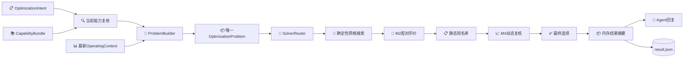

# RTO系统综合说明

> 当前Agent通过原生工具循环和`rto.runtime.staged`调用RTO；D0是独立公共合同，旧Assistant分类入口已移除。生产交互见[Agent说明](../domain_model/01_聚合式垂域模型综合说明.md)。

_更新日期：2026-09-03 · 本文说明当前离线RTO的职责、算法、评价、结果和独立证据边界；实时状态见[项目实施状态](../STATUS_REACT_REBUILD.md)。_

## 核心结论

当前RTO只有一套覆盖`1..N`目标的合同与执行链。目标数量只影响问题特征、确定性搜索路线和结果形状，不产生另一套API、workflow或策略模型。

四条边界保持不变：

1. `OptimizationIntent`表达业务目标，`OperatingContext`表达受信运行事实；模型回答不能成为运行事实。
2. `OptimizationProblem`冻结能力、政策、意图、工况和执行路线；业务意图不能指定算法。
3. 仿真证据描述物理计算，评价器解释证据；评价不得覆盖原始物理结果。
4. 物理可行、达到离线发布门槛、人工批准和现场可执行是不同判断。

所有目标值、候选关系和预测效果均来自合成工程仿真，不代表现场验证、产品放行、安全边界、实际收益或可直接下装的控制策略。

## 执行链

| 部件 | 当前职责 | 明确禁止 |
| --- | --- | --- |
| `IntentResolver` | 校验目标、方向、决策、偏好和返回请求 | 读取工况、选算法、调仿真 |
| `ProblemBuilder` | 用当前能力、意图和Context构造一次不可变问题 | 搜索候选、反向修改意图 |
| `SolverRouter` | 按问题已绑定路线核对算法ID、版本与支持声明 | 自由换算法、求解 |
| `SolverPort` | 提出候选并通过统一评价端口取得结果 | 解析自然语言、依赖CDU内部对象 |
| M2/M4评价器 | 提取KPI、重算约束、校验同上下文基准并分类失败 | 改写物理证据、抵消硬门禁 |
| 最终选择器 | 系统错误优先、硬门禁优先，再按偏好回退 | 把不可行包装成收益 |
| 结果投影器 | 从内存运行记录生成七部分用户结果，包括如实标记验证阶段的其他候选 | 回读文件、重建证据或把候选包装成策略 |
| 策略仓储 | 独立保存策略v3和追加生命周期 | 普通run自动创建、自动批准或现场下装 |

## 能力、Intent、Context与Problem

`CapabilityBundle`由`CapabilityCatalog`和`SystemPolicy`组成：前者定义可执行metric、objective、decision、guardrail和selector，后者定义硬门禁、预算、路线和评价政策。权威配置位于：

- [能力目录](../../configs/rto/capabilities/catalog.json)
- [系统政策](../../configs/rto/capabilities/system_policy.json)

统一Intent只包含已发布目标、方向、优先级、决策变量、选择偏好和结果请求；不包含进料、组成、当前设定值、初态、公式、自由阈值、内部路径或算法ID。当前未绑定的自由业务约束会明确拒绝，不会静默忽略。

[受信Context](../../configs/rto/contexts/case_20260604.json)独立保存模型与案例、运行模式、进料、组成、当前设定值、初态、时刻和数据质量。它不从用户话术或模型输出生成。

当前Agent先读取并保存受信工况，再在准备阶段加载能力、解析严格Intent并构造一次Problem。用户确认的是已展示版本和绑定快照；执行复用该Problem，确认时不换工况。修改业务要求或更新快照须重新准备、展示并确认。独立`run_confirmed_optimization`公共API仍面向受信调用方按其原合同一次读取并构造，不是当前终端装配路径。

## 当前优化算法

当前是确定性网格搜索，不是连续梯度优化或在线自学习：

| 问题特征 | 实现 | 搜索方式 | M2上限 | M4短名单 |
| --- | --- | --- | ---: | ---: |
| 1个目标 | `CoarseRefineGridSolver` | 粗网格后在优选区域局部细化 | 33 | 3 |
| 2至3个目标 | `FullGridParetoSolver` | 全网格评价后做精确非支配分层 | 81 | 5 |

`ExecutionRoute`是算法选择的唯一事实源。`SolverRouter`只核对问题绑定的路线、实现ID、版本和`supports(features)`；不在失败时尝试其他路线。多目标输出可包含Pareto候选，但最终仍只选择一个完成M4动态复核的候选作为推荐。`max_candidates`是推荐与其他候选合计的返回上限，不是备选数量；例如值为5时，最多返回1个推荐和4个其他候选。

当前高层决策只有炉出口温度目标和塔顶压力目标。输出是绝对、规范单位的稳态设定值向量，不输出阀位、燃料命令或控制轨迹。搜索边界是合成本地试验域，不是现场安全边界。

## 同上下文评价与失败语义

每个候选必须和同一Context基准配对。模型、案例、进料、组成、初态、资源、评价政策、时域和扰动计划保持一致，唯一允许变化的是候选决策向量及其编译动作。

评价顺序是：M2结构/收敛/守恒/数值检查 → M2硬门禁 → 静态偏好短名单 → 完整M4稳定性复核 → 回退选择 → 离线发布改善判断。

- 系统、资源、I/O或适配器错误不能归为工艺不可行；
- 有明确模型或约束证据时才可归为`process_infeasible`；
- 动态失败可按静态偏好回退；
- 短名单全部不通过只能得到`no_verified_candidate`，不能声称全域无解；
- 物理可行但改善不足得到`feasible_not_publishable`。

其他候选可能只经过M2，也可能已经进入M4；结果必须逐项记录实际`verification_stage`和`verification_status`。M2只代表稳态评价，不能写成已完成M4；进入M4但未通过的候选也不能描述为动态可行。只有最终选中的推荐同时具有可行的M2与M4证据。

## 内存结果与`result.json`

编排器返回`OfflineRtoRunRecord`后，`build_optimization_run_summary()`只访问内存中的Intent、Context、Problem、选中候选和评价对象，生成：

| 顶层字段 | 内容 |
| --- | --- |
| `status` | 最终优化状态 |
| `targets` | 目标名称、方向、优先级和单位 |
| `operating_context` | 运行模式、进料摘要、时刻和数据质量 |
| `baseline_values` | 各目标的同上下文基准值 |
| `recommended_adjustments` | 当前值、推荐值、调整量和单位 |
| `predicted_effects` | 预测值、方向性改善和相对改善 |
| `alternative_candidates` | 未选中候选的最终排序、调整、预测效果、M2/M4验证阶段和状态 |

`alternative_candidates`始终存在，可为空。它按最终全局`rank`升序排列，不重复顶层推荐；数量最多为`max_candidates - 1`。每项固定包含`rank`、`adjustments`、`predicted_effects`、`verification_stage`和`verification_status`。调整与预测效果来自该候选及其可行M2评价；只标为M2的候选状态必为`feasible`，已有M4评价时则如实记录`feasible`、`process_infeasible`、`invalid_request`、`evaluation_error`或`not_evaluated`。

同一七字段结构直接返回Agent并写为格式化`result.json`。完成路径不为了生成回复再读取文件、不重复校验manifest哈希、不重放物理证据、不比较策略副本。其他候选只是同一次离线计算的设定点组合，不是`StrategyEntry`、策略草案或已批准策略。

当前Agent的`/result [workflow_id]`严格重载指定运行的内部证据，再构造可读业务结果；当前进程已经完成的结果直接复用。外部结果路径不作为模型参数。

## 内部workflow与开发者检查

RTO仍保存内部阶段文件以支持恢复：请求、Intent、Context、能力快照、Problem、路线、静态求解、短名单、动态评价、最终选择、可选锚点、`workflow.json`、事件链、manifest和CDU证据。当前offline workflow合同版本为`4.0.0`，manifest版本为`offline-rto-manifest-4.0.0`。`result.json`是从内存生成的独立可读投影，不是内部manifest的一部分。

新鲜运行在提交内部workflow后直接返回内存记录；普通Agent不会随后重新读取内部workflow。七字段结果改变了严格公共合同，当前reader不兼容旧v3六字段结果。需要诊断当前版本内部文件时，开发者可显式调用`inspect_offline`或`rto-offline inspect`。该独立路径会检查当前合同、文件集、哈希、引用、事件和可重建结果，且不应启动新的物理仿真。

新鲜运行从内存生成结果；读取已有持久化运行时执行严格证据检查。这是不同数据来源的验证边界。

## 策略v3

普通`run_offline`和Agent确认运行都不创建策略草案、策略文件或策略库条目。策略必须由独立治理流程从已完成评价中显式构造。

当前`StrategyEntry`采用v3，恰有八个顶层字段：

1. `schema_version`
2. `strategy_id`
3. `revision`
4. `supersedes`
5. `adjustments`
6. `applicability`
7. `evidence`
8. `fingerprint`

`adjustments`只表达当前值到推荐值；`applicability`保存case、运行模式和已评价锚点；`evidence`只保留问题、最终选择和覆盖结果的最小引用。生命周期状态不重复写进payload，而由追加事件保存。

策略生命周期支持`draft → approved → published → pending_revalidation → superseded/retired`。草案创建、审核和发布都必须显式进行。点策略或离散锚点策略只在已验证锚点容差内查询，不对锚点间插值；任何状态都不赋予现场控制权。

## 当前限制

- 唯一真实仿真实现是CDU Mini Loop适配器；第二后端尚未证明可替换性。
- 当前只支持两个高层决策、最多三个已发布目标和固定M2/M4漏斗。
- 额外业务约束尚无受信参数绑定。
- 系统同步、单进程、离线运行；没有服务、数据库、在线调度或现场接口。
- point或有限采样锚点不能外推为连续现场适用域。

## 相关资料

- [RTO离线运行与策略库说明](04_RTO离线运行与策略库使用说明.md)
- [垂域模型与RTO通信协议](02_垂域模型与RTO通信协议.md)
- [源码区领域Agent](../domain_model/01_聚合式垂域模型综合说明.md)
- [CDU Mini Loop综合说明](../cdu/01_CDU_Mini_Loop机理模型综合说明.md)
- [目录与模块边界](../architecture/01_项目目录与模块边界.md)
- [项目实施状态](../STATUS_REACT_REBUILD.md)
