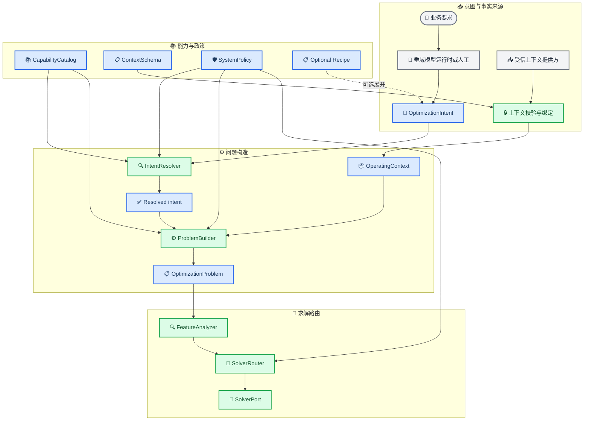

# RTO系统综合说明

_统一架构基线：1.3 · 更新日期：2026-08-21 · 本文是RTO职责、合同、评价和迁移门禁的现行主说明；实时进度以[项目实施状态](../STATUS.md)为准。_

---

## 📋 文档地位与核心结论

本文把既有单目标基线和多目标扩展收敛为一套目标数量无关的RTO设计。旧文档继续保留历史决策、精确政策值和验收证据，但不再用“V1等于单目标、V2等于多目标”组织未来架构。

| 问题 | 现行结论 |
| --- | --- |
| **优化目标由谁理解** | 用户或垂域模型生成结构化`OptimizationIntent`；机理模型不解释业务目标 |
| **单目标与多目标** | 共用同一意图和问题合同；`objectives`长度决定问题特征，不决定合同版本 |
| **运行事实来自哪里** | 进料、原油、当前设定值和初态来自受信`OperatingContext`，不由垂域模型生成 |
| **算法由谁选择** | `FeatureAnalyzer`提取问题特征，`SolverRouter`按系统政策选择`SolverPort`插件 |
| **机理模型接收什么** | 只接收编译后的M2参数或M4事件，并返回物理、动态和控制证据 |
| **RTO最终给出什么** | 经配对评价和动态复核的稳态高层设定值向量及证据引用 |
| **当前是否已切换** | 是；默认Python API、CLI、workflow和策略仓储已统一，历史V1/V2只以显式兼容名保留 |

> ⚠️ **声明边界：** 当前全部目标、约束、Pareto集合、策略效果和适用范围都只属于合成工程仿真，不代表现场验证、产品放行、安全边界、实际收益或可直接下装的控制策略。

## 🎯 系统职责与解耦边界

### 组件职责

| 组件 | 负责 | 不负责 |
| --- | --- | --- |
| **用户** | 提供业务表达和对确定性问题的澄清回答 | 直接构造内部仿真字段或绕过通信校验 |
| **聚合式垂域模型** | 只基于安全`DomainCapabilityManifest`生成完整候选`OptimizationIntent`，或返回白名单`unsupported` | 提供现场事实、编写KPI公式、指定算法、修改系统硬门禁 |
| **能力与政策层** | 发布原子能力、上下文字段、兼容规则、系统门禁和执行预算 | 理解自然语言、求解候选、修改仿真结果 |
| **IntentResolver** | 核对ID、方向和组合兼容性，返回结构化协商结果 | 注入上下文、猜测缺失语义、选择求解器 |
| **受信上下文提供方** | 提供进料、原油、模式、当前设定值、初态、时间和数据质量 | 改写业务目标或绕过意图校验 |
| **ProblemBuilder** | 确定性合并意图、上下文、能力和政策，冻结可执行问题 | 搜索候选、调用仿真、自由解释文本 |
| **SolverRouter与SolverPort** | 选择兼容插件、提出候选、消费评价并形成求解结果 | 直接导入CDU内部设备类、向DCS写值 |
| **候选编译与仿真适配** | 将中立物理量映射为M2参数或M4设定值事件 | 改目标、越决策域、改变控制器所有权 |
| **机理仿真** | 求解稳态、动态和基础控制响应，输出原始证据 | 理解目标优先级、比较候选、发布策略 |
| **统一评价器** | 提取KPI、判断约束、配对比较、分类失败并生成评价证据 | 重复求解物理模型、篡改原始证据 |
| **策略库** | 保存适用性、动作、效果摘要、裕度、证据和生命周期 | 自动批准、自动现场执行、把未验证候选称为策略 |

### 四个必须保持的分离

1. `OptimizationIntent`表达“想优化什么”，`OperatingContext`表达“装置现在是什么状态”。
2. 目标可以权衡，硬约束不能被较优目标抵消；发布门禁也不等于物理可行性。
3. `OptimizationProblem`描述问题，求解器只是一种插件；业务意图不得携带算法名。
4. 机理结果是物理事实，`CandidateEvaluation`是RTO政策解释；两者必须分别留证。

当前Python CDU与未来HYSYS都只能通过稳定的仿真端口接入。替换仿真后端时，上游意图、问题、求解、评价和策略合同不应随供应商对象模型变化。

## ⚙️ 统一目标架构

### 意图、事实与求解路由

下图是当前活动架构。统一workflow、策略仓储、Python API和CLI已按该链路接线。`Recipe`只是可选的受信模板；没有Recipe时，完整的原子意图仍可直接进入Resolver。



### 可选Recipe的定位

Recipe可以为重复业务场景提供一组可审查的原子选择默认值，例如目标顺序、决策集合和结果形式，但必须满足以下限制：

- Recipe不是`OptimizationIntent`的必填字段，也不是新的profile依赖
- Recipe展开后必须得到普通、完整、可独立校验的原子意图
- Recipe不能提供运行事实、算法名、自由公式或放宽系统门禁
- Recipe变化必须有版本和指纹，实际问题仍引用最终原子能力与政策
- 当前尚未实现Recipe合同；它是保留的可选便利层，不是统一workflow的执行前提

当前搜索算法标识、preset、预算、M4时序、Top-K、锚点和缓存规则仍集中在`SystemPolicy.ExecutionRoute`。若以后引入Recipe，必须先划清哪些是不可覆盖的系统政策、哪些只是可选业务模板，不能复制出第二套执行事实。

## 📚 统一合同与能力治理

### OptimizationIntent

统一外部意图使用`schema_id=optimization-intent`、`schema_version=1.0.0`。版本只表示合同演化，不表示单目标、多目标或“V3”。其核心结构如下：

```json
{
  "schema_id": "optimization-intent",
  "schema_version": "1.0.0",
  "intent_id": "quality-yield-energy-case-001",
  "objectives": [
    {
      "metric_id": "quality_proxy_max_abs_relative_change",
      "sense": "minimize",
      "priority": 1
    },
    {
      "metric_id": "valuable_distillate_yield",
      "sense": "maximize",
      "priority": 2
    },
    {
      "metric_id": "specific_furnace_fuel_energy_mj_per_t",
      "sense": "minimize",
      "priority": 3
    }
  ],
  "decision_variables": [
    "furnace_temperature_target_k",
    "tower_top_pressure_target_pa_a"
  ],
  "constraints": [],
  "preference": {
    "method": "lexicographic",
    "objective_order": [
      "quality_proxy_max_abs_relative_change",
      "valuable_distillate_yield",
      "specific_furnace_fuel_energy_mj_per_t"
    ]
  },
  "result_request": {
    "output_kind": "steady-setpoint-vector",
    "include_alternatives": true,
    "max_candidates": 5
  },
  "ambiguities": []
}
```

合同层允许`objectives[1..N]`；当前CDU能力政策只发布1至3个目标，这是配置能力上限，不是另一份schema。意图明确排除运行上下文、profile ID和算法选择。严格意图通信合同继续负责把自然语言候选限制为合法`OptimizationIntent`；普通人机使用已收缩为独立DMX Chat与内存多轮CLI，不允许聊天文本直接触发求解。人工JSON或受控表单仍可生成同一合同。

`objectives[].metric_id`引用已发布目标对应的指标，`constraints[]`用`guardrail_id`只表达额外请求的业务门禁，`preference.method`表达选择语义而不是暴露内部`selector_id`。M2结构、M4稳定性、质量、收率及发布改善等强制规则始终由SystemPolicy注入；Intent省略它们不代表关闭门禁，垂域模型也不能通过回显、删除或排序来改变其优先级。

### Resolver结果

| 状态 | 条件 | 后续动作 |
| --- | --- | --- |
| **`resolved`** | ID、方向和组合兼容，且无歧义 | 原样交给上下文绑定与问题构造 |
| **`needs_clarification`** | `ambiguities`非空 | 优先回问，不构造问题 |
| **`unsupported`** | 未知ID、方向冲突或组合不兼容 | 修复意图或调整已发布能力 |

每个issue都保存`code`、`json_pointer`、`message`和`supported_values`。Resolver不得静默删字段、替换目标、补上下文或选择算法；歧义非空时，状态优先为`needs_clarification`。

### 能力、上下文和政策

| 对象 | 机器事实 | 作用 |
| --- | --- | --- |
| **CapabilityCatalog** | 指标、目标、决策、门禁、选择器及可用性 | 回答“系统能做什么” |
| **ContextSchema** | 字段路径、类型、单位、必填性、角色、来源权威和覆盖规则 | 回答“哪些事实可信” |
| **SystemPolicy** | 兼容规则、目标数路由、预算、硬门禁、发布门禁和允许假设 | 回答“系统允许怎样做” |
| **Recipe（可选）** | 一组可展开的原子选择及版本 | 便利复用，不改变能力事实 |

当前原子配置见[能力目录](../../configs/rto/capabilities/catalog.json)、[上下文模式](../../configs/rto/capabilities/context_schema.json)和[系统政策](../../configs/rto/capabilities/system_policy.json)。`OperatingContext`保存受信provider、model/case引用、模式、事实、当前设定值、初态、时间、数据质量和工程仿真声明；它不从`OptimizationIntent`推导。

垂域模型不能直接接收上述三个内部治理对象。通信层从内部能力事实确定性生成`DomainCapabilityManifest 1.1.0`，只发布安全的metric、objective、decision、selector、基数规则和`result_output_rules`，明确排除`context_fields`、边界、硬门禁、执行路由、公式、内部引用和适配器绑定。当前外发请求为`DomainModelRequest 1.2.0`，模型响应为`DomainModelResponse 1.1.0`的`outcome=intent|unsupported`标签联合；`unsupported`只接受版本化原因码和固定安全消息。该外发对象不是内部`PublicCapabilityManifest`的别名。

## 🔄 问题构造与求解路由

### 确定性ProblemBuilder

ProblemBuilder只做规范化和冻结。同一Resolved Intent、OperatingContext、CapabilityCatalog和SystemPolicy必须得到同一`OptimizationProblem`和指纹。若使用Recipe，它应在意图生产边界先展开，ProblemBuilder不依赖Recipe才能工作。

| 输入 | 展开内容 |
| --- | --- |
| **Resolved Intent** | 目标向量、决策ID、业务约束、偏好和结果要求 |
| **OperatingContext** | 名义值、当前SP、进料、原油、初态和证据来源 |
| **CapabilityCatalog** | 单位、边界、M2/M4映射、KPI公式和可用性 |
| **SystemPolicy** | 系统硬约束、发布规则、评价预算和求解要求 |

统一问题包含意图、上下文、能力目录和系统政策引用，以及`decision_domains`、`objectives[1..N]`、`hard_constraints`、`preference`、`result_request`、`evaluation_plan`和`solve_requirements`。它不保存具体算法名；最大评价次数、确定性要求和梯度可用性属于求解需求，不是算法选择。

### FeatureAnalyzer与SolverRouter

`ProblemFeatureAnalyzer`只提取求解相关事实：目标数、决策数、是否有界、可计算的网格基数、结果模式、确定性要求、最大评价次数、梯度可用性、评价器类型和动态复核要求。`SolverRouter`再用路由政策和注册表逐个调用插件的`supports(features)`，选择第一个兼容插件并保存完整考虑记录。

`SolverPort`保持三个最小边界：稳定`descriptor`、无副作用的`supports(features)`和`solve(problem, evaluator)`。求解器通过`CandidateEvaluatorPort`得到评价，不直接调用CDU内部对象。受信系统调用方可以提供显式override，但业务意图和垂域模型不能指定它。

### 单目标与多目标不是版本

| 维度 | 一个目标 | 两个及以上目标 |
| --- | --- | --- |
| **Intent** | `objectives`长度为1 | `objectives`长度大于1 |
| **Problem** | 同一`OptimizationProblem` | 同一`OptimizationProblem` |
| **Feature** | `objective_count=1` | `objective_count>=2` |
| **偏好方法** | `single-objective` | 当前为`lexicographic` |
| **求解插件** | 确定性标量搜索适配器 | 确定性Pareto搜索适配器 |
| **结果要求** | 选中解，或静态全序备选加选中解 | 选中解，或第一Pareto前沿备选加选中解 |
| **最终动作** | 一个已验证稳态向量 | 仍是一个按偏好选中的已验证稳态向量 |

统一链现已提供`CoarseRefineGridSolver`和`FullGridParetoSolver`两类`SolverPort`插件，分别保留历史标量粗网格加局部细化政策和确定性全网格Pareto政策。目标数量和结果模式触发路由，合同版本不参与业务分流。两类插件共用统一M2/M4评价、最终选择和可恢复workflow；标量链已完成真实CDU的完整M2搜索、Top-3 M4复核和发布判定。

结果形状也不再由目标数量隐式决定：

| 目标与请求 | 内部结果模式 | 求解语义 | 返回语义 |
| --- | --- | --- | --- |
| 单目标，只要最终解 | `selected` | 标量全序搜索 | 只返回动态可行的选中项 |
| 单目标，需要备选 | `ranked-and-selected` | 标量全序搜索 | 返回静态排序前N项，并单列动态可行选中项 |
| 多目标，只要最终解 | `selected` | 内部仍计算Pareto层 | 只返回经偏好和M4复核的选中项 |
| 多目标，需要备选 | `pareto-and-selected` | 精确第一Pareto前沿后显式偏好排序 | 返回第一前沿静态前N项，并单列动态可行选中项 |

当前意图不暴露“只要Pareto集合而不做最终选择”的纯`pareto`模式，因为其动态复核和发布语义尚未冻结。备选列表是**静态候选证据**，其中可以保留M4不通过项以便审计；只有`selected_proposal_ref`表示按完整Top-K复核后选中的动态可行候选，调用方不得把备选列表直接解释为可执行动作。

## 🔍 CDU决策、配对与评价漏斗

### 当前决策边界

| 变量 | 统一角色 | M2 | M4 | 当前结论 |
| --- | --- | --- | --- | --- |
| **炉出口温度目标** | 可用decision | 炉出口温度参数 | `furnace_temperature`高层SP事件 | 首批端到端变量 |
| **塔顶压力目标** | 可用decision | 塔顶表压参数 | `top_pressure`高层SP事件 | 首批端到端变量 |
| **新鲜原油进料负荷** | context | `feed.mass_flow` | 固定运行事实 | 当前不得作为decision |
| **回流比** | deferred decision | M2可调整 | 无可发布高层SP映射 | 不进入端到端优化 |
| **塔顶温度目标** | 未发布decision | 当前无有效M2决策响应 | M4有控制回路 | 待贯通后再评审 |
| **循环取热** | 固定或延后 | M2局部参数可用 | PA1受PI所有，PA2/3固定 | 当前不发布为decision |

炉温局部合成范围为`626.35～630.35 K`，塔顶压力局部合成范围为`150325～154325 Pa(a)`。这些值是RTO试验域，不是现场安全边界。进料负荷是装置入口新鲜原油质量流量，当前由preset、fixture或未来受信接口提供；垂域模型只能引用上下文，不能生成现场事实。

### 约束和发布政策

| 顺序 | 类型 | 当前规则 | 语义 |
| ---: | --- | --- | --- |
| 0 | 可评价性 | M2执行、收敛、守恒、有限和非负 | 结构先决条件 |
| 1 | 硬约束 | M4完整acceptance通过 | 动态稳定性 |
| 2 | 硬约束 | 质量代理不利变化不超过`0.5%` | 合成代理门禁 |
| 3 | 硬约束 | 有价值馏分收率差不低于`-0.002` | 合成收率门禁 |
| 4 | 可发布性 | 能耗代理改善至少`0.5%` | 只决定是否形成草稿 |

业务优先级仍是稳定、质量、收率、能耗。计算上先用便宜的M2筛选，再对短名单执行M4，只是成本漏斗，不会降低M4稳定性门禁的语义优先级。KPI是可提取的量，约束是施加于KPI或运行状态的规则，两者不能混成一个字段。

### 同上下文配对

每个候选都必须和同一上下文基准配对。上下文、原油、进料、模型、资源、控制器、初态、评价政策、时域和扰动计划保持一致，唯一允许变化的是决策向量及其编译动作。相同上下文和评价层的基准可以按完整指纹复用；基准失败时，该上下文不可评价。

| 层级 | 基准 | 候选 | 允许差异 |
| --- | --- | --- | --- |
| **M2稳态** | 上下文名义炉温和塔顶压力 | 替换决策参数 | 仅启用决策参数 |
| **M4闭环** | 同一稳态初始化，`events=[]` | `600 s`为每个已选决策同时写入1～2个SP事件 | 仅完整事件数组 |

M4候选不能把目标值同时写入初始化参数，否则会从候选稳态开始并掩盖设定值切换。温度比例按绝对温标计算，压力比例按绝压计算；当前时域为`7200 s`、步长`1 s`。RTO输出的是保持不变的稳态SP向量，不是阀位、燃料命令或分段时间轨迹。

### M2到策略的评价链

```mermaid
flowchart LR
    accTitle: RTO分层评价与策略链
    accDescr: 求解器提出的全部候选先与同上下文M2基准配对筛选，显式偏好产生静态短名单，完整M4复核后再做回退选择和独立发布判定。

    optimization_problem["📋 OptimizationProblem"] --> solver_port["🔌 SolverPort"]

    subgraph static_evaluation ["⚙️ M2稳态评价"]
        solver_port --> candidate_proposal["📌 Candidate proposal"]
        candidate_proposal --> compile_m2["🔄 编译M2请求"]
        compile_m2 --> m2_candidate["🧪 M2候选运行"]
        m2_baseline["📦 M2配对基准"] --> paired_m2["📊 统一M2评价"]
        m2_candidate --> paired_m2
        paired_m2 --> solver_port
    end

    subgraph dynamic_evaluation ["🔍 M4动态复核"]
        static_shortlist["📋 静态短名单"]
        static_shortlist --> compile_m4["🔄 编译M4事件"]
        compile_m4 --> m4_candidate["🧪 M4候选运行"]
        m4_baseline["📦 M4配对基准"] --> dynamic_review["📊 动态门禁复核"]
        m4_candidate --> dynamic_review
        dynamic_review --> final_selector["🔍 完整Top-K回退选择"]
    end

    solver_port --> solver_result["📚 SolverResult"]
    solver_result --> explicit_preference["🔢 显式偏好排序"]
    explicit_preference --> static_shortlist
    explicit_preference --> final_selector
    final_selector --> publishability_gate["🛡️ 独立发布门禁"]
    publishability_gate --> optimization_result["✅ OptimizationResult"]
    optimization_result --> anchor_review["🔍 上下文锚点评价"]
    anchor_review --> strategy_draft["📝 Strategy draft"]
    strategy_draft --> human_review(["👥 人工审核与发布"])

    classDef contract fill:#f3f4f6,stroke:#6b7280,stroke-width:2px,color:#1f2937
    classDef process fill:#dbeafe,stroke:#2563eb,stroke-width:2px,color:#1e3a5f
    classDef evidence fill:#dcfce7,stroke:#16a34a,stroke-width:2px,color:#14532d

    class optimization_problem,candidate_proposal,solver_result,static_shortlist contract
    class solver_port,compile_m2,m2_candidate,paired_m2,explicit_preference,compile_m4,m4_candidate,dynamic_review,final_selector,publishability_gate,anchor_review process
    class m2_baseline,m4_baseline,optimization_result,strategy_draft,human_review evidence
```



M2负责全部候选的稳态经济和结构筛选；M4只复核短名单的闭环稳定、库存、饱和和恢复证据。短名单必须完整执行后才能做最终选择：任一系统错误优先终止选择，过程不可行则按静态偏好顺序回退；固定Top-K全部过程不可行只能得到`no_verified_candidate`，不能声称全局`no_feasible`。发布改善门槛只在选中之后判断，失败时得到`feasible_not_publishable`，不会反向改变物理或优化可行性。

M3开环保留为方向、时间常数和PI问题诊断工具，不进入每个候选的常规路径。未来换成HYSYS时只替换SimulatorPort适配器，配对和评价语义保持不变。

失败必须区分：合同或编译问题是`invalid_request`，资源、I/O或适配器问题是`evaluation_error`，只有合法候选得到明确模型或约束证据时才是`process_infeasible`。系统错误不能被汇总成“工艺无可行解”。

## 💾 策略、证据与规则演化

### 最小策略语义

| 字段组 | 保存内容 |
| --- | --- |
| **适用性** | case、原油、模式、显式上下文锚点和排除条件 |
| **动作** | 绝对高层SP向量、单位、共同切换时刻和保持规则 |
| **效果** | 目标向量摘要、基准差值和最差约束裕度 |
| **回退** | 基准SP、离线观察窗、停止条件和回退动作 |
| **证据** | 问题、路由、求解结果、M2/M4评价和锚点评价引用 |
| **权限** | `offline_simulation_only`、无控制权、未现场验证、无DCS写能力 |
| **治理** | revision、状态、审核、release和替代关系 |

完整候选集合、Pareto层、M2/M4评价和manifest保存在workflow证据；原始时间序列由M7证据读取器保存和重载。策略正文只保存选中动作、关键摘要和引用，不复制完整评价或轨迹。即使多目标求解产生多个Pareto候选，策略也只对应一个经过偏好选择和动态复核的动作。

### 用户结果解释

`rto-offline run/inspect`摘要现在直接包含`selected_setpoints`。薄组合CLI`rto-intent`与`rto-chat`还提供用户显式`/result <run-dir|result.json>`：它先用严格reader重载已有运行，再把选中设定值、目标改善、约束通过状态和离线声明投影给Chat模型解释。

该入口不会启动求解、仿真、审批或发布，也不会把`OperatingContext`、当前工况、求解器、公式、引用、路径、原始证据或策略payload交给模型。模型只解释确定性摘要，不能修改结果；即使模型调用失败，CLI仍直接显示本地设定值。

### 仿真基准工况查询

组合CLI会自动识别“当前常压装置工况”“目前仿真运行状态”“进料是多少”等明确的自然语言工况询问。命中后严格读取当前配置的`OperatingContext`，先本地显示模式、进料、两个当前设定值、初始库存比、时间与数据质量，再把同一白名单摘要交给Chat模型解释；用户不需要输入专用命令。

该查询不启动RTO、求解器或仿真器。因为当前CDU/RTO是按需执行的离线程序而非常驻服务，输出必须称为“当前配置的仿真基准工况”，并明确不是DCS、Historian或现场实时状态；组成、内部引用、指纹和路径不进入模型请求。

生命周期遵循`draft → approved → published → pending_revalidation → superseded/retired`。模型、控制器、KPI、约束、能力目录或适用上下文变化时，为新证据创建新revision；已发布payload和release不得原地改写。失败候选保留在运行证据中，但当前不建立负案例策略知识库。

三个进料比例`0.95/1.00/1.05`只是离散锚点。全部通过最多声明`sampled_anchors`，不能解释成连续区间覆盖。统一策略仓储已覆盖草稿、审核、发布、精确锚点查询、复验、替代和退役；任何审核状态都不赋予现场控制权。

## ⚠️ 当前统一迁移状态与门禁

### 当前活动实现

截至2026-08-21，新业务入口已转到统一主链：

| 层级 | 当前事实 |
| --- | --- |
| **统一Intent** | 严格合同、loader和Resolver已成为默认无上下文意图入口 |
| **垂域通信** | D0自足能力快照、严格响应、一次完整修复、最多3轮确定性澄清和resolved交接已落地 |
| **垂域模型** | 当前普通入口为可编辑URL/模型/系统提示词、Git忽略的本地SK、极简Chat Completions客户端和内存多轮CLI；能够自动识别自然语言工况询问并解释受信仿真基准工况，同时保留显式`/result`解释严格RTO摘要。默认DeepSeek已完成真实短对话和一次单目标动态RTO结果解释联动，旧profile、发现、评测和多协议代码仅保留兼容 |
| **意图纵向交接** | D5离线集成边界只在通信结果为`resolved`后将意图与受信`OperatingContext`同时交给`UnifiedProblemBuilder`；该边界不调用求解器、仿真器、审批或发布 |
| **能力治理** | 原子Catalog、ContextSchema、SystemPolicy、公开投影、`BundleCapabilityView`及`ExecutionRoute → solver ID顺序`确定性投影已落地 |
| **统一Context/Problem** | 严格OperatingContext合同、loader、版本化fixture、必填字段绑定和统一ProblemBuilder已支持同一合同构造单/多目标问题 |
| **特征与路由** | FeatureAnalyzer已传递预算、梯度和动态复核要求；SolverPort、Registry、Router及单/多目标Builder到Router联测已落地 |
| **求解插件** | 标量粗网格加局部细化和全网格Pareto插件已实现，并通过中立向量评价合同的定向测试 |
| **评价与最终选择** | 统一1..N目标M2/M4配对评价、完整Top-K回退、显式偏好、错误隔离、返回上限和独立发布门禁已落地；标量链完成真实CDU端到端纵切 |
| **策略治理** | 单一策略合同和仓储已覆盖draft、approve、publish、query、revalidation、supersede和retire |
| **Workflow与入口** | 统一artifact、事件链、manifest、严格reader、Python API和CLI已成为默认；历史V1/V2只保留显式兼容名 |

> 📌 **当前调用事实：** 顶层`ProblemBuilder`、`CandidatePlanCompiler`、`OfflineRtoOrchestrator`和`StrategyRepository`均指向统一实现。旧V1/V2 writer、reader和bundle仍为现存artifact保留，但不再定义默认业务能力。

### 已知接线缺口

- 当前Builder只按字段ID检查必填上下文并绑定已知容器，尚未通用执行`json_pointer`、`value_type`、单位、来源权威和覆盖策略
- Intent中的`constraints`可以被严格解析，但额外业务门禁尚无受信参数绑定；通信服务当前在进入Context绑定前明确返回`business-constraint-binding-unavailable`，统一Builder仍保留二次拒绝，绝不静默丢弃
- `CompatibilityRule`目前只在Builder中执行decision cardinality；`requires-context`等规则尚未形成通用规则执行器
- `steady-setpoint-vector`目前由`BundleCapabilityView`直接判断，尚未成为Catalog或SystemPolicy中的原子输出能力
- 当前SolverRoutingPolicy只锁定solver ID顺序，没有携带或核对`ExecutionRoute.search_algorithm_version`，插件版本兼容性尚未闭合
- 统一标量链已完成30个真实M2候选、Top-3真实M4复核和最终发布判定；统一workflow持久化已通过确定性仿真端到端、恢复和搬迁反例，尚未新生成一份真实CDU的正式统一workflow release
- 多目标求解、偏好和最终选择已共用统一合同并通过自动反例；尚未用统一链新执行81点真实CDU多目标workflow，历史R11证据继续作为兼容基线
- `returned_proposal_refs`在备选模式下表示静态排名或第一Pareto前沿证据，可包含动态不通过项；统一workflow输出说明必须同时暴露对应M4评价，不能把该列表单独称为可执行候选
- 统一Candidate、SolverResult、Finalization和策略合同已具备严格`from_mapping`、引用闭合和篁改反例；严格reader会从M7 bundle重算M2/M4评价且不新增仿真
- RTO内部公开能力Manifest已接入默认CLI/API；无`repo_root`时loader只从wheel内固定`unified_bundle.json`加载，给出仓库路径时还会核对两者对象和指纹一致；垂域外发必须再投影为更窄的`DomainCapabilityManifest`，不能直接发送内部对象
- 历史V1/V2证据的原字节与strict reader尚需保留；旧绝对`run_ref`在整体跨机器搬迁时仍是删除门禁
- 当前默认模型为`deepseek-v4-flash-0731`；同一Chat接口下切换Kimi只改`DMX_CHAT_MODEL`，无需审批、发现或评测配置
- Chat请求只发送`model + messages`，DMX鉴权按官方示例直接使用`Authorization: <sk>`；真实错误形状、费用和限流行为仍待首次在线调用观察
- 普通Chat会话只在当前进程内保存，不提供流式输出、恢复、数据库、RAG、工具调用或Web界面
- `/result`只接受严格重载后的安全投影；它不自动运行RTO，模型输出也不具备控制权或策略治理效力

这些缝隙都必须由显式合同、投影或构造器解决，不能在workflow里临时猜测。

### 切换与删除门禁

| 门禁 | 必须证明 |
| --- | --- |
| **合同门禁** | 单/多目标均由同一Intent、Problem和Result严格读取；非法字段和歧义在求解前拒绝 |
| **上下文门禁** | 受信Context绑定、来源权威、覆盖规则、单位和指纹可重复；意图不能注入事实 |
| **构造门禁** | 统一ProblemBuilder对相同输入逐字节确定，目标、决策、约束和政策引用闭合 |
| **求解门禁** | 标量与Pareto适配器在SolverPort下复现候选集合、排序、缓存和终止语义 |
| **评价门禁** | M2/M4配对、动态回退、错误分类、目标向量和发布判定与现有金标准等价 |
| **策略门禁** | 单一策略合同覆盖草稿、审核、发布、查询、复验和不可变revision |
| **证据门禁** | workflow可恢复、严格重放不新增仿真，manifest和历史artifact仍可读取 |
| **入口门禁** | 统一API/CLI不再要求用户选择目标数量版本，wheel隔离和全仓回归通过 |
| **删除门禁** | 新链通过单目标、多目标、策略治理和历史读取回归后，才删除旧活动实现与冗余配置 |

旧02、03、05、06及07讨论稿已迁入[历史归档](archive/README.md)，不再作为活动运行规范。后续删除旧活动代码、配置和合同仍必须先通过上述替代链门禁，并保留历史artifact读取能力与恢复点。

当前RTO仍采用同步、单进程、离线编排，不对外提供HTTP服务，也不引入Redis、消息队列、HYSYS、DCS/SIS/LIMS接口、分段轨迹或自动策略审批。独立`domain_model`负责DMX Chat；`assistant`只组合Chat与RTO严格只读摘要，这不改变RTO的离线执行语义。只有用户明确要求新能力时才继续扩展。

## 🔗 历史来源与阅读路径

| 文档 | 用途 |
| --- | --- |
| [RTO历史归档索引](archive/README.md) | 旧方案、冻结记录与讨论稿的统一只读入口 |
| [RTO解耦实施方案](archive/02_RTO策略库与机理仿真解耦实施方案.md) | 历史单目标R0～R6职责、配对、策略和验收细节 |
| [R0问题与政策冻结记录](archive/03_R0问题与政策冻结记录.md) | 两变量、局部域和单目标政策来源 |
| [垂域模型与统一RTO通信协议](02_垂域模型与RTO通信协议.md) | 公开能力、严格模型响应、结构化修复、用户澄清和resolved交接 |
| [DMX垂域模型与对话入口](../domain_model/01_聚合式垂域模型综合说明.md) | 可编辑Chat设置、多轮CLI和RTO结果解释边界 |
| [RTO离线运行与策略库使用说明](04_RTO离线运行与策略库使用说明.md) | 统一workflow的命令、恢复、严格检查和策略治理入口 |
| [多目标扩展实施准备](archive/05_RTO多目标与垂域意图接口扩展实施准备.md) | 历史R7～R11 Pareto、偏好、证据和兼容决策 |
| [R7多目标问题与政策冻结记录](archive/06_R7多目标问题与政策冻结记录.md) | 三目标、硬门禁、Top-5和金标准来源 |
| [CDU Mini Loop综合说明](../cdu/01_CDU_Mini_Loop机理模型综合说明.md) | M0～M7.2模型能力、接口和限制 |
| [常压蒸馏工艺及数据分析](../cdu/01_常压蒸馏工艺及数据分析.md) | 工艺背景、数据可信度和代理指标限制 |
| [R6单目标验证报告](../../reports/rto/R6_OFFLINE_RTO_REPORT.md) | 历史单目标正式合成证据 |
| [R6.1外部请求报告](../../reports/rto/R6_1_EXTERNAL_REQUEST_REPORT.md) | 历史外部JSON入口证据 |
| [R11多目标验证报告](../../reports/rto/R11_MULTI_OBJECTIVE_OFFLINE_REPORT.md) | 历史多目标正式合成证据 |
| [项目实施状态](../STATUS.md) | 当前授权、门禁、验证和下一步唯一事实来源 |

事实优先级为：当前源码、版本化配置、自动测试和正式证据高于状态摘要；状态摘要负责实时进度；本文负责统一架构与职责；归档方案及阶段冻结文档只保留历史决策和精确来源。
