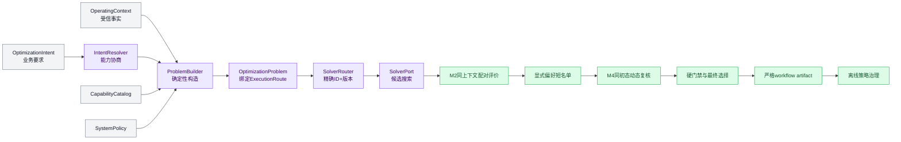

# RTO系统综合说明

_更新日期：2026-08-21 · 本文只说明当前离线RTO的职责、合同、评价和证据边界；实时验证状态见[项目实施状态](../STATUS.md)。_

## 核心结论

当前RTO只有一套覆盖`1..N`目标的合同与执行链。一个目标和多个目标的差异只体现在问题特征、执行路线和结果形状，不再产生另一套API、writer、reader、workflow或策略模型。

这套设计最重要的不是“组件数量”，而是四个不能混淆的判断：

1. `OptimizationIntent`说明想优化什么，`OperatingContext`说明受信运行事实；模型回答不能升级为运行事实。
2. `OptimizationProblem`冻结问题和执行路线，求解器只执行已绑定路线；业务意图不能指定算法。
3. 仿真证据描述物理计算，候选评价描述RTO政策判断；评价器不得改写原始证据。
4. 物理可行、满足发布门槛、人工批准和现场可执行是四件不同的事；当前系统最多形成离线策略记录，没有现场控制权。

所有目标、约束、候选、Pareto关系和策略效果均限定为合成工程仿真，不代表现场验证、产品放行、安全边界、实际经济收益或可直接下装的控制策略。

## 职责与执行链

| 部件 | 当前职责 | 明确禁止 |
| --- | --- | --- |
| `IntentResolver` | 校验目标、方向、决策、偏好和结果请求是否属于已发布能力 | 读取上下文、选算法、调仿真、补造业务语义 |
| `ProblemBuilder` | 用意图、上下文、能力和政策一次性构造不可变问题 | 搜索候选、按求解器反向改问题 |
| `SolverRouter` | 解析问题已绑定的执行路线，核对算法ID、版本与支持声明 | 遍历无关路线、接受业务override、求解 |
| `SolverPort`实现 | 提出候选并通过`CandidateEvaluatorPort`取得评价 | 解析自然语言、直接依赖CDU设备对象 |
| 候选编译器 | 把规范物理量映射为M2参数或M4设定值事件 | 改目标、越界或改变控制器所有权 |
| `SimulatorPort`适配器 | 预览或执行结构化仿真请求，返回证据bundle | 比较候选、发布策略 |
| M2/M4评价器 | 提取KPI、重算约束、核对配对并分类失败 | 重跑求解、覆盖仿真证据 |
| 最终选择器 | 系统错误优先、硬门禁优先，再按显式偏好回退 | 用综合收益抵消硬约束失败 |
| 策略仓储 | 保存不可变payload、追加事件和显式release | 自动批准、自动下装、冒充现场权限 |

## 机器事实与单一真相源

### 能力目录与系统政策

当前`CapabilityBundle`只包含两个治理对象：

| 对象 | 保存内容 | 不保存 |
| --- | --- | --- |
| `CapabilityCatalog` | metric、objective、decision、guardrail、selector及其真实可执行绑定 | 本次运行值、算法选择、未执行的治理标签 |
| `SystemPolicy` | 执行路线、评价预算、M2/M4计划、硬门禁、发布门禁和确定性tie-break | 业务意图、运行事实、上游自由覆盖 |

配置入口是[能力目录](../../configs/rto/capabilities/catalog.json)和[系统政策](../../configs/rto/capabilities/system_policy.json)。包内bundle是安装运行所需的受校验副本；源码区加载时必须和这两份权威配置逐对象一致。

`OperatingContext`已有严格、版本化合同，负责校验自身结构、单位语义和指纹，因此不再另建一份字段完全重复、却没有独立执行者的`ContextSchema`。来源是否可信由调用边界和上下文证据负责，不能靠未执行的`source_authority`或`override_policy`标签声明。

配置字段必须有运行时消费者。当前已删除不会影响行为的缓存标签、维度点数、梯度声明、通用兼容规则、允许假设和控制器治理标签；以后新增字段时必须同时指出执行者和反例测试。

### Intent、Context与Problem

统一意图使用非空目标向量，示例见[单目标意图](../../configs/rto/intents/minimize_specific_furnace_energy.json)和[多目标意图](../../configs/rto/intents/quality_yield_energy.json)。它只允许：

- 已发布目标metric、方向和显式优先级；
- 已发布高层决策变量；
- 当前支持的选择方法和结果请求；
- 结构化歧义，供上游澄清。

它不能携带进料、原油、当前设定值、初态、任意公式、自由阈值、内部路径、仿真preset或求解器ID。当前额外业务约束虽能被严格解析，但还没有受信参数绑定，系统会在构造问题前明确拒绝，不会静默忽略。

[受信上下文fixture](../../configs/rto/contexts/case_20260604.json)保存模型与案例引用、运行模式、进料、组成、当前设定值、初始库存、时刻、数据质量和工程仿真声明。它独立加载，不从意图或Chat回复生成。

`ProblemBuilder`内部只解析意图一次，并把同一个不可变问题交给编排器。问题保存能力目录、系统政策和上下文引用，同时直接保存所选`ExecutionRoute`的指纹引用。由此，构造时选定的路线和运行时使用的路线不能漂移。

合同版本表达结构演化，不表达目标数量。当前破坏性收敛后，能力、上下文、问题、路由、workflow和策略合同显式采用现行`2.0.0`语义；意图和仿真等未改变形状的合同保持各自版本。严格reader不猜测或兼容不匹配的旧结构。

## 求解路线

当前没有动态插件发现系统。代码中只注册两个被现行政策真实使用的确定性实现；`SolverPort`的意义是隔离算法与评价边界、支持替换测试，而不是预付一个插件平台。

| 问题特征 | 当前路线 | 搜索语义 | M2上限 | M4短名单 |
| --- | --- | --- | ---: | ---: |
| 1个目标 | `CoarseRefineGridSolver` | 粗网格后局部细化，稳定全序 | 33 | 3 |
| 2至3个目标 | `FullGridParetoSolver` | 确定性全网格、精确非支配分层 | 81 | 5 |

`ExecutionRoute`是算法选择的唯一事实源，包含算法ID、精确版本、预算、preset、动态时序、短名单、锚点和tie-break。`OptimizationProblem.execution_route_ref`绑定该路线；`SolverRouter`只查找这一算法，并依次验证：

1. 路线引用与问题完全一致；
2. 注册表中存在同ID实现；
3. 实现版本与政策精确一致；
4. `supports(features)`确认当前问题可执行。

任一步不满足都返回结构化`unsupported`，不会尝试另一条路线。当前也没有受信override入口，因为没有真实消费者需要它。

结果请求和目标数相互独立：

| 目标/请求 | 内部结果模式 | 返回含义 |
| --- | --- | --- |
| 任意目标数，不要备选 | `selected` | 只返回经M4复核的最终项 |
| 单目标，需要备选 | `ranked-and-selected` | 静态全序备选，加单列动态可行最终项 |
| 多目标，需要备选 | `pareto-and-selected` | 第一Pareto前沿备选，加单列动态可行最终项 |

当前不提供“只返回Pareto集合而不做最终选择”的模式。RTO输出始终是一个绝对、规范单位的高层稳态设定值向量，不输出阀位、燃料命令或分段轨迹。

## 当前CDU问题与评价漏斗

### 决策与上下文

| 物理量 | 当前角色 | M2映射 | M4映射 |
| --- | --- | --- | --- |
| 炉出口温度目标 | 可用decision | 炉出口温度参数 | `furnace_temperature`设定值事件 |
| 塔顶压力目标 | 可用decision | 塔顶表压参数 | `top_pressure`设定值事件 |
| 新鲜原油进料 | context | 固定进料事实 | 固定进料事实 |
| 回流比 | deferred | M2存在参数 | 无可发布的M4高层设定值映射 |

炉温和压力的当前搜索边界来自能力目录，只是合成局部试验域，不是现场安全边界。温度换算按绝对温标，压力换算按绝压；映射细节由编译器校验。

### 同上下文配对

每个候选必须和同一上下文基准配对。模型、案例、进料、组成、初态、资源、控制器、评价政策、时域和扰动计划全部相同，唯一允许变化的是候选决策向量及其编译动作。

| 层级 | 基准 | 候选 | 唯一允许差异 |
| --- | --- | --- | --- |
| M2稳态 | 当前名义设定值 | 替换选中决策参数 | 决策参数 |
| M4闭环 | 同一基准参数、同一初态、无preset默认扰动 | 在规定时刻同时写入候选SP事件 | 完整事件数组 |

M4候选不能从候选稳态初始化，否则会掩盖设定值切换。相同上下文与评价层的基准可按完整指纹复用；基准失败时，该上下文不可评价。

### 门禁与失败

当前顺序是：M2结构/收敛/守恒/数值有效性 → M2质量与收率硬门禁 → 静态偏好短名单 → 完整M4稳定性复核 → 回退选择 → 独立发布改善门禁。

发布门禁只决定是否形成策略草稿，不会反向改变物理可行性或候选排序。短名单必须完整复核后才能选择：

- 系统、资源、I/O或适配器错误优先终止，不能归为工艺不可行；
- 合法候选有明确模型或约束证据时，才可归为`process_infeasible`；
- 某候选动态失败时按静态偏好回退；
- 固定短名单全部过程不可行只能得到`no_verified_candidate`，不能声称全局无可行解；
- 物理可行但发布改善不足得到`feasible_not_publishable`。

备选列表只是静态证据，可能包含M4不通过项；只有单列的最终引用代表完成动态复核的候选。

## Workflow、严格读取与策略治理

一次运行按阶段原子写入请求、意图、上下文、能力、问题、路由、静态求解、短名单、动态评价、最终选择、可选锚点、可选策略草稿、结果、事件链和manifest。`manifest.json`最后提交。

严格reader位于持久化文件信任边界，当前保留的检查包括：

- 精确文件集、普通文件类型、大小和SHA-256；
- 所有合同引用、相对证据路径和事件连续hash链；
- 问题、路线、求解、短名单、M2/M4评价、最终选择、发布判定和策略的确定性重建；
- CDU物理证据的严格重载；
- 重放期间物理执行计数必须为零。

这些检查不是内部重复防御，而是对可修改磁盘内容的边界验证。SHA-256能证明自洽和检测意外损坏，但没有密钥的manifest不能证明作者身份，也不能抵抗能够重签全部文件的攻击者。

证据同时区分两种身份：输入、物理结果、版本和源码血缘构成可比较的语义指纹；包含运行目录、时间和耗时的manifest指纹只标识这一份具体artifact并用于审计。相同物理计算的新鲜重跑可以具有相同语义身份，但严格reader仍要求所引用的具体manifest逐字闭合。

策略payload和release不可变，状态变化只追加事件。生命周期支持`draft → approved → published → pending_revalidation → superseded/retired`；审核和发布必须显式执行。点策略或有限锚点策略只在已验证锚点容差内查询，不对锚点之间插值。任何状态都不赋予DCS写入或现场审批权。

## 垂域模型与本地Chat

[垂域模型通信协议](02_垂域模型与RTO通信协议.md)定义未来不可信模型生成严格Intent时的安全能力投影、请求关联、完整响应、有界修复、确定性澄清和`resolved-only`交接。当前没有生产`DomainModelPort`实现；协议服务也不调用求解或仿真。

[源码区对话工具](../domain_model/01_聚合式垂域模型综合说明.md)是另一条路径。它只做内存对话、当前配置的仿真基准摘要和已有RTO结果解释；普通回复不是Intent，不能进入`ProblemBuilder`，也不会自动执行RTO。

## 当前限制

- 当前唯一真实仿真实现是CDU Mini Loop适配器。源码依赖隔离和`SimulatorPort` seam已经存在，但后端可替换性尚未由第二个实现证明。
- 端口的Python合同是中立的，当前KPI公式和证据路径仍绑定CDU输出语义。未来HYSYS必须提供经验证的中立证据映射；不能只实现三个方法便宣称即插即用。
- 当前只支持两个高层决策、最多三个已发布目标、稳态设定值向量和固定M2/M4漏斗。
- 额外业务约束尚无受信参数绑定；当前明确拒绝，不自动补阈值。
- 系统同步、单进程、离线运行；没有HTTP服务、数据库、队列、在线调度、HYSYS、DCS/SIS/LIMS接口或自动审批。
- 策略覆盖只证明明确点或有限采样锚点，不证明连续适用域。
- 当前证据来自合成模型和弱时间对齐资料，不能提升为现场验证声明。

## 相关资料

- [RTO离线运行与策略库使用说明](04_RTO离线运行与策略库使用说明.md)
- [垂域模型与RTO通信协议](02_垂域模型与RTO通信协议.md)
- [CDU Mini Loop机理模型综合说明](../cdu/01_CDU_Mini_Loop机理模型综合说明.md)
- [常压蒸馏工艺及数据分析](../cdu/01_常压蒸馏工艺及数据分析.md)
- [目录与模块边界](../architecture/01_项目目录与模块边界.md)
- [项目实施状态](../STATUS.md)
