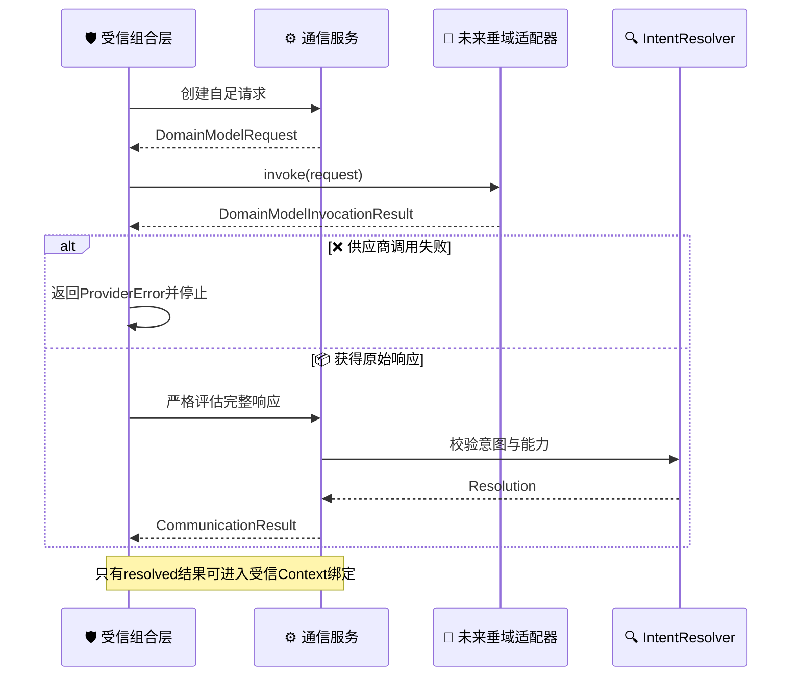
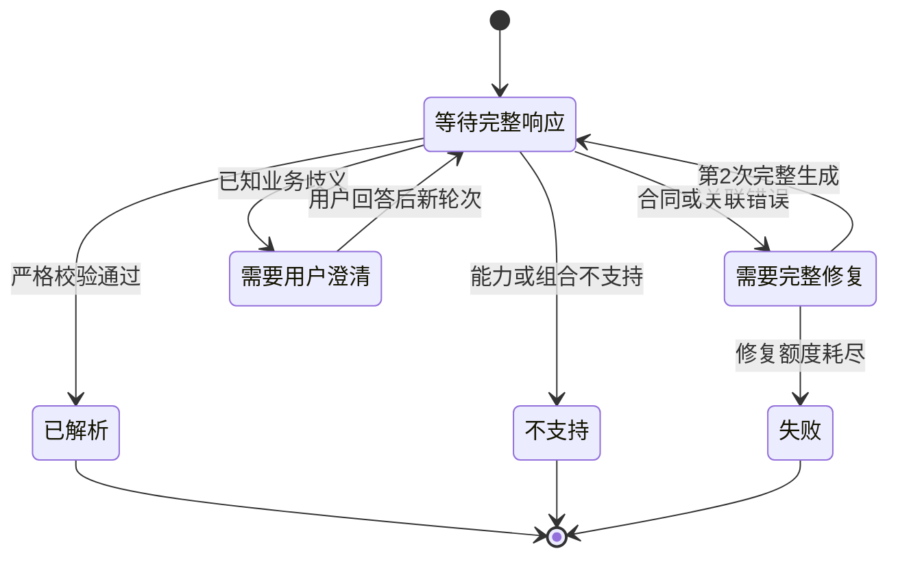

# 垂域模型与统一 RTO 通信协议

_当前 D0 边界：为未来垂域模型生成严格 `OptimizationIntent` 提供中立合同与确定性协商服务。_

---

## 📋 定位与实现状态

[`petroleum_rto.rto.communication`](../../src/petroleum_rto/rto/communication/) 当前包含：

- 版本化请求、响应、能力投影、调用结果和协商结果合同
- 严格且有界的 JSON 解码
- 确定性的请求创建、响应校验、一次完整修复和用户澄清服务
- 供应商中立的 [`DomainModelPort`](../../src/petroleum_rto/rto/communication/ports.py) 协议
- 当前合同的自动反例与金标准数据

它不是普通聊天入口，也不是已经接线的模型运行系统。当前没有 `DomainModelPort` 的生产实现，没有供应商 profile、模型发现、质量评测、多协议适配、模型意图生成 CLI、会话运行时或调用证据持久化。现有 [`DomainModelInvocationResult`](../../src/petroleum_rto/rto/communication/invocation.py) 只是未来适配器必须返回的中立合同，不代表这些运行能力已经存在。

源码区 [DMX 对话工具](../domain_model/01_聚合式垂域模型综合说明.md) 不实现本协议。普通 Chat 回复不能进入 `ProblemBuilder`，`/result` 也只是已有结果的反向只读解释。

## 🔗 职责与信任边界

| 角色 | 当前或未来职责 | 明确禁止 |
| --- | --- | --- |
| `IntentCommunicationService` | 投影安全能力、创建请求、严格校验响应、产生结构化结果 | 网络调用、读取运行上下文、求解或仿真 |
| 未来受信组合层 | 调用服务和未来模型适配器；只在 `resolved` 后独立绑定受信 Context | 绕过通信服务或把模型输出升级为现场事实 |
| 未来 `DomainModelPort` 实现 | 接收自足请求并返回供应商中立调用结果 | 接收受信 Context、选择求解器或调用仿真 |
| `IntentResolver` | 校验原子能力、方向、优先级、返回请求和兼容性 | 猜测业务意图或注入上下文 |
| `ProblemBuilder` | 将已解析意图与独立受信 Context 编译成问题 | 接受普通 Chat 文本或未解析候选意图 |

通信服务不会调用 `DomainModelPort`。未来组合层必须显式完成调用，再把成功结果中的原始响应交给服务校验；供应商失败停留在外层，不进入语义协商。



## 📦 版本化机器合同

当前版本以源码常量为准：

| 合同 | Schema 版本 | 作用 |
| --- | --- | --- |
| `DomainCapabilityManifest` | `1.1.0` | 允许离开 RTO 信任边界的安全能力投影 |
| `DomainModelRequest` | `1.2.0` | 自足请求、关联引用、澄清上下文和输出政策 |
| `DomainModelResponse` | `1.1.0` | 完整 `intent` 或闭集 `unsupported` 响应 |
| `DomainModelInvocationResult` | `1.0.0` | 未来适配器的成功或供应商失败联合 |
| `CommunicationResult` | `1.0.0` | 修复、澄清、解析、不支持或失败结果 |
| `OptimizationIntent` | `1.0.0` | 目标数量无关的严格业务意图 |

### 安全能力投影

`DomainCapabilityManifest` 只包含：

- 指标、目标、决策变量和选择偏好的公开业务字段
- 目标与决策变量的基数规则
- 结果形式、备选默认值和候选数量上限
- `engineering_simulation_only` 声明与能力指纹

它不包含运行上下文字段或数值、决策边界、硬门禁阈值、执行路由、公式、内部引用、模型路径或适配器绑定。能力引用必须由响应原样回显；过期或串线引用不能进入意图解析。

### 自足请求

`DomainModelRequest` 保存请求和会话标识、轮次、模型尝试次数、安全能力快照、用户原始消息、必要的上一轮澄清状态、结构化反馈和目标输出 schema。首轮不携带推断出的上下文；后续轮次保留用户回答，但不能把模型解释冒充用户事实。

固定输出政策为：

```json
{
  "constraints_mode": "system-only",
  "operating_context_mode": "excluded",
  "solver_selection_mode": "forbidden",
  "response_mode": "full-replacement",
  "maximum_model_attempts": 2
}
```

因此垂域模型不能提供受信工况、选择算法、覆盖系统门禁或用局部 JSON Patch 修补上一份意图。当前附加业务约束没有类型化参数绑定，非空 `constraints` 会返回 `unsupported`。

### 完整响应

`DomainModelResponse` 是严格标签联合：

| `outcome` | 唯一负载 | 处理方式 |
| --- | --- | --- |
| `intent` | 完整 `OptimizationIntent` | 校验引用、合同、能力和歧义 |
| `unsupported` | 固定 reason code 与对应安全消息 | 返回结构化不支持，不解析自由解释 |

以下是语法完整的单目标响应形状；引用值仅作占位：

```json
{
  "schema_id": "domain-model-intent-response",
  "schema_version": "1.1.0",
  "response_id": "response-1-1",
  "request_ref": {
    "object_id": "intent-request-session-energy-t1-a1",
    "fingerprint": "0000000000000000000000000000000000000000000000000000000000000000"
  },
  "capability_manifest_ref": {
    "object_id": "cdu-rto-public-capabilities.domain-model",
    "fingerprint": "0000000000000000000000000000000000000000000000000000000000000000"
  },
  "outcome": "intent",
  "intent": {
    "schema_id": "optimization-intent",
    "schema_version": "1.0.0",
    "intent_id": "reduce-energy",
    "objectives": [
      {
        "metric_id": "specific_furnace_fuel_energy_mj_per_t",
        "sense": "minimize",
        "priority": 1
      }
    ],
    "decision_variables": [
      "furnace_temperature_target_k",
      "tower_top_pressure_target_pa_a"
    ],
    "constraints": [],
    "preference": {
      "method": "single-objective",
      "objective_order": [
        "specific_furnace_fuel_energy_mj_per_t"
      ]
    },
    "result_request": {
      "output_kind": "steady-setpoint-vector",
      "include_alternatives": false,
      "max_candidates": 1
    },
    "ambiguities": []
  }
}
```

响应必须完整匹配当前请求引用和能力引用。两个联合分支不能并存，未知字段、重复 JSON 键、非有限数、非法 UTF-8、超限内容或错误类型都会在语义解析前被拒绝。

## 🔄 有界协商



| `CommunicationResult.status` | 语义 | 允许的下一动作 |
| --- | --- | --- |
| `repair_required` | 合同、JSON 或引用错误，仍有一次额度 | 同轮次生成一份完整替代响应 |
| `needs_clarification` | 候选意图含已知业务歧义 | 展示确定性问题并创建新轮次 |
| `resolved` | 意图和能力协商全部通过 | 交给受信 Context 绑定 |
| `unsupported` | 请求超出公开能力或当前绑定能力 | 返回结构化原因，不改写目标 |
| `failed` | 修复失败或澄清轮次耗尽 | 停止自动处理 |

自动机器修复最多一次，即同一轮最多两次完整模型生成。单轮最多提出三个问题，一个会话最多三个澄清轮次。问题只能来自当前白名单：目标选择、目标优先级、决策变量选择和是否返回备选。未知歧义代码先进入机器修复；修复后仍非法则失败。

用户回答必须匹配问题 ID、选项和数量。通信服务不会直接把回答写进意图，而是要求垂域模型在新轮次生成完整替代意图，再执行同样校验。

## ⚠️ 错误分类

| 问题 | 结果 |
| --- | --- |
| 响应结构、JSON 或引用错误 | `repair_required`，额度耗尽后 `failed` |
| 已知业务歧义 | `needs_clarification` |
| 未发布目标、变量、方向或组合 | `unsupported` |
| 非空自由业务约束 | `unsupported` |
| 认证、支付、限流、传输、超时、拒绝、截断或模型漂移 | 外层 `ProviderError` |
| 仿真、I/O、系统或求解错误 | 不属于本协议，不得伪装成业务不支持 |

`ProviderError` 和 `CommunicationResult` 互斥：供应商调用失败时没有可供语义服务校验的模型响应。调用尝试、用量和规范化错误字段属于中立返回合同；当前没有负责重试、会话管理或落盘这些字段的生产运行时。

## ✅ 交接门禁

只有 `CommunicationResult.status == "resolved"` 且携带同一份 `resolved_intent` 时，未来受信组合层才能继续：

1. 独立取得并校验受信 `OperatingContext`
2. 将已解析意图与 Context 交给 `ProblemBuilder`
3. 由后续路由、求解、仿真和评价链执行

任何普通 Chat 文本、候选意图、修复结果、澄清中间态、`unsupported` 或供应商错误都不能越过该门禁。运行上下文只能来自受信调用方，不能由模型输出、用户澄清或通信服务推断。

## 🧪 当前验证资产

- [D0 金标准](../../data/rto/gold/domain_communication_v1.json)覆盖单目标解析、多目标解析、决策变量澄清、未发布变量和未绑定业务约束；文件名中的 `v1` 是当前数据集版本，不是旧 RTO 执行分支
- [通信协议专项测试](../../tests/rto/unit/test_domain_communication.py)覆盖安全能力投影、严格往返、引用篡改、一次完整修复、澄清上限、结构化不支持和 `resolved-only` 交接
- [协议源码](../../src/petroleum_rto/rto/communication/)是字段、版本和状态不变量的权威来源

## 🚫 当前未实现

- 具体垂域模型或供应商适配器
- provider/profile 配置、模型发现或质量评测
- 多协议解析、自动重试或供应商路由
- 模型意图生成 CLI、会话运行时或调用证据仓储
- Chat 自动转 Intent、自动 RTO 或任何现场接口

这些能力只有在出现当前明确需求时才实现；不得为了预留未来路径削弱本协议的信任边界。当前授权、验证结果和下一步以[项目实施状态](../STATUS.md)为准。
