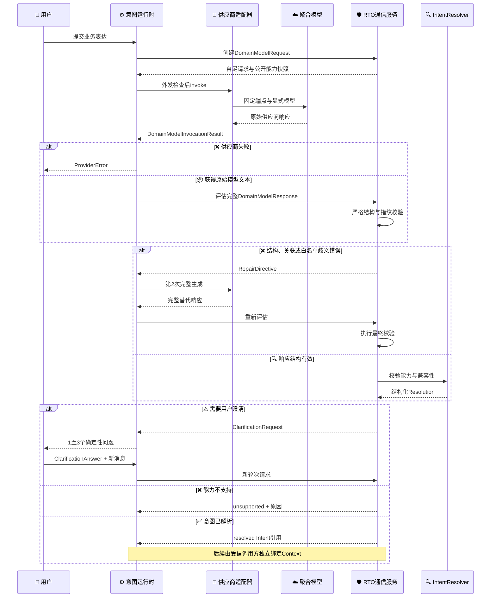
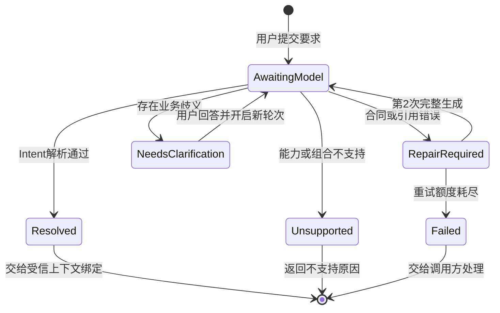

# 垂域模型与统一RTO通信协议

_严格意图合同边界 · 更新日期：2026-08-21 · 定义安全能力投影、意图生成、结构化修复、用户澄清和确定性交接。_

---

## 📋 协议目标

本协议位于垂域模型的严格意图生成路径和统一RTO之间。它不规定普通聊天界面，也不把提示词、网络客户端、密钥或模型供应商写进RTO核心；它只冻结自然语言进入`ProblemBuilder`前必须满足的业务合同。

协议完成以下闭环：

1. RTO提供经过脱敏的公开能力快照
2. 垂域模型根据用户表达生成完整`OptimizationIntent`
3. RTO严格校验响应结构、请求关联和能力版本
4. 结构错误返回机器修复指令，最多允许一次完整重生成
5. 业务歧义转换为确定性用户问题
6. 用户回答后，垂域模型生成一份完整替代Intent
7. 供应商失败返回独立`ProviderError`，不冒充业务`unsupported`或工艺不可行
8. 只有`resolved`结果才能交给受信上下文绑定和`ProblemBuilder`

> 📌 **边界：** 垂域模型不接收具体运行上下文值，不选择求解器，不输出模型内部路径，也不能创建或覆盖系统硬门禁。

## 🔗 角色与依赖

| 角色 | 输入 | 输出 | 明确禁止 |
| --- | --- | --- | --- |
| 用户 | 业务要求、澄清回答 | 自然语言 | 直接构造内部仿真字段 |
| 严格意图兼容运行时 | `DomainModelRequest`、模型调用和本地校验 | 供应商调用或有界语义结果 | 将供应商错误交给Resolver，或调用求解与仿真 |
| 垂域模型调用方 | 公开能力和用户业务表达 | `DomainModelInvocationResult` | 运行上下文、算法ID、任意公式或阈值 |
| 通信服务 | 公开能力、模型原始响应 | `CommunicationResult` | 调用求解器、仿真或猜测用户意图 |
| `IntentResolver` | 严格Intent、能力视图 | resolved/clarification/unsupported | 注入上下文或自动更改业务含义 |
| 受信调用方 | resolved Intent、受信Context | `OptimizationProblem` | 让垂域模型生成现场事实 |

[`petroleum_rto.domain_model`](../../src/petroleum_rto/domain_model/)只依赖[`rto.communication`](../../src/petroleum_rto/rto/communication/)公开合同和请求自带的安全[`DomainCapabilityManifest`](../../src/petroleum_rto/rto/communication/models.py)快照。该对象由RTO内部能力事实确定性投影，但不是内部`PublicCapabilityManifest`的原样外发；RTO、CDU和未来HYSYS内部对象不得反向泄漏到垂域模块。

## 🔄 通信顺序



通信服务是确定性语义边界：同一请求、同一能力快照和同一模型响应必须产生相同状态、问题、指纹和结构化错误。运行时负责调用与证据，但不改写通信服务的语义判定。

## 📚 机器合同

### DomainModelRequest

通信服务发给垂域模型适配器的请求是自足快照，当前schema版本为`1.2.0`，关键字段如下。

| 字段 | 语义 |
| --- | --- |
| `request_id/session_id` | 当前请求和会话身份 |
| `turn_index` | 用户澄清轮次，从1开始 |
| `model_attempt` | 同一轮模型生成次数，只允许1或2 |
| `capability_manifest` | `DomainCapabilityManifest 1.1.0`安全能力快照，不含受信上下文字段、边界、门禁、路由或内部绑定 |
| `capability_manifest_ref` | 能力快照ID与SHA-256，响应必须原样回显 |
| `user_messages` | 只保存用户原始表达，不把模型解释冒充用户事实 |
| `prior_intent` | 后续澄清轮次的上一份候选Intent |
| `prior_clarification` | 上一轮确定性问题 |
| `clarification_answers` | 与问题ID严格对应的用户回答 |
| `feedback_issues` | 上一轮合同、能力或歧义问题 |
| `output_schema_id/version` | 固定指向统一`OptimizationIntent 1.0.0` |
| `output_policy` | 约束、上下文、求解器和替代响应政策 |

`output_policy`固定为：

```json
{
  "constraints_mode": "system-only",
  "operating_context_mode": "excluded",
  "solver_selection_mode": "forbidden",
  "response_mode": "full-replacement",
  "maximum_model_attempts": 2
}
```

`DomainCapabilityManifest`只发布业务安全的`metrics`、`objectives`、`decisions`、`selectors`、目标/决策基数规则和`result_output_rules`。它明确排除`context_fields`、决策边界、硬门禁、执行路由、公式、内部引用和适配器绑定；未来受信Context有哪些字段也不属于模型外发清单。`result_output_rules`只说明结果形式、是否默认返回备选和候选数量边界，不授予求解器或路由选择权。

### DomainModelResponse

垂域模型每次只能返回完整响应，不支持JSON Patch或部分字段覆盖。

```json
{
  "schema_id": "domain-model-intent-response",
  "schema_version": "1.1.0",
  "response_id": "response-1-1",
  "request_ref": {
    "object_id": "intent-request-session-energy-t1-a1",
    "fingerprint": "<当前请求的64位SHA-256>"
  },
  "capability_manifest_ref": {
    "object_id": "cdu-rto-public-capabilities.domain-model",
    "fingerprint": "<当前能力快照的64位SHA-256>"
  },
  "outcome": "intent",
  "intent": {
    "schema_id": "optimization-intent",
    "schema_version": "1.0.0",
    "intent_id": "reduce-energy",
    "objectives": [
      {
        "metric_id": "specific_furnace_fuel_energy_mj_per_t",
        "sense": "minimize",
        "priority": 1
      }
    ],
    "decision_variables": [
      "furnace_temperature_target_k",
      "tower_top_pressure_target_pa_a"
    ],
    "constraints": [],
    "preference": {
      "method": "single-objective",
      "objective_order": [
        "specific_furnace_fuel_energy_mj_per_t"
      ]
    },
    "result_request": {
      "output_kind": "steady-setpoint-vector",
      "include_alternatives": false,
      "max_candidates": 1
    },
    "ambiguities": []
  }
}
```

`DomainModelResponse 1.1.0`是严格标签联合：

| `outcome` | 唯一允许的负载 | 语义 |
| --- | --- | --- |
| `intent` | 完整`intent` | 进入本地合同、引用和Resolver校验 |
| `unsupported` | `DomainModelUnsupported 1.0.0` | 只能使用版本化`reason_code`及其固定安全消息，不能自由输出解释 |

两个分支不得同时出现，也不得缺少对应负载。`request_ref`或`capability_manifest_ref`不一致时，响应不能进入语义解析。这样可以拒绝迟到响应、缓存串线和使用旧能力目录生成的Intent。

### DomainModelInvocationResult

`DomainModelPort.invoke(request)`不直接返回已解析Intent，而是返回严格、供应商中立的原始调用结果。

| 字段 | 语义 |
| --- | --- |
| `invocation_id/request_ref` | 调用身份与当前`DomainModelRequest`关联 |
| `status` | 只能为`succeeded`或`failed` |
| `attempts[]` | 连续编号的物理调用证据 |
| `response` | 成功时的原始模型文本，最大128 KiB |
| `error` | 失败时的最终`ProviderError` |

`ProviderAttempt`保存provider身份/版本、provider request ID、实际返回模型、结束原因、耗时、usage和规范化错误。一个`DomainModelInvocationResult`不得混用供应商或版本，也不得同时携带成功响应和错误。

每个语义调用在发送前、返回后和流式读取分块之间检查绝对期限；超过期限后才到达的结果会被拒收并保留结构化调用证据。同步HTTP客户端无法在阻塞I/O内部保证截止时刻的硬中断，因此期限是结果接受与重试预算，不是精确墙钟取消承诺。`maximum_concurrency=1`也是同一Python进程内的供应商调用限制，不是多个CLI进程共享的全局限流器。

### CommunicationResult

| 状态 | 含义 | 下一动作 |
| --- | --- | --- |
| `repair_required` | JSON结构、合同或引用错误，且还有一次模型重试额度 | 原请求同轮次重发，要求完整替代响应 |
| `needs_clarification` | 模型明确标记业务歧义 | 向用户展示1至3个确定性问题 |
| `resolved` | Intent结构和能力协商全部通过 | 交给受信Context绑定和ProblemBuilder |
| `unsupported` | 用户要求或候选Intent超出已发布能力 | 向用户说明原因，不擅自改写目标 |
| `failed` | 第二次模型响应仍违反合同 | 停止自动修复并交给调用方处理 |

每个结果同时保存请求、响应和能力引用。`resolved`时不得携带问题；`needs_clarification`必须携带候选Intent和问题；`repair_required`必须携带完整替代指令；这些互斥条件由严格读取器校验。

`CommunicationResult.failed`只表示有界语义生成后仍违反合同，不表示供应商故障。认证、支付、限流、HTTP、超时、拒绝、截断或模型漂移继续使用外层`ProviderError`。

## 💬 澄清回路



### 问题类型

| 歧义代码 | 回答类型 | 选项来源 |
| --- | --- | --- |
| `objective-selection-ambiguous` | 多选 | 当前公开且可用的目标指标 |
| `objective-priority-ambiguous` | 有序选择 | 当前候选Intent中的目标 |
| `decision-variable-selection-ambiguous` | 多选 | 当前公开且端到端可用的决策变量 |
| `result-alternatives-ambiguous` | 单选 | 只返回最终方案或同时返回备选 |

歧义代码是版本化白名单，不接受“其他代码+自由文本”。模型产生未知代码时，同轮先返回`unknown-ambiguity-code`并要求一次完整修复；修复后仍非法则`failed`。

单轮最多提出三个问题，一个会话最多进行三轮用户澄清。选择类回答必须严格命中问题声明的选项和数量；回答缺失、重复、越界或包含未发布ID时，在再次调用模型前直接拒绝。达到澄清轮次上限后结构化失败，不无限续问。

用户回答不会由通信服务直接写入Intent。服务只创建新轮次，将上一份Intent、问题、回答和反馈一并交给垂域模型；垂域模型必须重新生成完整Intent，再经过同样的严格校验。

## ⚠️ 错误与能力边界

| 问题类别 | 示例 | 分类 |
| --- | --- | --- |
| 合同错误 | 缺字段、未知字段、非法类型、非有限数 | `repair_required`，最多一次 |
| 协议错误 | 请求引用错误、能力快照过期 | `repair_required`，最多一次 |
| 业务歧义 | 目标、优先级、变量或返回形式未确认 | `needs_clarification` |
| 能力不支持 | 回流比当前无M4映射、目标方向错误 | `unsupported` |
| 额外业务约束 | `constraints`非空但没有可信参数绑定 | `unsupported` |
| 模型连续失败 | 第二次响应仍违反合同 | `failed` |
| 供应商或传输失败 | 401、429、5xx、超时、拒绝或截断 | 外层`ProviderError`，不生成`CommunicationResult` |
| 实际模型漂移 | 请求与返回模型ID不一致 | `ProviderError(category="model_mismatch")` |

当前`constraints_mode=system-only`。公开清单中的稳定、质量、收率和发布门禁用于说明系统一定会执行的规则，不表示垂域模型可以复制、关闭、改阈值或改变优先级。后续若实现类型化业务约束参数绑定，应升级通信合同和金标准，而不是放开任意公式字符串。

供应商5xx中的余额或配置提示当前仅通过保守响应体标记映射为不重试错误；真实供应商措辞尚待在线验证，不能把未知5xx自动解释为配置错误或业务不支持。

## 🧪 金标准与质量评测

首批机器样例位于[`data/rto/gold/domain_communication_v1.json`](../../data/rto/gold/domain_communication_v1.json)，覆盖：

- 单目标Intent成功解析
- 三目标Intent成功解析
- 决策变量需要用户澄清
- 延期回流比能力被明确拒绝
- 未绑定业务约束被明确拒绝

专项测试位于[`test_domain_communication.py`](../../tests/rto/unit/test_domain_communication.py)，还覆盖：

- 公开能力快照严格往返和指纹闭合
- 请求中无运行上下文值或求解器ID
- 请求/能力引用过期时不进入语义解析
- 模型结构错误只允许一次完整重生成
- 未知歧义代码先进入机器修复，而不是生成自由文本问题
- 已知歧义只展示当前可用能力，延期变量不进入选项
- 用户回答完整性、选项和数量反例
- 澄清轮次上限和供应商失败互斥形状
- 通信结果跨字段篡改和能力引用篡改

D0合同及其反例继续保留：公开能力快照、请求关联、一次完整重生成、确定性澄清、显式`unsupported`和只有`resolved`才能交接的规则都不因Chat简化而放宽。

当前普通用户入口不再暴露模型发现、评测、供应商profile或多协议命令。`rto-intent`与`rto-chat`都进入同一个内存多轮Chat界面；模型配置直接位于`chat_settings.py`，SK位于Git忽略的`dmx_api.json`。旧运行时、provider catalog、发现、评测和多协议适配器只保留为兼容代码，不再定义当前人机流程。

默认DeepSeek已用本地SK完成真实短对话和一次单目标动态RTO安全摘要解释，但这只证明普通Chat及反向结果解释链路连通，不证明模型输出符合本节严格`OptimizationIntent`协议。普通Chat回答不能自动进入RTO；若以后恢复“对话自动生成严格Intent”，仍必须复用本协议，不得把自由文本直接交给求解器。

## 💬 RTO结果解释回路

RTO完成后不会自动把内部运行对象交给垂域模型。只有用户在Chat中显式执行`/result <run-dir|result.json>`时，组合层才会：

1. 使用RTO严格reader重载已有运行
2. 本地显示选中设定值
3. 构造只含最终状态、设定值、目标改善、约束通过状态和离线声明的摘要
4. 将该摘要作为一轮Chat消息发送给模型并直接显示解释

该摘要排除`OperatingContext`、当前工况、求解器、公式、引用、指纹、文件路径、原始仿真证据和策略payload。模型不能修改RTO结果、批准或发布策略，也不能赋予现场控制权。结果解释是展示功能，不是`DomainModelRequest`/`DomainModelResponse`意图合同的一部分。

## 📍 严格意图兼容交接

需要自动生成严格Intent的兼容调用方必须实现[`DomainModelPort`](../../src/petroleum_rto/rto/communication/ports.py)：

```python
class DomainModelPort(Protocol):
    @property
    def provider_id(self) -> str: ...

    @property
    def provider_version(self) -> str: ...

    def invoke(self, request: DomainModelRequest) -> DomainModelInvocationResult: ...
```

调用方可以使用本地模型、远程模型或测试替身，但只能返回原始文本与调用证据。成功响应必须由[`IntentCommunicationService`](../../src/petroleum_rto/rto/communication/service.py)严格解析；任何调用方都不能绕过通信服务直接调用`ProblemBuilder`。

应用组合层通过RTO侧持有的`petroleum_rto.rto.communication.build_intent_communication_service()`取得使用包内权威能力快照的通信服务。DMX Chat配置、多轮CLI和结果解释见[DMX垂域模型与对话入口](../domain_model/01_聚合式垂域模型综合说明.md)。
