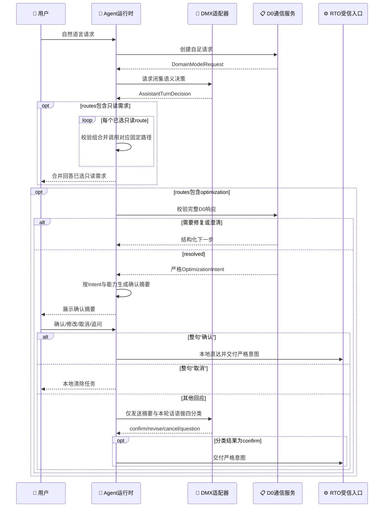
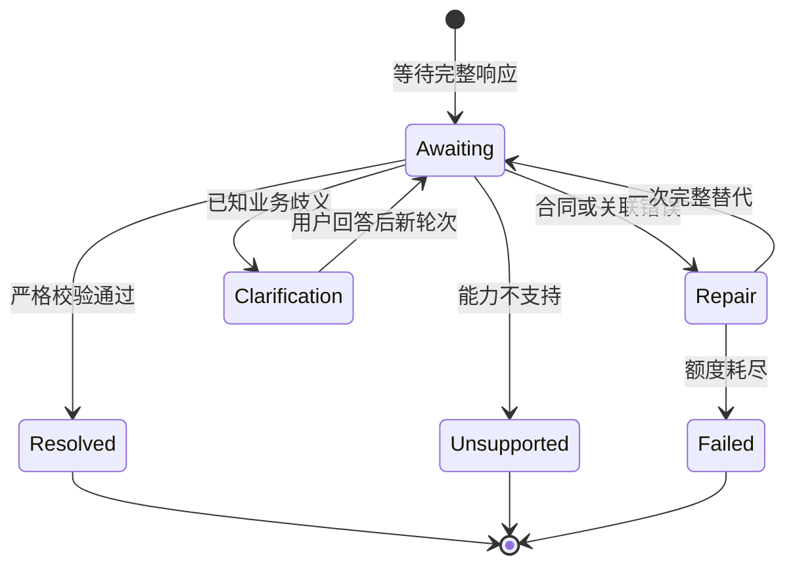

# 垂域模型与统一RTO通信协议

_更新日期：2026-09-03 · 当前D0边界负责把自然语言优化需求转换为严格`OptimizationIntent`；确认摘要、运行事实、确认执行和RTO仍位于受信组合层。_

## 当前定位

[`petroleum_rto.rto.communication`](../../src/petroleum_rto/rto/communication/)提供：

- 版本化能力投影、请求、响应、调用结果和协商结果；
- 严格且有界的JSON解码；
- 请求关联、完整响应校验、一次完整修复和有限用户澄清；
- 目标数量无关的`OptimizationIntent`解析。

它不负责普通Chat，不读取`OperatingContext`，不选择求解器，也不调用仿真。Agent组合层负责调用DMX、把原始响应交给D0校验，并且只在`resolved`后保存待确认意图。

当前DMX适配器在D0外增加一层`assistant-turn-decision`合同，使同一次模型响应返回一个或多个不重复的闭集`routes`；当其中包含`optimization`时，同一响应只携带一份完整D0响应，不携带确认文字。严格Intent通过后，确认摘要由受信代码依据Intent和当前能力确定性生成。这可覆盖一条消息中的多个独立需求，同时没有把工具名、任意路径、自由执行计划或确认承诺交给模型。

## 两层闭集合同

### Agent语义层

常规模式返回非空、不重复的`routes`数组，元素只能是：

- `chat`
- `capabilities`
- `operating-status`
- `assistant-status`
- `last-result`
- `optimization`
- `unsupported-action`

待确认时，整句严格等于“确认”或“取消”便由本地程序直接改变状态，不经过模型。其他回复才进入确认模式，其route只能是：

- `confirm`
- `revise`
- `cancel`
- `question`

常规模式可同时表达普通问答、能力、工况、助手状态和当前会话最近结果等独立需求。代码拒绝未知route、重复route、空数组及`optimization`与`unsupported-action`的冲突组合，然后才映射到固定只读路径。

除了包含`optimization`的常规响应或单独的Intent生成模式外，模型不得附带D0响应。需要生成优化意图时，外层只允许一份完整`DomainModelResponse`。外层模型响应没有`confirmation_text`字段；程序按严格Intent和能力业务名称生成确认摘要。一轮最多生成一份Intent，还必须等下一轮确认才能运行一次优化。

用户表达中的错别字、漏字或多字、同音或形近写法、简称、近义词和口语由模型结合整句与安全能力投影做通用语义归一，不经过本地错词表或字符模板。唯一合理映射必须输出已发布目标或变量ID；多个合理映射进入D0允许的`ambiguities`。首次提出新目标时，句尾“开始吧”仍属于`optimization`，不能作为`confirm`越过后续确认。

用户只说“帮我优化”或日常语义的“生成一条优化策略”但没有给出目标时，常规路由选择`capabilities`；本地能力回复列出可用目标、变量和可照抄示例，不构造空Intent、不自行选择目标，也不返回冷冰冰的“不支持”。用户同时给出具体目标并要求设定值或操作方案时，日常语义的“策略”属于`optimization`。只有正式创建、审批、发布、下装或现场控制请求才属于`unsupported-action`，回复同时引导到离线设定点建议；正式策略治理仍不在Agent动作中。

`assistant-status`只表示用户在追问助手、模型调用或上一轮界面错误。它不携带D0负载；严格路由通过后，Agent运行时依据最近一份安全结构化模型失败回答，不把供应商正文放入模型上下文，不查询RTO工况，也不根据模拟器是否`idle`猜测失败原因。

`last-result`只表示用户在追问当前会话最近一次完成或显式读取的RTO结果。它不携带文件路径或工具参数；运行时仅使用确认运行或成功`/result`读取后保存的受信结果回执。这一route可与`capabilities`等其他只读需求并存。

`operating-status`仍通过`assistant-turn-decision`做LLM闭集语义路由，但不携带D0负载。路由通过后，Agent运行时在本地读取并严格校验结构化工况投影，再确定性地生成简洁回复。正常成功路径不再调用Chat或DMX润色工况内容。

### D0业务层

`DomainModelResponse`仍是严格标签联合：

| outcome | 唯一负载 | 处理 |
| --- | --- | --- |
| `intent` | 完整`OptimizationIntent` | 校验合同、关联、能力和歧义 |
| `unsupported` | 固定原因码与安全消息 | 结构化停止，不猜测或改写目标 |

`OptimizationIntent`只允许目标、方向、优先级、决策变量、选择偏好、结果请求和结构化歧义。它不能包含Context、公式、自由门禁、内部路径、算法或批准状态。

## 责任与信任边界

| 角色 | 负责 | 明确禁止 |
| --- | --- | --- |
| `DmxIntentAdapter` | 发送自足请求，返回严格闭集语义响应 | 接收完整Context、调用求解或现场系统 |
| `IntentCommunicationService` | 投影安全能力、创建请求、校验D0响应、管理修复与澄清 | 网络调用、读取Context、求解 |
| `IntentResolver` | 校验目标、决策、方向、优先级和结果请求 | 猜测语义、注入事实、选算法 |
| Agent运行时 | 组合语义路由、D0、程序生成确认摘要、整句“确认”/“取消”直达、工况的本地确定性成文、Chat阶段标记和固定工具 | 绕过D0、接受任意工具名、使用Chat猜测工况或目标 |
| `ProblemBuilder` | 确认后把严格意图与受信Context编译成问题 | 接受普通Chat文本或候选意图 |



## 机器合同

当前版本以源码常量为准：

| 合同 | Schema版本 | 作用 |
| --- | --- | --- |
| `AssistantTurnDecision` | `3.0.0` | 非空不重复闭集`routes`与可选单份D0响应；不含确认文本，包含`last-result` |
| `DomainCapabilityManifest` | `1.1.0` | D0可见的安全能力投影 |
| `DomainModelRequest` | `1.2.0` | 自足请求、关联、澄清上下文和输出政策 |
| `DomainModelResponse` | `1.1.0` | 完整`intent`或`unsupported` |
| `DomainModelInvocationResult` | `1.0.0` | 调用成功或供应商失败联合 |
| `CommunicationResult` | `1.0.0` | 修复、澄清、解析、不支持或失败 |
| `OptimizationIntent` | `1.0.0` | 目标数量无关的严格业务意图 |

### 安全能力投影

D0只看到指标、目标、决策变量、选择偏好、目标与变量基数和结果形式；看不到运行数值、决策边界、硬门禁阈值、执行路线、公式、模型路径或适配器绑定。

请求和响应内部仍必须关联同一能力快照，防止并发或修复时串线。这个关联只属于机器合同，不显示给用户，也不作为确认命令的参数。真正执行时不信任旧快照，而是重新加载当前能力并再次解析严格意图。

### `AssistantTurnDecision`形状

`routing`和`intent`模式的外层对象恰有`schema_id`、`schema_version`、`request_ref`、`capability_manifest_ref`、`routes`和`optimization_response`六个字段。非优化路由的`optimization_response`必须为JSON `null`；优化或Intent模式必须是一份完整D0响应。

`confirmation`模式恰有`schema_id`、`schema_version`、`request_ref`和`routes`四个字段，只允许一个`confirm`、`revise`、`cancel`或`question`。它的请求内容只包含已展示摘要和本轮用户话语，不包含完整能力、原始优化请求、D0输出合同或求解信息。常规/Intent提示按任务、输出、路由、优化理解、严格意图和修复分段；确认使用独立的短提示。

### 自足请求

`DomainModelRequest`保存请求和会话标识、轮次、模型尝试、安全能力、用户原始消息、必要的澄清状态、结构化反馈和目标schema。固定政策是：

```json
{
  "constraints_mode": "system-only",
  "operating_context_mode": "excluded",
  "solver_selection_mode": "forbidden",
  "response_mode": "full-replacement",
  "maximum_model_attempts": 2
}
```

因此模型不能提供受信工况、选择算法、覆盖系统门禁或用局部JSON Patch修改旧意图。当前非空自由业务约束没有类型化参数绑定，会返回`unsupported`。

### 严格解码

响应必须完整匹配当前请求关联和能力关联。联合分支不能并存；未知字段、重复键、非有限数、非法UTF-8、超限内容、错误类型或非法能力在语义交接前被拒绝。适配器不做关键词补全、字段猜测或宽松归一化。

严格解析后，通信服务忽略模型随意生成的`intent_id`，按目标顺序、决策变量集合、偏好和结果要求生成确定性语义身份。相同业务含义即使措辞、模型标签或决策变量排列不同，也得到同一Intent引用；业务内容变化才形成新身份。

程序生成的确认摘要不承担机器授权：运行时保存并执行的是严格意图。摘要只用于让用户判断目标、调整变量和结果要求是否符合预期；模型不能生成摘要或通过摘要改写意图。

## 有界修复与澄清

Agent外层与D0各自只修复自己负责的合同。供应商返回内容但`assistant-turn-decision`外层JSON或结构无效时，Agent只请求一次完整替代，且不把原始响应放进重试请求。第二次仍无效时，内部记录准确阶段和响应合同分类；用户看到当前能力、变量和表达示例，而不是“意图解析失败”。已有待确认任务时还会明确原方案仍保留且没有开始计算。模型没有返回可解析内容时不做结构修复；其中可重试的传输失败或供应商`5xx`由语义入口最多重新调用一次，`429`不立即重试。只有外层严格解码成功后，嵌套D0响应才进入下述现有修复与澄清状态机。



一个意图轮次最多两次完整模型生成。一次任务最多三个意图轮次，单轮最多三个澄清问题。问题只来自目标选择、目标优先级、决策变量和是否返回备选。用户回答不会被代码直接写进意图，而是要求模型生成新的完整响应后重新校验。

多目标默认按用户提及顺序形成可确认的建议优先级；只有用户明确表示同等重要、顺序不确定、表达冲突或语义上确实无法确定时，才生成`objective-priority-ambiguous`。优先级选项的展示标签取自能力目录`business_name`，机器值保持`metric_id`。恰有两个目标时问题为单选，只要求给出第一优先，模型收到该唯一值后必须把另一目标设为第二优先并返回完整替代Intent；三个及以上目标仍为有序多选，必须完整覆盖全部目标。

## 从`resolved`到执行

`resolved`不立即读取Context或运行RTO。Agent按能力目录中的`business_name`和严格Intent生成确认摘要，再保存意图与摘要。摘要中的`max_candidates=N`表示推荐加其他候选合计最多N个，因此有备选时显示“1个推荐和最多N-1个其他候选”。后续行为是：

- 确认：加载当前能力、重新验证意图、读取一次最新Context、构造一次Problem并运行；
- 修改：确认小分类先识别`revise`，再生成一份新的完整D0意图并重新校验；新意图成功前保留原方案；
- 取消：删除待确认状态；
- 追问：回答确认内容，不改变严格意图。

确认内容追问仍使用Chat，失败阶段标记为“确认问题解答”。离线运行完成后的自然语言组织也使用Chat，标记为“优化结果解读”；已有`result.json`或当前会话最近结果的解释标记为“结果解读”。

确认入口返回受信`OptimizationRunReceipt`，其形状固定为：

- `workflow_id`：确定性`offline-rto-<16位十六进制指纹>`标识；
- `result_source`：严格等于`<workflow_id>/result.json`的受控相对位置；
- `result_summary`：`status`、`targets`、`operating_context`、`baseline_values`、`recommended_adjustments`、`predicted_effects`和`alternative_candidates`七个字段。

`alternative_candidates`始终存在，可为空；它不重复推荐方案，并按最终全局`rank`升序列出调整、预测效果、`verification_stage`和`verification_status`。M2仅表示稳态评价，M4才表示已有动态复核。这些候选是同一次RTO中的其他设定点组合，不是正式策略。

运行时在Chat解读前保存这份回执，供当前会话的`last-result`追问使用。磁盘`result.json`仍直接保存七字段摘要，不再包一层回执。当前offline workflow版本为`4.0.0`，当前reader不兼容旧v3六字段结果。进程重启后不通过全局文件修改时间猜测某个用户的最近结果；显式`/result <结果编号>`（结果编号即`workflow_id`）会在固定`runs/rto`根下解析指定结果，并把它设为新会话的最近结果。

任何普通Chat回复、候选意图、修复中间态、澄清中间态、`unsupported`或供应商失败都不能进入Problem构造。Context只能来自受信调用方。

## 错误分类

| 问题 | 结果 |
| --- | --- |
| Agent外层结构、JSON或route错误 | 一次不回显原文的完整外层替代；仍失败则内部分类，并向用户提供能力与表达引导 |
| D0结构、JSON、关联错误 | 一次完整D0替代；额度耗尽后内部分类，并向用户提供能力与表达引导 |
| 已知业务歧义 | `needs_clarification` |
| 未发布目标、变量、方向或组合 | 不执行；向用户展示可用目标、变量和表达示例 |
| 非空自由业务约束 | 内部为`unsupported`；不执行，并向用户提供能力与表达引导 |
| 可重试的传输失败或供应商`5xx` | 外层`ProviderError`；语义入口最多立即重试一次，仍失败则停止 |
| `429`限流 | 外层`ProviderError`；返回稳定限流提示，不立即重试 |
| 认证、权限、请求、协议、截断或其他模型失败 | 外层`ProviderError`；不作为用户表达错误，不立即重试 |
| 普通Chat、结果解读或确认问题解答的`DmxChatError` | 保留安全`code`、`retryable`、`http_status`和准确阶段；不自动重试 |
| HTTP 200后的本地结构、大小或内容校验失败 | 保留`http_status=200`；可说明服务已响应但本地解析失败，不回显响应正文 |
| 用户追问最近模型失败 | `assistant-status`读取最近安全失败状态；不查询或猜测模拟器状态 |
| 仿真、I/O、系统或求解错误 | 不属于D0，不得伪装成业务不支持 |

界面只返回简洁、稳定的用户说明或能力引导，不反射供应商异常、凭据、内部合同或调用路径。确认或修改阶段失败不会清除原待确认方案。

这里的自动重试只属于语义/D0入口；普通Chat和仍使用Chat的结果、确认问题解答均只发起一次调用。

## 当前未实现

- provider/profile治理、模型发现或质量评测；
- 多协议解析、通用退避、跨请求重试、`429`立即重试或供应商路由；
- 调用证据仓储、跨进程会话、基于全局mtime的“最近结果”猜测或通用模型动作规划；
- 独立仿真、自动策略治理或任何现场接口。

当前验证资产包括[D0金标准](../../data/rto/gold/domain_communication_v1.json)、[通信协议测试](../../tests/rto/unit/test_domain_communication.py)和[协议源码](../../src/petroleum_rto/rto/communication/)。实施状态以[项目实施状态](../STATUS.md)为准。
