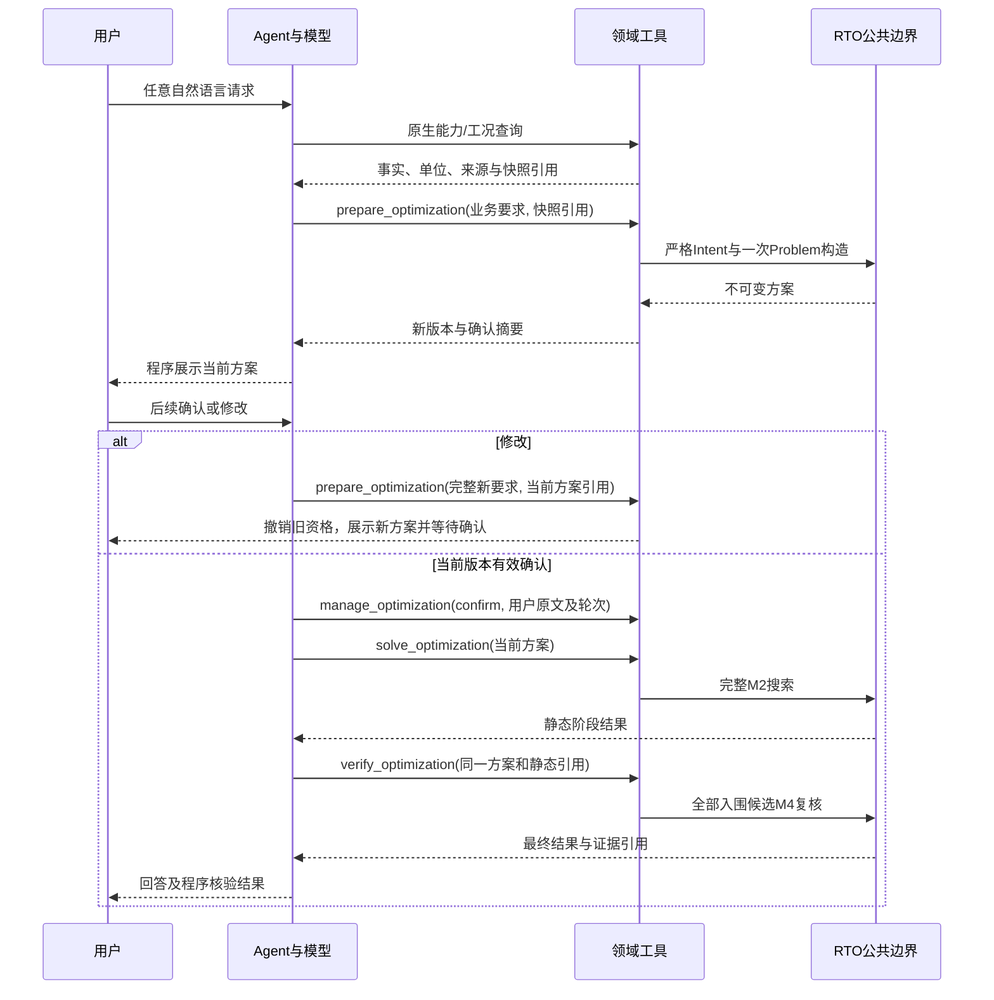

# 垂域模型与RTO通信协议

_2026-09-09 · 当前原生工具边界与独立D0公共合同。_

## 当前生产Agent

`rto-chat`和`python -m petroleum_rto.domain_model`共用一个原生工具Agent。任意自然语言直接进入LLM循环；模型收到工具Schema，返回原生函数调用，代码校验参数并回传工具结果。旧外层分类合同、意图/确认专用提示、四动作网关和分离Chat链已移除，没有失败回退到旧分类器的路径。

当前Agent不调用D0协商服务。D0继续作为独立的严格业务意图公共合同保留，不能把它的修复/澄清次数限制误认为当前Agent的对话限制。

| 边界 | 当前职责 | 不得承担 |
| --- | --- | --- |
| `domain_model/native.py` | Chat/Responses原生协议、完整流式接收、调用关联和推理状态 | 执行RTO或把正文猜成工具调用 |
| `assistant/native_tools.py` | 工具参数、快照、方案版本、确认资格及阶段引用 | 允许模型生成工况、任意路径或算法 |
| `rto.runtime.staged` | 严格Intent、不可变Problem、完整M2/M4与结果 | 根据自然语言猜授权或改写用户选择 |
| `rto.communication` | 独立D0请求/响应关联、能力解析和有界协商 | 读取Context、求解、仿真或控制当前Agent循环 |

## 工具调用与业务数据

工具声明从严格参数模型生成，同一参数模型在本地执行前校验。当前包括装置身份、工况读取、问题准备、方案管理、静态求解、动态复核、已有结果检查和全文分页。完整工具字段及条件见[Agent架构](../architecture/02_领域智能体架构与功能设计.md)。

工具传入的优化目标、变量、约束ID和候选数属于业务要求；程序根据已发布能力校验。测量值、组成、初态和运行模式来自读取并保存的受信Context。Problem在准备阶段构造并绑定快照，确认不会悄悄换成新工况；刷新工况须重新准备、展示并确认。

执行确认合同2.1.0沿用2.0.0的输入规则：只接受整条输入`/confirm`、`确认`或`确认执行`，仅忽略首尾空白；标点、引用及附加条件不被忽略。中文确认仍经过模型工具调用，程序核对实际用户输入、完整原文、轮次、已展示版本和资格；不符合输入规则时返回结构化`confirmation-input-required`。修改失败、未决输入及协议失败会暂停旧资格；同轮准备后不能确认。`/confirm`为直接程序确认入口。摘要、模型解释和工具返回文本均不能自授执行资格。

## 结果与恢复

静态回执只代表完整M2阶段，不能写成已完成动态验证。动态入口处理完整入围列表并返回最终七字段业务结果；最终排名、单位、基准和备选验证状态从受信证据投影。模型解释失败时，程序仍展示关键结果。

当前进程的已完成阶段直接复用；重新准备并确认同一问题时可严格重载现行workflow检查点，完整阶段不重复仿真。`/result [workflow_id]`及`inspect_optimization`只接受受控编号，指定已有运行时校验内部证据，不再支持任意目录或result.json路径。进程重启不恢复用户授权，不按文件修改时间猜最近结果。

业务结果和磁盘文件合同见[RTO综合说明](01_RTO系统综合说明.md)；会话摘要与原生推理续接见[Agent说明](../domain_model/01_聚合式垂域模型综合说明.md)。

## 保留的独立D0公共合同

`rto.communication`保留请求、响应、协商器、供应商调用结果以及`DomainModelPort`。它是供独立垂域意图部件组合使用的公共接口，目前没有生产DMX D0适配器，不能据此宣称已存在第二个完整Agent或可替换模型实现。

| 合同 | 用途 |
| --- | --- |
| `DomainCapabilityManifest` | 只暴露业务指标、目标、变量、偏好及基数；排除运行数值、门禁阈值、算法与内部路径 |
| `DomainModelRequest` | 请求及能力关联、完整用户消息、前次意图、澄清回答、修复反馈和输出政策 |
| `DomainModelResponse` | 完整Intent或结构化unsupported，不接受局部补丁 |
| `DomainModelInvocationResult` | 调用成功或供应商失败，保留安全分类与尝试元数据 |
| `CommunicationResult` | resolved、repair_required、needs_clarification、unsupported或failed |
| `OptimizationIntent` | 严格业务目标、方向、顺序、决策变量和结果要求，不携带受信工况 |

版本和字段以[合同源码](../../src/petroleum_rto/rto/communication/models.py)、[调用结果](../../src/petroleum_rto/rto/communication/invocation.py)及[意图合同](../../src/petroleum_rto/rto/intent/models.py)为准。工厂由[communication/factory.py](../../src/petroleum_rto/rto/communication/factory.py)和RTO公共runtime暴露；它加载公开能力并构造协商服务，不建立网络连接。

`start()`生成自足请求；`evaluate_response()`严格解码完整响应，校验request_ref和capability_manifest_ref后解析Intent。合同、关联或可修复业务错误通过`build_repair_retry()`请求完整替代；用户歧义通过`build_clarification_followup()`进入新意图轮。计数由[版本化协商政策](../../src/petroleum_rto/rto/communication/policy.py)限制，不进行无限重试或直接把澄清答案拼入受信Intent。

D0的`resolved`只表示业务意图解析成功，不读取Context、不构造Problem、不执行优化，也不赋予Agent确认资格。调用方若进入RTO仍必须经独立运行边界校验能力和Context。`run_confirmed_optimization`作为原有受信调用方公共API继续保留，当前Agent使用更细的staged接口。

保留[独立D0回归](../../tests/rto/unit/test_domain_communication.py)、相关gold数据及政策配置，检查合同严格性、关联、有界修复、澄清和能力拒绝。旧供应商适配器的专用分类/重试测试随实现删除；不得用它们维持第二条生产对话链。

## 验证边界

本地协议测试可以证明调用关联、参数拒绝、状态保留和执行次数，不能证明真实模型始终理解用户要求或忠于所有数值。真实模型的逐项兼容结果、未验证组合和下一步只记在[项目状态](../STATUS_REACT_REBUILD.md)。
