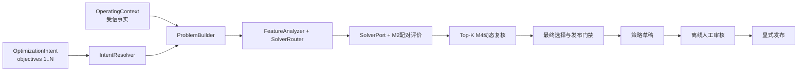

# RTO离线运行与策略库使用说明

_适用接口：统一`objectives[1..N]`离线RTO · 更新日期：2026-08-20 · 实时状态以[项目实施状态](../STATUS.md)为准_

---

## 📋 使用结论

当前默认API和CLI只使用一套目标数量无关的合同。单目标和多目标由`OptimizationIntent.objectives`的长度及结果请求表达，再由问题特征和系统政策路由到兼容求解器；用户不再选择“V1或V2”。

| 输入或操作 | 默认行为 |
| --- | --- |
| 一个目标 | 路由到当前确定性标量搜索插件 |
| 两个及以上目标 | 路由到当前确定性Pareto网格插件 |
| `point` | 只复核中心运行上下文 |
| `sampled-anchors` | 复核明确的离散锚点，不声称连续区间 |
| 成功且可发布 | 创建统一不可变策略草稿 |
| 审核或发布 | 必须分别显式调用，运行过程不会自动执行 |

> 当前所有输出都是`engineering_simulation_only`和`offline_simulation_only`，不具备DCS写入权限，不代表产品放行、现场安全边界或已验证经济收益。



## 📥 输入文件

统一运行使用两个独立JSON：

- `intent-file`：表达目标、方向、决策变量、业务约束、偏好和返回形式；不带运行上下文或算法名。
- `context-file`：表达受信的原油、进料、当前设定值、初始库存、模式、时刻和质量标签。

当前仓库示例：

- [单目标意图](../../configs/rto/intents/minimize_specific_furnace_energy.json)
- [质量—收率—能耗多目标意图](../../configs/rto/intents/quality_yield_energy.json)
- [CDU受信上下文](../../configs/rto/contexts/case_20260604.json)

解析器拒绝未知字段、重复JSON键、`NaN/Infinity`、布尔值冒充数值、未发布能力ID和方向冲突。意图中`ambiguities`非空时返回`needs_clarification`，不构造问题。

## 🔍 无求解校验

先查看公开能力投影：

```bash
PYTHONPATH=src .venv/bin/python -m petroleum_rto.rto.runtime.cli capabilities \
  --repo-root .
```

只校验意图，不绑定上下文也不调用求解器：

```bash
PYTHONPATH=src .venv/bin/python -m petroleum_rto.rto.runtime.cli validate-intent \
  --repo-root . \
  --intent-file configs/rto/intents/quality_yield_energy.json
```

绑定受信上下文并构造问题，但仍不搜索、不仿真、不创建运行目录：

```bash
PYTHONPATH=src .venv/bin/python -m petroleum_rto.rto.runtime.cli validate-problem \
  --repo-root . \
  --intent-file configs/rto/intents/quality_yield_energy.json \
  --context-file configs/rto/contexts/case_20260604.json
```

`validate-problem`结果会显示目标向量、决策变量、系统硬门禁、独立发布门禁、结果形式及`solver_called=false`。

## ⚙️ 运行和恢复

单目标和多目标只更换`intent-file`，命令不变：

```bash
PYTHONPATH=src .venv/bin/python -m petroleum_rto.rto.runtime.cli run \
  --repo-root . \
  --intent-file configs/rto/intents/minimize_specific_furnace_energy.json \
  --context-file configs/rto/contexts/case_20260604.json \
  --coverage-policy point \
  --run-root runs/rto \
  --library-root runs/rto/strategy-library \
  --actor offline-rto-operator
```

多目标只改为：

```text
--intent-file configs/rto/intents/quality_yield_energy.json
```

相同语义输入生成相同workflow ID。再次执行会先严格读取已提交阶段，并从最后一个完整阶段恢复。已完成workflow的`physical_m2_executions_this_call`和`physical_m4_executions_this_call`应均为`0`。

当前统一artifact顺序为：

```text
request.json
intent.json
context.json
capability_bundle.json
problem.json
solver_route.json
static_solve.json
static_selection.json
dynamic_evaluations.json
finalization.json
anchor_validation.json       # sampled-anchors时可选
strategy_draft.json          # 成功、可发布且覆盖通过时可选
result.json
events.jsonl
manifest.json                # 最后提交
simulator/                   # M7物理证据
```

每个阶段artifact先原子提交，事件再追加到hash链。事件存在但对应artifact缺失、阶段跳跃、未知顶层文件、符号链接或manifest不闭合都会停止恢复，不会盲目覆盖。

## ✅ 严格检查

新统一运行和历史V1/V2运行共用一条`inspect`命令。系统只根据manifest中的`schema_id + schema_version + manifest_version`精确分流，不按目录名、目标数或字段猜测：

```bash
PYTHONPATH=src .venv/bin/python -m petroleum_rto.rto.runtime.cli inspect \
  --repo-root . \
  --run-dir runs/rto/<workflow-id> \
  --library-root runs/rto/strategy-library
```

严格读取会核对阶段引用、路由决策、求解结果、M2/M4配对评价重算、动态回退、发布判定、锚点、策略、事件链和manifest。仿真证据用workflow内相对定位器解析，因此统一运行目录可整体搬迁。检查不执行新仿真。

某些历史V1外部请求只workflow中保存了请求引用，此时自动检查需要附加：

```text
--legacy-request-file <original-v1-request.json>
```

历史artifact字节不改写；旧绝对`run_ref`的跨机器搬迁能力尚未闭合，因此历史reader仍是保留项，旧代码尚不具备物理删除条件。

## 🔐 策略草稿、审核和发布

workflow只在最终候选M2/M4可行、发布改善门禁通过且覆盖要求满足时创建`draft`。草稿payload和release不可变，状态变化使用append-only事件。

审核和发布必须分两步执行：

```bash
rto-offline approve \
  --library-root ./runs/rto/strategy-library \
  --strategy-id <strategy-id> \
  --revision 1 \
  --actor offline-reviewer \
  --reason "offline evidence reviewed"

rto-offline publish \
  --library-root ./runs/rto/strategy-library \
  --strategy-id <strategy-id> \
  --revision 1 \
  --actor offline-release-owner \
  --reason "offline library release"
```

统一查询器只返回`published`修订，并且只在请求落入一个明确采样锚点的测量容差时命中；它不用`min/max`对锚点之间插值。当前查询以Python `StrategyRepository.query(StrategyQuery(...))`提供，CLI尚未暴露统一查询子命令。

离线`approved`和`published`只表示策略库治理状态，不等于MOC、SIS、工艺、生产或产品质量审批。

## 🔗 Python默认入口

`petroleum_rto.rto.runtime`中的默认`run_offline`、`inspect_offline`和`query_strategies`已是统一入口。顶层`petroleum_rto.rto`的`ProblemBuilder`、`CandidatePlanCompiler`、`OfflineRtoOrchestrator`和`StrategyRepository`也指向目标数量无关实现。

历史能力只以显式名保留，例如`run_legacy_v1_request`、`run_legacy_v2_request`、`read_legacy_offline_run_v1`和`read_legacy_offline_run_v2`。新业务代码不得继续从无版本名入口获取旧对象。

## 📚 历史兼容命令

旧V1/V2 writer只用于重放或审计历史artifact，不是新业务入口：

```text
rto-offline legacy-validate-v1
rto-offline legacy-validate-v2
rto-offline legacy-run-v1
rto-offline legacy-run-v2
rto-offline legacy-inspect-v1
rto-offline legacy-inspect-v2
rto-offline legacy-query-v1
```

旧JSON、bundle、strict reader和现存运行证据仍保留原字节。在历史绝对证据路径搬迁、包内兼容bundle和真实strict-auto-read门禁全部闭合前，不删除这些兼容实现。

## 📊 结果阅读和常见误解

| 字段 | 含义 |
| --- | --- |
| `objective_count` | 问题的目标数，不是schema版本 |
| `selected_solver_id` | 系统政策路由的求解插件 |
| `static_evaluation_count` | 本次求解保存的M2候选评价数 |
| `dynamic_shortlist_count` | 进入M4动态复核的候选数 |
| `selected_setpoints` | 最终选中设定值、数值和规范单位；这是用户应先查看的确定性结果 |
| `selected_objectives` | 选中候选的配对目标摘要 |
| `optimization_status` | 最终动态选择和发布性结果 |
| `strategy_state` | 草稿是否存在；不代表已批准或已发布 |
| `physical_*_executions_this_call` | 本次调用新增的物理执行数 |
| `manifest_fingerprint` | 整个workflow证据集的完整性标识 |

- 备选列表是静态排名或第一Pareto前沿证据，可包含M4不通过项；只有单列的选中引用表示完整动态回退后的候选。
- 运行错误不等于工艺不可行。`invalid_request`、`evaluation_error`和`process_infeasible`不得合并。
- 质量代理基准为零时，相对改善没有定义；系统保存绝对变化和不可用原因，不制造虚假比例。
- `sampled-anchors`只是有限点覆盖，不是数学上的连续区间证明。

需要自然语言说明时可运行`rto-intent`或`rto-chat`，进入会话后输入`/result <run-dir或result.json>`。该命令只严格读取已有运行并解释安全摘要，不会启动新的求解或仿真；模型失败也不影响本地`selected_setpoints`显示。

## 🔗 相关资料

- [RTO系统综合说明](01_RTO系统综合说明.md)
- [项目实施状态](../STATUS.md)
- [RTO历史文档索引](archive/README.md)
- [R6历史单目标验证报告](../../reports/rto/R6_OFFLINE_RTO_REPORT.md)
- [R11历史多目标验证报告](../../reports/rto/R11_MULTI_OBJECTIVE_OFFLINE_REPORT.md)

---

_最后更新：2026-08-21 · 验证平台：macOS、Python 3.12 · 维护范围：统一离线RTO、结果解释与历史只读兼容入口_
