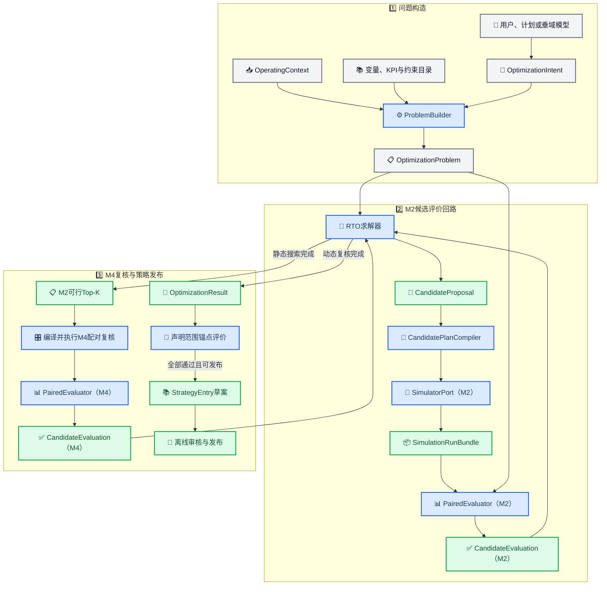
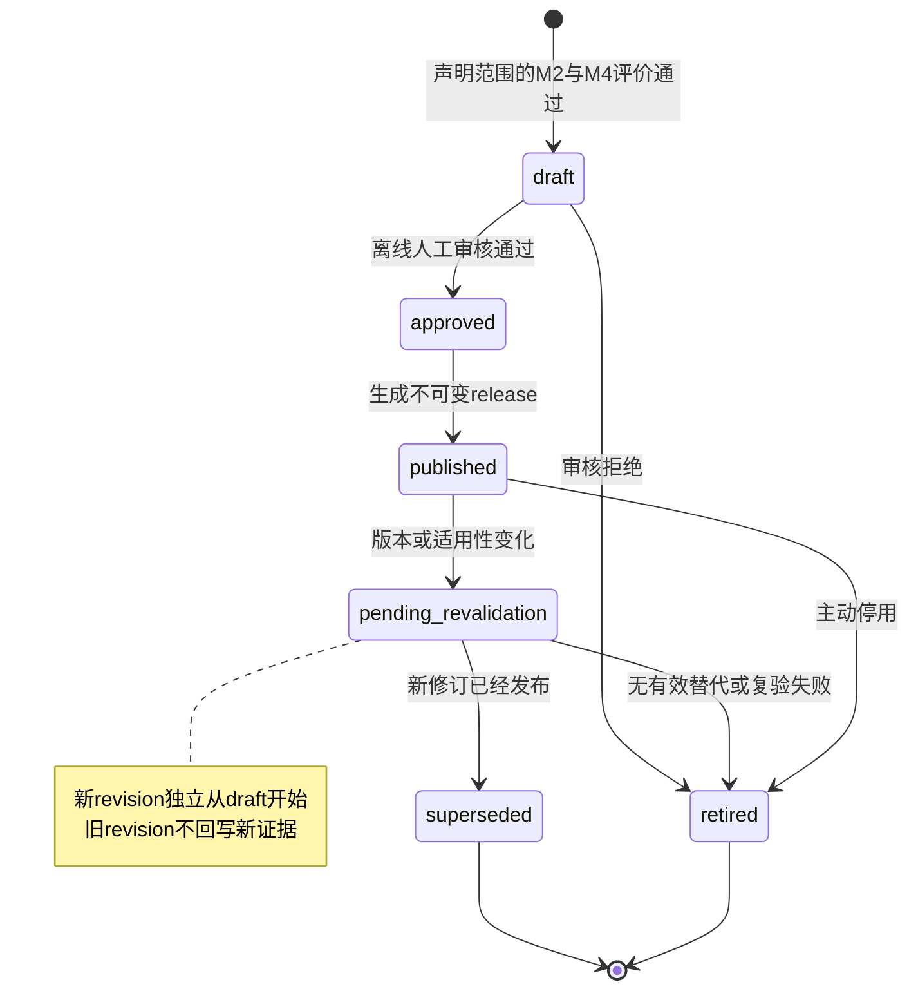
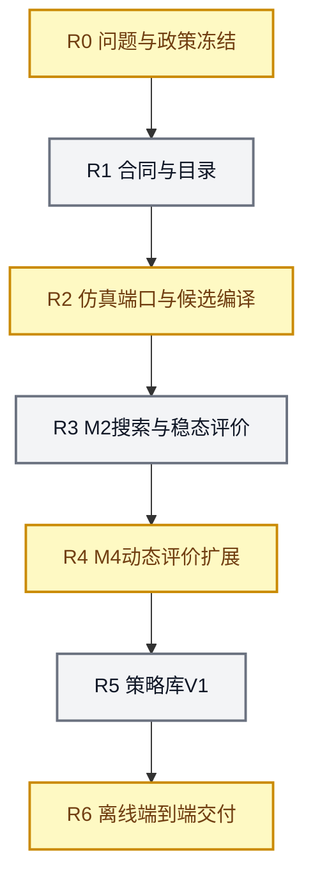

# RTO、策略库与机理仿真解耦实施方案

_版本：V1.1 · 更新日期：2026-08-19 · 本文保存已完成单目标RTO基线的架构、合同和R0～R6验收门槛；实际进度和授权边界以 [STATUS](../../STATUS.md) 为准。_

> 📌 **归档说明：** 本文只保留历史单目标基线；现行统一架构以[RTO系统综合说明](../01_RTO系统综合说明.md)为准。

---

## 🎯 目的与结论

本项目下一阶段的目标，是在已经完成的 CDU Mini Loop 机理仿真之上，建立可被未来大型智能体组合使用的离线 RTO 与策略库部件。各部件必须通过稳定、版本化的中立合同协作，使垂域模型、优化算法、当前 Python 机理模型和未来 HYSYS 仿真可以分别演化。

首版冻结以下设计结论：

1. **垂域模型理解业务目标，机理模型不理解优化目标。** 垂域模型或人工输入把自然语言转成结构化 `OptimizationIntent`；确定性问题构造器再生成 `OptimizationProblem`。
2. **RTO通过评价回路使用机理模型。** RTO提出候选稳态设定值，仿真返回物理结果，统一评价器计算KPI、约束和相对基准差值，再把评价反馈给RTO；不是一次性把问题送入RTO后才做仿真。
3. **机理模型只接收仿真请求。** 它不知道“节能优先”或“提高收率”，只执行给定上下文、候选设定值或事件，并返回守恒、收敛、产品、能耗、动态和控制证据。
4. **首版使用单目标、确定性、低维优化。** 稳定性、质量代理和收率作为依次检查的硬门禁；在全部可行候选中，单目标最小化“单位进料炉燃料热负荷代理”。
5. **进料负荷是上下文，不是首版决策变量。** 首批端到端决策变量为炉出口温度目标和塔顶压力目标；RTO最终输出带单位和证据引用的稳态高层设定值向量。
6. **M2筛选全部候选，M4只复核短名单，M3保留为诊断工具。** 开环能力不删除，但不进入首版每个候选的必经路径。
7. **首版同步、单进程、离线运行。** 不引入Redis、消息队列、代理模型、负案例知识库或HYSYS；架构保留相应端口，出现明确吞吐或跨进程需求后再扩展。
8. **策略库只发布通过配对评价和人工审核的正向策略。** 失败候选保留为运行证据和候选评价，不在首版建立负案例知识档案。

本文中的决策变量局部范围、质量代理阈值、收率阈值和最小改善率属于 **V1合成工程政策初值**，不是现场安全边界或产品放行标准；R0冻结结果及字段来源见[问题与政策冻结记录](03_R0问题与政策冻结记录.md)。

> 📌 **后续扩展：** 本文继续作为V1兼容基线，不改写历史单目标语义。R7～R11多目标合同、Pareto搜索和垂域意图接口以[多目标扩展实施准备](05_RTO多目标与垂域意图接口扩展实施准备.md)为准。

## 🧭 职责边界

### 业务意图、优化与仿真的分工

| 部件 | 负责 | 不负责 |
| --- | --- | --- |
| 用户、生产计划或垂域模型 | 理解自然语言、选择目标和优先级、引用生产上下文 | 直接生成M4比例、求解机理方程、宣称候选已验证 |
| 确定性问题构造器 | 校验意图、补全目录、换算单位、冻结版本与约束，生成优化问题 | 搜索最优点、调用模型内部类、自由解释自然语言 |
| RTO求解器 | 按问题合同提出候选、接收评价、确定Top-K和最终解 | 解释业务文本、计算机理结果、向DCS写值 |
| 候选编译器 | 把中立物理量编译为M2参数或M4设定值事件 | 重新定义目标、越过决策目录、修改模型内部参数 |
| 仿真适配器 | 通过稳定接口调用CDU M7；未来可替换为HYSYS适配器 | 把特定仿真实现泄漏到RTO核心 |
| 机理仿真 | 在给定输入下求解物理、动态和基础控制响应 | 理解优化优先级、给候选排序、发布策略 |
| 统一评价器 | 提取KPI、计算约束裕度、与同上下文基准配对比较 | 重复求解机理模型、篡改原始运行证据 |
| 策略库 | 保存适用上下文、动作、预期效果、约束裕度、证据和生命周期 | 自动升级为现场策略、保存未经审核的“最佳点” |

### 唯一主链



由于首版没有独立代理模型，RTO必须在搜索过程中多次调用评价回路。`CandidateProposal`表示一次待评价查询；搜索结束后的排序结果应称为 `OptimizationResult`，不能把尚未评价的候选称为最终策略。

## 🧩 模块化设计

### 建议代码边界

下一阶段建议新增独立的 `src/petroleum_rto/rto/` 包，不把优化代码放进 `src/petroleum_rto/cdu/`：

| 建议模块 | 主要职责 | 依赖规则 |
| --- | --- | --- |
| `contracts/` | RTO中立数据合同、严格解析与规范指纹 | 不依赖CDU或具体求解器 |
| `catalogs/` | 决策变量、KPI、约束和优先级目录 | 只依赖合同与版本化JSON |
| `problem/` | `OptimizationIntent`和上下文到问题的确定性构造 | 不调用仿真，不包含随机逻辑 |
| `optimizer/` | 确定性网格和局部细化、缓存、终止与排序 | 只依赖 `CandidateEvaluatorPort` 或等价回调 |
| `compilation/` | 中立候选到各评价层请求的编译 | 通过目录规则映射，不导入模型内部设备类 |
| `ports/` | `SimulatorPort`、`CandidateEvaluatorPort`、策略仓储端口 | 不包含CDU实现 |
| `adapters/cdu_m7.py` | 包装现有 `preview/run/read_run` | 唯一允许导入 `petroleum_rto.cdu.runtime` 的RTO模块 |
| `evaluation/` | KPI提取、硬约束、基准配对、动态门禁 | 原始结果只读，不重复仿真 |
| `strategies/` | 策略构建、审核状态、版本和查询 | 不内嵌原始时间序列 |
| `orchestration/` | 串联离线任务、恢复和审计事件 | V1同步执行，不直接依赖Redis |

核心依赖方向为：

`contracts ← catalogs/problem/optimizer/evaluation/strategies ← orchestration → ports ← adapters`

机理模型不反向导入RTO。未来接入HYSYS时新增适配器并实现同一 `SimulatorPort`，上层问题、求解、评价和策略合同保持不变。

### 仿真服务端口

首版端口至少提供：

```text
preview(request) -> SimulationPreview
evaluate(request, expected_preview_fingerprint) -> SimulationRunBundle
read_evidence(run_ref) -> SimulationRunBundle
```

CDU适配器内部严格执行M7现有的 `preview → run(expected_preview_fingerprint=...) → read_run`。这里的“确认”是程序把刚得到的preview fingerprint原样回传的完整性握手，不要求逐候选人工批准。RTO不能导入M2、M3或M4内部类，也不能跳过该握手。首版无需先建设HTTP服务；若未来大型智能体需要跨进程调用，可在端口外包一层HTTP或任务服务，不能改变端口语义。

适配器复用现有 `steady-baseline` 和 `closed-loop-feed-step` preset，不向M7注册虚构的 `rto-*` preset。`pair_id`、`candidate_id`和迭代序号保留在外层合同，不写入M7 `metadata`；当前metadata会参与请求指纹，把审计ID塞入其中会破坏相同物理输入的缓存复用。

## 📜 数据合同与指纹

### 通用合同规则

所有合同都应满足：

- 显式 `schema_version`、对象版本、唯一标识和语义指纹
- 严格字段；未知字段、缺字段、非法枚举、布尔值冒充数值、`NaN`和`Inf`一律拒绝
- 业务显示单位与规范SI单位同时可追溯；指纹以单位换算后的规范值计算
- 映射键顺序不影响指纹，同一物理候选只产生一个缓存键
- 对其他对象的引用同时保存 `id` 和 `fingerprint`，不能只比较版本字符串
- 时间戳、运行序号和展示文本不进入语义指纹
- 规范JSON和SHA-256规则版本化；原始文本可留档，但不是机器执行的事实来源
- 所有数值、约束和证据声明 `claim_scope=engineering_simulation_only`
- 面向策略的合同还必须机器可判地保存 `execution_scope=offline_simulation_only`、`control_authority=none`、`field_validated=false` 和 `dcs_write_capability=false`

### V1合同清单

| 合同 | 生产者 → 消费者 | V1关键字段 |
| --- | --- | --- |
| `OptimizationIntentV1` | 垂域模型、人工fixture或意图模板 → 问题构造器 | 来源、原始文本、上下文引用、单目标请求、优先级profile、决策/约束profile、输出类型 |
| `OperatingContextV1` | 上下文fixture → 问题构造器、编译器、评价器 | 案例与资源指纹、进料、原油、当前高层SP、三个可选库存初态比例、模式、数据时刻与质量标签 |
| `DecisionVariableCatalogV1` | 配置 → 问题构造器、编译器 | 角色、单位、名义值来源、局部边界、步长、M2/M4映射、控制器所有权、启用状态 |
| `KpiCatalogV1` | 配置 → 评价器 | 指标ID、公式/源路径、单位、方向、提取规则版本、代理标签 |
| `ConstraintProfileV1` | 配置 → 问题构造器、评价器 | 门禁顺序、评价层、比较符、阈值、归一化尺度、证据要求 |
| `OptimizationProblemV1` | 问题构造器 → RTO、评价器 | 意图/上下文引用、决策域、单目标、硬约束、评价计划、搜索计划、全部依赖版本 |
| `CandidateProposalV1` | RTO → 编译器 | 问题/上下文引用、规范决策向量、生成阶段、父候选引用、候选指纹 |
| `SimulationEvaluationRequestV1` | 编译器 → 仿真端口 | 评价层、配对ID/角色、外层审计引用、完整M7请求、预期输入与资源指纹 |
| `SimulationRunBundleV1` | 仿真端口 → 评价器 | 状态、摘要、事件/轨迹引用、manifest/result/input指纹、版本和失败原因 |
| `CandidateEvaluationV1` | 评价器 → RTO、策略构建器 | 评价状态、原因码、目标基准/候选/差值、各约束裕度、动态摘要、证据引用 |
| `OptimizationResultV1` | RTO → 编排器 | 终态、选中候选、M2/M4评价引用、评价次数、终止原因、算法与配置版本 |
| `StrategyEntryV1` | 策略构建器 →离线人工审核 | 适用性、固定step-hold动作、预期效果、最差裕度、停止/回退、证据和离线权限字段 |
| `StrategyLibraryReleaseV1` | 审核器 → 查询方 | 不可变策略版本集合、目录指纹、发布时间、审核记录和替代关系 |

`CandidateEvaluationV1.status`至少区分 `feasible`、`process_infeasible`、`invalid_request`、`evaluation_error` 和 `not_evaluated`。只有明确的模型或约束证据才能标记 `process_infeasible`；预检拒绝和映射错误属于 `invalid_request`，资源、I/O、适配器或未知执行错误属于 `evaluation_error`，都不能参与排序或被汇总成“工艺无可行解”。

`OptimizationResultV1.status`至少区分 `success`、`no_static_feasible`、`shortlist_dynamic_failed`、`feasible_not_publishable` 和 `evaluation_error`。`success`必须同时引用选中候选的M2与M4配对评价；只有它可以继续构建策略草案。

### 没有垂域模型时的输入方式

首版使用版本化JSON fixture或人工表单生成 `OptimizationIntentV1`。可以保留一段 `original_text`，例如“在当前原油和进料下，满足稳定、质量和收率要求后降低能耗”，但机器执行必须依赖已解析的结构化字段。未来垂域模型只需输出同一严格合同；它不能输出任意公式字符串、M4比例或未经目录验证的决策变量。

R6.1外部入口使用`ExternalOptimizationRequestV1`作为文件边界：`operating_context`引用受信基础上下文，`optimization_intent`承载人工或垂域模型输出，适配器再生成内部`OperatingContextV1`和`OptimizationIntentV1`。外部请求ID与指纹进入workflow请求合同；严格重载必须提供同一JSON。该入口不改变职责分配，垂域模型仍不得成为进料、原油组成或现场状态的事实来源。

`ProblemBuilder`必须是纯确定性的：同一意图、上下文和目录逐字节产生同一问题；它只组织问题，不求解、不调用仿真，也不要求垂域模型在线参与。

## 📥 场景、上下文与问题构造

### 两类输入分离

用户提出的“场景构造器”应拆成两个对象：

| 对象 | 表达内容 | 首版来源 |
| --- | --- | --- |
| `OperatingContext` | 原油、进料负荷、温压、当前SP、三个可选库存初态比例、不可操纵扰动、模型与案例版本 | M7 preset＋显式覆盖，或版本化上下文JSON |
| `OptimizationIntent` | 优化什么、方向、优先级、允许的决策/约束profile、输出形式 | 人工结构化JSON；未来由垂域模型生成 |

M7 preset适合承载机理模型的标准运行条件，但不能承载业务目标。问题构造器将两者和目录合并为 `OptimizationProblem`；其输出既供RTO使用，也供统一评价器和策略审计使用。

### 进料负荷的语义

“进料负荷”是装置入口新鲜原油质量流量，当前基准为 `407.3 t/h`，不是炉前闪蒸液流量。首版把它固定为 `OperatingContext`，唯一实施来源是版本化fixture和M7 preset；生产计划或DCS快照属于未来上下文采集端口，当前没有连接能力。垂域模型只能引用已有上下文，不能凭空生成现场事实。

未来若要让RTO改变进料负荷，必须先形成新的决策profile，并重新定义产量、经济、库存、控制与边界约束；不能只把已有输入白名单字段改成“可优化”。

### “同上下文基准配对”的含义

对每个候选，都要与一个可复核的基准运行比较。同一对中以下内容必须相同：

- `OperatingContext`及其指纹
- 原油、进料、模型、资源、控制器和评价profile版本
- 三个库存初态比例、时域、步长和不可操纵扰动计划
- KPI提取和约束规则版本

唯一允许不同的是决策向量及由它编译出的动作。逻辑上每个候选都有基准；工程上相同上下文和评价层的基准只运行一次并按完整缓存键复用。基准自身失败时，该上下文不可评价，不能把候选错误标记为“劣于基准”。

## 🔧 V1优化问题

### 目标与优先级

首版只建立一个标量目标：

```text
specific_furnace_fuel_energy_mj_per_t
= furnace_fuel_duty_w / feed_mass_flow_kg_s / 1000
```

该指标的准确名称是“单位进料炉燃料热负荷代理”，不能称为全装置能耗、利润或完整经济目标。当前已验证基准 `21,312,989.029536318 W` 和 `407.3 t/h` 对应 `188.378985 MJ/t`，实现时应作为单位换算回归值。

用户给出的优先级“稳定性 → 质量 → 收率 → 能耗”在单目标问题中按以下方式实现：

1. 模型执行、有限性、非负性、收敛和守恒是结构先决条件。
2. 稳定性是M4最高优先级硬门禁。
3. 质量使用明确标为代理的保持门禁。
4. 有价值馏分收率使用相对同上下文基准的最低门禁。
5. 只有全部门禁通过后，才按单位进料炉燃料热负荷代理排序。

这不是随意加权和。任何高优先级硬门禁失败都不能由更低能耗抵消。

计算执行顺序可以先用便宜的M2检查结构、质量代理和收率，再为短名单支付M4成本；这只是计算漏斗，不改变最终优先级。任何候选即使M2表现最好，也必须通过最高优先级的M4稳定性门禁才能被选中。

### 首批决策变量

| 变量 | V1角色 | M2映射 | M4映射 | V1局部搜索范围 |
| --- | --- | --- | --- | --- |
| 炉出口温度目标 | 启用决策 | `operating.furnace_outlet_temperature_c` | `furnace_temperature.setpoint_ratio` | `353.2～357.2 ℃`；粗步长`1 ℃`；细步长`0.5 ℃` |
| 塔顶压力目标 | 启用决策 | `operating.tower_top_pressure_mpa_g` | `top_pressure.setpoint_ratio` | `0.049～0.053 MPa(g)`；粗步长`0.001`；细步长`0.0005` |
| 新鲜原油进料 | 固定上下文 | `feed.mass_flow_t_h` | 不作为RTO动作 | 名义上下文及验证锚点 |
| 回流比 | 延后决策 | M2可用 | 当前无对应M4高层SP | 不进入首版端到端优化 |
| 一、二、三路循环取热 | 固定/延后 | M2可用 | PA1由塔顶温度PI拥有；PA2/3固定 | 不进入首版端到端优化 |
| 塔顶温度目标 | 延后 | 当前M2不形成有效决策响应 | M4可用 | 不进入首版端到端优化 |

上述局部范围是围绕合成名义点的RTO试验范围，不是M7解析白名单、更不是现场安全范围。实现前必须把范围、变量所有权和现场可操纵性作为R0评审项。

### V1约束与发布门禁初值

| 顺序 | 性质 | 门禁 | 初始规则 | 说明 |
| ---: | --- | --- | --- | --- |
| 0 | 可评价性 | M2结构与数值 | 合法请求、模型正常执行、回流收敛、守恒通过、有限且非负 | 系统、资源、I/O或编译错误是 `evaluation_error/invalid_request`，不是工艺不可行 |
| 1 | 可行性 | M4稳定性 | `acceptance_passed=true`且control fingerprint匹配 | 现有验收已包含七回路、真实库存`0.8～1.2`、连续饱和`<=300 s`和尾窗门禁；RTO只引用并提取裕度，不复制实现 |
| 2 | 可行性 | 质量代理保持 | 所选方向性质量代理相对基准不利变化不超过`0.5%` | 暂定政策值，不是产品标准 |
| 3 | 可行性 | 有价值馏分收率 | 汽油＋煤油＋轻柴＋重柴质量分数不低于基准减`0.002` | 相对基准的绝对分数差 |
| 4 | 可发布性 | 策略发布改善 | 单位进料炉燃料代理至少改善`0.5%` | 不参与物理可行性；改善不足返回 `feasible_not_publishable`，不生成策略 |

规则必须放进版本化 `ConstraintProfileV1`，不能散落在算法代码中。质量代理的方向和源路径须由KPI目录逐项冻结，不能用模糊的“质量通过”字段替代。

KPI与约束需要分开：KPI是从模型结果提取或计算的量，例如产品收率、质量方向性代理、炉燃料热负荷、库存峰值和稳定时间；约束是施加在这些KPI或运行状态上的判定规则。首版约束既包括产品侧要求，也包括收敛、守恒、适用域、库存和控制饱和等设备/模型限制，但所有来源和声明范围都必须显式标注。

## 🔄 候选编译与评价漏斗

### M2快速筛选

M2快速筛选指：问题构造器先把越决策域的请求作为合同错误拒绝，再对域内候选执行廉价稳态求解，识别不收敛、守恒失败、非有限、负流量以及质量/收率门禁失败的工艺候选，只把少量静态可行点送到M4。`0.5%`最小改善率在最终选择后检查，不参与搜索和细化，也不把“可行但改善不足”伪装成无可行解。

当前正式基线中，M2执行内核中位约 `0.170 s/次`，M4执行内核中位约 `143.770 s/次`，相差约845倍；这些数值绑定特定源码和机器，不含artifact写出与 `read_run`。因此“全部M2、Top-K M4”是必要的计算漏斗。M2只能证明稳态候选在当前缩减模型上可行，不能证明闭环动态稳定。

### M2配对规则

- 基准请求使用上下文中的名义炉温和塔顶压力。
- 候选请求只替换这两个决策参数。
- 对完整嵌套M7请求执行deep diff；除两个 `parameters.*` 决策值外，`preset_id`、`run_type`、`random_seed`、metadata、scenario、overrides和三个库存初态比例必须完全相同。
- 候选与基准均走M7自定义输入预览和程序化指纹握手。

### M4配对规则

M4用于验证从当前基准工作点切换到候选设定值的闭环过程，必须遵守：

- 基准和候选的 `parameters`、`overrides`、三个库存初态比例完全相同，均从当前上下文基准稳态初始化。
- 基准必须显式设置 `scenario.events=[]`，取消 `closed-loop-feed-step` preset默认的600秒进料`+5%`事件。
- 候选必须显式给出完整事件数组，在 `600 s` 同时写入炉温和塔顶压力的高层设定值事件。
- 候选值不能同时写进M4的 `parameters`；否则模型会从候选稳态初始化，掩盖实际切换过程。
- 对完整嵌套M7请求执行deep diff；唯一允许差异为 `scenario.events`。当前M4事件使用设定值比例且 `duration_s` 为空；首版固定 `7200 s` 时域和 `1 s` 步长，只允许一次共同变更时刻。

比例必须由候选编译器用绝对物理量计算：

```text
furnace_ratio = candidate_temperature_K / baseline_loop_nominal_temperature_K
pressure_ratio = candidate_pressure_Pa(a) / baseline_loop_nominal_pressure_Pa(a)
```

分母必须来自同一M4基准初始化得到的loop nominal PV；编译器还要断言上下文名义SP与它一致，并在运行证据中核对600秒后的绝对目标恰等于候选SI值。例如，从 `355.2 ℃` 切到 `353.5 ℃` 的比例是 `(353.5+273.15)/(355.2+273.15)=0.9972945015`；从 `0.051 MPa(g)` 切到 `0.050 MPa(g)` 的比例按绝压计算为 `0.9934350894`。禁止直接用摄氏度或表压相除。这两个数值是编译器单位换算反例，不要求成为默认搜索格点。

### 统一评价器的增量职责

机理模型已经负责求解和输出原始结果；统一评价器在此基础上增加跨候选的一致政策语义：

- 从版本化源路径提取炉燃料、进料、产品收率和质量代理
- 校验运行状态、收敛、守恒、适用域和证据完整性
- 计算目标值、基准差值、相对改善和规范化约束裕度
- 读取M4闭环验收、库存、饱和和稳定时间摘要
- 强制检查配对上下文、版本、时域、三个库存初态比例和事件是否一致
- 生成不复制原始轨迹的 `CandidateEvaluation`

因此评价器不重复机理模型功能，也不能只读取一个“success”字段。它把物理输出转成RTO可消费、可比较、可审计的目标和约束结果。V1目标、质量代理和收率来自M2配对；M4只增加动态稳定门禁和解释性裕度，不把两层混成未定义的综合分数。

`rejected`或`failed`不能统一映射成工艺不可行：预检、编译、资源、I/O或适配器失败必须返回 `invalid_request/evaluation_error`并停止本次可信排序或执行显式重试；只有合法候选得到明确收敛或约束失败证据时，才标记 `process_infeasible`。

## 🔎 V1确定性搜索

首版不引入SciPy、随机算法或代理模型，采用固定粗网格加局部细化：

1. 炉温取 `{353.2, 354.2, 355.2, 356.2, 357.2} ℃`。
2. 塔顶压力取 `{0.049, 0.050, 0.051, 0.052, 0.053} MPa(g)`。
3. 形成25个粗网格点，包含名义基准。
4. 以最佳静态可行粗网格点为中心，用 `0.5 ℃` 和 `0.0005 MPa(g)` 形成 `3×3` 细化网格；中心点已评价，裁剪边界并按候选指纹去重后最多新增8点。
5. 每个优化上下文的M2物理执行总数不超过33；静态Top-3候选进入M4，另执行一次可复用M4基准。
6. 若Top-3中有动态可行候选，RTO按静态稳定顺序选择首个；若Top-3全部动态失败，返回 `shortlist_dynamic_failed`且不生成策略，不能宣称未验证的其余候选全局无解。

静态排序使用可传递的固定键：规范化目标值精确升序；目标值完全相同时，依次选择最小规范化约束裕度更大者、距名义点的规范化L1动作更小者和候选指纹字典序。`0.01 MJ/t`只能作为展示时的近似差异提示，不能用作两两epsilon比较器。

相同问题、上下文和规范SI候选必须命中同一缓存。即使调用方给出不同 `candidate_id`，同一物理向量也只执行一次。工艺不可行点保留完整原因和运行证据；系统或评价错误不得写入可行性排序。

基准缓存键至少包含上下文指纹、评价层、模型/资源/控制器/场景指纹、三个库存初态比例、扰动计划以及KPI/约束profile指纹；任一项变化都必须重新运行基准。

## 📚 策略库V1

### 最小策略对象

`StrategyEntryV1`只保留可检索、可复核、离线可应用、可回退和可审计的关键字段：

| 字段组 | 内容 |
| --- | --- |
| 身份 | 必填 `strategy_id`、revision、当前状态；`supersedes`仅新修订填写，`library_release_ref`发布前为空 |
| 适用性 | 案例/原油指纹、`coverage_kind=point/sampled_anchors`、显式进料锚点、运行模式和排除条件 |
| 触发条件 | 必需数据、数据质量、当前工况与策略上下文匹配规则 |
| 动作 | 绝对高层SP向量、单位、`application_profile_ref=step_hold_v1`、共同切换时刻和保持规则 |
| 目标与约束 | objective、KPI和constraint profile引用 |
| 预期效果 | 各锚点基准、候选、差值和最差情形，不夸大为现场收益 |
| 停止与回退 | 基准SP向量、离线观察窗、停止条件和回退动作；不命名为现场安全联锁 |
| 证据 | 问题、优化结果、M2/M4评价及依赖版本的引用；完整评价和M7运行证据留在工作流证据文件中，不复制进策略正文 |
| 权限范围 | `offline_simulation_only`、无控制权、未现场验证、无DCS写能力 |
| 审核与发布 | 生成记录必填；审核、批准、发布和替代使用append-only事件，发生前相应引用为空 |

策略条目不内嵌完整评价、M7证据对象或时间序列。每个锚点只保存M2/M4评价引用、基准与候选目标摘要、相对改善和最差裕度；完整评价分别保存在 `static_search.json`、`optimization_result.json` 和 `anchor_validation.json`，底层运行证据由兼容runtime/software版本的M7严格reader重载。旧式内嵌评价的草稿只作兼容读取，重新序列化时必须输出精简形式。模型、控制器、KPI、约束、目录或上下文定义变化时，相关策略通过append-only事件进入 `pending_revalidation`。

### 生命周期与规则演化



“规则演化”不是让模型自动改写已发布规则，而是基于新证据生成不可变新修订：

1. 触发器发现模型、控制器、KPI、约束或适用上下文发生变化。
2. 给旧revision追加 `pending_revalidation` 事件，原payload、证据和release保持不变。
3. 创建新revision草案，使用新版本在声明的全部锚点重新执行M2/M4配对；必要时重跑RTO。
4. 统一评价器生成新评价，离线人工审核差异与声明范围。
5. 通过后发布新revision并记录 `supersedes`，再给旧revision追加 `superseded` 事件；失败则不发布新revision。

生命周期变化以append-only状态事件记录；已经发布的策略payload和library release保持不可变。复验产生的新证据必须进入新revision，不能回写旧发布对象。

失败候选不生成策略条目。其 `CandidateEvaluation`、原因码和M7运行证据仍按证据保留期保存，首版不把它们组织成负案例知识库。

### 示例

以下数值只用于解释流程，不是本轮新仿真结论：

- 上下文：`case_20260604`，进料 `407.3 t/h`，当前SP为 `355.2 ℃`、`0.051 MPa(g)`。
- 意图：稳定、质量和收率门禁通过后，最小化单位进料炉燃料代理。
- RTO候选A：`354.2 ℃`、`0.050 MPa(g)`，属于默认粗网格点。
- M2若显示能耗代理改善且质量/收率门禁通过，则A进入Top-3。
- M4从当前基准点在600秒切换到A；若库存、饱和、稳定时间及全部acceptance通过，A才是动态可行候选。
- 三个进料锚点均通过后，策略库可形成 `coverage_kind=sampled_anchors` 的待审核草案；若只有中心点通过，只能形成 `coverage_kind=point` 草案。

策略检索时先做上下文匹配和硬约束过滤，再按既定优先级和目标效果排序；任何硬约束失败都不能被更低能耗覆盖。

规则演化示例：若 `constraint_profile_v1` 的质量代理阈值被新证据修订，已发布的策略 `r1`先追加 `pending_revalidation` 事件；系统创建 `r2 supersedes r1` 草案，在三个原锚点用新profile重跑配对M2/M4。只有 `r2`全部通过并经离线审核后才发布，同时把 `r1`标为 `superseded`；若复验失败，`r2`不发布，失败证据保留但不形成负案例策略。

## 📐 上下文采样覆盖

首版可用M6正常进料域作为合成采样范围：名义的 `0.95/1.00/1.05`，即 `386.935/407.3/427.665 t/h`。这三个值是离散验证锚点，不是对连续区间的数学证明、插值承诺或现场安全声明。

同一候选绝对SP向量至少在三个锚点分别执行配对M2和M4：

- 每个锚点的基准必须成功；
- 每个锚点使用相同的模型、控制、KPI和约束版本；
- 策略保存每个锚点的目标差值和最差约束裕度；
- 任一锚点失败，不得声明三点采样覆盖，可降级为实际通过的显式锚点集合或单点草案；
- V1查询只匹配明确锚点及版本化测量容差，不按 `min/max` 命中任意中间进料；连续区间能力留待加密采样或插值门禁另行设计。

## ⏱️ 稳态、开环与闭环的保留方式

| 层级 | RTO V1位置 | 保留原因 |
| --- | --- | --- |
| M2稳态 | 所有候选必经 | 经济平衡点和低成本快速筛选；也是动态初始化基础 |
| M3开环 | 按需诊断 | 区分植物响应与PI问题，检查方向和时间常数，为未来轨迹优化保留能力 |
| M4闭环 | Top-K和上下文锚点必经 | 验证设定值切换、库存、温压、饱和和稳定时间 |

“直接全部使用闭环”会把每个候选的成本放大约三个数量级，并混淆稳态经济可行性与控制动态可行性；“只用稳态”又不能发现动态饱和和库存问题。因此首版保留分层漏斗，M3不进入常规主链但不删除。

首版输出稳态向量，即最终保持不变的一组高层SP，不是阀位、燃料命令或完整时间轨迹。底层M4事件接口可以表达多个时刻，但现有acceptance只围绕首个扰动时刻和最终目标计算恢复/尾窗，没有逐段验收语义，因此RTO V1禁止分段轨迹。

## 📨 同步执行与未来异步化

首版不引入Redis或消息队列，原因是：

- 当前运行时没有HTTP、Celery或Redis依赖，稳定边界是Python API和文件证据；
- 每个优化上下文最多33次M2执行和3个M4候选复核，另有可复用M4基准；采样锚点验证另行计数，单任务离线顺序仍可控；
- 过早引入队列会增加幂等、重试、锁、状态一致性和证据提交复杂度，却不改善优化语义。

V1编排器仍应使用不可变任务ID、候选指纹缓存、append-only审计事件和可恢复运行引用。只有出现以下任一经过测量的需求时才进入异步架构评审：多上下文并行导致单任务超时、多个调用方共享仿真池、HYSYS只能远程执行、需要资源配额或跨主机恢复。

届时先定义 `TaskQueuePort` 和幂等协议，再选择Redis等实现；业务模块不得直接依赖Redis键结构。消息只传合同引用和指纹，不传完整动态轨迹。

## 🗺️ 实施里程碑

V1里程碑使用R0～R6，避免与已完成的机理模型M0～M7混淆。R0～R6.1当前均已按[当前状态](../../STATUS.md)收口；下表保留为现行单目标合同和历史验收基线。后续R7～R11另见[多目标扩展实施准备](05_RTO多目标与垂域意图接口扩展实施准备.md)。

| 里程碑 | 范围 | 主要交付物 | 通过条件 |
| --- | --- | --- | --- |
| R0 问题冻结 | 审核目标、变量、局部域、门禁和上下文锚点 | 决策记录、版本化profile草案、字段来源表 | 每个目标/约束可从当前结果提取；变量有M2/M4端到端映射；政策值明确非现场限值 |
| R1 合同与目录 | 实现严格合同、规范指纹、目录加载和ProblemBuilder | `contracts/`、`catalogs/`、fixtures和单测 | 非法字段/单位/版本拒绝；同输入逐字节同问题；语义变化必改指纹 |
| R2 仿真端口与编译 | 建立SimulatorPort、CDU M7适配器、M2/M4配对编译 | `ports/`、`adapters/`、`compilation/` | M2仅决策参数不同；M4仅events不同；预览确认、单位比例和证据重载通过 |
| R3 单目标RTO与M2评价 | 实现25点粗网格、最多8个新增细化点、M2版统一评价、缓存和稳定排序 | `optimizer/`、`evaluation/steady.py`、M2评价循环和结果合同 | 固定顺序、去重、错误分类、静态不可行、tie-break和重复性单测通过 |
| R4 M4评价扩展 | 扩展统一评价器，加入Top-3闭环复核、动态门禁和最终选择 | `evaluation/dynamic.py`、动态摘要和端到端短名单 | 版本/上下文漂移拒绝；评价回传RTO；Top-3耗尽不冒充全局无解；证据完整 |
| R5 策略库V1 | 构建最小StrategyEntry、生命周期、发布与查询 | `strategies/`、文件仓储、release manifest | 未审核不可发布；不可变revision；变更触发复验；不内嵌轨迹 |
| R6 离线交付 | 串联人工Intent到策略release、恢复、文档与回归 | `orchestration/`、CLI/API、示例和报告 | 同输入结果/排序/指纹一致；全仓库回归通过；无现场能力误述 |

### 建议实施顺序



## ✅ 验收与反例

### 合同和问题构造

- 缺字段、未知字段、非法单位/枚举/版本、布尔数值、`NaN/Inf`全部拒绝。
- 映射顺序不改变指纹；任一语义字段变化必须改变指纹。
- 问题构造器拒绝把上下文、模型参数或三个库存初态比例伪装成决策变量。
- 决策变量缺M2或M4映射、越局部域、目标无法提取时，问题构造失败。
- 人工fixture和未来垂域模型输出相同结构化意图时，生成相同问题。

### 编译和配对

- 温度比例金标准为 `0.9972945015`，压力比例金标准为 `0.9934350894`。
- M2配对差异白名单只有两个决策参数；M4配对差异白名单只有完整事件数组。
- M4基准事件必须为空；候选两个事件均在600秒，顺序稳定且不继承进料`+5%`事件。
- M4比例分母来自同一基准loop nominal PV，600秒后的绝对目标必须逐项等于候选SI值。
- 名义候选直接复用基准；不同候选ID但同规范向量只执行一次。
- 上下文、模型、控制器、时域、三个库存初态比例或评价profile任一漂移，配对检查必须拒绝。
- 完整M7请求deep diff除阶段白名单外无其他差异；pair/candidate审计字段只存在外层合同。

### 搜索和评价

- 粗网格固定25点，细化新增不超过8点，包含边界和名义点，M2物理执行最多33次。
- 合法候选明确不收敛或违反物理/政策门禁时可标 `process_infeasible`；preflight拒绝标 `invalid_request`，资源/I/O/适配器错误标 `evaluation_error`。
- 资源加载失败不得参与排序、不得映射为 `no_static_feasible`，必须终止或进入显式重试。
- M4不能只看底层engine状态，必须检查完整acceptance和证据。
- 静态最优动态失败时按稳定排序选择Top-3中的次优；Top-3全部动态失败返回 `shortlist_dynamic_failed`。反例必须覆盖前三名失败而第4名假设可行时，系统仍不得宣称全局无解。
- 全部M2候选明确工艺不可行才返回 `no_static_feasible`；存在动态可行候选但改善不足时返回 `feasible_not_publishable`。
- 单位进料能耗基准重算为 `188.378985 MJ/t`。
- 质量代理相对基准规则必须覆盖零或极小分母反例，不能生成非有限评价。
- 同一输入重复执行的候选集合、排序、结果和语义指纹一致。

### 策略和采样覆盖

- 中心点通过但任一进料边界锚点失败时，不得声明三点采样覆盖。
- 三锚点通过只声明 `sampled_anchors`，查询不得把 `min/max` 内任意点视为已验证。
- 策略证据可由记录的兼容M7 reader/runtime版本严格重载；策略条目不复制时间序列。
- 模型、控制、KPI、约束或目录版本变化后自动进入待复验。
- 新revision必须从 `draft` 重新评价和审核；旧revision只能通过append-only事件转为 `superseded/retired`。
- 未经离线人工审核的条目不能进入published release；该审核不等于MOC、SIS或产品放行批准。
- 每条策略都必须机器可判地声明无现场控制权、未现场验证且无DCS写能力。

### 全局完成门禁

只有以下条件同时满足，RTO与策略库V1才可宣布完成：

1. R0～R6各自验收逐项有自动检查或可复核证据。
2. 当前机理模型全部既有回归继续通过，没有修改其物理或运行合同来迁就RTO。
3. 端到端链路 `Intent → Problem → RTO ↔ M2评价 → Top-K M4 → Result → StrategyEntry` 可重复运行。
4. 所有产物明确标为合成工程仿真，不暗示现场、DCS、SIS或产品放行能力。
5. 文档、配置、代码、测试、运行证据和 [STATUS](../../STATUS.md) 相互一致。

## ⚠️ 已知限制与后续扩展

- 当前质量和产品指标是缩减模型代理，未获得现场规格放行资格。
- V1局部搜索只覆盖两个决策变量和一个标量目标，不代表完整装置经济优化。
- 进料三个锚点是有限采样，不证明连续上下文区间。
- M4当前设定值事件和基础控制所有权限制了回流、循环取热等变量的端到端优化。
- 当前模型是确定性、低可信合成模型；策略效果不得外推至现场。
- HYSYS替换将在后续通过新的 `SimulatorPort` 适配器实现；在此之前不预先耦合其对象、许可、COM接口或部署方式。
- 垂域模型是可替换的上游意图翻译器；其建设、提示词、评测和智能体编排不属于RTO V1。
- Redis、远程队列、代理模型、分段轨迹和负案例知识库仍需单独授权；多目标R7～R11已按[扩展方案](05_RTO多目标与垂域意图接口扩展实施准备.md)形成并行V2可执行链，本文继续只定义V1兼容基线。

## 📎 事实来源

- 当前机理模型范围、接口与限制：[CDU Mini Loop机理模型综合说明](../../cdu/01_CDU_Mini_Loop机理模型综合说明.md)
- 当前实施进度与授权：[STATUS](../../STATUS.md)
- 工艺背景和数据可信度：[常压蒸馏工艺及数据分析](../../cdu/01_常压蒸馏工艺及数据分析.md)
- 设计讨论原稿：[RTO策略库与机理仿真解耦设计讨论稿](07_RTO策略库与机理仿真解耦设计讨论稿.docx)
- 历史阶段文档：[archive索引](../../cdu/archive/README.md)
- 当前可执行事实：`src/petroleum_rto/cdu/`、`configs/cdu/`、`tests/cdu/`和`reports/cdu/`
