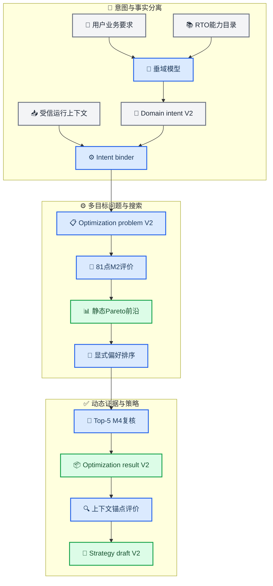

# RTO多目标与垂域意图接口扩展实施准备

_实施版本：V2.0 · 更新日期：2026-08-20 · 状态：R7～R11已实现并通过离线交付门禁_

> 📌 **归档说明：** 本文只保留R7～R11历史扩展基线；现行统一架构以[RTO系统综合说明](../01_RTO系统综合说明.md)为准。

---

## 🎯 结论与实施范围

R7～R11已经在R0～R6.1之上增加多目标能力，并把垂域模型的输出边界从“完整运行请求”进一步收窄为“业务意图子合同”。实现目标不是让垂域模型直接控制优化器，而是让它在RTO发布的能力目录内表达多个目标、优先级和输出偏好，再由确定性构造器生成可执行问题。

首个多目标版本冻结以下方向：

1. 保留全部V1合同、指纹和严格reader，新增并行V2合同，不原地改变历史workflow语义。
2. 首个目标profile包含三个M2指标：质量代理偏离最小、有效馏分收率最大、单位进料炉燃料热负荷代理最小。
3. M2结构与数值、M4稳定性、质量上限和最低收率仍是硬门禁；目标之间可以权衡，硬门禁不能参与权衡。
4. RTO先产生静态可行Pareto集合，再根据显式偏好选择M4短名单和最终候选；不得先把多个目标偷偷合成一个未声明分数。
5. 默认偏好沿用用户已给出的顺序：质量、收率、能耗，采用确定性词典序选择；V2首版不接受自由权重。
6. 当前两决策变量使用固定`9×9`细网格，共81个M2候选，不引入随机算法或新的运行依赖。
7. 垂域模型只输出`DomainOptimizationIntentV2`；运行上下文由受信调用方注入，模型不能生成进料、原油组成或当前设备状态事实。
8. 原始文本、来源和解释进入审计指纹；真正影响执行的目标、偏好和profile另有语义指纹，避免措辞变化破坏物理缓存。
9. 策略条目仍只对应一个经过M4和锚点评价的稳态动作；完整Pareto集合保存在workflow证据，不复制进策略正文。
10. R7～R11的实施范围不包含垂域模型本体、HYSYS、在线服务、队列或现场接口；这些边界在已完成实现中保持不变。

> 📌 **实现结论：** V1单目标运行、既有草稿及其指纹继续严格重载。V2不是对V1 JSON增加几个可选字段，而是一条通过`--request-version v2`显式路由的新合同链。正式结果见[R11验证报告](../../../reports/rto/R11_MULTI_OBJECTIVE_OFFLINE_REPORT.md)。

## 🔍 当前基线与扩展缺口

### 单目标假设分布

当前R6.1虽然已经能读取外部JSON，但单目标假设贯穿了整个RTO链路：

| 层级 | 当前V1事实 | V2必须调整 |
| --- | --- | --- |
| 外部输入 | 单个`objective_profile_id` | 多目标列表、偏好和输出政策 |
| 意图与问题 | 单个`objective_metric_id/sense` | 有序`ObjectiveSpecV2`集合 |
| 评价 | 单个基准值、候选值和改善率 | 每个目标独立的`ObjectiveOutcomeV2` |
| 搜索 | 单目标排序并围绕一个最优点细化 | 全细网格、非支配排序和Pareto前沿 |
| M4短名单 | 标量Top-3 | 偏好排序后的Pareto Top-5 |
| 最终选择 | 第一个动态可行的标量最优点 | 第一个动态可行的偏好候选 |
| 发布门禁 | 能耗改善阈值硬编码到选择器语义 | 独立、版本化的发布profile |
| 策略摘要 | 单个`objective_metric_id`和改善 | 目标向量摘要、偏好与选择理由 |
| 恢复校验 | 重放标量排序 | 重放目标提取、非支配层和偏好选择 |

受影响的真实实现至少包括`inputs/`、`contracts/`、`problem/`、`evaluation/steady.py`、`optimizer/`、`strategies/`、`orchestration/`和`runtime/`。KPI目录已经同时包含能耗、有效馏分收率和质量代理，为V2提供了基础，但当前评价合同只把能耗保存为目标。

### 首个目标组合的证据判断

对现存R6 `static_search.json`做只读复核，不运行新仿真，得到以下实施判断：

- 30个静态可行候选的能耗代理范围约为`183.993068～192.764902 MJ/t`
- 有效馏分收率范围约为`0.491884769～0.492028970`
- 只用“能耗最小＋收率最大”时，当前离散证据的非支配集合退化为一个候选
- 加入“质量代理偏离最小”后，当前证据出现4个非支配候选，能够表达质量保持与收率之间的弱权衡

因此，首版如果只实现能耗和收率两个目标，软件合同虽然是多目标，当前模型演示却几乎没有真实权衡。V2采用质量、收率、能耗三个目标；质量同时保留硬上限，表示“在允许偏离内继续择优”，而不是取消质量门禁。

这些结果只用于选择实施方向，不是现场工艺结论。R7仍要把目标方向、提取公式、零基准处理和发布规则逐项冻结后才能进入代码实现。

## 🧭 目标架构与职责

### V2主链



### 权限边界

| 部件 | 可以决定 | 不能决定 |
| --- | --- | --- |
| 垂域模型 | 选择已发布目标、给出优先级、说明歧义和期望输出 | 编写KPI公式、放宽系统门禁、注入现场事实 |
| 受信调用方 | 提供上下文、数据质量和来源引用 | 改写垂域模型意图或跳过合同验证 |
| Intent binder | 校验能力、绑定上下文、生成语义意图 | 根据自然语言猜测缺失目标 |
| ProblemBuilder | 解析目标profile、单位和约束，冻结问题 | 搜索候选或调整优先级 |
| 多目标优化器 | 产生候选、Pareto集合和确定性顺序 | 用权重抵消硬约束失败 |
| 统一评价器 | 提取目标向量、约束和证据 | 解释业务文本或改变模型结果 |
| 策略构建器 | 保存选中动作、目标摘要和证据引用 | 把整个静态Pareto集合变成已发布策略 |

## 📜 V2合同与结构化JSON

### 合同分层

V2新增以下合同，名称中的版本是语义版本，不复用V1类名：

| 合同 | 核心内容 | 主要消费者 |
| --- | --- | --- |
| `RtoCapabilityManifestV2` | 可用目标、方向、profile、最大目标数和输出类型 | 垂域模型、表单、校验器 |
| `DomainOptimizationIntentV2` | 多目标、优先级、偏好、输出要求和审计说明 | Intent binder |
| `ExternalOptimizationRequestV2` | 受信上下文＋垂域意图＋覆盖政策 | 无求解校验、离线编排 |
| `ResolvedOptimizationIntentV2` | 只含执行语义的规范意图 | ProblemBuilder |
| `ObjectiveSpecV2` | 指标、方向、优先级层和profile引用 | 问题、评价、优化器 |
| `ObjectiveOutcomeV2` | 基准、候选、方向性差值、归一化值和零基准状态 | 优化器、结果、策略摘要 |
| `OptimizationProblemV2` | 目标集合、硬约束、偏好、搜索和评价计划 | 优化、评价、审计 |
| `ParetoSearchResultV2` | 全部评价引用、非支配层、Pareto引用和统计 | 选择器、workflow reader |
| `OptimizationResultV2` | Pareto摘要、动态复核、选中候选和终止原因 | 策略构建器、调用方 |
| `StrategyEntryV2` | 目标向量摘要、偏好profile和单一已验证动作 | 策略仓储、离线审核 |

V2最多接受3个目标。每个目标必须存在于KPI目录、方向与目录一致、可由同一M2配对证据提取，且指标ID不得重复。缺目标、重复目标、非法方向、非连续优先级或未实现profile均在调用求解器前拒绝。

### 垂域模型输出示例

垂域模型只输出下面的`optimization_intent`对象；`operating_context`由受信上层随后绑定。该合同已经实现，当前可执行示例见[意图fixture](../../../configs/rto/intents/quality_yield_energy_v2.json)和[完整V2请求](../../../configs/rto/requests/multiobjective_example_v2.json)：

```json
{
  "schema_version": "2.0.0",
  "intent_version": "domain-optimization-intent-v2",
  "intent_id": "balance-quality-yield-energy-case-001",
  "source": {
    "source_type": "domain-model",
    "producer_id": "cdu-domain-model",
    "producer_version": "domain-model-version-ref",
    "correlation_id": "business-request-001"
  },
  "original_text": "在稳定和质量要求满足的前提下，优先保持质量，其次提高收率，并兼顾降低能耗。",
  "objective_profile_id": "quality-yield-energy-pareto-v1",
  "objectives": [
    {
      "metric_id": "quality_proxy_max_abs_relative_change",
      "sense": "minimize",
      "priority_tier": 1
    },
    {
      "metric_id": "valuable_distillate_yield",
      "sense": "maximize",
      "priority_tier": 2
    },
    {
      "metric_id": "specific_furnace_fuel_energy_mj_per_t",
      "sense": "minimize",
      "priority_tier": 3
    }
  ],
  "selection": {
    "selection_profile_id": "lexicographic-quality-yield-energy-v1",
    "return_pareto_front": true,
    "max_returned_candidates": 5
  },
  "decision_profile_id": "cdu-v1-decisions",
  "business_constraint_profile_id": "preserve-quality-yield-v1",
  "requested_output": "pareto-and-selected-steady-setpoint",
  "context_policy": "feed-as-fixed-context",
  "assumptions": ["current-crude-and-equipment-mode-remain-fixed"],
  "ambiguities": [],
  "rationale_summary": "采用既有两变量决策空间，并沿用质量、收率、能耗的业务优先级。",
  "claim_scope": "engineering_simulation_only"
}
```

`ambiguities`非空时返回`needs_clarification`，不构造优化问题。`assumptions`只接受能力目录中的代码；`rationale_summary`和`original_text`用于审计，不成为算法参数。V2首版不接受任意公式、模型路径、M4比例、原始权重、自由约束阈值或未知扩展字段。

### 语义与审计指纹

复杂模型输出容易因措辞、来源或解释变化产生不同字节。V2必须同时保存：

- `audit_fingerprint`：覆盖完整模型输出、来源、原始文本、假设和解释
- `semantic_fingerprint`：只覆盖目标、方向、优先级、偏好profile、决策profile、约束profile、输出类型和上下文policy
- `request_fingerprint`：覆盖受信上下文与完整意图信封
- `problem_fingerprint`：覆盖规范SI问题、所有目录和政策引用

Workflow身份与候选缓存基于语义问题，不因`rationale_summary`变化而重复物理仿真；审计记录仍能区分每一次垂域模型输出。任何执行语义变化都必须改变problem和后续证据指纹。

### 能力发现与结构化错误

R7～R8应增加`rto-offline capabilities`和`validate-intent`：

- `capabilities`返回支持的schema、目标、方向、profile、最大目标数、决策profile和输出类型
- `validate-intent`只校验垂域意图，不要求运行上下文、不创建run目录、不调用仿真
- `validate-request`在绑定受信上下文后生成问题，继续保证`solver_called=false`
- 校验错误返回稳定的`code`、`json_pointer`、`message`、`supported_values`和`retryable`

垂域模型可以使用这些错误修复JSON，但RTO不能在服务端静默猜测、删除或替换字段。

## ⚙️ 搜索、评价与最终选择

### 首版算法决策

| 方案 | 判断 | 原因 |
| --- | --- | --- |
| `9×9`确定性全网格 | V2首版采用 | 覆盖当前细步长，Pareto可严格重放，无随机性和新依赖 |
| 25点＋单中心细化 | 不用于多目标 | Pareto可能有多个中心，选择一个中心会漏掉权衡区域 |
| 多中心局部细化 | 后续可选 | 预算和中心去重规则更复杂，当前二维问题没有必要 |
| NSGA-II等演化算法 | 暂缓 | 当前空间只有81个离散点，引入随机状态和依赖没有收益 |

V2固定使用炉温9个细网格值与塔顶压力9个细网格值，形成81个候选。每个上下文最多执行81次候选M2评价，另有一个可复用基准；所有候选继续使用规范SI向量指纹去重。

当启用决策变量超过3个、笛卡尔网格超过500点或必须搜索连续空间时，再评审一个独立`MultiObjectiveOptimizerPort`及固定版本、种子和预算的演化算法适配器。即使以后使用`pymoo`或其他实现，Pareto合同、评价缓存和严格重放也不能依赖库内部对象。

### 非支配排序

只对`status=feasible`且全部目标完整的M2候选做非支配排序。统一转换方向后，候选A支配B必须同时满足：

1. A在所有目标上不劣于B
2. A至少在一个目标上严格优于B

V2不使用两两epsilon比较器，避免非传递排序。初版使用当前确定性模型的规范浮点值；以后接入带数值抖动的后端时，只能通过profile定义的固定量化桶产生可传递比较键。

目标值完全相同的候选形成等价组，代表候选依次按最小硬约束裕度更大、动作L1更小和候选指纹排序；等价候选引用仍保留在证据中。

### 目标结果语义

`ObjectiveOutcomeV2`按目标分别保存：

- `metric_id`、方向、单位和KPI规则引用
- 基准值、候选值和有方向的绝对改善
- 可为空的相对改善及其不可计算原因
- 用于展示或未来偏好计算的归一化值

质量偏离目标的基准为零，不能计算相对改善；必须保存绝对值，并以版本化工程尺度归一化，禁止除以极小数得到虚假的巨大改善。

### 偏好、M4与发布

Pareto集合独立于偏好生成。默认`lexicographic-quality-yield-energy-v1`按质量、收率、能耗逐层排序；随后用硬约束裕度、动作L1和候选指纹作确定性平局规则。

偏好排序后的前5个Pareto候选全部进入M4：

1. 每个候选仍与同一上下文M4基准配对
2. M4只验证动态稳定与证据完整性，不重新计算M2目标向量
3. 最终选择第一个M4可行候选
4. Top-5全部动态失败时返回`pareto_shortlist_dynamic_failed`，不宣称其余静态候选全局无解
5. 系统或评价错误返回`evaluation_error`，不能当成动态不可行

发布仍是优化之后的独立政策。V2初版保留“所选候选能耗代理至少改善`0.5%`”作为合成发布门禁，同时保存三目标结果；达不到门禁时返回`feasible_not_publishable`，仍保留Pareto和选中结果，但不生成策略草稿。未来如要允许“收率改善换取有限能耗上升”，必须新增经过审核的发布profile，不能由垂域模型临时改阈值。

## 🧩 代码、配置与测试调整

### 模块影响

| 模块 | 主要调整 | V1保护措施 |
| --- | --- | --- |
| `contracts/` | 新增目标、偏好、Pareto和V2结果合同 | V1类与序列化保持不变 |
| `inputs/` | 新增domain intent、capability和V2 binder | V1 request继续由现有adapter处理 |
| `catalogs/` | 加载目标、偏好、发布profile | V1 bundle字节与指纹不变 |
| `problem/` | 新增`MultiObjectiveProblemBuilder` | 不改变V1 ProblemBuilder输出 |
| `evaluation/` | 目标提取器注册表与向量结果 | V1标量评价器继续可读旧证据 |
| `optimizer/` | 81点生成、非支配排序和偏好排序 | V1网格优化器保留 |
| `strategies/` | V2锚点目标摘要和偏好引用 | V1仓储与生命周期事件兼容 |
| `orchestration/` | 新阶段文件和V2严格重放 | manifest按schema选择reader |
| `runtime/` | capabilities、validate-intent和版本路由 | 现有CLI参数继续工作 |

### 已实现的主要文件

```text
src/petroleum_rto/rto/
├── contracts/multiobjective.py
├── contracts/results_v2.py
├── contracts/selection_v2.py
├── inputs/v2_models.py
├── inputs/v2_adapter.py
├── problem/multiobjective.py
├── compilation/multiobjective.py
├── evaluation/multiobjective.py
├── evaluation/dynamic_v2.py
├── optimizer/pareto.py
├── optimizer/multiobjective.py
├── orchestration/v2_models.py
├── orchestration/v2_service.py
└── strategies/v2_models.py
configs/rto/
├── catalogs/objectives_v2.json
├── profiles/preferences_v2.json
├── profiles/multiobjective_policy_v2.json
├── profiles/publishability_v2.json
└── requests/multiobjective_example_v2.json
tests/rto/
├── unit/test_multiobjective_contracts.py
├── unit/test_pareto_search.py
├── unit/test_preference_selection.py
└── integration/test_multiobjective_orchestration.py
```

实现复用了现有通用合同工具、仿真端口、M2/M4缓存和同一个CDU适配器，没有复制第二套机理接口。

## 🔄 兼容、证据与策略语义

### V1与V2并存

- `ExternalOptimizationRequestV1`、`OptimizationProblemV1`和历史artifact保持逐字节语义不变
- CLI按`request_version`显式路由，不使用字段猜测版本
- V1请求继续输出V1 workflow；V2请求只输出V2 workflow
- 旧manifest始终由兼容V1 reader读取，新reader不得把V1标量字段补写成V2数组
- 包内同时发布V1和V2配置；两套bundle分别有独立指纹
- 未来如提供显式`lift-v1-intent`辅助，只能把新请求转换为单元素V2目标集合，不能用它重写旧证据

### Workflow证据

V2实际将阶段文件拆为：

```text
request.json
external_request.json
resolved_intent.json
problem.json
pareto_search.json
preference_selection.json
dynamic_verification.json
optimization_result.json
anchor_validation.json
strategy_draft.json
result.json
events.jsonl
manifest.json
```

严格恢复必须重新提取目标引用、重算非支配层、重放偏好顺序、核对M4短名单和最终选择。Pareto集合不应只信任序列化排名结果。

### StrategyEntryV2

V2策略仍是一条单动作策略，而不是一组待现场选择的Pareto动作：

- `objective_catalog_ref`、`problem_ref`和`preference_profile_ref`共同说明目标定义与为何选中该动作
- 每个锚点保存`objective_summaries[]`，不再使用单个`baseline_objective`
- `pareto_search_ref`和`selection_ref`指向完整权衡证据
- `selection_rationale_code`使用确定性代码，不保存自由文本作为机器事实
- 未来若开放V2查询，必须先匹配上下文与目标profile，并且只返回显式发布修订
- V1与V2 entry版本和物理仓储路径严格分离，不能互相伪装

V2仍不自动批准或发布。R11的V2仓储只实现revision-1草稿创建和严格读取，尚未开放V2审核、发布或查询API；现有CLI治理命令只服务V1仓储。垂域模型的偏好输出只是求解输入，不构成策略库审核意见。

## 🗺️ R7～R11实施顺序

| 里程碑 | 范围 | 主要交付物 | 通过门禁 |
| --- | --- | --- | --- |
| R7 多目标问题冻结 | 冻结三目标、硬门禁、偏好、发布和证据语义 | 决策记录、目标/profile配置草案、金标准向量 | 每个目标可提取；零基准和方向明确；现有证据可重算 |
| R8 V2合同与输入 | 实现domain intent、能力目录、V2请求和ProblemBuilder | 严格合同、capabilities、validate-intent、示例JSON | 非法组合求解前拒绝；语义/审计指纹分离；V1指纹不变 |
| R9 Pareto搜索与评价 | 实现目标向量、81点搜索、非支配层和缓存 | `ObjectiveOutcomeV2`、Pareto optimizer、单测 | 人工Pareto金标准、顺序无关、等价组和错误分类通过 |
| R10 偏好与M4复核 | 实现词典序选择、Top-5 M4和发布门禁 | preference selector、V2 result、动态证据 | 动态失败回退、全失败语义、发布不足和严格重放通过 |
| R11 策略与离线交付 | 实现StrategyEntryV2、workflow、CLI、包与报告 | V2策略、端到端示例、wheel和正式报告 | V1/V2全回归；重复运行零新增；无自动审批和现场误述 |


实施时严格遵循“前一里程碑通过后再进入下一项”。R7先用既有证据冻结合同金标准，R11在用户授权后执行新的81点M2和Top-5 M4正式运行。

R7～R11已按上述顺序完成。正式点上下文运行评价81个M2候选、5个Pareto候选和1个共享M4基准；重复运行与独立严格读取新增仿真均为零。该结果不改变本节保留的阶段门禁。

## ✅ 验收门禁与非目标

### 合同反例

- 缺目标、重复目标、目标超过3个、非法方向或非连续优先级全部拒绝
- 目标不存在、阶段不是M2或KPI方向不一致时，ProblemBuilder拒绝
- 非空`ambiguities`返回`needs_clarification`，不调用求解器
- 自由权重、任意公式、模型路径、M4比例和门禁阈值在V2首版拒绝
- 审计文本变化只改变审计指纹；任何执行字段变化必须改变语义问题指纹
- 垂域意图不得携带进料、原油组成、设备状态或初始库存事实

### Pareto与选择反例

- 手工构造的支配、互不支配、完全相同和最大化目标案例均正确分层
- 输入顺序变化不改变Pareto集合、等价代表、偏好顺序或指纹
- 硬约束失败候选不得进入任何Pareto层
- 质量零基准不得产生非有限相对改善
- 系统错误不得被非支配排序隐藏或降级为工艺不可行
- 偏好第一候选M4失败时选择下一个动态可行候选
- Top-5全部失败不得写成全局无可行解
- V1单目标706项现有回归及历史workflow严格读取继续通过

### 端到端门禁

1. `capabilities → domain intent → validate-intent → bind context → problem`全程无求解且指纹稳定
2. 81点M2评价形成可复核Pareto集合，并能从manifest严格恢复
3. Top-5 M4评价、偏好选择、发布判定和锚点验证引用闭合
4. 同一V2语义请求重复运行不增加物理仿真
5. V2策略正文不嵌入完整Pareto集合或时间序列
6. 所有产物继续声明`offline_simulation_only`、无控制权、未现场验证且无DCS写能力

### 本轮非目标

- 不训练、微调或评测垂域语言模型
- 不开放任意用户公式、自由权重或动态修改系统硬门禁
- 不增加回流、循环取热、塔顶温度等未贯通M2/M4的决策变量
- 不引入Redis、消息队列、HTTP服务、HYSYS或现场数据接口
- 不实现分段时间轨迹、在线闭环RTO或自动策略审批
- 不把有限网格Pareto集合描述为连续真实装置前沿

## 📎 事实来源

- 当前单目标职责、合同和R0～R6门禁：[RTO解耦实施方案](02_RTO策略库与机理仿真解耦实施方案.md)
- 当前严格外部JSON入口和命令：[RTO离线运行与策略库使用说明](../04_RTO离线运行与策略库使用说明.md)
- 当前进度和授权：[项目实施状态](../../STATUS.md)
- R6正式离线证据摘要：[R6验证报告](../../../reports/rto/R6_OFFLINE_RTO_REPORT.md)
- R6.1外部JSON证据摘要：[R6.1验证报告](../../../reports/rto/R6_1_EXTERNAL_REQUEST_REPORT.md)
- R11多目标正式证据摘要：[R11验证报告](../../../reports/rto/R11_MULTI_OBJECTIVE_OFFLINE_REPORT.md)
- 可执行事实：`src/petroleum_rto/rto/`、`configs/rto/`、`tests/rto/`和本地`runs/rto/`

---

_本文保留R7～R11设计决策和验收门禁；当前实现结果以R11正式报告、源码、版本化配置和STATUS为准。_
