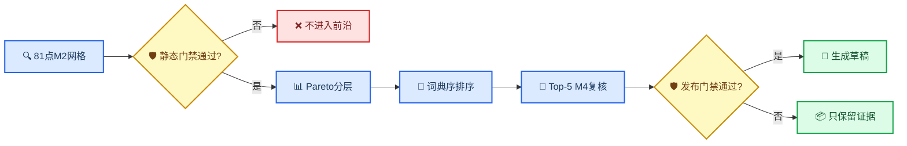

# R7多目标问题与政策冻结记录

_决策状态：Accepted · 日期：2026-08-20 · 适用范围：RTO V2离线合成工程仿真_

> 📌 **归档说明：** 本文只保留R7历史政策来源；现行统一架构以[RTO系统综合说明](../01_RTO系统综合说明.md)为准。

---

## 📋 决策背景

R0～R6.1已经实现单目标能耗优化、M2/M4配对评价、策略草稿和严格外部JSON入口。R7需要在不改变V1合同和历史证据的前提下，冻结首个多目标问题，使后续V2合同、Pareto搜索、动态选择和策略交付只有一套可执行事实来源。

本记录冻结的是软件与合成工程政策，不是现场产品规格、安全边界或经济承诺。完整扩展范围见[多目标实施准备](05_RTO多目标与垂域意图接口扩展实施准备.md)，当前进度见[项目状态](../../STATUS.md)。

### 必须满足的约束

- V1六份外部配置和包内bundle保持字节稳定
- 机理模型仍只接收仿真请求，不接收目标或业务优先级
- 所有硬门禁先于Pareto排序，任何目标改善不能抵消门禁失败
- 首版无随机数、无新增运行依赖、可由严格证据完全重放
- 垂域模型只能选择已发布profile，不能提交公式、自由权重或门禁阈值

## 🔍 方案比较

| 方案 | 覆盖能力 | 可复现性 | 当前代价 | 决策 |
| --- | --- | --- | --- | --- |
| 能耗＋收率 | 两目标合同 | 确定性 | 现有证据只有一个非支配点 | 不采用 |
| 质量＋收率＋能耗 | 三目标合同 | 确定性 | 现有证据得到四个非支配点 | 采用 |
| NSGA-II连续搜索 | 可扩展连续空间 | 依赖种子和预算 | 当前二维81点无必要 | 暂缓 |
| 自由加权和 | 表达灵活 | 权重敏感 | 可能隐藏业务语义 | 禁用 |

现有R6证据只读复算表明，质量代理、收率和能耗能够形成可观察的权衡。该判断仅用于选择软件演示问题，不外推为装置工艺结论。

## 🎯 冻结决策

### 目标和方向

| 优先层 | 指标 | 方向 | 单位 | 归一化尺度 | 相对改善 |
| ---: | --- | --- | --- | ---: | --- |
| 1 | `quality_proxy_max_abs_relative_change` | 最小化 | `1` | `0.005` | 基准为零时必须为空 |
| 2 | `valuable_distillate_yield` | 最大化 | `mass_fraction` | `0.002` | 方向性相对改善 |
| 3 | `specific_furnace_fuel_energy_mj_per_t` | 最小化 | `MJ/t` | `1.0` | 方向性相对改善 |

目标profile固定为`quality-yield-energy-pareto-v1`，最大目标数为3。质量代理既是目标，也是既有硬上限约束：只有在允许偏离内的候选才参与Pareto排序。

### 约束和发布

- M2结构、数值、收敛和守恒使用既有`m2-structural-numeric`硬门禁
- M4稳定性使用既有`m4-stability-acceptance`硬门禁
- 质量代理偏离不超过`0.005`
- 有效馏分收率不得低于同上下文基准`0.002`绝对质量分数
- 发布是优化后的独立门禁：选中候选的单位进料炉燃料代理改善至少`0.5%`
- 发布改善不足返回`feasible_not_publishable`，不把候选改判为工艺不可行

### 搜索和选择

- 两个决策变量均按既有`refine_step`生成9个端点闭合值，笛卡尔积为81个候选
- 非支配判断使用精确方向性值，不采用两两epsilon比较
- 默认选择profile为`lexicographic-quality-yield-energy-v1`
- 平局依次比较最小硬约束裕度、归一化动作L1和proposal指纹
- Pareto偏好前5个候选进入M4；全失败返回`pareto_shortlist_dynamic_failed`
- 系统、合同、资源或评价错误返回`evaluation_error`，不得伪装成工艺不可行

## 📊 金标准证据

R7把现有workflow `offline-rto-fc174fafb89288e5`中的静态评价转录为不可变小型fixture：[R7 Pareto金标准](../../../data/rto/gold/r7_existing_evidence_pareto_v2.json)。fixture包含四个预期第一前沿点和两个受支配反例。

| Proposal | 质量偏离 | 有效馏分收率 | 能耗代理 `MJ/t` | 第一前沿 |
| --- | ---: | ---: | ---: | --- |
| `proposal-d42228b313f9258c` | `0` | `0.4919579477` | `183.9930676` | 是 |
| `proposal-bb684fd5b22f2011` | `0.0000098736` | `0.4919759016` | `183.9930676` | 是 |
| `proposal-4c5c203ffbaf53c8` | `0.0000197300` | `0.4919937223` | `183.9930676` | 是 |
| `proposal-fae6b007d35bd587` | `0.0000393905` | `0.4920289696` | `183.9930676` | 是 |

这些数值只来自既有合成运行。R7没有新增仿真，也没有批准或发布策略。

## ⚙️ 可执行配置

| 事实 | 文件 |
| --- | --- |
| 目标、方向和尺度 | [`objectives_v2.json`](../../../configs/rto/catalogs/objectives_v2.json) |
| 词典序偏好 | [`preferences_v2.json`](../../../configs/rto/profiles/preferences_v2.json) |
| 搜索和评价政策 | [`multiobjective_policy_v2.json`](../../../configs/rto/profiles/multiobjective_policy_v2.json) |
| 发布门禁 | [`publishability_v2.json`](../../../configs/rto/profiles/publishability_v2.json) |

Markdown不复制第二套机器配置；字段和精确值以这些JSON及后续严格合同为准。

## ⚡ 影响与风险

### 正向影响

- V2目标、偏好、约束和发布职责被显式拆分
- 当前二维空间可穷举，Pareto集合没有采样遗漏或随机重放问题
- 垂域模型只需要选择能力目录中的profile，不需要理解求解器内部字段

### 已接受限制

- 81点只代表当前离散局部域，不是连续真实装置Pareto前沿
- 默认词典序会强烈保护质量，其他偏好必须通过新profile显式授权
- 现有质量和收率都是缩减模型代理，不能替代现场产品标准
- 当变量数超过3个、组合数超过500或转为连续空间时，必须重新评审优化器端口

## ✅ R7验收结果

| 门禁 | 结果 |
| --- | --- |
| 三目标和方向与KPI目录一致 | 通过 |
| 零基准相对改善策略明确 | 通过 |
| 81点、Top-5和无随机政策一致 | 通过 |
| 发布与工艺可行性分离 | 通过 |
| V1关键配置字节哈希不变 | 通过 |
| R7配置专项测试 | 2项通过 |

R7通过后可以进入R8。R8只能实现严格V2合同、能力目录、意图校验和确定性ProblemBuilder，不能提前运行81点搜索。

## 🔗 相关文档

- [多目标实施准备](05_RTO多目标与垂域意图接口扩展实施准备.md)
- [RTO V1兼容基线](02_RTO策略库与机理仿真解耦实施方案.md)
- [当前实施状态](../../STATUS.md)
- [R11多目标离线验证报告](../../../reports/rto/R11_MULTI_OBJECTIVE_OFFLINE_REPORT.md)

---

_最后更新：2026-08-20_
