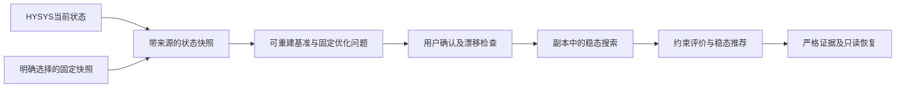

# HYSYS稳态仿真替换与Agent接入规划

当前授权已从首轮T-39贯通扩展到变量目录内24项MV的单项/多项调节。实现与验收以[当前连接说明](02_HYSYS连接与状态读取说明.md)及[STATUS](../STATUS_REACT_REBUILD.md)为准；下文首轮T-39限制为阶段历史，不再限制当前可选MV。只选代表变量实际联调，不全量逐项扰动，不扫描模型失收敛推定范围。

_2026-09-11 · 仿真文件：mjh_ATM.hsc · 用户已明确稳态专用、删除旧CDU及动态内容、HYSYS优先工况来源；读取、严格快照、内存基准/恢复、T-39单点及独立物料/能量边界已实测，H1/H2部分完成。固定ABBA重复输出存在差异，顺序验收失败，须先诊断；Agent已接入唯一T-39稳态比较并通过真实模型联调；旧CDU及专用离线链路已退役，其他变量和优化搜索尚未开放。进度以[STATUS](../STATUS_REACT_REBUILD.md)为准。_

已确定用HYSYS稳态仿真完整替换原Python CDU，删除旧稳态、动态、控制、校正、验证及其专用入口；不保留双后端、动态占位或DCS扩展分支。保留Agent的意图理解、人工确认、RTO候选搜索、结果解释和证据管理。新仿真代码及资产统一归属simulation模块；装置状态默认从HYSYS读取，固定快照仅为明确标注的离线来源。

当前材料及只读实测仍不足以发布优化变量范围或产品质量约束。以下前三节保留历史文件事实与原始数值，当前核定另作补记；第四节起是整体替换方案。现行能力以[连接与状态读取说明](02_HYSYS连接与状态读取说明.md)及[变量与正式读取报告](../../reports/simulation/hysys_binding_qualification_20260911.json)为准，当前Agent已调用新模块；hysys来源模型原位保留，旧物理实现已删除。下文替换步骤保留设计背景，实际保留范围以STATUS及当前模块说明为准。

## 📁 1. 目录中什么有用

历史来源目录为`/Users/idc/Desktop/hysys_moni`，当前对应项目[hysys/](../../hysys/)。[只读核对记录](../../reports/simulation/hysys_inventory_20260911.json)保存26个文件的大小、SHA-256、60个表单映射及核算结果；[替换范围核对](../../reports/simulation/hysys_replacement_scope_20260911.json)列出旧模块文件、跨模块引用和Windows障碍。

**Windows接续补记：** [Windows接收核对报告](../../reports/simulation/windows_hysys_intake_20260911.json)确认22个非缓存/系统文件与原清单逐一哈希相符，包含核心模型和正确导出；8份JSON严格解析、5份现行Python语法检查及现有10项离线测试通过。本机HYSYS为V12.0，项目Python3.12.13已安装pywin32。正式`simulation`读取器现已消费版本化变量目录，核对60项真实绑定并按显式单位读取，取得73级、20项规格/10项活动规格及直接读取的0自由度，严格快照保存与重载已实测。正式入口只附着用户已打开的指定案例，不沿用来源脚本的打开/激活行为；两次自动打开副本失败仍见[早期读取证据](../../reports/simulation/windows_hysys_read_20260911.json)，根因尚未解决。来源目录仍保留原样，尚未完成H1资料迁移。

| 文件 | 已查明的用途 | 接入时的处理建议 |
| --- | --- | --- |
| [mjh_ATM.hsc](../../hysys/mjh_ATM.hsc) | 1,773,263字节的二进制案例，文件头为SimulationCase10 | 核心资产，保持原件；Windows使用受控工作副本。文件头不能证明产品版本 |
| [hysys_control.py](../../hysys/hysys_control.py) | 通过COM访问Table和C-1102，读取运行点、写MV、校验回读、等待收敛 | 复用已实现的读写逻辑，在专用适配器内补足任务隔离和严格证据 |
| [main.py](../../hysys/main.py) | 一次连接、快照、写入、求解、导出的命令入口 | 可作为Windows首轮联调参考，不能直接充当多候选RTO执行器 |
| [data_read](../../hysys/data_read) | 修正气相读取后的最近一次导出 | 历史HYSYS快照，可供离线读取和展示；不是当前在线工况 |
| [data_write](../../hysys/data_write) | 输入文件，只有mv实际参与写入；同时夹带旧cv和stage | 后续请求只保留需要修改的变量；其中旧输出不得作为结果证据 |
| [hysys_inspection.json](../../hysys/artifacts/hysys_inspection.json)及inspect_hysys.py | COM成员清单、Table的设备/属性/原始数值/单位标签 | 变量对照依据；缺少单元格连接到哪个真实HYSYS属性的信息 |
| operating_point_before.json、run_report.json | 本次运行前快照及成功/收敛/耗时报告 | 保留历史证据；后续改为每次运行独立保存 |
| analyze_results.py、artifacts/analysis/ | 从既有JSON生成的分析、汇总和CSV | 可追溯的派生分析，不是额外仿真试验 |
| tests/test_hysys_control.py | 模拟单元格及求解状态的离线测试 | 保留相关读写/回滚测试；不作为Windows实算证明 |
| artifacts/original/ | 改进前脚本和错误气相导出的备份 | 历史参考，不迁入活动接口 |
| __pycache__/、.DS_Store、artifacts/nature-figure.json | 缓存、系统元数据；最后一项仅含backend=python | 无仿真接入用途，可列为后续清理对象；本轮未删除 |

来源README记录当时Windows使用HYSYS V12、Python3.11和pywin32；当前项目环境另见STATUS。来源run_report记录2026-09-09一次24项MV写入成功、36项输出和73级导出，历时3.687秒。输入、运行前、运行后的MV完全相同，属于同工况重求解，不是扰动或优化实验。不能把3.687秒直接用作新候选的耗时估计。

analysis/summary.json中的四个源文件哈希均与现有文件一致。不过旧运行报告没有记录案例哈希，不能证明本次收到的.hsc二进制与那次运行时的案例内容完全相同，也不能证明当时内存状态已保存到文件。

## 🏭 2. 从导出数据可以确认的模型情况

| 项目 | 文件证据及含义 |
| --- | --- |
| 操作入口 | Table：第2–25行24个可写量；第28–63行36个输出量；A/B/C/D分别为对象、属性、内部数值、单位标签 |
| 进料 | crude_oil为400 t/h、32.6℃、180 kPa；三股Water合计3 t/h，介质相态与具体用途未导出 |
| 塔系 | C-1102下共73级：Main Tower 52级，Kerosene SS 8级及其再沸器1级，Diesel SS 6级，AGO SS 6级 |
| 主塔剖面 | 52级在顶部，约106℃、150 kPa；1级在底部，约361.32℃、180 kPa；6级约369.18℃，温度并非全塔严格单调 |
| 产品 | Naptha、Kerosene、Diesel、AGO、Risedue五股；原拼写是接口事实，业务显示可采用规范名称 |
| 产品输出 | 每股质量流量和20/40/60/80/100% TBP温度，共30项；另有6项设备热负荷 |
| 塔级输出 | 每级压力、温度、液相流量、气相流量，共292项；加上MV/CV，当前快照合计352个标量 |
| 已知求解信号 | can_solve、is_solving、is_valid、column_converged；历史报告均处于允许、空闲、有效和收敛状态 |

这些对象名支持“预热/闪蒸/泵送/加热、常压塔及侧线产品”的初步理解，但没有完整连接拓扑，不能根据名字确定炉子串并联关系、中段回流位置、Water相态或所有边界物流。

五股产品分别约12.370、9.620、25.585、55.234、300.190 t/h，合计403 t/h，与400 t/h原油加3 t/h Water在已列物流层面闭合。相对原油的比例合计100.75%，所以只能称为表观产率，不能称为干基烃类收率。渣油表观占比约75.05%，需要原油组成/馏程和水分归属才能解释。

六项热负荷合计106.739 MW，除以原油进料为0.961 GJ/t。它是“已导出设备负荷合计”，还没有核对热回收、公用工程边界和炉效率，不能命名为净能耗、燃料消耗或经济收益。现有五点TBP也不能替代成品规格、闪点、硫含量或标准分离间隙。

修正后的data_read和before快照没有液相/气相完全重复的记录；data_write以及original/data_read中73级全部重复，符合旧脚本错误地把液相填入气相字段的情况。新旧气相差异不得解释为工艺变化。

## 🎛️ 3. MV/PV如何整理

文件实际使用mv、cv、stage三个分区。用户所说的PV可以覆盖读取的cv和塔级属性；这里只能确认它们是输出，不能据cv命名认定全部是控制回路的被控量。24个MV首先是“接口允许写入的字段”，还不是24个已批准优化自由度。

| 原字段或字段组 | 历史导出值 | 历史规划中的用途与待确认事项 |
| --- | --- | --- |
| crude_oil.temperature_C / pressure_kPa / massflow_kg_h | 32.6 / 180 / 400000 | 工况输入；首轮优化固定，之后可做明确指定的负荷/进料情景 |
| heater_to_flash.D_temperature_C | 169.4 | 加热规格候选；D是温升还是出口值须查属性连接 |
| flash_column.liquid_level | 44.5，标签% | 暂时固定；须确认稳态下是否影响结果及液位口径 |
| pump.D_pressure_kPa | 550 | 暂时固定；须确认压升还是出口压力、绝压还是表压 |
| heater_to_furnace.D_temperature_C | 67.85 | 加热规格候选；D语义待核对 |
| furnace_1.D_temperature_C | 115 | 加热规格候选；不能直接对应旧模型炉出口温度 |
| furnace_2/3/4.D_temperature_C | 各225 | 各自独立字段；设备连接、相应物流及温度规格待核对 |
| Water1/2/3.massflow_kg_h | 2200 / 300 / 500 | 流量候选；确认水/蒸汽相态、温压、目的物流后再开放 |
| C-1102.top_massflow_kg_h / top_temperature_C | 320690 / 105.5556 | 疑似循环回流规格；须与活动规格和连接物流对应 |
| C-1102.one_massflow_kg_h / one_temperature_C | 170000 / 150 | 疑似中段循环规格；不能认作产品抽出量 |
| C-1102.two_massflow_kg_h / two_temperature_C | 241000 / 180 | 同上；确认独立自由度及与其它规格的耦合 |
| C-1102.boilup_rate | 0.5，标签% | 暂时固定；0.5比例、0.5%或自定义显示尚不能确定 |
| C-1102.39/26/16_temperature_C | 156.8 / 215 / 301 | 优先检查的分馏规格候选；活动规格、实际控制对象和联动约束须验证 |

**Windows当前核定：** 上表保留历史数值及当时疑问，不覆盖为当前工况。真实ImportedVariable及类型库已确认：加热设备的`D_temperature_C`是温差，泵的`D_pressure_kPa`是压差；Flash对应液相体积百分比，正式ID为`flash_column.liquid_volume_percent`。`Kerosene SS BoilUp Ratio`是无量纲0.5，不是0.5%，正式ID为`C-1102.kerosene_ss_boilup_ratio`。三组PA分别绑定循环流量与返回温度，另有三条塔温规格和再沸比。24项MV实测为指定状态且可修改，36项CV为计算状态且不可修改；这些属性不构成优化授权。当前60项绑定、单位及规格证据见[正式读取说明](02_HYSYS连接与状态读取说明.md)和[核定报告](../../reports/simulation/hysys_binding_qualification_20260911.json)。

读取范围包括全部36项CV和73级状态。首版按用户最新要求，仅用T-39这一个调控变量贯通Agent，其他变量维持当前设定，不列为首版必测任务。后续优化搜索范围需有明确依据，不从一个基准值自动生成“±5%安全范围”，也不通过持续调整至模型不收敛来认定上下限。

单个变量需要一份权威定义：稳定变量ID、中文名、来源对象/属性、读写角色、原始及规范单位、量纲语义、绑定规则。已开放决策再关联经确认的上下界、步长和当前值来源。工艺限制与界面标签不能混在一起；目录只存元数据，快照存观测值。

单位转换必须按已核对的属性定义执行：历史Table的kg/s→kg/h和kJ/s→kJ/h乘3600在来源文件中相互对应，但D列只是表单文字，不能作为单位证明；正式读取器已改用真实属性的`GetValue`请求规范单位，另存原始内部值。绝对℃→K加273.15，温差℃→K不加偏移；压力仍须核实绝压/表压基准，新增或未核定字段不得凭百分号开放优化。TBP还应补充馏出百分数基准及属性方法。

## 📂 4. 模块归属与最小接口

新模块命名为simulation，按现有“类型目录＋模块命名空间”放置内容；不沿用cdu这个已经代表旧Python实现的包名。已建立`models.py`纯Python不可变观测、`hysys.py`只读实现及`__main__.py`独立入口，并实际消费`configs/simulation/mjh_atm_variables.json`。基准捕获/恢复、T-39单点和严格结果读取已形成正式接口；`boundary.py`另消费实际边界定义，提供独立只读证据，尚未并入逐候选单点结果。下表列完整实施目标，其余变量及RTO适配能力不因目录存在而视为完成。

| 目标位置 | 负责的内容 |
| --- | --- |
| `src/petroleum_rto/simulation/` | HYSYS连接、装置描述、变量映射、统一单位、快照、基准副本、单点稳态计算和原始证据读取 |
| `configs/simulation/` | 仿真文件定位、Table/C-1102等对象绑定、变量来源与单位、读取/求解参数；不保存第二套“当前工况” |
| `data/simulation/hysys/` | 引入的.hsc原始基准、必要依赖资源、HYSYS导出快照与来源清单；不进入Python安装包 |
| `tests/simulation/`、`scripts/simulation/` | 数据合同/假COM单测、Windows实算验收及人工运行的探查/导出脚本 |
| `reports/simulation/`、`runs/simulation/` | 前者保存核对和验收报告；后者保存本机任务副本、快照和每次计算证据，继续忽略Git |
| `docs/simulation/` | 本规划及实施后稳态仿真主文档；源报告本轮已归入此模块对应目录 |
| `src/petroleum_rto/rto/adapters/hysys.py` | 仅将RTO候选/工况编译成仿真请求、将仿真结果映射成RTO证据；无COM细节、无物性或求解代码 |
| `configs/rto/`、`runs/rto/` | 优化目标/决策资格/工艺约束/搜索预算，以及优化计划、评价和结果；引用仿真证据，不复制一套物理运行产物 |

仿真模块不依赖RTO、Agent或LangChain；RTO核心依赖现有中立端口，具体适配器调用仿真公共函数；Agent通过公共业务入口查询/准备/确认。只有HYSYS一个实现，生产装配直接创建它，不增加后端注册表、插件系统、动态运行模式或回退到旧CDU的路径。

HYSYS通过COM提供自动化能力，现有脚本已经采用该路线。[AspenTech自动化说明](https://esupport.aspentech.com/apex/S_Article?id=000066742)

最小公共操作是：读取装置描述、读取状态快照、冻结可重建基准、预览变更、执行一次稳态计算、严格读取已有证据。函数名在编码时确定；连接、暂停、逐格写入、求解、复位和关闭均封装在仿真模块内部，不向LLM暴露。已有SimulatorPort的preview/evaluate/read_evidence继续作为RTO边界，删除build_m4_request，剩余请求编译统一为稳态。

仿真变量字典是名称/单位/属性链接的唯一来源，RTO目录通过变量ID引用并增加决策范围与资格；范围不在两个文件重复维护。HYSYS数据有原始和规范单位两个表示是边界转换需要，不能再维护手写当前值作为第三份事实。安装包内现有capability_bundle应由唯一权威配置生成并校验，随新目录同步更新，禁止保留旧CDU默认能力包。

迁入HYSYS原件时先记录源哈希并复制到工作区，复核复制内容后保留外部来源目录不变。只迁入核心模型、必要接口/探查代码及可追溯快照；旧original脚本、错误输出、缓存和nature-figure残留不进入活动实现。运行副本从工作区受控基准产生，不自动覆盖原件，也不把大型模型打入wheel。

## 📡 5. 从HYSYS取得工况，以及如何固定一次优化

当前[Agent工具](../../src/petroleum_rto/assistant/native_tools.py)的装置介绍和工况读取均写死`configs/rto/contexts/case_20260604.json`；展示投影（已退役，历史路径：`../../src/petroleum_rto/rto/runtime/chat_summary.py`）要求旧炉温/塔压两个设定及三个库存比，并把模拟器状态固定写成idle。OperatingContext（已退役，历史路径：`../../src/petroleum_rto/rto/contracts/context.py`）还强制要求进料组成。上述假设必须一起删除；缺少HYSYS原油组成时应标明缺项，不用旧七组分表补齐。

### 数据来源规则

| 场景 | 目标行为 |
| --- | --- |
| 用户询问当前装置/运行状态 | 默认查询已配置的HYSYS实例，返回实际MV/PV、求解状态、读取时间和来源；装置类型由装置描述决定，不再凭cdu-m7判断 |
| Mac未连接HYSYS | 明确当前不可取得在线状态；可查看指定历史快照，显示原导出时间及离线来源，不伪造idle或当前收敛 |
| 用户选择固定工况 | 读取按新快照合同保存的HYSYS导出，不再要求维护旧case_20260604；固定工况不是另一种仿真后端 |
| 连接失败时已有旧快照 | 可作为有标签的历史信息返回；不得静默用它准备/执行实时任务。切到固定工况后重新展示和确认来源 |
| 重启及/result查询 | 从已保存证据恢复展示，不自动连接HYSYS、求解、改工况或重新批准任务 |

读取来自HYSYS仍是仿真状态，不是DCS现场测量。本轮不设计DCS连接、采样订阅或在线调度。

### 同一个事实源，两种必要表示

simulation保存带来源的完整状态快照；RTO的OperatingContext是从该快照确定性产生的优化所需投影，绑定其引用及内容指纹。它不再拥有独立可手工维护的运行值。快照至少记录模型/变量映射身份、MV/PV、塔级、求解状态、观测时间、来源类型及数据完整性；Context保留相关进料事实、已批准决策的当前值和基准引用，去掉动态initial_state及强制旧库存/伪组分结构。

.hsc是必须定位的仿真资产，模型引用和快照引用用于复现；用户不再需要先选择或维护另一个旧式业务case文件。一个历史JSON只描述可见运行点，不一定能恢复HYSYS隐藏规格和内部状态，所以“有固定工况可展示”和“有可重建基准可计算”应明确区分。

1. **查询：** 在HYSYS未求解、当前可读时采集一个一致快照，读取前后检查状态和相关输入是否变化。求解中或读到混合工况时明确返回状态不可用于准备，不能把部分新旧字段拼成一个快照。
2. **准备：** 引用用户已看到的快照，冻结完整可重建的HYSYS基准副本并核对与快照相符，然后构造Problem；不求解或改MV。如何从当前内存状态复制到独立文件而不改源实例，需要Windows验证。不能冻结时仍可查询，但必须说明无法准备可复现计算。
3. **确认：** 再校验基准文件、变量映射和来源的相关工况是否仍匹配。比较语义输入及模型身份，不因读取时间不同就判漂移；源模型/进料/相关规格改变时停止这版执行，重新读取、准备和确认，不能把新值偷偷填入旧方案。
4. **执行：** 全部候选使用冻结基准的工作副本；原始HYSYS装置实例用于观察，不被优化搜索逐点改写。候选从同一基准初始化，基准重新载入误差以实测容差检查。
5. **追问与刷新：** 新查询可产生新快照，但不覆盖已准备方案。旧结果继续标注它当时的模型和快照；不能因当前装置变化而改写旧结果。

离线快照模式若缺少对应的可重建HYSYS基准，允许查询、界面预览和合同校验，不允许用旧输出冒充新候选计算。HYSYS不可用时返回能力不可执行，不回退Python仿真或插值输出。

## ⚙️ 6. RTO与Agent统一收敛成稳态流程

目标执行链为“读取工况→准备/确认→基准计算→稳态候选搜索→约束评价和排序→推荐复算→保存/解释”。推荐复算仍调用同一个稳态接口，至少对最终推荐从冻结基准独立重算一次；它用于检查初始化和重复性，不建立一个替代M4的第二套模型或通用阶段框架。备选只标记实际完成的搜索评价/复算状态。

### 必须同步处理的范围

| 位置 | 现有耦合 | 目标修改 |
| --- | --- | --- |
| capabilities/models.py（已退役，历史路径：`../../src/petroleum_rto/rto/capabilities/models.py`）、目录/政策及打包数据 | 决策要求M2参数和M4回路；路线有动态事件、时域和预设 | 只绑定稳态变量；删除动态字段，搜索次数/返回数量各自有唯一含义；换成本案例指标和工艺条件 |
| contracts/context.py（已退役，历史路径：`../../src/petroleum_rto/rto/contracts/context.py`）、context/loader.py | 旧进料组成、设定和库存合同；只读JSON案例 | 以HYSYS快照为权威来源；固定快照走同一严格转换，移除旧case默认值及动态库存 |
| problem/builder.py（已退役，历史路径：`../../src/petroleum_rto/rto/problem/builder.py`）、contracts/problem.py | 强制dynamic_verification_required=True及M4时间参数 | 删除动态计划字段及必经阶段，构造仅含稳态目标/决策/约束/预算的固定问题 |
| compilation/compiler.py、ports/interfaces.py、contracts/simulation.py | M2/M4双请求、动态事件与阶段枚举 | 单一稳态请求和基准/候选配对；不保留M4占位、动态sample/event计数 |
| evaluation/m2.py、evaluation/m4.py、evaluation/formulas.py | 旧物理字段和质量/燃料代理、M4验收 | 删除m4.py，适用的配对检查迁为steady评价；删除旧指标和旧公式，新增有真实HYSYS依据的公式 |
| selection/selector.py、contracts/finalization.py、orchestration/ | 完整M4短名单、dynamic_evaluations.json、动态阶段回执与恢复 | 以有效稳态结果和工艺约束选方案；保存实际复算证据；删除动态产物/回执/reader路径 |
| runtime/api.py、runtime/staged.py及导出 | CduM7硬编码装配和两阶段调用 | 仅装配HYSYS；统一稳态优化公共入口；执行和inspect使用同一仿真证据reader |
| runtime/cli.py | validate/run均必填--context-file | 默认HYSYS取工况；明确选择固定快照时才输入文件；原公共参数语义同步升级，不仅修改Agent入口 |
| assistant/native_tools.py、react.py、state.py | 固定case查询、M2/M4节点、旧审批/阶段字段 | 当前HYSYS查询；一个固定稳态优化执行节点；保存绑定快照/任务/结果，删除动态节点和字段 |
| progress.py、runtime/chat_summary.py、orchestration/result.py、assistant/presentation.py | 固定idle、旧变量展示、M2/M4文案及候选标记 | 按真实HYSYS状态和变量目录展示；进度按实际基准/候选/复算，结果声明稳态仿真范围 |
| strategies/builder.py及策略合同/CLI | 必须拥有M4证据才能构造策略；沿用旧案例和收益门槛 | 保留现有明确公共治理能力，改为引用稳态已评价方案及其模型/快照/适用锚点；删除动态证明要求，不自动生成/批准策略 |
| 测试、示例、帮助、包导出和文档 | old case、provider、M2/M4、产品代理散布在多处 | 替换为HYSYS合同与稳态夹具；动态专属测试随代码删除，保留真实边界和失败路径测试 |

源码检索已发现旧CDU根目录以外53个源码/配置/测试/脚本文件包含相关引用；这是待逐项审查范围，不是53个应直接删除的文件。完整清单见替换范围报告。特别是现有M2评价器会把not_converged归为process_infeasible，新合同必须区分“未求得数值解”与“已求解且违反工艺约束”；COM/许可/损坏等系统错误也不能混入工艺判定。

现有单目标/多目标算法可继续使用，但M2命名收敛为steady或evaluation，删除默认继承的33/81预算及旧变量网格假设；新预算按实际变量数量与Windows耗时确定。首版唯一调控变量为T-39，用于贯通整个Agent流程，不安排24项控制变量逐一扰动验收，其余变量保持当前设定。联调可沿用已实测156.8℃和156.9℃两个离散目标，但不把它们包装成工艺上下限；重复性失败须如实回传，不宣称可靠最优排名。进料负荷情景如需保留，必须在HYSYS副本执行并取得新快照，不能只把Context中的feed数字乘比例就当成新工况。

候选的物料/能量数据在其工作副本计算结束后、恢复基准前读取，并与该次输入和结果一同保存；评价复用这份对应证据。变量范围和产品约束在具体优化任务中按需定义，不作为只读连接或单点接入的前置门禁；没有已确认质量条件时可以展示仿真结果，但不声明满足成品要求或已取得合格最优解。

### 目标、约束和结果的实际含义

- 能耗：仅在外部供热边界核实后开放相应目标；六项设备负荷合计先作为明确命名的观察指标，删除原燃料代理公式和默认0.5%发布门槛。
- 产率：按产品名称和明确组合计算；未补含水前只展示表观产率，干基收率及其优化保持不可用，不把AGO直接改名成旧heavy_diesel。
- 质量：优先使用真实导出的TBP点和经确认的限制，删除旧density/t50代理与相对偏离阈值。第一版质量条件来自受信政策/规格文件；用户自由输入阈值的绑定属于另一次明确工具合同扩展，不能假装当前prepare已支持。
- 判断：只有已完整定义的约束满足才称为在该验证范围内可行；未确认的变量范围、物料边界或质量条件不以默认通过补齐。
- 结果：保留目标、工况、基准、调整、效果和备选这些可读信息，新增或显式保留来源、观测时间、模型/快照身份与steady验证范围；机器合同升级，不能让旧七字段回执暗示动态通过。通用失败状态继续区分原因。

### 版本与已保存任务

当前Context/能力/Problem为2.0.0，仿真合同1.0.0，workflow4.0.0，策略3.0.0，Agent工具3.0.0、会话内容1.0.0。实际受影响合同在对应替换批次提升主版本并同步引用、reader、示例和测试；这些旧版本事实以源码常量为准，本文不维护另一份版本配置。

升级时停用旧会话中的运行计划、M2/M4回执和审批资格，不能把旧审批自动迁成新HYSYS任务。旧SQLite和用户运行证据原样留存，新的会话容器使用新版本；只迁移有明确需求且验证过的用户偏好，不保留旧仿真执行器或多版本reader来恢复计算。旧结果文件仍可作为历史文件查看；新/result明确拒绝不支持版本并指出历史文件位置。不会自动清空整个runs或覆盖用户已有数据库。

通用LangChain工具循环、摘要、流式、有限模型重试、人工审批及当前会话管理继续使用，仿真侧不新增一套Agent。求解调用不随LLM网络重试重做；恢复先核对已完成稳态证据，执行是否完成不明确时不能盲目重发。动态功能不在新工具菜单、能力目录或结果中保留为“暂不可用”条目。

## 🧹 7. 旧CDU的删除与资料保留

用户已确定删除旧模型及动态能力，不再待确认是否保留独立CDU演示后端。先切断活动入口和跨模块依赖，再在相应可验证批次删除文件；不重构即将删除的物理代码。

| 范围 | 处理 |
| --- | --- |
| `src/petroleum_rto/cdu/` | 全部退出并删除，包括旧稳态设备/物性/流程、M3动态、M4控制、M5校正、M6验证、M7运行与内嵌资源；当前非忽略文件86个 |
| `configs/cdu/`、`scripts/cdu/`、`tests/cdu/` | 删除旧专用配置、基准脚本和测试，当前分别14、3、68个非忽略文件；测试数不等于文件数 |
| `reports/cdu/`及旧专用gold/catalog | 删除旧模型专属生成报告和校正数据的活动副本；保留必要历史出处，不作为HYSYS验收；reports当前10文件，data/cdu非忽略文件4个 |
| `docs/cdu/` | 旧模型主文档及归档实施说明退出活动文档；当前13个非忽略文件需按内容拆分。通用工艺说明及原始资料引用先迁移/改写到simulation文档，再删除旧路径 |
| `rto/adapters/cdu_m7.py`、`evaluation/m4.py` | 随调用方切换删除；所有导出、硬编码装配、M4专属合同、字段、配置、writer/reader和测试同步移除 |
| `configs/rto/contexts/case_20260604.json`及旧目标/政策/打包能力 | 删除旧固定工况及假设，替换为HYSYS来源与受信决策配置；固定HYSYS快照是可选输入，不再是启动必需文件 |
| pyproject、忽略规则、README及现行文档 | 删除cdu-mini入口、CDU包数据和旧目录规则，增加必要的Windows仿真依赖标记与新资源位置，修复所有导航和示例 |
| `data/cdu/raw/`及项目原始资料 | 已发现工艺图、规程、DCS截图、化验台账、能耗报表等；原样保留或有清单地迁移到原始资料归档，不参与本轮新DCS接入，也不随旧代码批量删除 |
| `runs/cdu`、用户RTO结果、会话库、既有外部hysys_moni | 不做整个目录的破坏性清理；切断旧运行可达性并保留已有文件。后续产物清理单独按归属/引用/锁状态核对 |
| 旧STATUS与已完成阶段记录 | 保留历史事实并明确已被新路线取代，不通过删除历史来伪装从未有过动态能力 |

上述数量来自本轮Git跟踪及非忽略未跟踪清单，排除缓存和被忽略的raw资料；是删除规划起点，编码时须重新核对当前文件。验收扫描允许“常压蒸馏CDU”的工艺名称及历史记录存在，但活动导入、命令、配置和可执行合同不得依赖旧包或M2/M4语义。

## 🧪 8. 分批实施与验收顺序

跨模块合同变化较大，先形成可验证的替换链，再删除依赖根。每批同步源码、配置、测试、主文档和STATUS；临时不能执行的功能必须清楚显示，不让旧模拟器代跑。正式只读读取与严格快照重载已实测，H1/H2部分完成；完整批次状态以STATUS为准。

### Windows接续的小批次安排（资料接收后）

已有模型/脚本完整性、安装注册和来源离线测试核对完成。项目3.12正式入口已取得60变量真绑定与规范单位、73级、20项规格/10项活动规格及0自由度，并完成不可变快照保存和严格重载。当前源内存`IsDirty=true`，因此使用SaveCopyAs保存内存基准；同一HYSYS应用内自动打开独立工作案例并零容差恢复已通过，独立新进程仍未成功。T-39固定诊断及正式单点已通过，后续固定ABBA重复性验收失败；独立边界读取已实测，尚未扩展其他变量。现行合同见[连接读取说明](02_HYSYS连接与状态读取说明.md)，本批实测见[顺序与边界报告](../../reports/simulation/hysys_order_boundary_20260911.json)。H1/H2按以下小步继续推进，在重复性问题和候选证据边界明确后进入H3。

1. **连接与状态读取（已实测）。** 正式只读入口记录案例路径、源文件哈希、软件版本、内存状态、实际变量/塔级/规格和求解状态；连续两份完整采样及四次状态检查后保存到独立`runs/simulation/`目录，并严格重载核对。读取失败保留结构化诊断，不写MV、不覆盖历史导出。采样一致不构成原子快照，当前合同仍禁止用于优化；独立新进程启动失败另列待解决项，同应用副本Open已成功。
2. **变量与仿真资料归位（部分完成）。** 本案例60项真实属性绑定、量纲、显式单位及10项活动规格映射已核定，唯一变量目录和严格快照合同已实现并实测。必要源资产尚未按H1迁移；首版只开放T-39贯通流程，已实测两个目标可供有限联调，不扩其余控制变量。连续搜索范围和质量约束在具体优化任务中按需定义，不将极限探查或全产品质量认证设为接入前置任务。
3. **基准重建与副本单点（部分完成）。** 基准捕获、严格重载和恢复已有正式接口；固定T-39 +0.1℃在工作塔Reset后Run，通过实际温度跟随与A零容差恢复，前两次仅Run时未跟随的失败保留。T-39正式单点完成原目标和+0.1℃实测；后续A→B→B→A的四点各自通过，但同目标重复输出存在差异，零容差顺序验收失败。源案例和原件均保持不变。下一步先定位重复求解差异，再扩其他变量或候选评价；现有接口不发布工艺范围或质量约束。区分写入失败、未跟随、数值未收敛、COM/许可错误和调用未结束；超时不盲目重发，副本处置与恢复证据先于多候选搜索。
4. **Windows运行基础。** 项目锁定依赖、单写锁、文件保护、原生终端及会话相关适配和针对性回归已完成，范围见STATUS。后续Agent切换仍需验证组合后的双进程互斥、退出/异常恢复及中文路径，不以旧CDU实验替代HYSYS验收，也不以移除保护来取得可运行性。

随后按H3统一稳态请求、评价、排序和严格证据，并以公共入口完成有限候选搜索及推荐复算；H4协调切换当前工况查询、确认、执行、结果展示和会话版本。H3/H4中间态不得通过旧Agent执行已不匹配的合同，旧审批不沿用。依赖切断后执行H5删除；H6以真实HYSYS完成完整Agent链及重启只读重载验收。每批先做最相关验证，后续不重复以已通过离线测试替代真实连接/恢复证据。

| 批次 | 交付与同步删除 | 最低验收 |
| --- | --- | --- |
| H1：仿真模块与资料归位（部分完成） | 已有simulation只读模块、变量目录、不可变快照及模块测试；尚须引入核心.hsc和正确导出，排除旧错误输出 | 纯Python合同、真实绑定/单位、完整读取及严格重载已验证；资料迁入及原件哈希核对仍待执行 |
| H2：HYSYS状态与单点稳态接口（部分完成） | 已有读取、基准捕获/严格重载、副本恢复及Windows基础；T-39正式单点与严格证据读取已实现，独立物料/能量边界待并入逐次计算结果；其他调控变量不在首版范围 | Windows读取、内存基准重开、T-39响应及A零差恢复已通过；固定A→B→B→A四点各自通过、重复输出不等，顺序验收失败；采用同应用案例隔离，独立进程未验证；各批真实结果见STATUS |
| H3：RTO稳态合同与评价 | 统一稳态请求、Context、能力/Problem/策略引用；删除M4评价/字段/产物，替换旧指标、情景假设、provider装配和公共CLI必填case | 以同一仿真接口完成基准/候选/推荐复算；系统错误、数值非收敛、约束失败分开；严格重载与候选去重；无假动态通过 |
| H4：Agent与恢复整体切换 | get_plant_info/read_operating_context改HYSYS优先；单一稳态节点、确认前漂移检查、实时/固定来源展示、进度与解释；升级会话/工具并退出旧审批 | 当前状态来自真实来源；固定快照有标签；刷新不换旧计划；未确认不算；重复确认/result/启动无重算；旧会话不接续旧CDU任务 |
| H5：删除旧模型和全部残余 | 依赖已断开后删除第7节旧模型代码/配置/测试/报告/专用文档与包入口；保留通用原始资料和用户证据；更新总导航与主说明 | 新路径可导入、安装/帮助/离线查询可用；活动依赖扫描无旧CDU/M4；原始资料清单一致；相关回归及剩余全仓检查通过 |
| H6：Windows单变量Agent验收 | 仅用T-39贯通查询、准备、确认、计算、结果解释及保存重载；首轮有限目标联调，优化排名另须满足范围/质量/重复性条件 | 真实查询→准备→确认→基准与候选求解→比较/解释→重启只读重载；执行失败和重复性未通过如实呈现；不以COM替身代替实算或将联调通过称为最优解证明 |

H1以及H2–H5的合同/实现/离线回归可以在Mac推进，Windows实算门禁记录未执行，不因为Mac测试通过而开放真实优化。只要活动调用已全部切断且Mac回归通过，旧代码删除不必等到H6；Windows验收尚未通过的事实必须持续可见。H6通过才声明HYSYS稳态Agent接入完成。

### 必测交互与故障

1. HYSYS连接正常、不可达、正求解、无效和收敛状态分别展示；不把读取失败写成工艺失败。
2. 用户选择固定快照、连接中途失败、旧快照缺少对应基准时，来源和可执行能力一致。
3. 读取过程中状态改变，或准备后有人修改原实例：拒绝混合快照/过期计划；复制出的候选运行不改变观察实例。
4. 请求未知变量、错误单位、非法数值、规格/模型哈希漂移：写入前拒绝；求解后数值非收敛、COM异常、阻塞超时和复位失败各自保留证据。
5. 所有候选从同一基准出发；A→B→A及不同候选顺序检查；结果缺失/损坏不能通过恢复触发新的求解。
6. 新版会话跨进程恢复、取消、重复确认、/result及模型解释失败均不重复已完成计算；旧格式审批不能迁为新授权。
7. Linux/macOS和Windows的单写锁、进程崩溃后释放、中文路径、交互输入和文件权限分别检查；不能通过删除锁/路径保护来获得Windows可运行性。

## 📌 9. Windows限制、待补资料与本轮边界

[assistant/session.py](../../src/petroleum_rto/assistant/session.py)、[rto/_file_lock.py](../../src/petroleum_rto/rto/_file_lock.py)和[assistant/cli.py](../../src/petroleum_rto/assistant/cli.py)已增加Windows文件锁、私有文件保护及原生终端分支。POSIX仍使用fcntl等原机制；Python官方明确fcntl仅适用于Unix。[Python fcntl文档](https://docs.python.org/3.12/library/fcntl.html) Windows实测范围和剩余门禁统一记录在STATUS，不以COM读取成功代表完整稳态Agent已经接通。

同机运行的建议仍成立；Windows适配采用本地锁及系统文件保护，保持会话及证据单写，使用原生终端而不强求Unix readline。用户已授权安装相关依赖，本机保留既有项目3.12环境并定向安装锁定依赖，HYSYS/pywin32实际附着读取已通过。来源README中的3.11仅作来源事实，不代表项目环境。

COM对象应在所属线程初始化、使用、释放并处理消息，HYSYS任务串行；客户端超时不能保证阻塞COM已经停止。[Microsoft COM线程规则](https://learn.microsoft.com/en-us/windows/win32/com/single-threaded-apartments) 不增加后台服务；若以后明确要求Mac长期调用Windows，再单独增加一条承载同一请求合同的通信通道。

Windows产品版本、本案例60项Table真实绑定与单位、活动规格及直接读取的自由度已核定；内存基准捕获、副本恢复及固定单变量诊断已通过。当前只读已核实主/塔子流程设备和流连接、44组分物性体系、Water入口液相及后续汽化、产品含水和11股物理能流，详见现行读取说明。仍缺原油assay与依赖资源核查、压力基准和TBP方法、产品质量及公用工程指标口径，以及经确认的变量范围/步长。固定ABBA已实测失败，重复计算差异须先诊断；资料迁移、其他变量及RTO/Agent替换仍待完成。动态控制器、动态试验和DCS数据均不在本阶段待办。

历史规划批次形成了删除清单与53文件交叉影响清单；其中旧Mac环境扫描和未执行说明仅属于当时证据。后续Windows资料接收、实际读取、依赖和适配结果以STATUS及对应报告为准，本文不重复维护运行日志。
