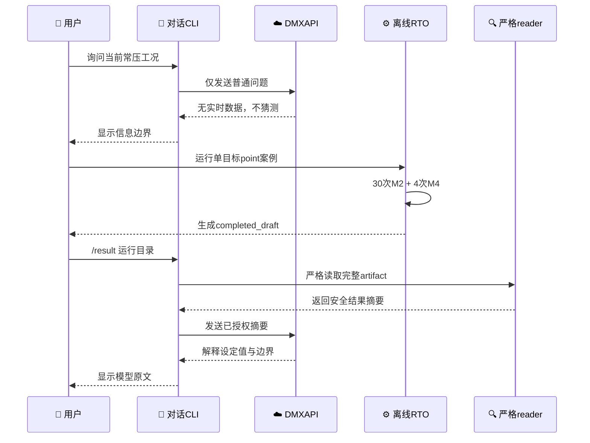

# D2.2 DeepSeek与RTO真实联动测试报告

_测试日期：2026-08-21 · 模型：`deepseek-v4-flash-0731` · 范围：信息边界、单目标动态RTO、严格重载与结果解释_

---

## 📋 结论

- **联动闭环通过**：DeepSeek先明确承认无法读取当前现场工况；本地RTO随后完成新的M2/M4物理执行；用户明确授权后，CLI只把安全结果摘要发送给同一模型会话并获得正确解释
- **边界行为正确**：模型没有把离线设定值当成实时测量值，也没有把`publishable=true`解释为现场批准或可直接下装
- **RTO执行成功**：30次M2静态评价、4次M4动态执行、3个动态短名单和1个中心锚点全部完成；独立严格重载新增物理执行为0
- **案例结果**：炉温目标由628.35 K降至626.35 K，塔顶绝压保持152325 Pa(a)；单位进料炉燃料能耗代理由188.378985降至183.993068 MJ/t，改善约2.32824%
- **现场结论仍未知**：本次输入是2026-06-04的弱时间对齐工程仿真fixture，不是实时DCS快照；系统当前没有DCS、Historian或在线传感器连接



## 🔍 当前工况问题为什么无法直接回答

原因不只是“RTO当时没有运行”，而是当前系统的职责和数据路径就是分开的：

1. `rto.runtime`是按请求启动的离线批处理程序，不是常驻后台服务
2. 普通Chat请求只包含`model + messages`，不会自动读取RTO目录或`OperatingContext`
3. 受信运行上下文只在本地交给`ProblemBuilder`和仿真链，默认不外发给模型
4. 即使RTO正在执行，DeepSeek也不会看到进度、工况或中间结果
5. 只有运行完成且用户显式输入`/result`时，严格reader才会生成一份受控摘要供模型解释
6. 判断“当前现场工况”需要带时间戳的DCS、Historian、LIMS或人工确认数据；这些接口目前尚未实现

因此，当前正确行为是：模型回答“当前工况未知”，RTO使用本地受信fixture独立计算，完成后再由用户决定是否把最终摘要交给模型。

## ⚙️ 本地动态调整案例

### 输入与范围

| 项目 | 本次取值 |
| --- | --- |
| Workflow | `offline-rto-afc89f8c86b3c535` |
| 目标 | 最小化单位进料炉燃料能耗代理 |
| 覆盖 | `point`，仅中心上下文 |
| 本地上下文 | `case-20260604-nominal` |
| 数据时间 | `2026-06-04T09:16:00+08:00` |
| 数据质量 | `weak-time-alignment` |
| 工况标签 | `normal-steady` |
| 进料 | 113.1388888888889 kg/s，即407.3 t/h |
| 初始炉温目标 | 628.35 K，即355.2 °C |
| 初始塔顶绝压目标 | 152325 Pa(a)，即0.051 MPa(g) |
| 声明范围 | `engineering_simulation_only` |

上述本地`OperatingContext`没有发送给DMXAPI。模型只收到后文列出的最终安全摘要。

### 执行命令

```bash
env PYTHONPATH=src .venv/bin/python -m petroleum_rto.rto.runtime.cli run \
  --repo-root . \
  --intent-file configs/rto/intents/minimize_specific_furnace_energy.json \
  --context-file configs/rto/contexts/case_20260604.json \
  --coverage-policy point \
  --run-root runs/rto \
  --library-root runs/rto/strategy-library \
  --actor domain-model-linkage-demo
```

### 执行结果

| 指标 | 结果 |
| --- | ---: |
| Workflow事件耗时 | 81.853055 s |
| M2物理执行 | 30 |
| M4物理执行 | 4 |
| 静态评价 | 30 |
| 动态短名单 | 3 |
| 请求锚点 | 1 |
| 通过锚点 | 1 |
| 优化状态 | `success` |
| Workflow状态 | `completed_draft` |
| 策略状态 | `draft` |
| 控制权 | `none` |
| DCS写入能力 | `false` |
| 现场验证 | `false` |

### 最终设定值

| 决策变量 | 基准 | 最终值 | 变化 |
| --- | ---: | ---: | ---: |
| 炉出口温度目标 | 628.35 K | 626.35 K | -2.00 K |
| 塔顶绝压目标 | 152325 Pa(a) | 152325 Pa(a) | 0 Pa |

温度最终值为353.2 °C；压力等价于0.152325 MPa(a)或0.051 MPa(g)。这些是离线稳态高层设定值，不是现场测量值或阀位。

### 目标结果

| 指标 | 基线 | 候选 | 改善 |
| --- | ---: | ---: | ---: |
| 单位进料炉燃料能耗代理 | 188.37898479334825 MJ/t | 183.99306755689793 MJ/t | 4.385917236450325 MJ/t |
| 相对方向性改善 | — | — | 2.328241253270197% |

### 约束与动态稳定性

| 阶段 | 检查 | 结果 | 观测 |
| --- | --- | --- | ---: |
| M2 | `m2-structural-numeric` | 通过 | `m2_evaluable=1.0` |
| M2 | `quality-proxy-preservation` | 通过 | 相对变化0.0，限制0.005 |
| M2 | `valuable-distillate-yield-preservation` | 通过 | 变化0.0，最低-0.002 |
| M4 | `m4-stability-acceptance` | 通过 | `m4_acceptance_passed=1.0` |
| 最终选择 | `minimum-publishable-energy-improvement` | 通过 | 2.32824%，门槛0.5% |

被选中候选的M4结果为`feasible`：失败检查数0、失败回路数0、最大连续饱和0 s、最大最终误差比例约`7.086821e-6`。

## ✅ 严格重载

```bash
env PYTHONPATH=src .venv/bin/python -m petroleum_rto.rto.runtime.cli inspect \
  --repo-root . \
  --run-dir runs/rto/offline-rto-afc89f8c86b3c535 \
  --library-root runs/rto/strategy-library
```

严格检查恢复了从`inputs-ready`到`manifest-committed`的全部阶段，结果与manifest指纹保持一致：

| 项目 | 值 |
| --- | --- |
| 本次新增M2执行 | 0 |
| 本次新增M4执行 | 0 |
| Result指纹 | `0b29f0b516e2e589affde3aff01775e818fda857e6fc2c65d92997344fa4ab2b` |
| Manifest指纹 | `f6284b6e1ed21909f6720f6315d08028ca762f86ad883f323663a5c5c7f7c504` |
| 策略草稿 | `strategy-68abc10e2fa42b9a-r1` |

运行证据入口是[`runs/rto/offline-rto-afc89f8c86b3c535`](../../runs/rto/offline-rto-afc89f8c86b3c535/)。目录包含workflow合同、静态搜索、动态评价、最终化、策略草稿、事件链、manifest及34个物理仿真运行目录。

## 💬 完整用户可见输出

### 首次工况边界提问

**用户：**

```text
请告诉我当前常压蒸馏装置的工况状态。只基于你当前实际可访问的信息回答；如果没有实时或受信工况数据，请明确说明，不要猜测。
```

**DeepSeek：**

```text
我无法访问任何实时或受信工况数据。我没有连接到您的常压蒸馏装置、DCS/PLC系统、历史数据库或任何在线传感器。因此，我无法判断装置的当前工况状态（如塔顶温度、侧线抽出量、回流比等）。

如需真实工况，请提供有效数据源（如带时间戳的工艺数据文件或截图），我才能在此基础上进行分析。我目前没有任何受信工况数据，亦不会凭空猜测。
```

### 实际发送给DMXAPI的安全摘要

用户明确授权后，`/result`严格生成并发送了以下完整JSON：

```json
{
  "claim_scope": "engineering_simulation_only",
  "constraints": [
    {
      "constraint_id": "m2-structural-numeric",
      "passed": true,
      "stage": "M2"
    },
    {
      "constraint_id": "quality-proxy-preservation",
      "passed": true,
      "stage": "M2"
    },
    {
      "constraint_id": "valuable-distillate-yield-preservation",
      "passed": true,
      "stage": "M2"
    },
    {
      "constraint_id": "m4-stability-acceptance",
      "passed": true,
      "stage": "M4"
    },
    {
      "constraint_id": "minimum-publishable-energy-improvement",
      "passed": true,
      "stage": "post_selection"
    }
  ],
  "control_authority": "none",
  "field_validated": false,
  "objectives": [
    {
      "baseline_value": 188.37898479334825,
      "candidate_value": 183.99306755689793,
      "directional_improvement": 4.385917236450325,
      "metric_id": "specific_furnace_fuel_energy_mj_per_t",
      "sense": "minimize",
      "unit": "MJ/t"
    }
  ],
  "publishable": true,
  "selected_setpoints": [
    {
      "unit": "K",
      "value": 626.35,
      "variable_id": "furnace_temperature_target_k"
    },
    {
      "unit": "Pa(a)",
      "value": 152325.0,
      "variable_id": "tower_top_pressure_target_pa_a"
    }
  ],
  "status": "success"
}
```

### DeepSeek对RTO摘要的解释

```text
根据您提供的离线RTO摘要JSON，我为您做如下简明解释：

1. 总体状态
- 状态：success（仿真计算成功）
- 适用范围：engineering_simulation_only（仅限工程仿真）
- 是否可发布：publishable = true（表示结果在仿真体系内达到可输出标准）
- 现场验证状态：field_validated = false（未经现场验证）
- 控制权限：control_authority = none（没有现场控制权）

2. 优化目标（能耗改善）
- 目标指标：specific_furnace_fuel_energy_mj_per_t（单位燃料能耗，单位 MJ/t），目标方向为最小化
- 基线值：188.37898479334825 MJ/t
- 候选值：183.99306755689793 MJ/t
- 方向性改善：4.385917236450325 MJ/t（即燃料单耗下降约4.39 MJ/t）

3. 建议设定值（仅仿真推荐）
- 加热炉目标温度：626.35 K
- 塔顶目标压力：152325.0 Pa(a)

4. 约束检查（全部通过）
- M2阶段结构数值检查：通过
- M2阶段质量代理保持检查：通过
- M2阶段高价值馏分收率保持检查：通过
- M4阶段稳定性验收：通过
- 最小可发布的节能改进检查：通过

重要声明（必须注意）：
- 以上结果完全来自离线合成工程仿真（M2/M4流程），未经现场验证。
- 该结果不具有现场控制权，不得直接下装至DCS/PLC，也不得视为已批准、已发布或可用于实际生产调整。
- 任何实际应用前必须经工艺工程师、系统工程师和现场操作人员人工审核及验证，并需结合真实工况数据重新确认。
- 数值和单位均原样保留自您提供的JSON，未做任何外推或修改。
```

### 结果与当前工况的区分追问

**用户：**

```text
刚才的RTO摘要是否足以判断当前现场常压装置工况？请明确区分离线RTO结果、受信运行上下文和实时DCS状态，不要补充摘要中没有的数据。
```

**DeepSeek：**

```text
仅凭刚才的RTO摘要，不能判断当前现场常压装置工况。我必须明确区分以下三类信息，且不会补充摘要中未包含的任何数据：

1. 离线RTO结果（来自JSON，属于仿真计算产物）
- 内容：优化候选值、设定建议、约束通过标志等。
- 性质：仅代表在合成工程仿真环境下的计算结果，field_validated = false，control_authority = none。
- 不能用于推导现场任何实时或历史工况。

2. 受信运行上下文（来自您之前提供的说明）
- 您仅提供了该JSON文件“由本地程序严格读取后生成”，未提供任何现场运行参数、历史趋势、设备状态或时间戳。
- 因此，不存在受信运行上下文可被用于判断当前工况。

3. 实时DCS状态（需要外部数据源）
- 摘要中没有任何DCS点值、报警、趋势、塔顶温度现场值、流量、液位等实时数据。
- JSON中出现的furnace_temperature_target_k和tower_top_pressure_target_pa_a是目标设定值（setpoints），不是测量值，不代表当前实际工况。

结论：仅凭该RTO摘要，无法判断当前现场常压装置的实时工况（温度、压力、流量、液位、安全状态等）。它只能说明“在仿真层面满足约束并获得节能改善建议”，而不提供任何现场实时运行依据。若需要判断工况，必须提供带时间戳的DCS/历史趋势数据或现场巡检记录。
```

## ⚠️ 限制与后续边界

- 本次只证明普通Chat、离线RTO、严格摘要和模型解释之间的手动闭环，不代表Chat已经能自动发起RTO
- 本次没有把`OperatingContext`、当前设定值、原油组成、初始状态、求解器、原始轨迹、证据路径、指纹或凭据发送给DMXAPI
- `publishable=true`只表示满足离线仿真发布性门槛；策略仍为`draft`，没有执行`approve`或`publish`
- 如果未来需要回答真实“当前工况”，必须单独设计受信数据接入、时间戳、新鲜度、质量标签、权限和外发政策；不能因为RTO进程常驻就默认获得这些能力
- 如果未来需要“用户自然语言→自动运行RTO→自动解释”，必须另行授权和设计执行确认、成本预算、取消机制及错误恢复，本次未实现

## 🔗 证据入口

- [Workflow结果](../../runs/rto/offline-rto-afc89f8c86b3c535/result.json)
- [最终选择与发布性](../../runs/rto/offline-rto-afc89f8c86b3c535/finalization.json)
- [M4动态评价](../../runs/rto/offline-rto-afc89f8c86b3c535/dynamic_evaluations.json)
- [静态求解结果](../../runs/rto/offline-rto-afc89f8c86b3c535/static_solve.json)
- [事件链](../../runs/rto/offline-rto-afc89f8c86b3c535/events.jsonl)
- [Workflow manifest](../../runs/rto/offline-rto-afc89f8c86b3c535/manifest.json)
- [项目实施状态](../../docs/STATUS.md)

本报告记录的是一次用户明确授权的真实外部模型调用和本地合成仿真联动，不包含API密钥、Authorization头或供应商内部推理过程。
